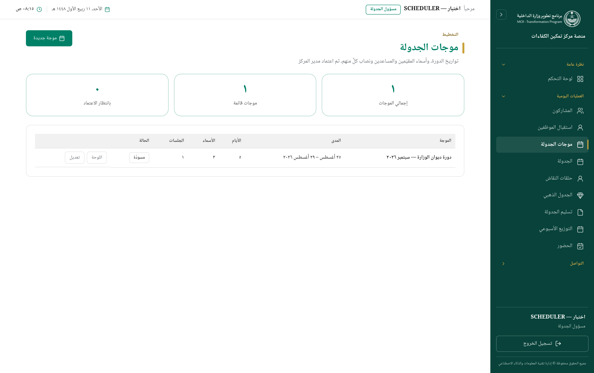
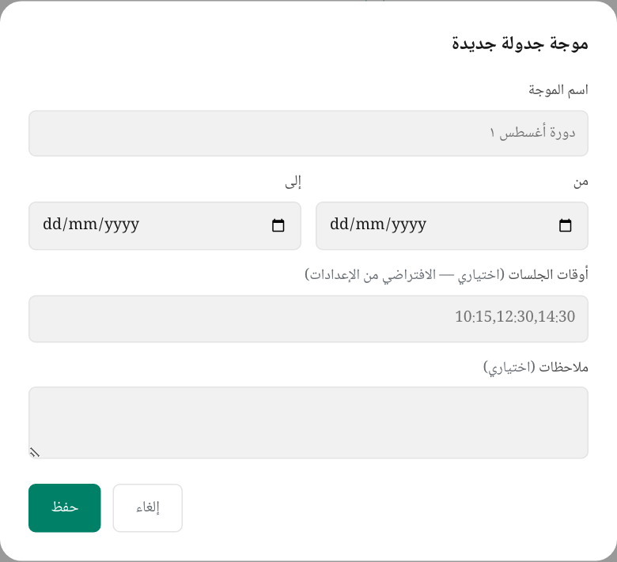
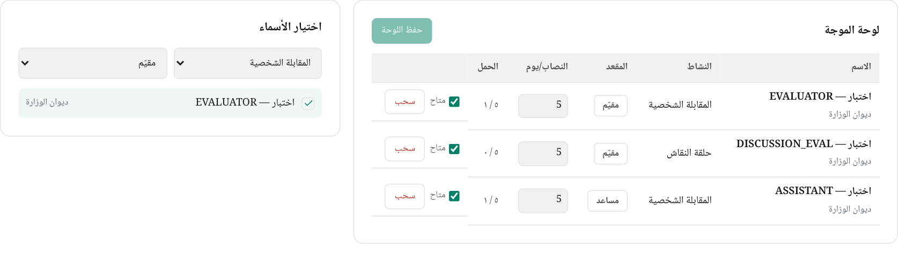
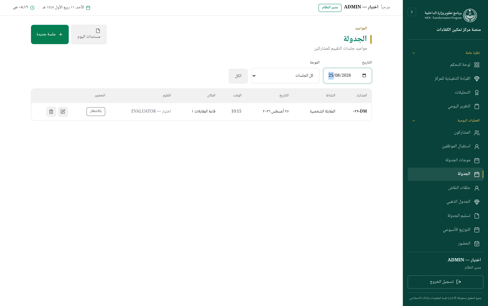
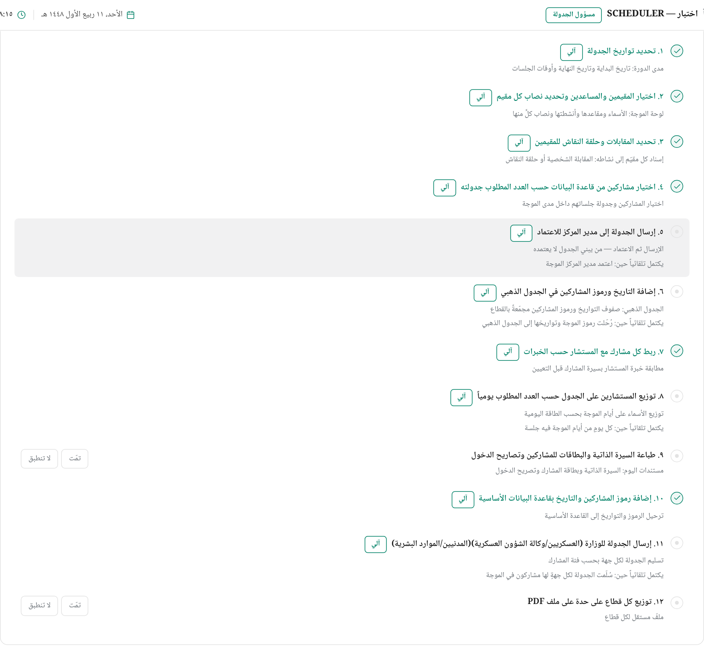
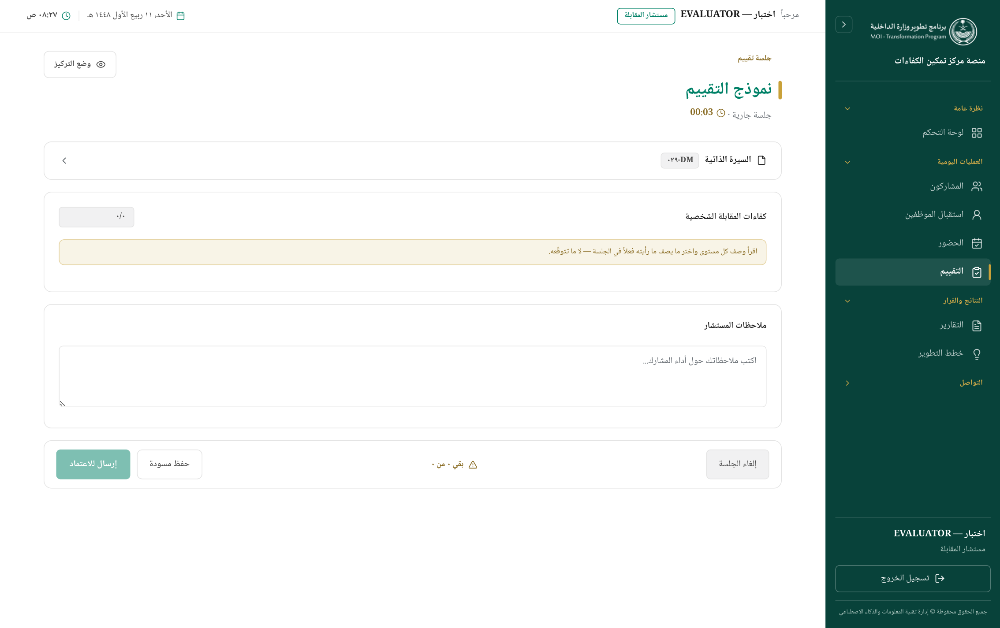

# رحلة المشارك

> من إضافة المشارك إلى إسناده لمستشار المقابلة — المسار كاملاً بالصور.
> كل صورة مُلتقطة آلياً من المنصّة نفسها، فلا تتقادم عن الواجهة.

---

## نظرة عامة على المسار

رحلة المشارك سبع محطّات، لكلٍّ منها **صاحبٌ** و**شاشة** و**شرطٌ لا تبدأ قبله**:

| # | المحطّة | من ينفّذها | الشاشة | لا تبدأ قبل |
|---|---|---|---|---|
| ١ | إضافة المشارك | المستخدم الخارجي أو مسؤول الجدولة | ترشيح مشارك / المشاركون | — |
| ٢ | اعتماد الترشيح | مسؤول الجدولة | المشاركون | اكتمال بيانات المشارك |
| ٣ | إنشاء موجة الجدولة | مسؤول الجدولة | موجات الجدولة | — |
| ٤ | اختيار المقيّمين ونصابهم | مسؤول الجدولة | لوحة الموجة | وجود موجة |
| ٥ | جدولة الجلسة وإسناد المقيّم | مسؤول الجدولة | الجدولة | اعتماد المشارك + موجة مفتوحة |
| ٦ | اعتماد الموجة | مدير المركز | موجات الجدولة | وجود جلسة واحدة على الأقل |
| ٧ | التنفيذ: استقبال ثم تقييم | الاستقبال ثم المقيّم | الاستقبال / التقييم | حلول يوم الجلسة |

> **قاعدةٌ تحكم المسار كلّه:** الجدولة **يدوية**. المنصّة لا توزّع المشاركين
> على المقيّمين من تلقاء نفسها — المستخدم يختار الأسماء والمواعيد، والنظام
> يمنع الخطأ ولا يتّخذ القرار.

---

## ١. الدخول إلى المنصّة

كل مستخدم يدخل بحسابه، وما يراه بعد الدخول يتبع دوره: القائمة الجانبية تُبنى
من صلاحياته، فلا تظهر له شاشةٌ لا يملكها.


---

## ٢. إضافة المشارك

للإضافة طريقان، والفرق بينهما **من يُدخل البيانات**:

### أ) المستخدم الخارجي يرشّح بنفسه

الجهة تُدخل مرشّحيها عبر حساب «مستخدم خارجي» — أدنى صلاحية في المنصّة: يُضيف
ولا يرى غير ما أضاف.


النموذج يجمع البيانات الشخصية والوظيفية والمؤهّلات. وما يمنعه النظام هنا:

| المنع | السبب |
|---|---|
| هوية مسجَّلة مسبقاً | يُردّ بإيصال «هذا المشارك مُضاف مسبقاً» مع تاريخ تسجيله — ولا يُنشأ صفٌّ ثانٍ |
| حقل إلزامي فارغ | شريط خطأ أعلى الاستمارة وحدود حمراء على الخانات الناقصة |
| تصنيف أمني بلا صلاحية | تعيين «سرّي» يحتاج `candidate.view_classified` |

### ب) مسؤول الجدولة يضيف مباشرة

من شاشة «المشاركون» بزرّ الإضافة — نفس الحقول، لكن بيد موظّف المركز.


**الفئة تغيّر النموذج**: اختيار «متعاقد» يبدّل حقل الرتبة إلى مسمّى وظيفي حرّ
ويُظهر الفئة القيادية — فالنموذج يتبع الفئة ولا يفرض عليها حقولاً لا تخصّها.

---

## ٣. اعتماد الترشيح

المشارك المُضاف يقع في حالة **«مسودة»**، ولا يُجدوَل قبل اعتماده.


القائمة تُبنى **بالرموز لا بالأسماء** (`DM-029` مثلاً): الاسم يُقرأ في بطاقة
التفاصيل لمن يملك `candidate.view_names` وحده، وفتحه يُكتب في سجل التدقيق.


> ⚠ **الاعتماد من «مسودة» فقط.** اعتماد مشاركٍ غادر المسودة مرفوض — كيلا يُعيد
> اعتمادٌ متأخّر دورةً مكتملة إلى «مجدول».

بعد الاعتماد تصير حالته **«مجدول»** ويظهر في قوائم الجدولة.

---

## ٤. إنشاء موجة الجدولة

**الموجة** هي الدورة: مدىً من التواريخ، وأسماءٌ تعمل فيه، وحالةُ اعتماد. وهي
**وحدة الاعتماد** في المنصّة — ما يعتمده مدير المركز ليس جلسةً بعينها بل
الموجة بكل جلساتها.



الشاشة تعرض لكل موجة: مداها، وعدد أيامها، وعدد الأسماء المُدرَجة، وعدد جلساتها،
وحالتها.



| الحقل | ملاحظة |
|---|---|
| **الاسم** | فريد — وهو ما يُطبع على المستند الذاهب إلى الجهة، فتكراره خطأ إدخال |
| **تاريخا البداية والنهاية** | المدى الأقصى ١٢٠ يوماً — سقفٌ يكشف خطأ إدخال السنة |
| **أوقات الجلسات** | تُترك فارغة فتُقرأ من الإعداد العام؛ وتُكتب `HH:MM` مفصولة بفاصلة لموجةٍ لها أوقاتها |

> موجتان قد تتداخلان عمداً — قطاعٌ صباحاً وآخر مساءً، أو دورة تعويضية داخل
> دورة. لا قيد على تداخل التواريخ.

---

## ٥. اختيار المقيّمين وتحديد النصاب

بعد إنشاء الموجة يُفتح زرّ **«اللوحة»**: من يعمل في هذه الموجة، وفي أي نشاط،
وعلى أي مقعد، وبأي نصاب.



**المقعد** يفرّق بين **مقيّم** و**مساعد**. و**النشاط** يفرّق بين المقابلة
الشخصية وحلقة النقاش وأدوات القياس والتمرين التكاملي — فالشخص الواحد قد يكون
مستشار مقابلات ومستشار حلقة نقاش في الموجة نفسها بنصابين مختلفين.

### النصاب عدّادٌ لا سدّ

هذه قاعدةٌ مقصودة في المنصّة:

> **النصاب يُنذر ولا يمنع.** يظهر «٣/٥» بجانب الاسم، ويصير أحمر عند التجاوز،
> **ويبقى الاسم قابلاً للاختيار** — لأن الضغط في يومٍ بعينه قرارُ المركز لا
> قرارُ الخوارزمية.

وما **يُمنع** فعلاً هو **تعارض الوقت**: الشخص الواحد لا يكون في مكانين في
اللحظة نفسها. وهذا خطأ إدخال لا قرار إداري، فيُمنع في قاعدة البيانات نفسها —
لا يمرّ حتى لو ضغط اثنان في اللحظة ذاتها.

| يُمنع دائماً | لا يُمنع |
|---|---|
| مقيّم في مقابلتين في اللحظة نفسها | مقيّم تجاوز نصابه اليومي |
| مساعد في مقابلتين في اللحظة نفسها | مقيّم في جلستين في اليوم بوقتين مختلفين |
| مشارك في جلستين في اللحظة نفسها | مشرف مع عدّة مشاركين في أدوات القياس أو التمرين التكاملي أو حلقة النقاش (جلسات جماعية) |

### الأهلية تُفرَض على اللوحة

لا يُدرَج في مقعد المقيّم إلا من يؤهّله دوره لذلك النشاط. ومحاولة إدراج اسمٍ
غير مؤهّل تُردّ بسببٍ مكتوب باسمه: «دوره لا يؤهّله لحلقة النقاش (مقيّم)».

---

## ٦. جدولة الجلسة وإسناد المقيّم

هنا يلتقي المشارك بالمقيّم. من شاشة **الجدولة** بزرّ **«جلسة جديدة»**:


الحقول بالترتيب:

| الحقل | ماذا يفعل |
|---|---|
| **المشارك** | من المعتمدين فقط — غير المعتمد لا يظهر |
| **النشاط** | يغيّر قائمة المقيّمين: «مستشار المقابلة» للمقابلة، ومستشار حلقة النقاش لها |
| **مستشار المقابلة** | قائمة المؤهّلين لقطاع المشارك، ومعها **عدّاد النصاب** لكل اسم |
| **مساعد التقييم** | اختياري |
| **استعراض السيرة الذاتية** | يعرض ملخّص سيرة المشارك داخل النافذة قبل اختيار المقيّم |
| **الموجة** | اختياري — الجلسة بلا موجة تعمل كما كانت، لكنها تغيب عن مستندات الموجة |
| **التاريخ والوقت** | داخل مدى الموجة إن اختيرت |
| **المكان** | نصّ حرّ |

### ترتيب المقيّمين ليس عشوائياً

القائمة مرتّبة: **المُدرَج في لوحة الموجة أولاً**، ثم **الأقرب خبرةً** (تُطابَق
مجالات المقيّم بما تذكره سيرة المشارك)، ثم **الأخفّ حملاً**.

> اقتراحُ ترتيبٍ لا حجب: من درجة مطابقته صفر يبقى في القائمة قابلاً للاختيار.
> والقرار للمُجدوِل.

### بعد الإسناد



الصفّ يعرض: المشارك بالرمز، والنشاط، والتاريخ والوقت، والمكان، والمقيّم
المُسنَد، وحالة الحضور **«بالانتظار»** حتى يحلّ اليوم.

> ⚠ **حدّ القطاع.** كل مقيّم ومساعد مخصَّص لقطاع ولا يُقيّم غيره. الإسناد عبر
> القطاعات يُمنع، ولا يمرّ إلا لحامل `cross_sector.assign` وبعد تأكيد صريح —
> ويُكتب في سجل التدقيق.

---

## ٧. سير عمل الجدولة — الخطوات الاثنتا عشرة

الموجة تحمل قائمة إجراءٍ من اثنتي عشرة خطوة، تُقاس حالتها على الموجة نفسها:



نوعان من الخطوات:

- **آلية** — يتحقّق منها النظام بنفسه من حالة الموجة، فلا تُؤشَّر كذباً ولا
  تبقى مؤشَّرةً بعد نقض شرطها. مثالها: «جُدولت جلسةٌ واحدة على الأقل».
- **يدوية** — يؤشّرها صاحبها، مثل طباعة السير والبطاقات وتصاريح الدخول.

> **القائمة تُعلِم ولا تمنع.** لا خطوة تمنع إرسال الموجة ولا اعتمادها — هي
> شريط إنجازٍ يُقرأ، لا بوّابة.

---

## ٨. اعتماد الموجة

بعد بناء الجلسات تُرسَل الموجة إلى مدير المركز:

```
مسودّة ──إرسال──> بانتظار اعتماد مدير المركز ──اعتماد──> معتمَدة ──إغلاق──> مغلقة
   ^                          │
   └──── إرجاع (بسبب مكتوب) ───┘
```

| الانتقال | من يملكه | شرطه |
|---|---|---|
| **إرسال** | مسؤول الجدولة | الموجة مسودّة، **وفيها جلسة واحدة على الأقل** |
| **اعتماد** | مدير المركز (`schedule.approve_center`) | الموجة مُرسَلة — **ولم يُرسِلها هو** |
| **إرجاع** | مدير المركز | الموجة مُرسَلة، **وبسببٍ مكتوب إلزامي** |
| **إغلاق** | مسؤول الجدولة | الموجة معتمَدة |

> 🔒 **من يبني الجدول لا يعتمده.** مدير المركز يستطيع بناء الموجة وإرسالها،
> لكنه **لا يعتمد موجةً أرسلها بنفسه** — يعتمدها حاملُ الصلاحية غيره. فصلُ
> مهامٍ لا صلاحية تجميلية.

### ما يتغيّر بالاعتماد

الموجة المعتمَدة **تُقرأ ولا تُكتب**: لا تُضاف إليها جلسة، ولا تُعدَّل جلساتها،
ولا تُحذف إحداها، ولا تُعدَّل لوحة أسمائها، ولا تُحذف الموجة نفسها.

> **وجلسة تعويض الغياب؟** لا تدخل الموجة المعتمَدة. الغياب لا يقع إلا وموجةٌ
> معتمَدة تعمل، فلو دخلت لتغيّر ما اعتمده مدير المركز بعد ختمه. تذهب الجلسة
> المُعوِّضة إلى الموجة المفتوحة التي يقع تاريخها الجديد داخل مداها.

---

## ٩. يوم الجلسة — الاستقبال

يوم التنفيذ يُسجَّل وصول المشارك عند الاستقبال، ويؤخذ توقيعه وإقراره، ثم
يُوزَّع على النشاط والمقيّم.


التوزيع يمرّ بثلاث حالات: **بانتظار المقيّم** ← **مُستلَم** ← **معتمَد**. ومن
يوزّع لا يعتمد توزيعه بنفسه.

---

## ١٠. التقييم

المقيّم يفتح شاشة التقييم فيجد جلساته وحدها:


> 🔒 **المقيّم يعمل بالرمز لا بالاسم.** لا يرى أسماء المشاركين — حياد التقييم
> محفوظ ببناء الشاشة لا بالتوصية.



بعد الرصد يُرسَل التقييم فتُقفل درجاته، ولا تُعدَّل إلا بإرجاعٍ من صاحب
الصلاحية.

---

## ١١. ما يتفرّع عن الموجة بعد اعتمادها

| المخرَج | ما هو | شرطه |
|---|---|---|
| **الجدول الذهبي** | تواريخ الموجة ورموز مشاركيها مجمَّعةً بالقطاع | يُرحَّل من جلسات الموجة |
| **تسليم الجهات** | ملفّ لكل جهة (الشؤون العسكرية / الموارد البشرية) بحسب فئة المشارك | **الموجة معتمَدة فقط** |
| **تصاريح الدخول** | بطاقة لكل مشارك ليوم بعينه | — |
| **كشف الحضور** | كشف اليوم موزّعاً على أوقات الجلسات | — |

> 🔒 **لا يُسلَّم إلا المعتمَد.** التسليم فعلٌ خارج المنصّة يُبنى عليه حضور
> أناس، فلا يسبق اعتماد مدير المركز — لا باختيار الموجة ولا بكتابة تاريخين.

---

## ملخّص المسار في سطور

1. **يُضاف** المشارك — من الجهة أو من مسؤول الجدولة.
2. **يُعتمد** ترشيحه فيصير «مجدول».
3. **تُنشأ موجة** بتواريخها.
4. **تُبنى لوحتها**: الأسماء ومقاعدها وأنشطتها ونصابها.
5. **تُجدوَل الجلسة** ويُسنَد المقيّم — بالنصاب مُنذِراً، وبتعارض الوقت مانعاً.
6. **تُرسَل الموجة** لمدير المركز فيعتمدها — ولا يعتمد ما أرسله بنفسه.
7. **يوم الجلسة**: استقبالٌ فتوزيعٌ فتقييم.
