# دليل المستخدم — منصة مركز تمكين الكفاءات

> دليل تشغيلي لموظّفي المركز. يشرح لكل شاشة: **مَن يفتحها**، و**كيف يعمل فيها
> خطوةً خطوة**، و**ما الذي يمنعه النظام ولماذا**.
>
> كل صورة في هذا الدليل مُلتقطة آلياً من المنصّة نفسها بأمرٍ واحد
> (`node docs/capture-guide.mjs`)، فلا تتقادم عن الواجهة. تاريخ آخر التقاط في
> `docs/guide-images/manifest.json`.

---

## كيف تقرأ هذا الدليل

الدليل في ثلاث طبقات، اقرأ ما يخصّك ودع الباقي:

| إن كنت | ابدأ من |
|---|---|
| موظّفاً جديداً على المنصّة | **الدخول أوّل مرّة**، ثم **التعرّف على الواجهة** |
| تعرف دورك وتريد عملك اليومي | **دليلك بحسب دورك** — قسم لكل دور |
| تريد تنفيذ مسارٍ كامل مع زملائك | **المسارات الكاملة خطوة بخطوة** |
| تبحث عن شاشة بعينها | **مرجع الشاشات** |
| تطبع كشفاً أو تقريراً | **المستندات المطبوعة** |
| مدير النظام تُجهّز منصّة جديدة | **التهيئة الأولى لمنصّة جديدة** |
| واجهتك رسالة لا تفهمها | **الرسائل ومعانيها** |

**اصطلاحات:**

- ما يُكتب **بخطٍّ عريض** هو نصّ يظهر لك على الشاشة حرفياً: زرّ، أو عمود، أو عنوان.
- ⚠ تنبيه: فعلٌ لا رجعة فيه، أو قيدٌ يوقفك إن لم تنتبه له.
- 🔒 قاعدة أمنية: منعٌ مقصود، ومعه سببه.

---

## الفهرس

- [١. الدخول أوّل مرّة](#١-الدخول-أوّل-مرّة)
- [٢. المبدأ الذي بُنيت عليه المنصّة](#٢-المبدأ-الذي-بُنيت-عليه-المنصّة)
- [٣. التعرّف على الواجهة](#٣-التعرّف-على-الواجهة)
- [٤. رحلة المرشّح من الترشيح إلى التقرير](#٤-رحلة-المرشّح-من-الترشيح-إلى-التقرير)
- [٥. دليلك بحسب دورك](#٥-دليلك-بحسب-دورك)
- [٦. المسارات الكاملة خطوة بخطوة](#٦-المسارات-الكاملة-خطوة-بخطوة)
- [٧. مرجع الشاشات](#٧-مرجع-الشاشات)
- [٨. المستندات المطبوعة](#٨-المستندات-المطبوعة)
- [٩. التهيئة الأولى لمنصّة جديدة](#٩-التهيئة-الأولى-لمنصّة-جديدة)
- [١٠. ما ليس له شاشة في هذا الإصدار](#١٠-ما-ليس-له-شاشة-في-هذا-الإصدار)
- [١١. الرسائل ومعانيها](#١١-الرسائل-ومعانيها)
- [١٢. أسئلة متكرّرة](#١٢-أسئلة-متكرّرة)
- [١٣. مسرد المصطلحات](#١٣-مسرد-المصطلحات)
- [١٤. ملحق: تحديث هذا الدليل](#١٤-ملحق-تحديث-هذا-الدليل)

---

## ١. الدخول أوّل مرّة

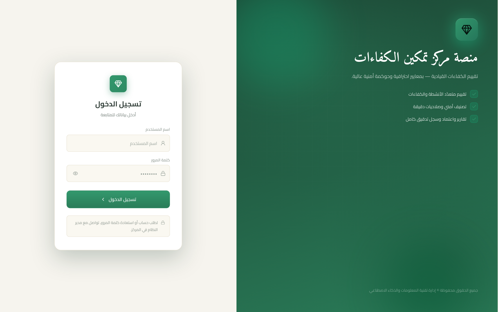

الحقلان يبدآن فارغين دائماً. أدخل اسم المستخدم وكلمة المرور اللذين سلّمهما لك
مدير النظام، ثم **تسجيل الدخول**. **زرّ العين** داخل حقل كلمة المرور يُظهرها
للتأكّد من كتابتها قبل الإرسال.

| ما تراه | معناه | ما تفعله |
|---|---|---|
| «أدخل اسم المستخدم وكلمة المرور» | أحد الحقلين فارغ — لم يُرسَل شيء للخادم بعد | أكمل الحقلين |
| «فشل تسجيل الدخول — تأكد من البيانات والخادم» | البيانات غير صحيحة، أو الخادم لا يستجيب | راجع الكتابة؛ فإن تكرّرت راجع مدير النظام |
| تحويلك مباشرةً إلى **تغيير كلمة المرور** | حسابك جديد أو أُعيد ضبطه | غيّرها — لا تُفتح شاشة أخرى قبلها |
| الرسالة نفسها تتكرّر بعد خمس محاولات خاطئة | حسابك **مقفل ١٥ دقيقة** | انتظر المدّة، أو اطلب من مدير النظام فكّ القفل |

> 🔒 **القفل بعد خمس محاولات** يُبطل تخمين كلمات المرور آلياً، و**لا تُخبرك
> الشاشة أنك مقفل**: الرسالة تبقى «فشل تسجيل الدخول» نفسها. هذا مقصود — رسالةٌ
> تقول «الحساب مقفل» تؤكّد لمن يجرّب الأسماء أن الاسم موجود. العدّاد يُصفَّر عند
> أوّل دخول ناجح، ومحاولات الدخول كلّها — الناجح منها والفاشل — تُقيَّد في
> سجل التدقيق.
>
> ولهذا السبب نفسه: إن تأكّدت من صحّة بياناتك وتكرّر الرفض، فالأرجح أنك مقفل —
> انتظر ربع ساعة قبل أن تراجع مدير النظام.

### تغيير كلمة المرور

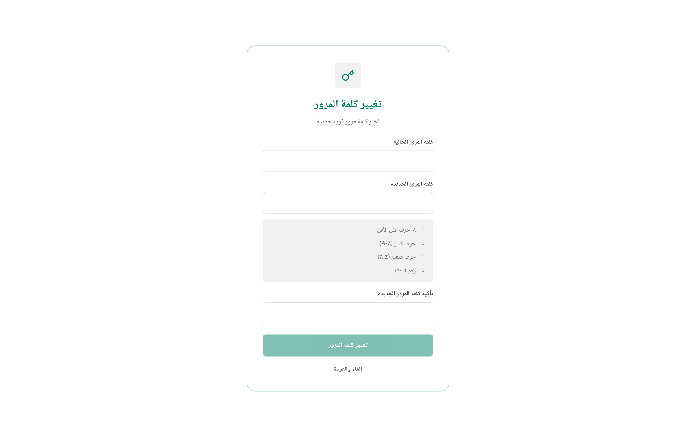

إلزامي عند أوّل دخول **مرّة واحدة**، ومتاح في أي وقت بعده.

**شروط كلمة المرور** — يفرضها الخادم، ويُردّ ما خالفها برسالةٍ تحدّد الشرط الناقص:

1. **٨ أحرف** على الأقل.
2. حرف **كبير** واحد على الأقل (A–Z).
3. حرف **صغير** واحد على الأقل (a–z).
4. **رقم** واحد على الأقل.
5. أن **تختلف عن الحالية**.

**عند نجاح التغيير تُنهى كل جلساتك الأخرى** وتبقى الجلسة التي غيّرت منها. هذا
مقصود: لو كانت جلسةٌ مسروقة مفتوحة في مكان آخر، فتغييرُ كلمة المرور يطردها.

المنع خادميٌّ لا واجهي: لن ينفع تجاوز شاشة التغيير بتعديل الرابط. وإن غادرتها
دون إتمامها فالدخول من جديد يعيدك إليها — لا تُحبَس خارج النظام.

> **لمدير النظام** — إنشاء أوّل حساب، أو فكّ قفل حساب واستعادة الدخول:
> ```bash
> php artisan kafaat:create-admin <اسم المستخدم>          # حساب جديد
> php artisan kafaat:create-admin <اسم المستخدم> --reset  # إعادة ضبط وفكّ قفل
> ```
> تُطبع كلمة المرور مرّة واحدة، ويُلزَم صاحبها بتغييرها عند أوّل دخول.

### الخروج

**تسجيل الخروج** أسفل القائمة الجانبية. يُبطل جلستك على الخادم لا في المتصفّح
وحده — فلا تُستأنف بزرّ الرجوع.

---

## ٢. المبدأ الذي بُنيت عليه المنصّة

ثلاث قواعد تفسّر أكثر ما ستراه، ومعرفتها تُغنيك عن السؤال في مواضع كثيرة:

**أوّلاً: الرمز لا الاسم.** المرشّح يُعرَف في المنصّة برمزه (`ED-014`)، لا باسمه.
قائمة المرشحين تعرض الرموز **لكل الأدوار بلا استثناء** — حتى لمن يملك صلاحية
رؤية الأسماء. الاسم يظهر في بطاقة المرشّح وسيرته والتصدير والتقارير لمن يملك
`candidate.view_names`، لا في الشاشة المفتوحة أمام الجميع.

**ثانياً: الإخفاء في الواجهة راحة لا حماية.** حين لا تملك صلاحية شاشةٍ فإن
رابطها لا يظهر في القائمة، وكتابة عنوانها يدوياً تعيدك إلى لوحة التحكم. لكنّ
الحماية الحقيقية على الخادم: كل منع في هذا الدليل مطبَّق هناك أيضاً، فاستدعاء
الواجهة البرمجية مباشرةً لا يتجاوز شيئاً.

**ثالثاً: الفصل بين من يفعل ومن يعتمد.** المسار الواحد مقسوم على صلاحيات
مستقلّة: من يوزّع لا يعتمد، ومن يقرّر لا يوزّع، ومن يكتب التقرير لا يعتمده في
المرحلة الثانية. جمعُ المراحل في صلاحية واحدة كان يجعل كلَّ من فتح الشاشة
يملك المسار كاملاً بلا مراجعة.

---

## ٣. التعرّف على الواجهة

### الشريط العلوي

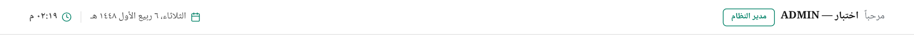

يظهر في كل شاشة بعد الدخول — لا في اللوحة وحدها، لأنك قد تقضي يومك في الجدولة
أو الحضور حيث يلزمك الوقت والتاريخ فعلاً:

- **مرحباً، [اسمك]** ومعه **دورك** في المنصّة.
- **التاريخ الهجري**؛ مرّر المؤشّر فوقه ليظهر الميلادي.
- **الساعة**، تتحدّث كل ثانية — لأنك تسجّل الحضور بالدقيقة.

الشريط يلازمك عند التمرير.

### القائمة الجانبية

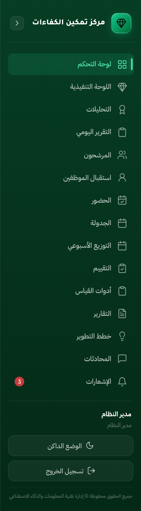

**لا تعرض القائمة إلا ما تملكه.** قائمتك أقصر من قائمة زميلك، وهذا هو الوضع
الصحيح لا نقصٌ في التجهيز. وازِن بين قائمة مدير النظام أعلاه وقائمة مستشار
المقابلة:

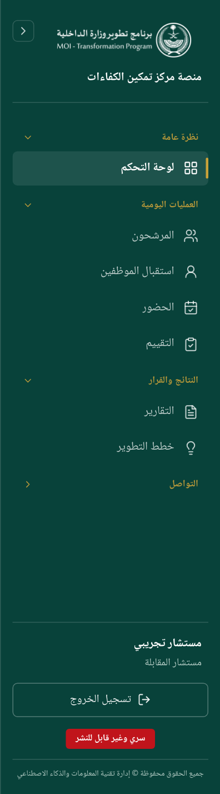

أسفل القائمة زرّان دائمان:

| الزرّ | ما يفعله |
|---|---|
| **تسجيل الخروج** | يُنهي الجلسة على الخادم |
| السهم أعلى القائمة | **يطوي القائمة** إلى أيقونات فيتّسع الجدول أمامك |


**الإشعارات** في القائمة، وعليها عدّاد ذهبيّ بعدد ما لم تقرأه.

### هوية المنصّة

المنصّة تتبع **هوية برنامج تطوير وزارة الداخلية**: سطحٌ أبيض، وأخضرُ البرنامج
للفعل والتأكيد، وذهبٌ للتمييز والانتظار، وخطُّ نسخٍ عربي واحد. ما يعنيك منها
عملياً ثلاثة أشياء:

| ما تراه | ما يعنيه |
|---|---|
| شريطٌ ذهبي رفيع يمين عنوان الصفحة | أنت في رأس الشاشة — تحته وصفُها ثم أدواتها |
| **أخضر** في زرّ أو شارة | فعلٌ أساسي أو حالةٌ مكتملة/معتمدة |
| **ذهبي** في شارة | بانتظارك أو بانتظار غيرك — لم يُحسم بعد |
| **أحمر** في شارة أو صفّ | خطرٌ أو تصنيفٌ أمني: اقرأ قبل أن تضغط |

**الأرقام كلّها هندية** (٠١٢٣٤٥٦٧٨٩) في كل ما يُعرض: الإحصاءات والتواريخ
والأوقات والنسب ورموز المشاركين. تبقى لاتينية القيمُ التقنية وحدها — عناوين
الشبكة وأسماء المستخدمين والبريد — لأنها تُنسخ وتُبحث كما هي. وما تكتبه أنت في
الحقول تكتبه بأرقامٍ عادية، والنظام يقبلها.

لا يوجد وضعٌ داكن: الهوية سطحٌ أبيض واحد.

### عادات مشتركة بين الشاشات

تتكرّر في أكثر الجداول، فتعلُّمها مرّة يكفي:

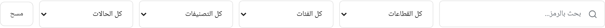

- **البحث** يعمل وأنت تكتب، بعد توقّفٍ قصير عن الكتابة لا مع كل حرف. وفي قاعدة
  المرشحين البحث **بالرمز**.
- **المرشِّحات** المنسدلة تُطبَّق فور اختيارها، ويجمعها زرّ **مسح** في نقرة واحدة.
- **الفرز**: اضغط عنوان العمود ليُفرَز به؛ اضغطه ثانيةً ليُعكَس الاتجاه. السهم
  بجانب العنوان يدلّ على العمود المستعمَل واتجاهه.

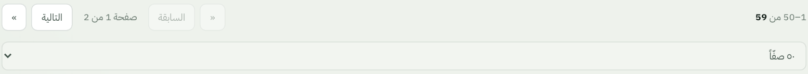

- **الترقيم**: أسفل الجدول يظهر مدى الصفوف المعروضة من الإجمالي، وأزرار
  **التالية** و**السابقة** والقفز إلى الأولى والأخيرة، و**عدد الصفوف في الصفحة**
  (٢٥ / ٥٠ / ١٠٠ / ٢٠٠).

> الفرز والتصفية والترقيم كلّها تجري **على الخادم**، لا على ما حُمِّل في متصفّحك.
> فحين تفرز، يُفرَز الجدول كلّه لا الصفحة التي تراها.

- **الصفوف المصنَّفة (سرّي)** مميّزة بلونٍ مختلف — ولا تظهر أصلاً لمن لا يملك
  `candidate.view_classified`.

---

## ٤. رحلة المرشّح من الترشيح إلى التقرير

هذا هو المسار الذي تخدمه كل شاشة في المنصّة. اعرف موضعك منه تعرف عملك:

```text
ترشيح  →  اعتماد الترشيح  →  جدولة  →  توزيع المقيّمين
   →  استقبال يوم الجلسة (وصول + توقيع وإقرار + توزيع على الأنشطة)
   →  استلام المقيّم (أو ردّه فيُعاد إسناده)  →  اعتماد العمليات  →  حضور
   →  تقييم (مقابلة + حلقة نقاش + أدوات قياس)
   →  كتابة التقرير  →  سلسلة اعتماد من أربع مراحل  →  تقرير معتمد + خطة تطوير
```

### مسار يوم الجلسة — ستّ مراحل، ستّ صلاحيات

| # | المرحلة | الصلاحية | صاحبها |
|---|---|---|---|
| ١ | تسجيل الوصول (الوقت تلقائي وقابل للتعديل) | `reception.record` | مسؤول استقبال الموظفين |
| ٢ | توقيع المرشّح وإقراره بصحّة بياناته | `reception.record` | مسؤول استقبال الموظفين |
| ٣ | التوزيع على مقابلة / حلقة نقاش / أدوات قياس | `reception.assign` | الاستقبال والعمليات |
| ٤ | استلام المرشّح أو ردّه بسبب | `reception.decide` | المقيّم المُسنَد إليه |
| ٥ | إعادة إسناد المردود | `reception.assign` | مسؤول العمليات |
| ٦ | الاعتماد وترحيل الجلسات إلى الجدول | `reception.approve` | مسؤول العمليات |

**من يوزّع لا يعتمد، ومن يقرّر لا يوزّع.**

### سلسلة اعتماد التقرير — أربع مراحل

| المرحلة | صاحبها | ملاحظة |
|---|---|---|
| ١ | مستشار المقابلة | يعتمد ما رصده |
| ٢ | مدير إدارة التقييم | 🔒 **يُمنع** من اعتماد تقرير كتبه بنفسه |
| ٣ | إدارة تطوير الكفاءات | |
| ٤ | مدير المركز | الاعتماد النهائي + الملخّص التنفيذي |

**الإرجاع والإلغاء لمدير المركز وحده** — عمداً: لو ملك كل معتمِدٍ الإرجاع لَرَدّ
كلٌّ منهم التقرير خطواتٍ للوراء فلا يستقرّ.

التقارير المتأخّرة تُصعَّد آلياً كل يوم إلى صاحب المرحلة العالق عندها.


---

## ٥. دليلك بحسب دورك

اثنا عشر دوراً في المنصّة. اقرأ دورك وحده — وما تحتاج معرفته عن غيرك يجده في السيناريوهات بعده.

### مدير النظام

مدير النظام هو الحساب الوحيد الذي يُهيّئ المنصّة ويحرسها: القطاعات وأوقات الجلسات والتكاملات، والكفاءات وربطها بالأنشطة، وحسابات الموظفين وأدوارهم، وسلسلة اعتماد التقرير. هو لا يقف في مسار المرشّح خطوةً بعينها، بل يضع القضبان التي يمشي عليها المسار كلّه — فبلا قطاع لا يُولَّد رمز مشارك، وبلا كفاءات مربوطة بنشاط لا تُرصد درجة، وبلا مرحلة اعتماد واحدة مفعّلة لا يُعتمد تقرير. ويملك في مصفوفة الصلاحيات كل صلاحية، فيستطيع عند الحاجة أن يدخل أي شاشة تشغيلية ويُتمّ ما توقّف فيها.


**شاشاتك:** لوحة التحكم · اللوحة التنفيذية · التحليلات · التقرير اليومي · المرشحون · استقبال الموظفين · الحضور · الجدولة · التوزيع الأسبوعي · التقييم · أدوات القياس · التقارير · خطط التطوير · المحادثات · الإشعارات · سجل التدقيق · المستخدمون · الأدوار والصلاحيات · سير العمل · الإعدادات · إطار الكفاءات · ربط الكفاءات.

#### يومك في المنصّة

**١ — اقرأ حال المركز قبل أي إجراء** *(لوحة التحكم)*

1. افتح **لوحة التحكم** من القائمة الجانبية.
2. اقرأ السطر أسفل التحية: يجمع جلسات اليوم وتقارير الانتظار في جملة واحدة.
3. اقرأ بطاقة **أحدث النشاط** — آخر ستّ حركات من سجل التدقيق: الفاعل · الإجراء · «قبل N دقيقة».
4. اضغط بطاقة **معلّقة** إن ارتفع رقمها.

النتيجة: تعرف حجم اليوم، وتُفتح شاشة التقارير على مرشّح **بانتظار الاعتماد** مباشرةً. بطاقة **أحدث النشاط** لا تظهر إلا لحامل `audit.view`، وارتفاع **معلّقة** يُقرأ تحذيراً لا نجاحاً — ولذلك يُلوَّن سهمها بلون التحذير.

**٢ — أكمل تهيئة المنصّة** *(لوحة التحكم)*

1. اقرأ بطاقة **تهيئة المنصّة** أعلى الصفحة؛ تظهر ما دامت خطوة إلزامية ناقصة، ولا تظهر إلا لحامل `settings.manage`.
2. اضغط **ابدأ** أمام أول خطوة غير مكتملة.
3. أنجز ما تطلبه الشاشة التي فُتحت، ثم ارجع إلى لوحة التحكم.

النتيجة: يرتفع العدّاد وشريط التقدّم، ويتحوّل زرّ الخطوة إلى **مراجعة**. الخطوات الستّ: القطاعات · الرتب المُدارة · الكفاءات · ربط الكفاءات بالأنشطة · حسابات الموظّفين · المشاركون. والترتيب تبعيّ لا تفضيلي: «أكمل الخطوات بالترتيب — كل خطوة تعتمد على ما قبلها.» وعند اكتمال الخطوات الإلزامية الأربع تختفي البطاقة من تلقائها.


**٣ — اضبط بيانات التشغيل الثابتة** *(الإعدادات)*

1. افتح **الإعدادات**، وانزل إلى بطاقة **القطاعات**.
2. في الصفّ الفارغ أسفل الجدول اكتب الاسم في «اسم القطاع…» والرمز في «XX» — حرفان إلى أربعة، لاتيني كبير أو أرقام. راقب عمود **نموذج** فهو يعرض شكل الرمز الناتج فوراً.
3. اضغط **إضافة**.
4. انزل إلى بطاقة **أوقات الجلسات**، واكتب الأوقات مفصولة بفاصلة بصيغة `HH:MM` بنظام ٢٤ ساعة، ثم اضغط **حفظ**.
5. اضبط **الحدّ لكل مقيّم / يوم** في بطاقة **التوزيع الأسبوعي**، ثم اضغط **حفظ**.

النتيجة: «تمت إضافة «{الاسم}»» ثم «تم حفظ أوقات الجلسات» ثم «تم حفظ حدّ التوزيع اليومي». الأوقات تُرتَّب وتُنقّى من التكرار عند الحفظ، ومنها تُبنى أعمدة كشف الحضور المطبوع وخيارات وقت الجلسة في الجدولة. وحدّ التوزيع يُستعمل في اقتراح توزيع الأسبوع القادم.

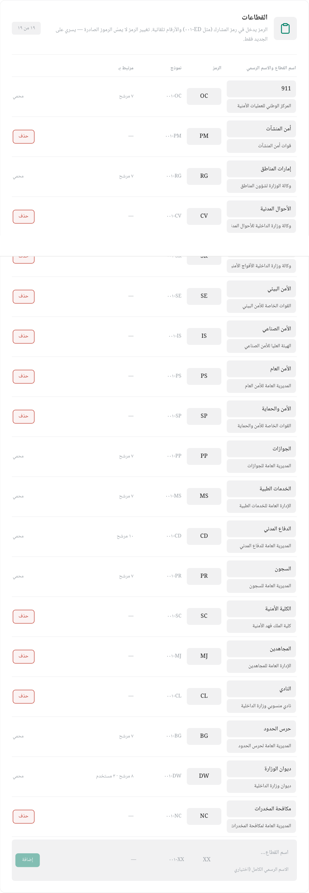

**٤ — عرّف الكفاءات واربطها بالأنشطة** *(إطار الكفاءات ← ربط الكفاءات)*

1. افتح **إطار الكفاءات** واضغط **إضافة كفاءة**.
2. اكتب **الاسم**، واختر **النوع** — سلوكية أو قيادية أو فنية.
3. اضبط **الحد الأقصى** (١–١٠) و**الوزن** (٠–١٠ بخطوة ٠٫٥)، واكتب **مطلوب — قيادة عليا** و**مطلوب — قيادة وسطى** أو اتركهما فارغين.
4. اضغط **حفظ**.
5. افتح **ربط الكفاءات**، وأشِّر في بطاقة **مقابلة شخصية** وبطاقة **حلقة نقاش** ما يُرصد في كلٍّ منهما، ثم اضغط **حفظ** في كل بطاقة على حدة.

النتيجة: تظهر الكفاءة في آخر جدول الإطار، ويظهر **«تم حفظ كفاءات المقابلة الشخصية ✓»** أو **«تم حفظ كفاءات حلقة النقاش ✓»**. التغيير يسري على شاشة التقييم مباشرة. والنوع يُثبَّت عند الإنشاء ولا يظهر حقله في نافذة التعديل.

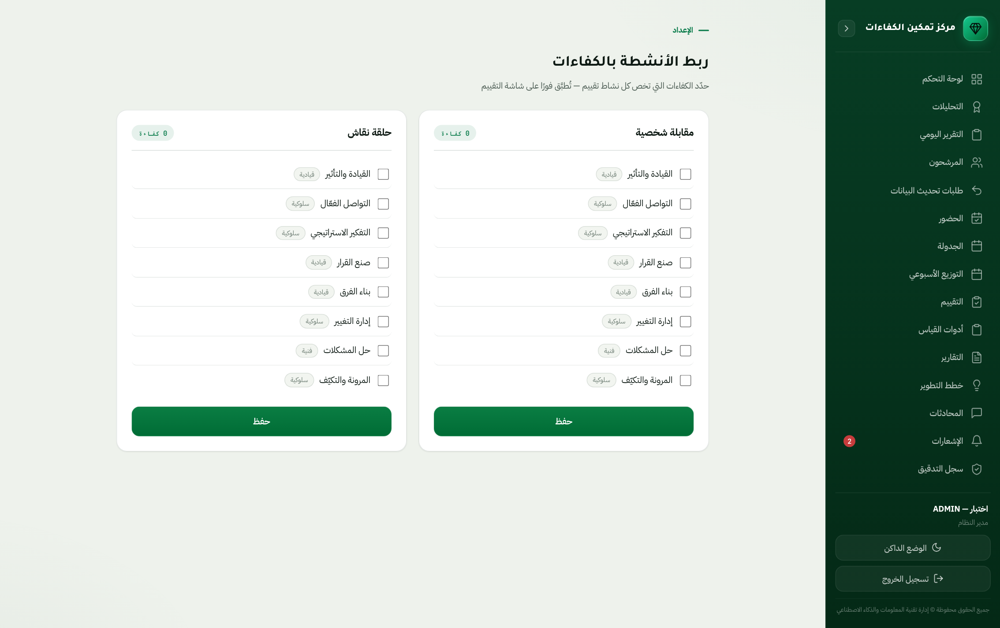

**٥ — أنشئ حساب موظف** *(المستخدمون)*

1. اضغط **إضافة مستخدم**، ثم اختر البطاقة **داخلي (Active Directory)**.
2. اكتب **اسم المستخدم** و**الاسم الكامل**، و**البريد الإلكتروني** اختياري.
3. اكتب **اسم حساب Active Directory** بالصيغة المعروضة `domain\username`.
4. اختر **الدور**، واقرأ صندوق **صلاحيات هذا الدور (N)** أسفل النموذج.
5. إن ظهر **القطاع** فاختره، وإن ظهر **المدير** فاختره من القائمة.
6. اضغط **حفظ**.

النتيجة: **تمت إضافة المستخدم الداخلي**، ويظهر الحساب في الجدول بوسم **داخلي**. ولا كلمة مرور محلية له — دخوله عبر الدليل النشط. حقل **القطاع** يظهر للأدوار المحصورة بقطاع (مستشار المقابلة، مستشار حلقة النقاش، مساعد التقييم) بتنبيه «لا يُقيّم إلا مرشحي هذا القطاع»، و**المدير** يظهر لمساعد التقييم بتنبيه «مديره هو من يعتمد تقاريره».

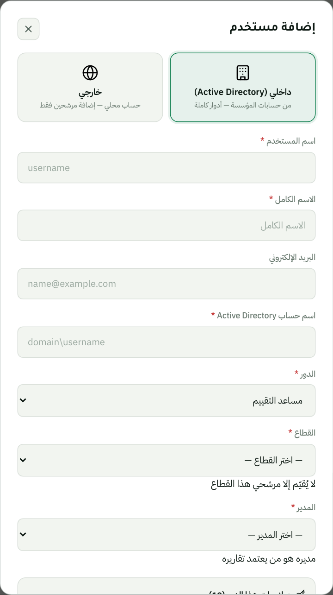

**٦ — امنح استثناء صلاحية لشخص أو اسحبه منه** *(المستخدمون)*

1. اضغط **الصلاحيات** في صفّ المستخدم.
2. اضغط على الصلاحية لتدوير حالتها: من الدور ← عكس ما يقوله الدور ← عودة إلى الدور. الأخضر **ممنوحة استثناءً**، والأحمر المشطوب **مسحوبة استثناءً**.
3. اقرأ الشريط أسفل القائمة: **N استثناء — سيُطلب من المستخدم إعادة الدخول بعد الحفظ**.
4. اضغط **حفظ الصلاحيات**.

النتيجة: **تم حفظ الصلاحيات — سيُطلب من المستخدم إعادة الدخول**، وتُبطَل جلساته فوراً. استعمل هذا للحالة الفردية، أمّا القاعدة فمكانها شاشة **الأدوار والصلاحيات**.

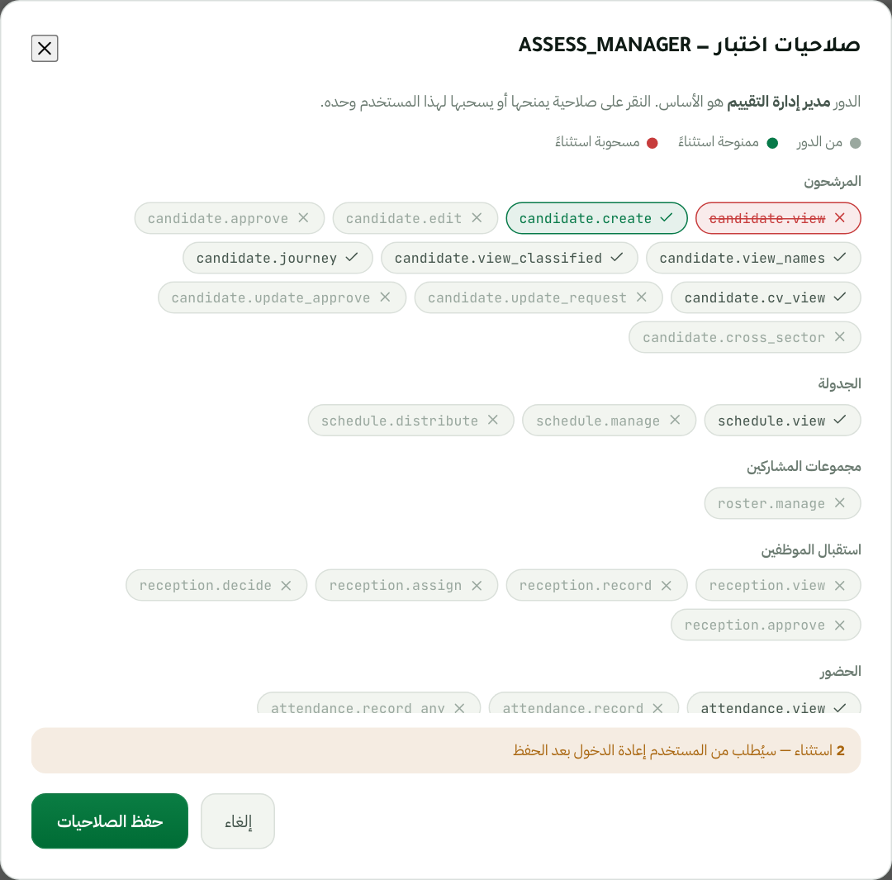

**٧ — اضبط صلاحيات دور** *(الأدوار والصلاحيات)*

1. اضغط اسم الدور في القائمة اليمنى؛ تُفتح صلاحياته على اليسار مع عدد حامليه.
2. أشِّر ما تريد منحه، وأزِل تأشير ما تريد سحبه، أو استعمل **تحديد الكل** / **إلغاء الكل** لمجموعة كاملة.
3. اقرأ صندوق **تغييرات غير محفوظة — ستسري على N مستخدماً** بسطرَي **+ يُضاف** و**− يُسحَب**.
4. اضغط **حفظ** في الشريط أسفل الشاشة، أو **تراجع** للعودة إلى المحفوظ.

النتيجة: **حُفظت صلاحيات «اسم الدور» — تسري على N مستخدماً**، ويتحدّث عدّاد الصلاحيات في القائمة. الإجراء يسري فوراً على كل حامل للدور.

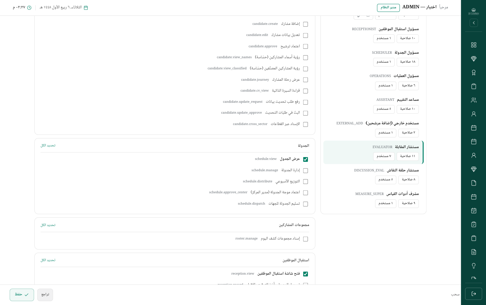

**٨ — اضبط سلسلة اعتماد التقرير** *(سير العمل)*

1. افتح **سير العمل** واقرأ بطاقة **المسار الحالي**: «مسودة» ثم المراحل المفعّلة بالترتيب ثم «معتمد».
2. حرّك المرحلة بسهم **لأعلى** أو **لأسفل** بجانب رقمها؛ يتحدّث «المسار الحالي» فوراً.
3. اضبط قاعدتَي المرحلة: **لا يعتمد ما كتبه** و**كاتبه من فريقه**.
4. اضغط **حفظ سير العمل**.

النتيجة: **تم حفظ سير العمل**، وتُعاد قراءة عدّادات التقارير، ويُدوَّن التغيير في سجل التدقيق بحالتَي السلسلة قبل وبعد. القواعد تُفحَص عند كل اعتماد لتلك المرحلة، وتُفحَص أيضاً عند التجاوز.


**٩ — راجع سجل التدقيق في آخر اليوم** *(سجل التدقيق)*

1. افتح **سجل التدقيق**.
2. افتح قائمة **كل الإجراءات** واختر الإجراء المطلوب — مثلاً «الاطلاع على البيانات الشخصية».
3. اقرأ عمودَي **المستخدم** و**الوقت** لتعرف من ومتى، وعمود **الكيان** لتعرف على أي مشارك، وعمود **IP** لتعرف من أي جهاز.
4. اضغط **مسح** للعودة إلى العرض الكامل.

النتيجة: جدول مقصور على ذلك الإجراء، صفوفه مظلَّلة لأنه حسّاس. العرض محدود بآخر ٢٠٠ عملية مهما كان حجم السجل، والتضييق يكون بالمرشّحات لا بالتصفّح.

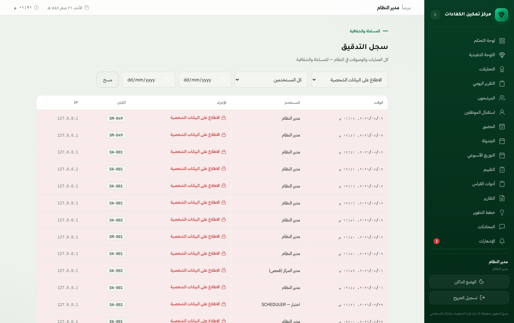

#### ما لا تستطيعه — ولماذا

| ما يمنعه النظام عنك | سببه التصميمي |
|---|---|
| لا تعدّل صلاحيات حسابك أنت | لولا هذا لصار كل من يملك «إدارة المستخدمين» قادراً على منح نفسه كل شيء، فلا يبقى لأي حدٍّ معنى |
| لا تعطّل حسابك ولا تغيّر دورك؛ والزرّان مخفيّان في صفّك | الخادم يردّ المحاولة على أي حال — الإخفاء في الواجهة راحة لا حماية |
| لا تعدّل صلاحيات الدور الذي تحمله أنت | من يعدّل دوره يمنح نفسه ما يشاء، فلا يبقى لأي حدٍّ معنى |
| دور **مدير النظام** لا تُعدَّل صلاحياته ولا يُحذف — يُفتح وكل صلاحياته مقفلة | سحب «إدارة المستخدمين» منه يُغلق باب الإدارة على الجميع بلا سبيل للعودة إلا من قاعدة البيانات مباشرة |
| `user.manage` و`settings.manage` و`audit.view` لا تُمنح ولا تُسحب بالاستثناء الفردي، وتظهر مقفلة في كل دور | سلطات نظام تُدار بالدور المبذور لا بالتحرير؛ منحُها بالتحرير يلتفّ على كونها غير قابلة للتفويض أصلاً |
| لا يُحذف دورٌ له حاملون | حذفه وهم عليه يترك حساباتٍ بلا دور، وكلُّ فحص صلاحية يمرّ بدور صاحبه فيسقط عند أول طلب لهم |
| لا تُعطَّل مرحلة اعتماد فيها تقارير، ولا بدّ من مرحلة واحدة مفعّلة على الأقل | التقرير الواقف عليها يعلق على حالةٍ لا مرحلةَ مفعّلة تعتمدها؛ وسلسلة فارغة تعني تقريراً لا يُعتمد أبداً |
| لا تُخترع مرحلة اعتماد جديدة من الشاشة | مفردات الحالات يفرضها قيد قاعدة البيانات على `final_reports.status`؛ الشاشة تُرتّب وتُفعّل وتُسمّي فقط |
| لا يُحذف قطاع مرتبط بمرشحين أو مستخدمين — يظهر مكان زرّ الحذف وسم **محمي** | حذفه يُيتّم سجلاتهم ويكسر المرجعية |
| لا تُعاد كلمة مرور مستخدم داخلي من هذه الشاشة | يُصادَق عبر الدليل ولا كلمة مرور محلية له، وإعادةُ تعيينها تحبسه في حلقة «غيّر كلمة المرور» لا يستطيع إتمامها |
| لا حذف لكفاءة، ولا حذف ولا تبديل لكفاءات نشاط له تقييمات نشطة (الإضافة فقط مسموحة) | الكفاءة مرتبطة بدرجات مرصودة وتقارير معتمدة؛ وسحبُ كفاءة من تحت تقييم جارٍ يُيتّم درجاتها أو يُفشل إرساله |
| لا يُعدَّل نوع الكفاءة بعد إنشائها | النوع يحكم موضعها في الرصد والتحليل، وتبديله بأثر رجعي يغيّر معنى درجات مرصودة |
| سجل التدقيق للقراءة فقط، ولا يُعدَّل صفٌّ فيه ولا يُحذف | السجل يُكتَب من داخل العمليات نفسها؛ المسار الوحيد المتاح هو القراءة |
| لا تعتمد تقريراً كتبته بنفسك في مرحلةٍ مضبوطة على منع ذلك | «من يكتب لا يعتمد» — وتُفحص القاعدة عند التجاوز أيضاً فلا يصير التخطّي باباً خلفياً يلتفّ عليها |
| لا تحذف جلسة سُجّل حضورها | القفل يمنع تنافر «حضورٌ لجلسة تغيّر تاريخها»؛ والرفض معلَّق على **وجود** سجلّ حضور لا على حالته |
| المفاتيح وكلمات المرور في الإعدادات لا تعود إلى الواجهة أبداً | الخادم يُخزّنها مشفَّرة ولا يعيد منها إلا إشارةً بأنها مضبوطة — وتركُ الحقل فارغاً يعني «أبقِ المحفوظ» لا «امسحه» |

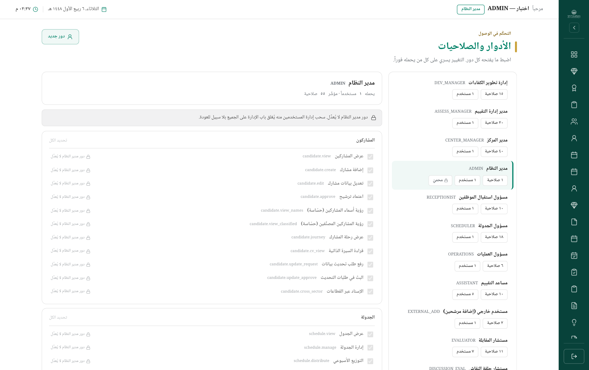

#### إن واجهتك رسالة

| الرسالة | معناها | ما تفعله |
|---|---|---|
| لا يمكنك تعديل صلاحيات حسابك · لا يمكنك تغيير دورك الخاص · لا يمكنك تعطيل حسابك الخاص | إجراء على حسابك أنت | اطلبه من مدير نظام آخر |
| لا يمكنك تعديل صلاحيات دورك | حفظُ صلاحيات الدور الذي تحمله | اطلبه من مدير نظام آخر |
| هذه الصلاحيات تُدار بالدور لا بالاستثناء الفردي: … | حاولت منح أو سحب سلطة نظام باستثناء فردي | أعِدها إلى حالة «من الدور» |
| The role id field is required. | حُفظ الحساب بلا دور — يقع دائماً عند إضافة مستخدم من النوع **خارجي** لأن حقل الدور مخفيّ عنه | استعمل النوع **داخلي (Active Directory)** ليظهر حقل الدور |
| «‹اسم المرحلة›» فيها N تقرير — حرّكها أولاً ثم عطّل المرحلة | منعك تعطيل مرحلة عليها تقارير واقفة | اعتمد تلك التقارير أو أرجعها حتى يخلو العدّاد، ثم عطّل المرحلة |
| لا شيء يظهر بعد ضغط **حفظ الصلاحيات** | الخادم ردّ الحفظ والنافذة لا تعرض سبب الردّ | راجع تأشيراتك: سلطة نظام؟ استثناء يطابق الدور؟ ثم أعِد المحاولة |

---

### مدير المركز

مدير المركز يُشرف على مسار المرشّح كلّه ولا يُدخل بياناته ولا يرصد درجاته. يوم المرشّح يمرّ عليه في موضعين: عند باب المركز حين يعتمد بيانات الاستقبال ويُرحّل جلساته إلى الجدول، وعند نهاية المسار حين يقرأ التقرير النهائي ويكتب ملخّصه التنفيذي ويُرجعه للتعديل إن لزم. وبينهما يوزّع مشاركي الأسبوع على مستشاري المقابلة، ويعتمد الترشيحات، ويضبط إطار الكفاءات الذي يُرصد عليه التقييم. وهو الدور الثاني الوحيد — مع مدير النظام — الذي يقرأ سجل التدقيق.

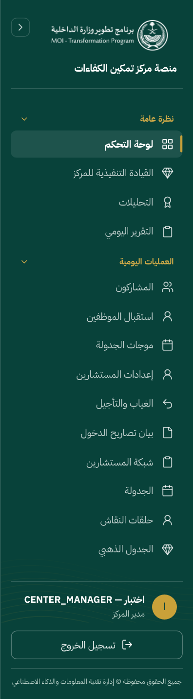

**شاشاتك:** لوحة التحكم · اللوحة التنفيذية · التحليلات · التقرير اليومي · المرشحون · استقبال الموظفين · الحضور · الجدولة · التوزيع الأسبوعي · التقييم · أدوات القياس · التقارير · خطط التطوير · المحادثات · الإشعارات · سجل التدقيق · إطار الكفاءات · ربط الكفاءات.

#### يومك في المنصّة

**١ — اقرأ اليوم قبل أن يبدأ** *(لوحة التحكم ← اللوحة التنفيذية)*

1. افتح **لوحة التحكم** واقرأ الشرائح الثلاث: **حضور اليوم** و**جلسات نشطة** و**مرشحون جدد**، ثم مقياس **جاهزية القيادة**.
2. افتح **اللوحة التنفيذية** واقرأ البطاقات الأربع وشارات الفرق؛ تلميحها **«مقارنة بالفترة السابقة»**.
3. انزل إلى **رؤى تلقائية** وابدأ من بطاقتَي **أولوية التطوير** و**اختناق الاعتماد** — هما اللتان تقودان إلى إجراء.

النتيجة: أربعة أرقام قيادية مع اتجاه آخر ثلاثين يوماً، وأطول طابور في سلسلة الاعتماد، وأضعف كفاءة مؤسسياً. أرقام اللوحة كلها من التقارير **المعتمدة** وحدها — لا يحرّكها تقرير ما زال في السلسلة.

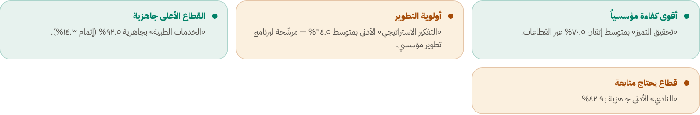

**٢ — راجع يوم أمس واطبع مستنده** *(التقرير اليومي)*

1. افتح **التقرير اليومي**؛ يفتح على تاريخ اليوم.
2. اضغط حقل التاريخ واختر اليوم المطلوب — تُعاد الأقسام الأربعة فوراً بلا زرّ بحث.
3. اقرأ **الغياب والأسباب**: الوسم الأخضر **بعذر** أو الأحمر **بدون عذر**، والسبب كما دُوِّن عند تسجيل الغياب.
4. اضغط **طباعة**، ثم **طباعة / حفظ PDF** في التبويب الجديد.

النتيجة: مستند «مركز تمكين الكفاءات لتقييم القيادات — التقرير اليومي» بتاريخه وأربعة جداول. ويصلك بريدٌ يومي الساعة ٦:٠٠ صباحاً نصّه: «التقرير اليومي — <التاريخ>. افتح النظام لعرض التفاصيل والطباعة.» — التفاصيل تُقرأ من هذه الشاشة لا من البريد.

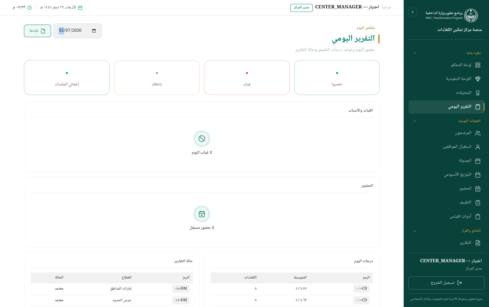

**٣ — أغلق مسار اليوم عند الاستقبال** *(استقبال الموظفين)*

1. افتح **استقبال الموظفين** على تاريخ اليوم، واقرأ البطاقات الأربع: **وصلوا** · **وقّعوا وأقرّوا** · **بانتظار قرار المقيّم** · **معتمدون**.
2. إن ظهر سطر ردّ أحمر بصيغة «ردّ ‹المقيّم› ‹النشاط› — ‹السبب›»، اضغط **توزيع** في الصفّ، واختر **النشاط** ثم **المقيّم** من قائمة «الاسم — الدور (القطاع)»، ثم اضغط **إسناد وإشعار**.
3. إن بقي إسناد **بانتظار المقيّم**، انتظر قراره أو اضغط «سحب الإسناد» داخل بطاقته.
4. اضغط **اعتماد وترحيل** في الصفّ الذي وقّع وأقرّ وفيه إسناد **مُستلَم**.

النتيجة: تُنشَأ جلسة في **الجدولة** لكل إسناد مُستلَم بتاريخ الزيارة ونشاطها ومقيّمها، ويتحوّل الصفّ إلى **معتمد**، وتظهر «اعتُمد ‹الرمز› ورُحّلت جلساته». والزرّ يبقى معطّلاً ما لم يكتمل شرطه، وسبب التعطيل يظهر عند مرور المؤشّر عليه.

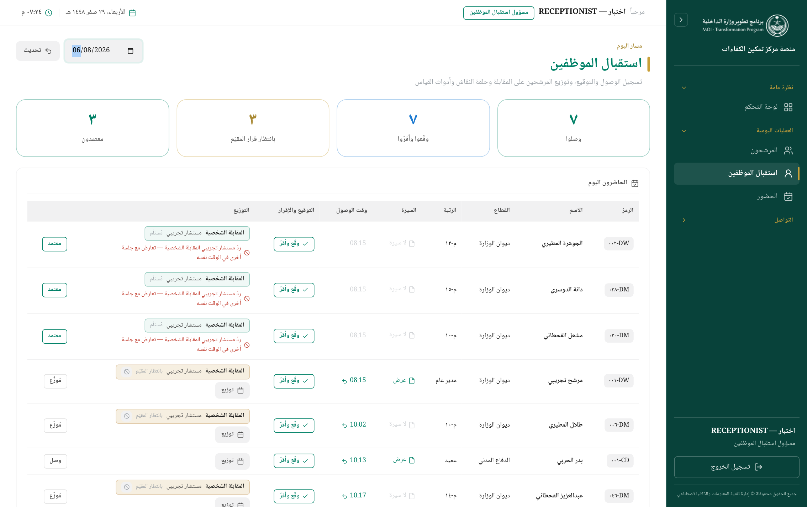

**٤ — اعتمد الترشيحات وجهّز كشف اليوم** *(المرشحون)*

1. افتح **المرشحون**، ورشّح **كل الحالات** على «مسودة».
2. اضغط أيقونة **اعتماد** (✓) في صفّ المرشّح.
3. حدّد مشاركي اليوم من مربّعات صفوفهم، ثم اضغط **إسناد لمجموعة** في شريط التحديد، واختر **اليوم** ثم المجموعة **أ** أو **ب**، ثم **إسناد**.
4. اضغط **كشف الحضور**، واختر **اليوم**، واضبط **الهوية الوطنية** على «إخفاء» أو «إظهار»، ثم **فتح الكشف**.

النتيجة: «تم اعتماد <الرمز>» وتصير الحالة «مجدول»، ثم «تم إسناد N مشاركاً للمجموعة أ». المجموعة تحدّد أيّ فترة يبدأ بها كلٌّ منهم — المقابلة أو حلقة النقاش، والحدّ ٢٠٠ مشارك في المرة. وإظهار الهوية في الكشف يُسجَّل في سجل التدقيق باسمك.

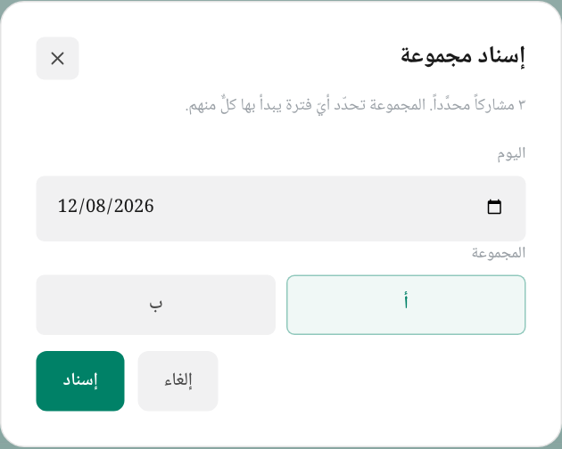

**٥ — وزّع مشاركي الأسبوع القادم** *(التوزيع الأسبوعي)*

1. افتح **التوزيع الأسبوعي** وراجع البطاقات الثلاث: الأسبوع المستهدَف، و**جاهزون للتوزيع**، و**الحدّ لكل مقيّم / يوم**.
2. اضغط **اقترح توزيع الأسبوع**.
3. اقرأ كتل المستشارين واحدة واحدة، وقارن عدد **البنود** في اللافتة بعدد **الجاهزين** في البطاقة.
4. اضغط **اعتماد وإنشاء الجلسات**، وأكّد السؤال **اعتماد التوزيع سيُنشئ جلسات المقابلات. متابعة؟**.

النتيجة: **تم اقتراح التوزيع — راجعه ثم اعتمده** ثم **تم اعتماد التوزيع — جُدوِل … مرشّح**. الاعتماد يعيد التحقّق من كل بند على البيانات الحيّة ولا ينسخ المسودّة، فما بطل يسقط بسببه في عمود **الحالة**. والأسبوع الموزَّع هو الأحد القادم إلى الخميس.


**٦ — استكمل الجلسات التي أنشأها التوزيع** *(الجدولة)*

1. افتح **الجدولة** واختر تاريخ اليوم المستهدف من حقل **التاريخ**.
2. الجلسات المُنشأة بالاعتماد تظهر بـ**—** في عمودَي **الوقت** و**المكان**؛ اضغط زرّ القلم في صفّ الجلسة.
3. اضبط **الوقت** و**المكان**، وراجع **مستشار المقابلة**.
4. اضغط **حفظ**.

النتيجة: تُحدَّث الجلسة في الجدول. حقل **الوقت** يظهر لك حقلاً حرّاً لا قائمةَ أوقاتٍ معتمدة، لأن قراءة أوقات الجلسات تتطلّب إدارة الإعدادات. وتغيير التاريخ أو الوقت يحذف الحضور المسجَّل لتلك الجلسة، لأن حضوراً لموعدٍ تبدّل لم يعد صحيحاً.

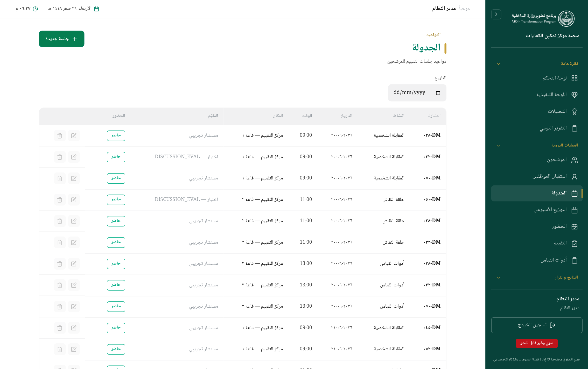

**٧ — راجع التقارير وأرجِع ما يحتاج تعديلاً** *(التقارير)*

1. افتح **التقارير** واضغط مرشّح **بانتظار الاعتماد** لترى السلسلة كاملةً.
2. اضغط **مستند مفصّل** على البطاقة لقراءة التقرير قبل قرارك.
3. للإرجاع: اضغط **إرجاع للتعديل**، واكتب السبب في «سبب الإرجاع (إلزامي)» — خمسة أحرف فأكثر — ثم اضغط **تأكيد الإرجاع**.
4. للملخّص: اضغط **الملخّص التنفيذي**، واكتب النصّ، ثم **حفظ**.
5. للتصدير: اضغط **تصدير CSV**.

النتيجة: «أُعيد تقرير ‹الرمز› للتعديل»، وتصير حالته **مُعاد للتعديل**، ويصل كاتبه إشعار بالسبب، ويُقيَّد السبب في محادثة التقرير، ويزيد عدّاد مرّات الإرجاع. والملخّص يظهر في **المستند المختصر** — ويعلوه التنبيه «يُعرض في المستند المختصر. بصلاحية مدير المركز.» واسم المشارك في المستند المطبوع لا يظهر إلا لك ولمدير النظام، ويُدوَّن في سجل التدقيق من أخرج مستنداً يحمل الاسم.

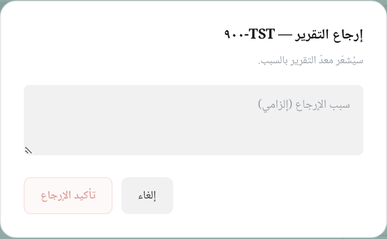

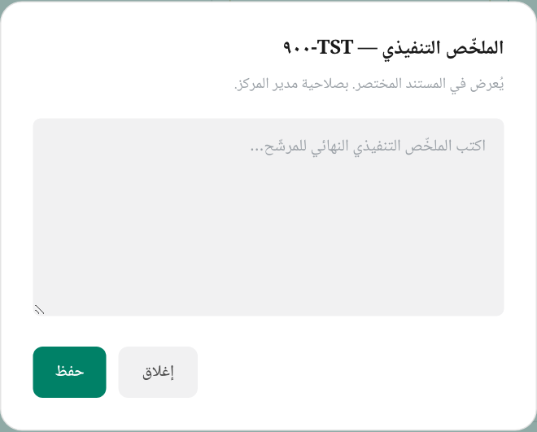

**٨ — تابع خطط التطوير وارفع نتائج القياس** *(خطط التطوير ← أدوات القياس)*

1. افتح **خطط التطوير**، واختر المشارك من قائمة **المرشّح**.
2. اضغط **توليد من التقرير** — يُنشأ بند بحالة «بالانتظار» لكل مجال تطوير في تقرير الدورة، والمُدرَج سابقاً لا يتكرّر.
3. اضبط حالة البند من قائمته: **بالانتظار** / **قيد التنفيذ** / **مكتمل**.
4. افتح **أدوات القياس**، واختر المشارك، واكتب **المقياس الشخصي** و**القدرات التحليلية** و**اللغة الإنجليزية** (٠–١٠٠)، ثم اضغط **حفظ النتيجة**.

النتيجة: عند اختيار **مكتمل** يُسجَّل وقت الإكمال ويظهر وسم «اكتمل» ويُشطَب مجال البند. وفي القياس يظهر شريط **«تم حفظ نتيجة القياس»** ويتحدّث سطر «آخر تحديث». الحقل المتروك فارغاً يُحفظ بلا قيمة ولا يُعدّ صفراً، والحفظ يستبدل نتيجة الدورة نفسها ولا يضيف سجلاً جديداً.

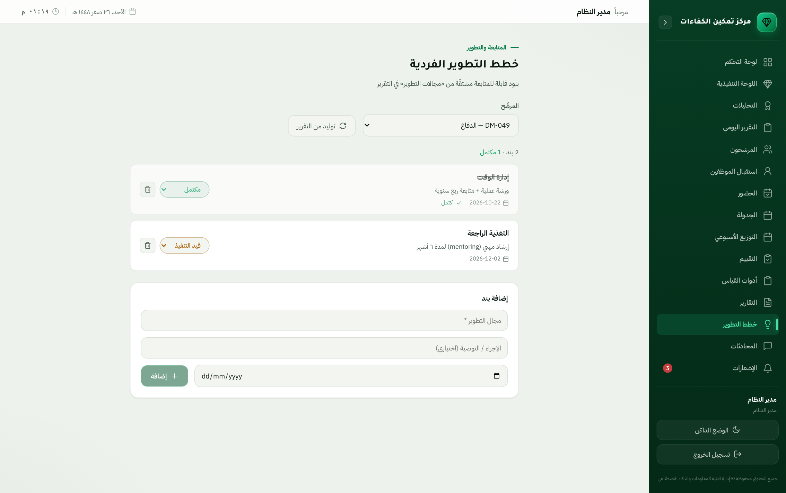

**٩ — اضبط إطار الكفاءات** *(إطار الكفاءات ← ربط الكفاءات)*

1. افتح **إطار الكفاءات**، واضغط أيقونة **تعديل** في صفّ الكفاءة.
2. عدّل **الوزن** أو **الحد الأقصى** أو **مطلوب — قيادة عليا** و**مطلوب — قيادة وسطى**.
3. اضغط **حفظ**.
4. افتح **ربط الكفاءات** إن أردت تغيير ما يُرصد في نشاط، وأشِّر المربّعات، ثم اضغط **حفظ** في البطاقة نفسها.

النتيجة: يُعاد تحميل الجدول بالقيم الجديدة. حقل **النوع** لا يظهر في نافذة التعديل — يُثبَّت عند الإنشاء. والحفظ في شاشة الربط استبدال كامل لا إضافة تراكمية: ما لم يُؤشَّر يُفكّ ربطه.

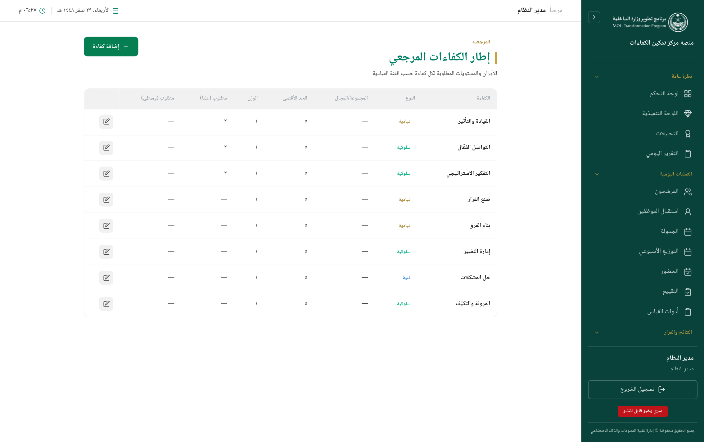

**١٠ — أغلق يومك بسجل التدقيق** *(سجل التدقيق)*

1. افتح **سجل التدقيق**.
2. اختر اسم المستخدم من قائمة **كل المستخدمين**، واضبط **من تاريخ** و**إلى تاريخ**.
3. اقرأ الجدول — يُعاد تحميله بعد كل اختيار، بلا زرّ بحث.
4. اضغط **مسح** للعودة إلى آخر ٢٠٠ عملية.

النتيجة: كل ما فعله ذلك المستخدم داخل المدّة، من الأحدث إلى الأقدم. الصفوف الحسّاسة مظلَّلة ويسبق إجراءَها قفل، ومنها **كل محاولة وصول مرفوضة**.

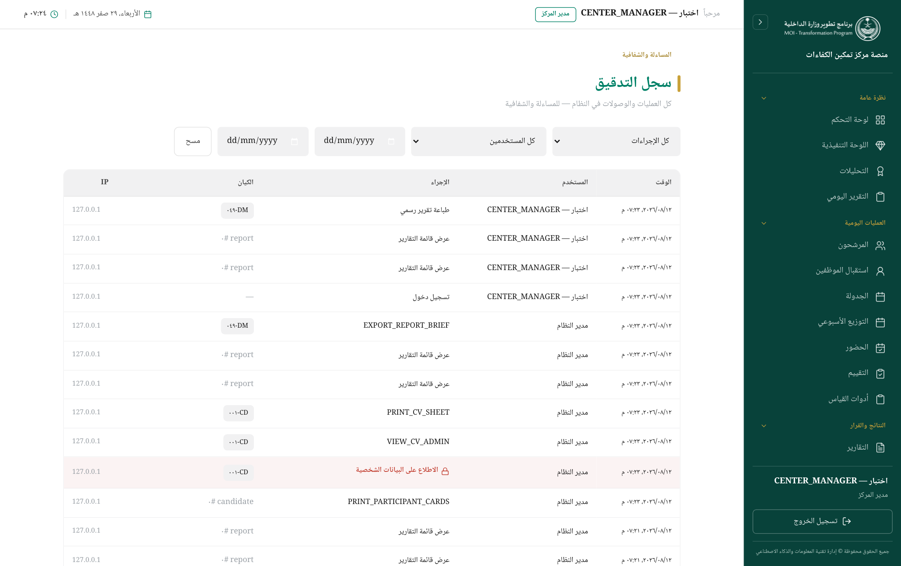

#### ما لا تستطيعه — ولماذا

| ما يمنعه النظام عنك | سببه التصميمي |
|---|---|
| لا تُنشئ حساباً، ولا تُسند دوراً، ولا تعيد كلمة مرور، ولا تضبط صلاحيات الأدوار — و**المستخدمون** و**الأدوار والصلاحيات** لا تظهران في قائمتك | `user.manage` سلطة نظام غير قابلة للتفويض؛ فصلُها يبقي من يشرف غير من يضبط |
| لا تفتح **الإعدادات**: القطاعات، وأوقات الجلسات، وحدّ التوزيع، والتكاملات. وأثره اليومي أن حقل **الوقت** في نافذة الجلسة يظهر لك حرّاً لا قائمةً معتمدة | `settings.manage` واحدة من ثلاث سلطات غير قابلة للتفويض، وقراءة أوقات الجلسات تتبعها |
| لا تضبط **سير العمل** — ترتيب مراحل الاعتماد وتفعيلها وقواعدها | قرار حوكمي؛ نصّ المصفوفة: «لا يتحكّم في المستخدمين ولا الإعدادات ولا مراحل الاعتماد؛ تلك سلطات نظام تُدار من حساب مدير النظام وحده» |
| لا تسجّل حضوراً ولا غياباً في شاشة **الحضور**، وإن ملكتَ «تسجيل حضور أي جلسة» | التسجيل يشترط `attendance.record` أولاً؛ والقاعدة «الذي يستقبله يسجّله» — بلا هذا التمييز يسجّل أيُّ أحد حضور مشاركٍ لم يره |
| لا تسجّل وصول مرشّح، ولا تعدّل وقت وصوله، ولا تأخذ توقيعه، ولا يظهر لك قسم **المنتظَرون** | لكل مرحلة في الاستقبال صلاحية مستقلّة: من يسجّل ليس من يوزّع، ومن يوزّع ليس من يقرّر، ومن يقرّر ليس من يعتمد — وأنت المعتمِد |
| لا تستلم مرشّحاً ولا تردّه، ولا يظهر لك قسم **المُسنَد إليّ اليوم** | القرار لمن يجري النشاط؛ صاحب الإسناد وحده يستلمه أو يردّه |
| لا ترصد درجات ولا تبدأ جلسة تقييم؛ تفتح الشاشة وتقرأ ولا تبدأ بها جلسة | الرصد لمستشار المقابلة ومستشار حلقة النقاش؛ وأنت في موقع الاعتماد (`evaluation.approve`) — وسرّية الدرجات بين المستشار ومراجعه |
| لا تُضيف مرشحاً ولا تستورد ولا تفتح له دورة تقييم جديدة | `candidate.create` لمن يستقبل الترشيح — بوّابة الجهة الخارجية ومسؤول الجدولة — وأنت تعتمد ما أُدخل |
| لا تبتّ في طلبات تحديث بيانات المرشحين | البتّ بصلاحية `candidate.update_approve` — مسؤول الجدولة ومدير النظام |
| لا تُسند مقيّماً من قطاع غير قطاع المشارك في شاشة الاستقبال | الإسناد محصور بقطاع المشارك، والتجاوز يحتاج `candidate.cross_sector` صراحةً — وهي القاعدة نفسها المطبَّقة في الجدولة |
| لا يظهر لك زرّ **اعتماد** إلا حيث تملك مرحلته؛ ومراحل المقيّم ومدير التقييم والاعتماد النهائي ليست لك | المرحلة تُشتقّ من حالة التقرير لا من دور المستخدم، وإخفاء الزرّ يمنع زرّاً يَعِد بما يُرفض |
| لا تعتمد تقريراً كتبته بنفسك في مرحلةٍ مضبوطة على ذلك | «من يكتب لا يعتمد» — والقاعدة تُفحص عند التجاوز أيضاً |
| لا تُرجِع تقريراً معتمداً ولا مسودة، ولا تُلغي تقريراً معتمداً | الإرجاع لما هو في سلسلة الاعتماد وحده منعاً لإفساد حالة المشارك؛ والمعتمَد وثيقة نافذة قد تكون طُبعت ووُقّعت، وسحبها يحتاج إجراءً موثّقاً لا زرّاً |
| لا تحذف مرشحاً بدأت عملية تقييمه، ولا تحذف جلسة سُجّل حضورها | من غادر المسودة له أثرٌ مرصود؛ والقفل يمنع تنافر «حضورٌ لجلسة تغيّر تاريخها» |
| لا تسحب كفاءة من نشاط له تقييمات جارية (الإضافة فقط مسموحة) | التقييم الجاري مرصود على قائمة الكفاءات القائمة، وسحبُ كفاءة من تحته يُيتّم درجاتها أو يُفشل إرساله |


> ملاحظة على سلسلة الاعتماد: هي في هذا التنصيب أربع مراحل آخرها اعتماد مدير المركز. وشارات شاشة التقارير تسمّي المراحل الثلاث الأولى؛ فالتقرير الذي يبلغ مرحلتك يظهر برمزها `pending_center`، ويبقى محسوباً في مؤشّر **بانتظار** وضمن مرشّح **بانتظار الاعتماد**، ولا يظهر له زرّ اعتماد في هذه الشاشة.

#### إن واجهتك رسالة

| الرسالة | معناها | ما تفعله |
|---|---|---|
| ليس لديك صلاحية تسجيل الحضور | تملك عرض الحضور لا تسجيله | أبلغ من يملك التسجيل: الاستقبال، أو المستشار المُسنَدة إليه الجلسة |
| ليس لديك صلاحية إدارة الإعدادات | فتحتَ **سير العمل** أو أحد مسارات الإعدادات | الشاشة لمدير النظام؛ اطلب التغيير منه — الصلاحية لا تُفوَّض |
| لا يمكنك اعتماد تقرير كتبته بنفسك — يعتمده صاحب صلاحية أخرى | مرحلة الاعتماد هذه تمنع كاتب التقرير من اعتماده | أحِل الاعتماد إلى صاحب صلاحية أخرى في المرحلة نفسها |
| لا يمكن إرجاع تقرير غير مُرسل للاعتماد | التقرير معتمد أو مسودة | لا يُرجَع إلا ما هو في سلسلة الاعتماد |
| بقي إسناد بانتظار قرار المقيّم — انتظر البتّ أو اسحب الإسناد | ضغطتَ **اعتماد وترحيل** وثمّة إسناد معلّق | انتظر قرار المقيّم، أو اسحب الإسناد ثم اعتمد |
| المقيّم من قطاع آخر — يلزم صلاحية الإسناد عبر القطاعات | المقيّم المختار محصور بقطاع غير قطاع المرشّح | اختر مقيّماً من قطاع المرشّح، أو أوكِل الإسناد لمن يملك `candidate.cross_sector` |
| لا يمكن حذف جلسة سُجّل حضورها | للجلسة سجلّ حضور | لا تُحذف — عدّلها بدل ذلك |

# مسؤولو تشغيل اليوم

### مسؤول الجدولة

مسؤول الجدولة هو مالك مواعيد المركز وبيانات المشاركين. يعتمد الترشيحات الواردة، ويحوّل المشارك المعتمد إلى جلسات لها تاريخ ووقت ومكان ومستشار، ويوزّع مشاركي الأسبوع القادم على مستشاري المقابلة بحدٍّ يومي، ويعتمد زيارات الاستقبال فتُرحَّل جلساتها إلى الجدول. لا يقيّم ولا يكتب تقريراً؛ عمله ينتهي عند وضع المشارك أمام المقيّم في موعده الصحيح.

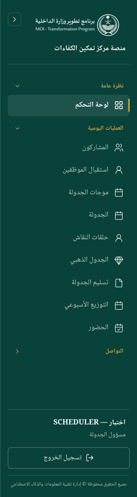

**شاشاتك:** لوحة التحكم · المرشحون · استقبال الموظفين · الحضور · الجدولة · التوزيع الأسبوعي · المحادثات · الإشعارات.

#### يومك في المنصّة

**١ — اقرأ نظرة اليوم** *(لوحة التحكم)*

1. افتح **لوحة التحكم** من القائمة الجانبية.
2. اقرأ السطر أسفل التحية — يجمع جلسات اليوم وتقارير الانتظار في جملة واحدة.
3. اقرأ بطاقة **جدول اليوم**: حتى ستّ جلسات، لكل واحدة الوقت ثم «النشاط — الفئة القيادية».
4. إن كان اليوم أزحم اضغط السطر **و{العدد} جلسة أخرى — عرض الجدول كاملاً**.

تُفتح شاشة الجدولة بالجلسات كلها. وإن لم تكن هناك جلسات ظهر في البطاقة: **لا جلسات مجدولة اليوم.**

**٢ — اعتمد الترشيحات الجديدة** *(المرشحون)*

1. افتح **المرشحون**.
2. من مُرشِّح **كل الحالات** اختر «مسودة».
3. اضغط أيقونة **اعتماد** (✓) في صفّ المشارك.

تظهر رسالة «تم اعتماد <الرمز>»، وتصير الحالة «مجدول»، وتُزامَن معها دورة التقييم الحالية. قبل هذه الخطوة لا يظهر المشارك في قائمة **المرشّح** داخل نافذة الجلسة.

**٣ — جدوِل جلسة وعيّن مستشار المقابلة** *(الجدولة)*


1. افتح **الجدولة** واضغط **جلسة جديدة**.
2. اختر المشارك من قائمة **المرشّح** (بصيغة «الرمز — القطاع»).
3. اختر **النشاط**. للمقابلة الشخصية يظهر حقل **مستشار المقابلة** وصفّ **استعراض السيرة الذاتية**.
4. اضغط **استعراض السيرة الذاتية** واقرأ المنصب وسنوات الخبرة والنبذة والمؤهلات والخبرات.
5. اختر الاسم من قائمة **مستشار المقابلة**، أو أبقِ **— بلا تعيين —**.
6. اختر **التاريخ** ثم **الوقت**، واكتب **المكان** إن وُجد.
7. اضغط **إنشاء**.

تُغلق النافذة، وتظهر الجلسة في الجدول بحالة حضور **بالانتظار**، ويظهر اسم المستشار في عمود **المُقيّم**.

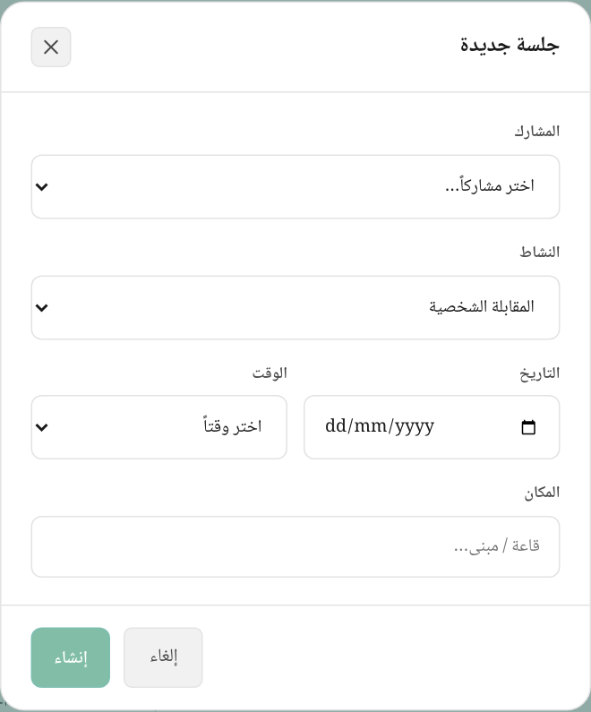

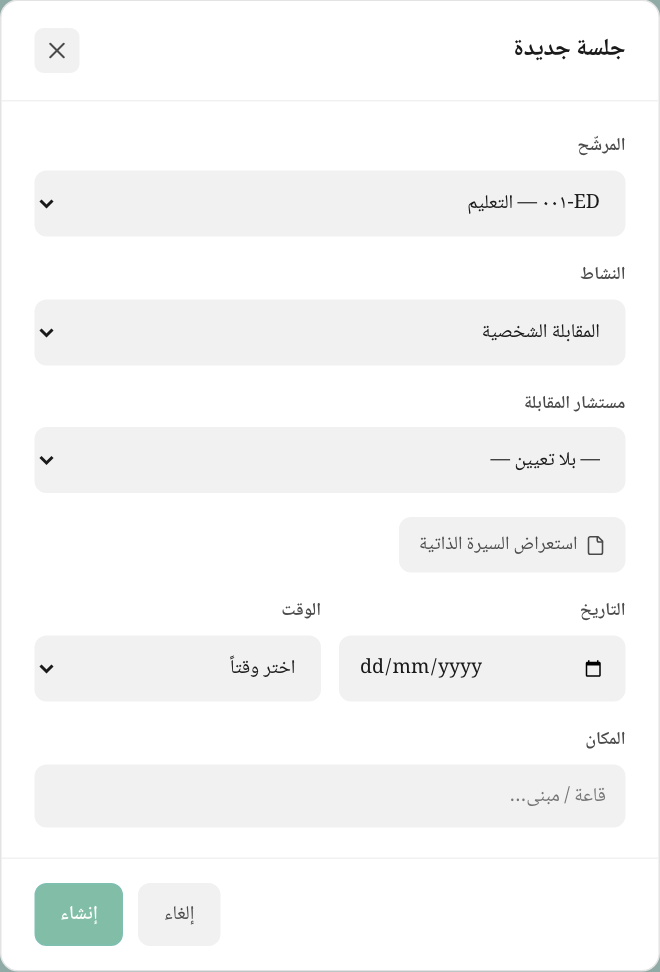

**٤ — عدّل جلسة أو احذفها** *(الجدولة)*

1. اضغط زرّ القلم في صفّ الجلسة، وعدّل النشاط أو التاريخ أو الوقت أو المكان أو المستشار، ثم اضغط **حفظ**.
2. للحذف اضغط زرّ السلّة، ثم أكّد السؤال **حذف جلسة … للمشارك …؟**.

تُحدَّث الجلسة أو تختفي من الجدول. تغيير التاريخ أو الوقت يحذف الحضور المسجَّل لتلك الجلسة، وتغيير النشاط إلى غير المقابلة يُلغي تعيين المستشار.

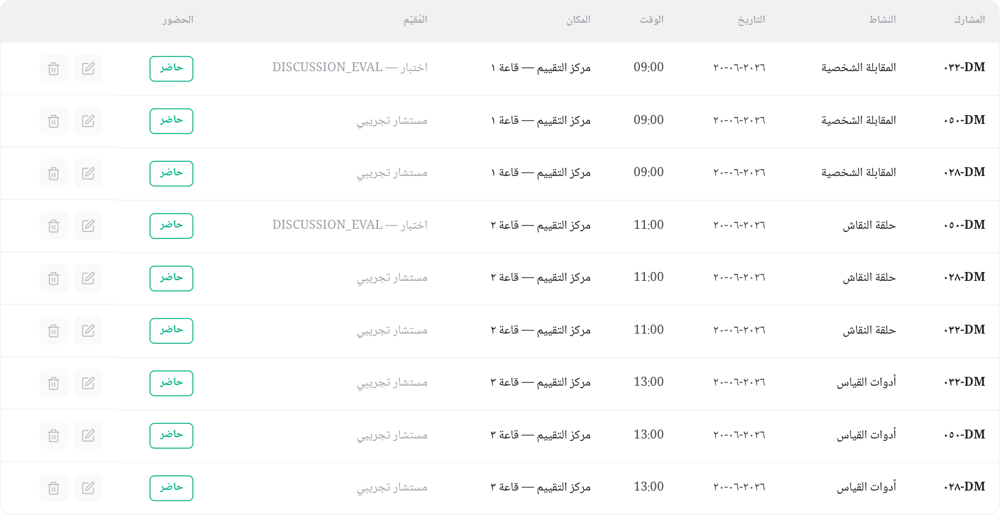

**٥ — تابع كشف الاستقبال ووزّع من وصل** *(استقبال الموظفين)*

1. افتح **استقبال الموظفين** وتأكّد أن حقل التاريخ على اليوم.
2. في جدول **الحاضرون اليوم** ابحث عن صفّ من وقّع وأقرّ، واضغط **توزيع**.
3. اختر **النشاط**: المقابلة الشخصية، أو حلقة النقاش، أو أدوات القياس.
4. اختر **المقيّم** من القائمة؛ كل سطر فيها «الاسم — الدور (القطاع)».
5. اضغط **إسناد وإشعار**.

يظهر الإسناد في الصفّ بحالة **بانتظار المقيّم**، وتظهر الرسالة «أُسنِد المرشح وأُشعِر المقيّم»، ويصل المقيّم إشعار «مرشّح مُسنَد إليك: ‹الرمز›» بالرمز لا بالاسم.

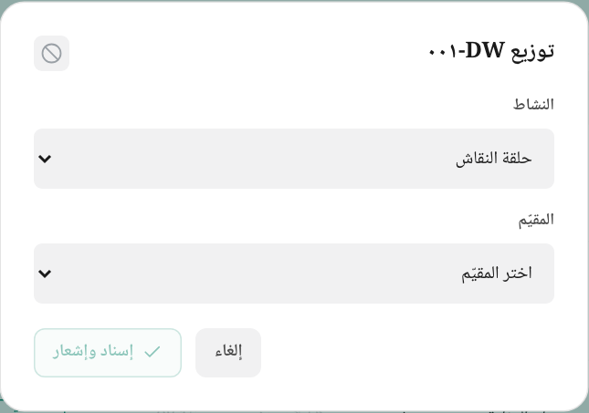

**٦ — اسحب إسناداً لم يُبَتَّ فيه** *(استقبال الموظفين)*

1. ابحث عن بطاقة الإسناد الموسومة **بانتظار المقيّم**.
2. اضغط الزرّ الصغير المسمّى «سحب الإسناد» داخلها.

يختفي الإسناد وتظهر الرسالة «سُحب الإسناد». الإسناد الذي استلمه المقيّم أو ردّه لا يُسحب.

**٧ — أعِد إسناد المردود ثم اعتمد ورحّل** *(استقبال الموظفين)*

1. إن ظهر سطر ردّ أحمر بصيغة «ردّ ‹المقيّم› ‹النشاط› — ‹السبب›»، اضغط **توزيع** وأعد إسناده لمقيّم آخر أو لنشاط آخر.
2. تأكّد أن المشارك **وقّع وأقرّ**، وأن إسناداته كلّها مبتوت فيها، وفيها إسناد واحد على الأقل **مُستلَم**.
3. اضغط **اعتماد وترحيل**.

تُنشَأ في **الجدولة** جلسة لكل إسناد مُستلَم بتاريخ الزيارة ونشاطها ومقيّمها، ويتحوّل الصفّ إلى **معتمد**، وتظهر الرسالة «اعتُمد ‹الرمز› ورُحّلت جلساته». والزرّ يبقى معطَّلاً ما لم يكتمل شرطه، وسبب التعطيل يظهر عند مرور المؤشّر عليه.

**٨ — جهّز كشف حضور الغد وإسناد المجموعات** *(المرشحون)*

1. حدّد المشاركين من مربّعات صفوفهم.
2. اضغط **إسناد لمجموعة**، واختر **اليوم** ثم المجموعة **أ** أو **ب**، ثم اضغط **إسناد**.
3. اضغط **كشف الحضور** في شريط الأدوات، واختر **اليوم**.
4. من **الهوية الوطنية** اختر «إخفاء» أو «إظهار»، ثم اضغط **فتح الكشف**.

تظهر رسالة «تم إسناد N مشاركاً للمجموعة أ»، والمجموعة تحدّد أيّ فترة يبدأ بها كلٌّ منهم. ويفتح الكشف في تبويب جديد بأعمدته المعتمدة: «م»، «ج»، «الهوية الوطنية»، «الرتبة/المرتبة»، «رمز المشارك»، «التوقيع»، وأعمدة المقيّمين ومساعديهم. واختيار **إظهار** يُسجَّل في سجل التدقيق باسمك، والحدّ ٢٠٠ مشارك في إسناد المجموعة الواحد.


**٩ — أعِد جدولة الغياب** *(المرشحون)*

1. في صفٍّ يحمل وسم **غياب** اضغط أيقونة **إعادة جدولة الغياب**.
2. اختر **جلسة الغياب** من القائمة.
3. حدّد **التاريخ الجديد**، و**الوقت** و**المكان** إن أردت تغييرهما — واتركهما فارغين للإبقاء على السابق.
4. اضغط **إعادة الجدولة**.

تظهر رسالة «تمت إعادة جدولة <الرمز>». تُنشأ جلسة جديدة بنفس النشاط ونفس الإسناد، وتبقى جلسة الغياب في السجل للتدقيق.

**١٠ — وزّع الأسبوع القادم** *(التوزيع الأسبوعي)*

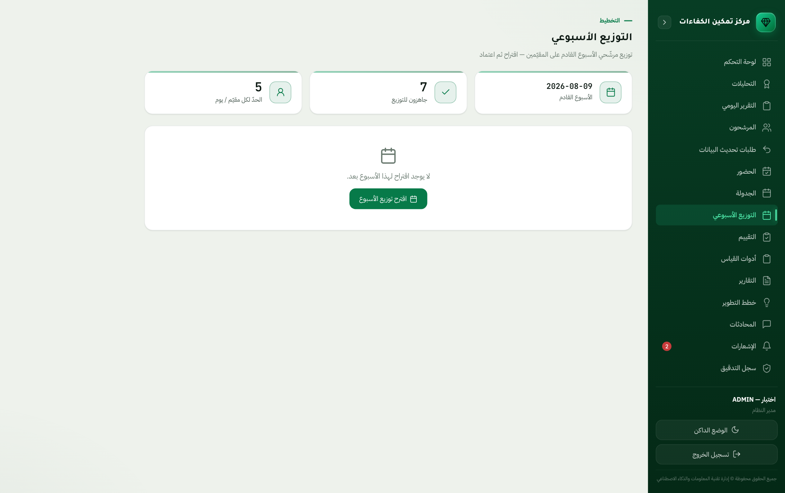

1. افتح **التوزيع الأسبوعي** وراجع البطاقات الثلاث: **الأسبوع القادم** (الأحد القادم إلى الخميس)، و**جاهزون للتوزيع**، و**الحدّ لكل مقيّم / يوم**.
2. اضغط **اقترح توزيع الأسبوع**.
3. اقرأ كتل المستشارين واحدة واحدة، وقارن عدد **البنود** في اللافتة بعدد **الجاهزين** في البطاقة.
4. اضغط **اعتماد وإنشاء الجلسات**، ثم أكّد السؤال **اعتماد التوزيع سيُنشئ جلسات المقابلات. متابعة؟**.

بعد الاقتراح تظهر رسالة **تم اقتراح التوزيع — راجعه ثم اعتمده** ولافتة **مسودّة — بانتظار الاعتماد**، ولم تُنشأ أي جلسة بعد. وبعد الاعتماد تظهر **تم اعتماد التوزيع — جُدوِل … مرشّح**، أو **تم الاعتماد — جُدوِل …، وسقط … لتغيّر بياناتهم**، وتظهر الجلسات في **الجدولة** بنشاط المقابلة الشخصية وبـ**—** في عمودَي الوقت والمكان حتى تُستكمل بالتعديل. ولإعادة التوزيع اضغط **إلغاء الاقتراح** ثم أكّد **حذف الاقتراح لإعادة التوزيع من جديد؟**.


**١١ — تابع الحضور قراءةً** *(الحضور)*

1. افتح **الحضور**.
2. اضغط بطاقة **بانتظار** لترشيح الجدول على الجلسات التي لم تُسجَّل حالتها بعد.
3. لإلغاء الترشيح اضغط البطاقة نفسها ثانيةً، أو **الإجمالي**.

يُرشَّح الجدول داخل قائمة اليوم المحمَّلة. عمود **إجراء** يعرض لك «مُسنَدة لغيرك» في كل صفّ، فالتسجيل ليس من عملك.

#### ما لا تستطيعه — ولماذا

| ما يمنعه النظام عنك | سببه التصميمي |
|---|---|
| لا ترى المشاركين المصنَّفين (سرّي / سرّي للغاية) — لا في جدول المرشحين، ولا في العدّادات، ولا في التصدير، ولا في عدّ **جاهزون للتوزيع** | `candidate.view_classified` ليست في صلاحياتك. والعدّاد محصور مثل القائمة تماماً، لأن مؤشّراً أوسع من القائمة يُفشي حجم ما تخفيه. والمصنَّفون يُجدوَلون يدوياً ممّن يملك رؤيتهم |
| لا تسجّل وصول مرشّح، ولا تعدّل وقت وصوله، ولا تأخذ توقيعه؛ ولا يظهر لك قسم **المنتظَرون** أصلاً | `reception.record` للاستقبال وحده. التوقيع والإقرار بصحّة البيانات يقعان أمام المرشّح عند باب المركز، لا من مكتب الجدولة |
| لا تستلم مرشّحاً ولا تردّه؛ لا يظهر لك قسم **المُسنَد إليّ اليوم** | `reception.decide` للمقيّم المُسنَد إليه. لكل مرحلة في الاستقبال صلاحية مستقلّة: من يوزّع ليس من يقرّر، ومن يقرّر ليس من يعتمد |
| لا تسجّل حضوراً ولا غياباً — ترى شاشة الحضور ولا تكتب فيها | تملك `attendance.view` بلا `attendance.record`. القاعدة: «الذي يستقبله يسجّله»؛ بلا هذا التمييز يسجّل من لم ير المشارك حضورَه |
| حقل **الوقت** في نافذة الجلسة يظهر لك حقلَ وقتٍ حرّاً لا قائمةَ الأوقات المعتمدة | قراءة أوقات الجلسات المعتمدة تتطلّب `settings.manage`، وهي لمدير النظام وحده. الوقت يبقى إلزامياً بصيغة `HH:MM` |
| لا تحذف جلسةً لها سجلّ حضور، ولو بدت **بالانتظار** | الرفض معلَّق على **وجود** سجلّ الحضور لا على حالته. القفل يمنع تنافر «حضورٌ لجلسة تغيّر تاريخها» |
| لا تُسنِد مستشاراً من خارج قطاع المشارك من شاشة الجدولة | قائمة **مستشار المقابلة** تُبنى من مقيّمي قطاعه الفعّالين وحدهم. حدّ القطاع يُطبَّق على القائمة قبل أن تختار |
| لا تفتح **رحلة المرشح** | `candidate.journey` لمدير النظام ومدير المركز ومدير إدارة التقييم وإدارة تطوير الكفاءات |
| لا تفتح التقييم ولا التقارير ولا خطط التطوير ولا أدوات القياس ولا التحليلات ولا سجل التدقيق | لا تملك `evaluation.view` ولا `report.view` ولا `development_plan.view` ولا `measurement.view` ولا `analytics.view` ولا `audit.view`. الروابط لا تظهر في قائمتك، وكتابة العنوان تعيدك إلى لوحة التحكم |
| تفتح **المحادثات** فتجدها بلا تقارير | المحادثة بوّابتان: `chat.view` تفتح الميزة، و`report.view` تفتح محادثةً بعينها — وأنت تملك الأولى دون الثانية. نطاق المحادثة هو نطاق التقرير نفسه |
| لا تظهر لك الأقسام التحليلية في لوحة التحكم: جاهزية القيادة، واتجاه اثني عشر شهراً، وخريطة الكفاءات، والرؤى التلقائية | تحتاج `analytics.view`. المنع في اللوحة قسمٌ قسم لا ٤٠٣ على الصفحة، والقسم الذي لا تملكه يختفي بلا رسالة |

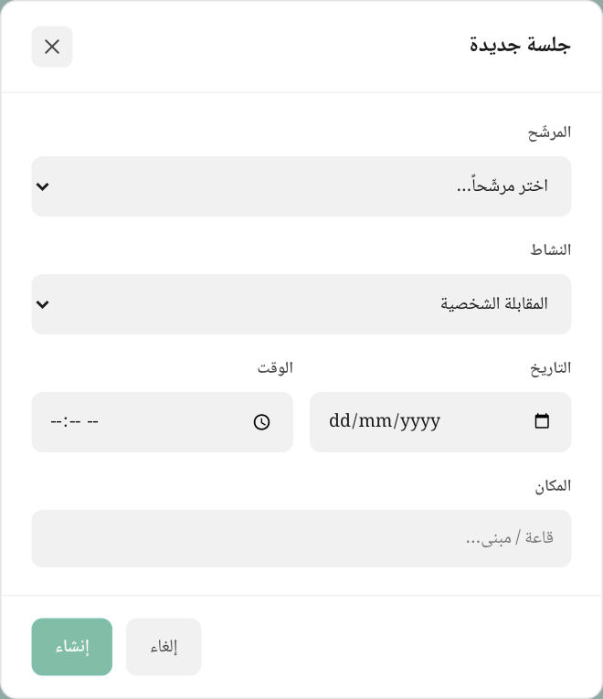

#### إن واجهتك رسالة

| الرسالة | معناها | ما تفعله |
|---|---|---|
| لا يمكن جدولة مرشّح غير معتمد للتقييم | حالة المشارك ليست «مجدول» ولا «مُقيّم» | اعتمد ترشيحه أولاً من شاشة **المرشحون** بأيقونة **اعتماد** |
| لا مستشارون متاحون في قطاع المرشّح. | قطاع المشارك بلا مستشار مقابلة فعّال | احفظ الجلسة **— بلا تعيين —**، أو اطلب إنشاء حساب بدور مستشار المقابلة لهذا القطاع |
| لا يمكن حذف جلسة سُجّل حضورها | للجلسة سجلّ حضور | لا تُحذف. عدّلها بزرّ القلم — التعديل مسموح لك ويُدوَّن في سجل التدقيق |
| يوجد اقتراح لهذا الأسبوع — احذفه أولاً لإعادة التوزيع | لهذا الأسبوع اقتراح قائم | اضغط **إلغاء الاقتراح** ثم أعِد الاقتراح. والاقتراح المُعتمد لا يُحذف لأن جلساته قائمة |
| بقي إسناد بانتظار قرار المقيّم — انتظر البتّ أو اسحب الإسناد | حاولت **اعتماد وترحيل** وثمّة إسناد معلّق | انتظر قرار المقيّم، أو اسحب الإسناد ثم اعتمد |

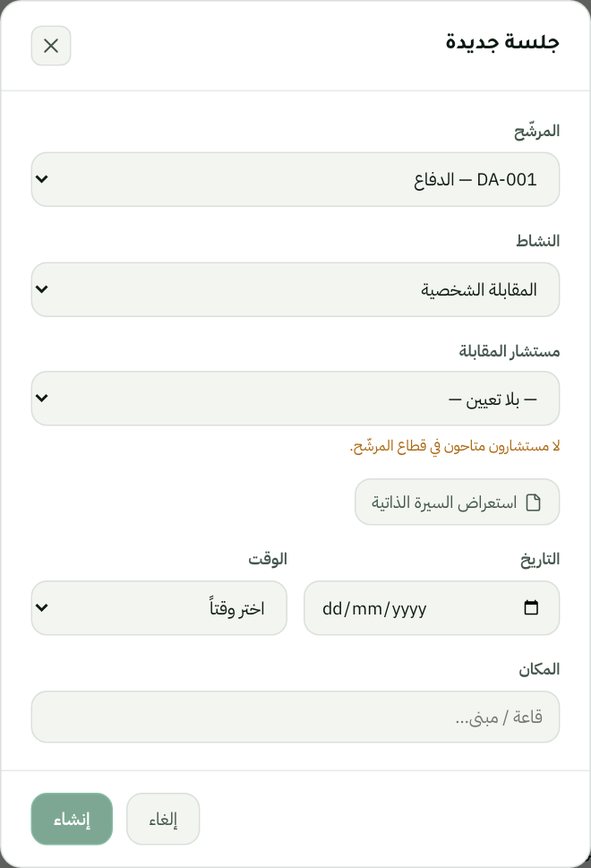

---

### مسؤول استقبال الموظفين

مسؤول استقبال الموظفين هو أول من يلقى المرشّح في المركز وآخر من يُوثّق حضوره. يسجّل وصوله، ويطابق سيرته معه وجهاً لوجه، ويأخذ توقيعه وإقراره بصحّة بياناته، ثم يوزّعه على النشاط والمقيّم، ويسجّل حالة جلسات اليوم حضوراً أو غياباً. هو الوحيد مع مدير النظام الذي يملك تسجيل الوصول وأخذ التوقيع، ولذلك يقف مسار المرشّح كلّه عند مكتبه إن لم تُنجَز هاتان الخطوتان.

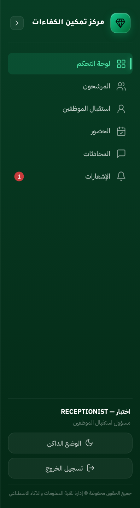

**شاشاتك:** لوحة التحكم · المرشحون · استقبال الموظفين · الحضور · المحادثات · الإشعارات.

#### يومك في المنصّة

**١ — افتح كشف اليوم** *(استقبال الموظفين)*

1. افتح **استقبال الموظفين** من القائمة الجانبية.
2. تأكّد أن حقل التاريخ على تاريخ اليوم؛ الشاشة تبدأ عليه.
3. اقرأ البطاقات الأربع: **وصلوا** · **وقّعوا وأقرّوا** · **بانتظار قرار المقيّم** · **معتمدون**.
4. اضغط **تحديث** كلّما أردت إعادة تحميل الكشف بلا تغيير التاريخ.

البطاقات محسوبة على ما تراه أنت من صفوف، لا على قاعدة البيانات كلّها. وإن لم يصل أحد بعد ظهر مكان الجدول: **لم يصل أحد بعد** مع التلميح «سجّل وصول أول مرشّح من قائمة المنتظَرين أدناه.»

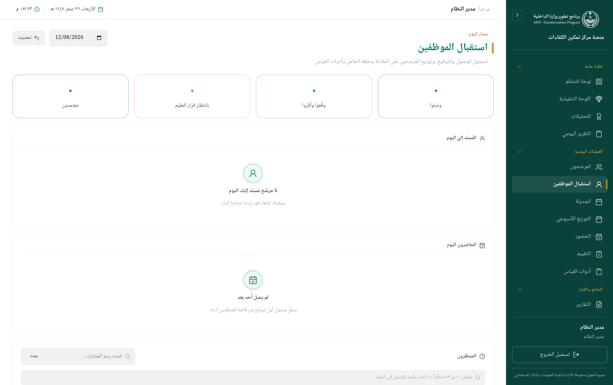

**٢ — سجّل وصول مرشّح** *(استقبال الموظفين — جدول المنتظَرون)*

1. ابحث عن المرشّح في جدول **المنتظَرون**، أو اكتب رمزه في «ابحث برمز المشارك…» واضغط **بحث**.
2. اضغط **تسجيل الوصول** في صفّه.

ينتقل المرشّح إلى جدول **الحاضرون اليوم** بوقت وصول مثبَّت تلقائياً، وتظهر الرسالة «سُجّل وصول ‹الرمز›». الضغط مرّتين لا يُنشئ زيارتين — الزيارة واحدة لكل دورة في اليوم. والقائمة مقصوصة عند ٤٠ صفّاً، ويظهر فوقها العدد الكلّي: «يُعرَض ٤٠ من … منتظَراً — ابحث بالرمز للوصول إلى البقيّة.»

**٣ — صحّح وقت الوصول** *(استقبال الموظفين)*

1. اضغط الوقت المكتوب في عمود **وقت الوصول**؛ يتحوّل الحقل إلى محرِّر وقت داخل الصفّ.
2. اكتب الوقت الصحيح.
3. اضغط علامة الصحّ للحفظ، أو علامة المنع للإلغاء.

تظهر الرسالة «حُدّث وقت الوصول». الوقت يُركَّب على **تاريخ الزيارة** لا على اليوم الحالي، فتعديل زيارة يوم مضى يبقيها في كشف يومها.

**٤ — طابِق السيرة الذاتية مع المرشّح** *(استقبال الموظفين)*

1. اضغط **عرض** في عمود **السيرة**.
2. طابِق معه ما هو مسجَّل: المنصب الحالي، والنبذة، والمؤهلات، والخبرات، والشهادات.
3. أغلِق النافذة.

المعروض هو نسخة السيرة المحفوظة مع الدورة إن وُجدت، وإلا السيرة الحالية للمرشّح. وإن لم يُدخِلها ظهر «لم يُدخِل المرشح سيرته الذاتية بعد.» وكل فتح للسيرة يُقيَّد في سجل التدقيق.

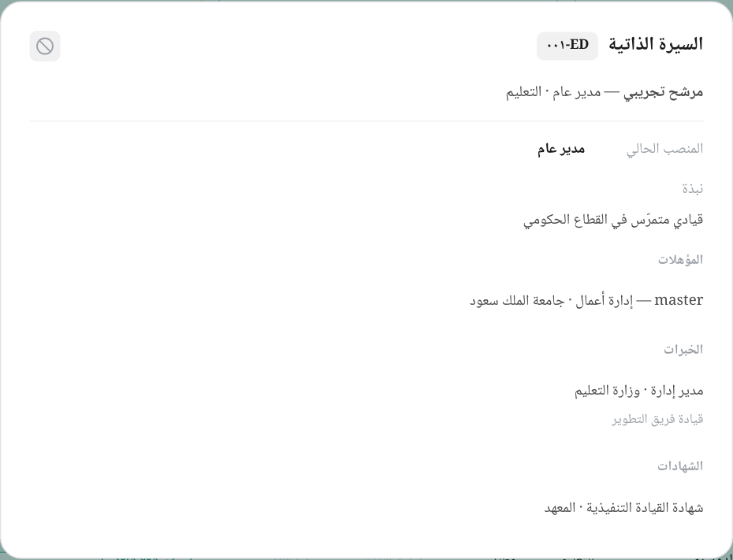

**٥ — خذ التوقيع والإقرار** *(استقبال الموظفين)*

1. اضغط **أخذ التوقيع** في عمود **التوقيع والإقرار**.
2. اقرأ على المرشّح نصّ الإقرار الظاهر باسمه.
3. سلّمه الجهاز ليوقّع داخل اللوحة المكتوب فيها «وقّع هنا» — بإصبعه أو بالفأرة. وزرّ **مسح** يمحو التوقيع لإعادته.
4. علّم خانة **قرأ المرشح الإقرار أعلاه ووافق عليه**.
5. اضغط **حفظ التوقيع**.

يتحوّل عمود التوقيع إلى الوسم **وقّع وأقرّ**، وتظهر الرسالة «وقّع ‹الرمز› وأقرّ بصحّة بياناته». زرّ الحفظ يبقى معطّلاً حتى تُعلَّم خانة الإقرار، والحفظ يُرفَض إن كانت اللوحة فارغة. والتوقيع يُخزَّن مشفَّراً، ولا يُكتب في سجل التدقيق.

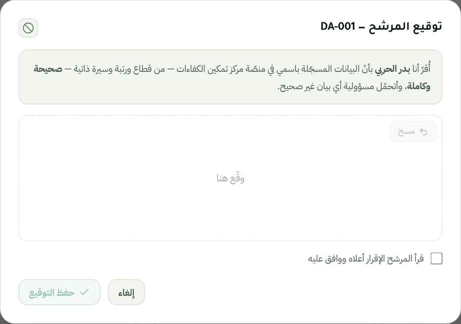

**٦ — وزّع المرشّح على نشاط ومقيّم** *(استقبال الموظفين)*

1. اضغط **توزيع** في عمود **التوزيع**.
2. اختر **النشاط**: المقابلة الشخصية، أو حلقة النقاش، أو أدوات القياس. تُفتَح النافذة على أول نشاط غير مُسنَد.
3. اختر **المقيّم** من القائمة؛ كل سطر فيها «الاسم — الدور (القطاع)».
4. اضغط **إسناد وإشعار**.

يظهر الإسناد في الصفّ بحالة **بانتظار المقيّم**، وتظهر الرسالة «أُسنِد المرشح وأُشعِر المقيّم». والقائمة لا تعرض إلا من يستطيع الاستلام فعلاً: صاحب دور ذلك النشاط، ونشِط، ويملك البتّ في الإسناد، ويغطّي قطاع المرشّح.


**٧ — اسحب إسناداً لم يُبَتَّ فيه** *(استقبال الموظفين)*

1. ابحث عن بطاقة الإسناد الموسومة **بانتظار المقيّم**.
2. اضغط الزرّ الصغير المسمّى «سحب الإسناد» داخلها.

يختفي الإسناد وتظهر الرسالة «سُحب الإسناد».

**٨ — تابع الإسنادات المردودة** *(استقبال الموظفين)*

1. ابحث في عمود **التوزيع** عن السطر الأحمر بصيغة «ردّ ‹المقيّم› ‹النشاط› — ‹السبب›».
2. اقرأ السبب، ثم اضغط **توزيع** وأعد إسناد المرشّح لمقيّم آخر أو لنشاط آخر.

الإسناد المردود يبقى في السجلّ بسببه واسم رادّه؛ وإعادة الإسناد سجلّ جديد بجانبه لا استبدال له. وسبب الردّ يصلك إشعاراً لأنك تملك إعادة الإسناد.


**٩ — سجّل حضور جلسات اليوم** *(الحضور)*

1. افتح **الحضور** من القائمة الجانبية.
2. ابحث عن صفّ المشارك برمزه في عمود **الرمز**.
3. اضغط **حضور**.

تظهر رسالة «تم تسجيل حضور» متبوعةً برمز المشارك، وتصير الحالة «حاضر»، ويصير عمود الإجراء «تم»، ويرتفع عدّاد **حاضر**. ووقت الحضور هو لحظة الضغط. وأنت تسجّل أي جلسة من جلسات اليوم لا جلساتك وحدها.

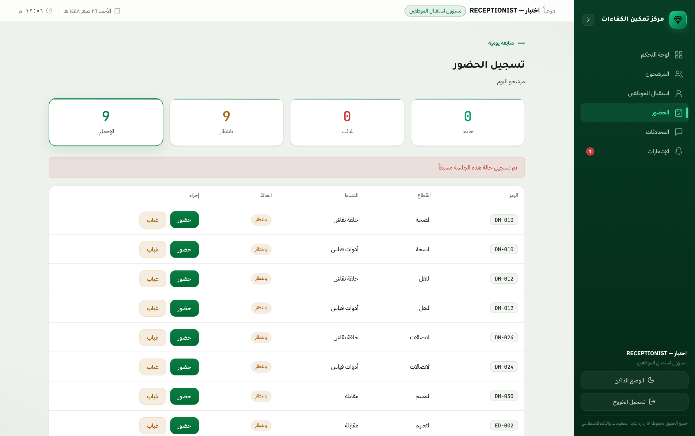

**١٠ — سجّل غياباً بسببه** *(الحضور)*

1. اضغط **غياب** في صفّ المشارك.
2. أبقِ **غياب بعذر** مؤشَّراً إن كان الغياب بعذر، وأزل التأشير إن كان بلا عذر.
3. اكتب السبب في «سبب الغياب (اختياري)» — وحدّه ٥٠٠ حرف.
4. اضغط **حفظ**.

تظهر رسالة «تم تسجيل غياب» متبوعةً برمز المشارك، وتصير الحالة «غائب بعذر» أو «غائب». والسبب المكتوب يظهر بعدها في التقرير اليومي تحت «الغياب والأسباب»، وفي رحلة المشارك، ويُبنى عليه طلب إعادة الجدولة.

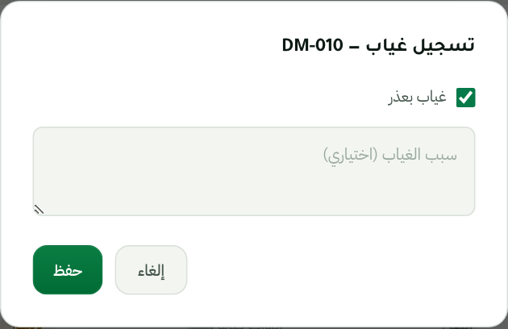

**١١ — تحقّق من هوية مراجعٍ عند الباب** *(المرشحون)*

1. افتح **المرشحون** واكتب رمز المشارك في «بحث بالرمز...».
2. اضغط أيقونة **تفاصيل** في صفّه.
3. اقرأ الاسم ورقم الهوية والجوال والبريد، ثم القطاع والرتبة والفئة والحالة.

الجدول نفسه رموزٌ لا أسماء لكل الأدوار بلا استثناء، والبحث فيه بالرمز وحده. والاسم يُقرأ في بطاقة التفاصيل، وفتحه يُكتب في سجل التدقيق.

**١٢ — تابع إشعاراتك** *(الإشعارات)*

1. راقب الرقم الأحمر بجانب **الإشعارات** في القائمة الجانبية — يتحدّث كل دقيقة وعند كل تنقّل.
2. افتح **الإشعارات** واضغط بطاقة الإشعار لقراءته.
3. لتصفير العدّاد اضغط **تعليم الكل كمقروء**.

تختفي النقطة الخضراء عن البطاقة وينقص الرقم الأحمر واحداً. والضغط لا ينقلك إلى الشاشة المعنيّة — افتحها بنفسك من القائمة الجانبية. وأهمّ ما يصلك: **ردّ إسناد: ‹الرمز›**.

#### ما لا تستطيعه — ولماذا

| ما يمنعه النظام عنك | سببه التصميمي |
|---|---|
| لا تستلم مرشّحاً ولا تردّه؛ لا يظهر لك قسم **المُسنَد إليّ اليوم** | `reception.decide` للمقيّم المُسنَد إليه وحده. من يوزّع ليس من يقرّر، ولا يبتّ أحدٌ في إسناد غيره |
| لا يظهر لك زرّ **اعتماد وترحيل**؛ ترى في العمود الأخير حالة الزيارة: **وصل** / **مُوزَّع** / **معتمد** | `reception.approve` لمسؤول العمليات ومدير المركز ومسؤول الجدولة ومدير النظام. الاعتماد هو ما يُرحّل الجلسات إلى الجدول، فيُفصل عمّن أنشأ الزيارة |
| لا تُسنِد مقيّماً من خارج قطاع المرشّح | الإسناد عبر القطاعات يحتاج `candidate.cross_sector`، ويحملها مسؤول الجدولة ومدير النظام. القائمة تُصفّى بقطاع المرشّح قبل أن تختار |
| لا ترى المشاركين المصنَّفين (سرّي / سرّي للغاية) — لا في الحاضرين، ولا في المنتظَرين، ولا في العدد الكلّي | `candidate.view_classified` ليست في صلاحياتك. العدّ نفسه يُفشي وجودهم، فيُحجب معهم: بطاقة المرشحين تقرأ عندك **٤٥** حيث يقرأ مدير النظام **٥٩** |
| لا تُضيف مرشّحاً ولا تعدّله ولا تعتمده ولا تحذفه من شاشة المرشحين | لا تملك `candidate.create` ولا `candidate.edit` ولا `candidate.approve`. إدخال المشارك واعتماده عمل الجدولة، وأنت تستقبل من اكتمل ترشيحه |
| لا تفتح السيرة الذاتية من شاشة المرشحين، وتفتحها من شاشة الاستقبال | `candidate.cv_view` ليست في صلاحياتك؛ وسيرة الزائر مفتوحة لمن يستقبله في يومه. المطابقة عمل يقع أمام المرشّح لا استعراضاً للأرشيف |
| لا يظهر لك زرّ **كشف الحضور** في شاشة المرشحين، ولا بطاقة **جدول اليوم** في لوحة التحكم | كلاهما يحتاج `schedule.view`. الجدولة خارج نطاقك، وكشف اليوم يُطبَع ممّن يملكها |
| لا يظهر لك زرّ **إسناد لمجموعة** في شريط التحديد | `roster.manage` لمدير النظام ومدير المركز ومسؤول الجدولة. المجموعة أ/ب تقرّر ترتيب الفترات، وهو قرار جدولة |
| لا تفتح **رحلة المرشح** | `candidate.journey` لمدير النظام ومدير المركز ومدير إدارة التقييم وإدارة تطوير الكفاءات |
| لا تفتح التقييم ولا التقارير ولا أدوات القياس ولا التحليلات ولا سجل التدقيق | لا تملك صلاحياتها. الروابط لا تظهر في قائمتك، وكتابة العنوان تعيدك إلى لوحة التحكم |
| تفتح **المحادثات** فتجدها بلا تقارير | `chat.view` تفتح الميزة، و`report.view` تفتح محادثةً بعينها — وأنت تملك الأولى دون الثانية |
| لا تُعدّل زيارةً اعتُمدت: لا وقتها ولا توقيعها | الوثيقة المعتمَدة تبقى هي التي اعتُمدت |
| لا تُعدّل حالة حضور بعد تسجيلها؛ يحلّ «تم» محلّ الزرّين | حالة واحدة لكل جلسة، يحرسها فهرس فريد في قاعدة البيانات حتى عند ضغطتين متزامنتين من جهازين |

#### إن واجهتك رسالة

| الرسالة | معناها | ما تفعله |
|---|---|---|
| لم يوقّع المرشح ولم يُقرّ بصحّة بياناته بعد | حاولت التوزيع قبل التوقيع | اضغط **أخذ التوقيع** أولاً؛ توزيع من لم يُقرّ يُدخِل المقيّم على بيانات لم يُصادَق عليها |
| هذا النشاط مُسنَد بالفعل — اسحب الإسناد القائم أولاً | للنشاط إسناد فعّال | اسحب الإسناد القائم، أو اختر نشاطاً آخر — المرشّح لا يكون في مقابلتين في وقت واحد |
| لا مقيّم مؤهّل لهذا النشاط في قطاع المرشح. أضف مستخدماً بالدور المناسب من شاشة المستخدمين. | لا مستخدم نشط يجمع دور النشاط وصلاحية الاستلام وقطاع المرشّح | غيّر النشاط، أو اطلب من مدير النظام إنشاء الحساب المناسب |
| لا يُسحب إسنادٌ بُتّ فيه | الإسناد مُستلَم أو مردود | المستلَم لا يُنتزع من تحت المقيّم: يُردّ منه أو يُعتمد |
| تم تسجيل حالة هذه الجلسة مسبقاً | حالة الجلسة سُجّلت من قبل، أو سجّلها مستخدم آخر في اللحظة نفسها | حدّث الصفحة لترى الحالة المسجَّلة |
| لا يمكن تسجيل الحضور إلا لجلسات اليوم | الجلسة ليست بتاريخ اليوم | الحضور يُسجَّل في يومه؛ وما فات يُعالَج بإعادة الجدولة من مسؤول الجدولة |

### مسؤول العمليات

مسؤول العمليات هو من يُبقي مسار اليوم متحرّكاً داخل المركز. لا يستقبل المرشّح ولا يقيّمه: يبدأ عمله بعد أن يُسجَّل وصول المرشّح ويوقّع ويُقرّ بصحّة بياناته، فيوزّعه على النشاط والمقيّم، ويتابع قرار المقيّم استلاماً أو ردّاً، ويعيد إسناد من رُدَّ، ثم يعتمد الزيارة فتُرحَّل جلساتها إلى جدول التقييم. يعمل بالرمز لا بالاسم في كل خطوة.

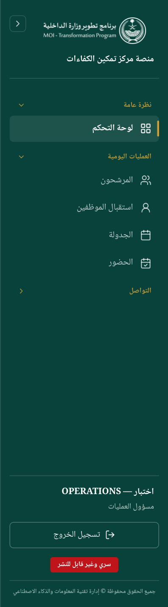

**شاشاتك:** لوحة التحكم · المرشحون · استقبال الموظفين · الحضور · الجدولة · الإشعارات.

#### يومك في المنصّة

**١ — ابدأ من الإشعارات: من رُدَّ إسناده؟** *(شاشة الإشعارات)*

1. افتح **الإشعارات** من القائمة الجانبية.
2. ابحث عن إشعارات **«ردّ إسناد: ‹الرمز›»** — تصل كل من يملك صلاحية إعادة الإسناد، لا دوراً بعينه.
3. اقرأ سبب الردّ في متن الإشعار، واضغط البطاقة لتعليمها مقروءةً.

النتيجة: تعرف قبل فتح الكشف أيّ المرشحين يحتاج إعادة إسناد. الضغط لا ينقلك إلى الشاشة المعنيّة — افتح **استقبال الموظفين** بنفسك من القائمة الجانبية.

**٢ — افتح كشف اليوم** *(شاشة استقبال الموظفين)*

1. افتح **استقبال الموظفين**.
2. تأكّد من أن حقل التاريخ على تاريخ اليوم.
3. اقرأ البطاقات الأربع: **وصلوا** · **وقّعوا وأقرّوا** · **بانتظار قرار المقيّم** · **معتمدون**.
4. اضغط **تحديث** كلّما احتجت إعادة تحميل الكشف بلا تغيير التاريخ.

النتيجة: يظهر جدول **الحاضرون اليوم** بأعمدته: الرمز، والقطاع، والرتبة، والسيرة، ووقت الوصول، والتوقيع والإقرار، والتوزيع. البطاقات محسوبة على ما تراه أنت من صفوف لا على قاعدة البيانات كلّها. ولا يظهر عندك عمود **الاسم**، ولا قسم **المنتظَرون**، وعمود **السيرة** يعرض «—».

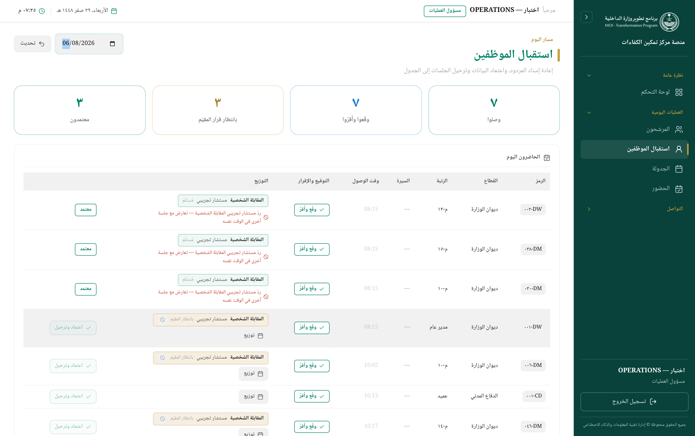

**٣ — وزّع المرشّح على نشاط ومقيّم** *(شاشة استقبال الموظفين)*

1. تحقّق من أن عمود **التوقيع والإقرار** في صفّه يحمل الوسم **وقّع وأقرّ**.
2. اضغط **توزيع** في عمود **التوزيع**.
3. اختر **النشاط**: المقابلة الشخصية، أو حلقة النقاش، أو أدوات القياس. تُفتَح النافذة على أول نشاط غير مُسنَد.
4. اختر **المقيّم** من القائمة؛ كل سطر فيها «الاسم — الدور (القطاع)».
5. اضغط **إسناد وإشعار**.

النتيجة: تظهر بطاقة الإسناد في الصفّ بحالة **بانتظار المقيّم**، وتظهر الرسالة «أُسنِد المرشح وأُشعِر المقيّم»، ويصل المقيّم إشعار «مرشّح مُسنَد إليك: ‹الرمز›» — بالرمز لا بالاسم. والقائمة لا تعرض إلا من يستطيع الاستلام فعلاً: صاحب دور ذلك النشاط، ونشِط، ويملك صلاحية الاستلام، ويغطّي قطاع المرشّح.


**٤ — اسحب إسناداً لم يُبتّ فيه** *(شاشة استقبال الموظفين)*

1. ابحث عن بطاقة الإسناد الموسومة **بانتظار المقيّم**.
2. اضغط الزرّ الصغير المسمّى «سحب الإسناد» داخلها.

النتيجة: يختفي الإسناد وتظهر الرسالة «سُحب الإسناد». الإسناد الذي استلمه المقيّم أو ردّه لا يُسحب.

**٥ — أعِد إسناد المردود** *(شاشة استقبال الموظفين)*

1. ابحث في صفّ المرشّح عن السطر الأحمر بصيغة «ردّ ‹المقيّم› ‹النشاط› — ‹السبب›».
2. اقرأ السبب.
3. اضغط **توزيع** وأسنِده لمقيّم آخر أو لنشاط آخر.

النتيجة: يُنشأ إسناد جديد بجانب المردود لا بدلاً منه — الإسناد المردود يبقى في السجلّ بسببه واسم رادّه.

**٦ — اعتمِد الزيارة ورحّل جلساتها** *(شاشة استقبال الموظفين)*

1. راجِع صفّ المرشّح: وقّع وأقرّ، وإسناداته كلّها مبتوت فيها، وفيها إسناد واحد على الأقل **مُستلَم**.
2. إن بقي إسناد **بانتظار المقيّم**: انتظر قراره أو اسحبه.
3. إن ظهر سطر ردّ أحمر: أعِد الإسناد أولاً.
4. اضغط **اعتماد وترحيل**.

النتيجة: تُنشَأ جلسة في **الجدولة** لكل إسناد مُستلَم بتاريخ الزيارة ونشاطها ومقيّمها، ويتحوّل الصفّ إلى **معتمد**، وتظهر الرسالة «اعتُمد ‹الرمز› ورُحّلت جلساته»، ويصل كل مقيّم إشعار «اعتُمد ورُحّل: ‹الرمز›». والزرّ يبقى معطّلاً ما لم يكتمل شرطه، وسبب التعطيل يظهر عند مرور المؤشّر عليه.

**٧ — تحقّق من وصول الجلسات إلى الجدول** *(شاشة الجدولة)*

1. افتح **الجدولة**.
2. اختر تاريخاً في حقل **التاريخ** أعلى الشاشة.
3. راجِع الصفوف: **المشارك** (بالرمز)، و**النشاط**، و**التاريخ**، و**الوقت**، و**المكان**، و**المُقيّم**، و**الحضور**.
4. اضغط **الكل** لعودة القائمة كاملةً.

النتيجة: تتأكّد من أن ما اعتمدتَه صار جلسات قائمة. الشاشة عندك للقراءة: لا زرّ **جلسة جديدة** ولا عمود الأزرار.


**٨ — تابِع حضور اليوم** *(شاشة الحضور)*

1. افتح **الحضور**.
2. اقرأ البطاقات: **حاضر** · **غائب** · **بانتظار** · **الإجمالي**.
3. اضغط بطاقة الحالة لترشيح الجدول عليها، واضغطها ثانيةً أو اضغط **الإجمالي** لإلغاء الترشيح.

النتيجة: تعرف كم جلسة بقيت بلا تسجيل. عمود **إجراء** عندك لا يحمل زرّي **حضور** و**غياب** — الشاشة قراءة.

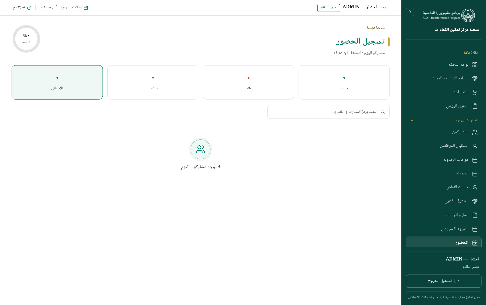

**٩ — اطبع كشف الحضور وبطاقات المشاركين** *(شاشة المرشحون)*

1. افتح **المرشحون**، ثم اضغط **كشف الحضور**.
2. اختر **اليوم**. خيار **إظهار** في **الهوية الوطنية** معطَّل عندك، وتحته: «صلاحيتك لا تسمح بطباعة أرقام الهوية — يُطبع الكشف بالرموز».
3. اضغط **فتح الكشف**.
4. لطباعة البطاقات: اضغط أيقونة **طباعة بطاقة المشارك** في صفّ المشارك، أو حدّد صفوفاً ثم اضغط **طباعة بطاقات المشاركين** في شريط التحديد.

النتيجة: يفتح الكشف في تبويب جديد بأعمدته المعتمدة: «م»، «ج»، «الهوية الوطنية»، «الرتبة/المرتبة»، «رمز المشارك»، «التوقيع»، وأعمدة المقيّمين ومساعديهم. والبطاقة تحمل رمز المشارك وحده بلا اسم. يلزم السماح بالنوافذ المنبثقة في المتصفّح.

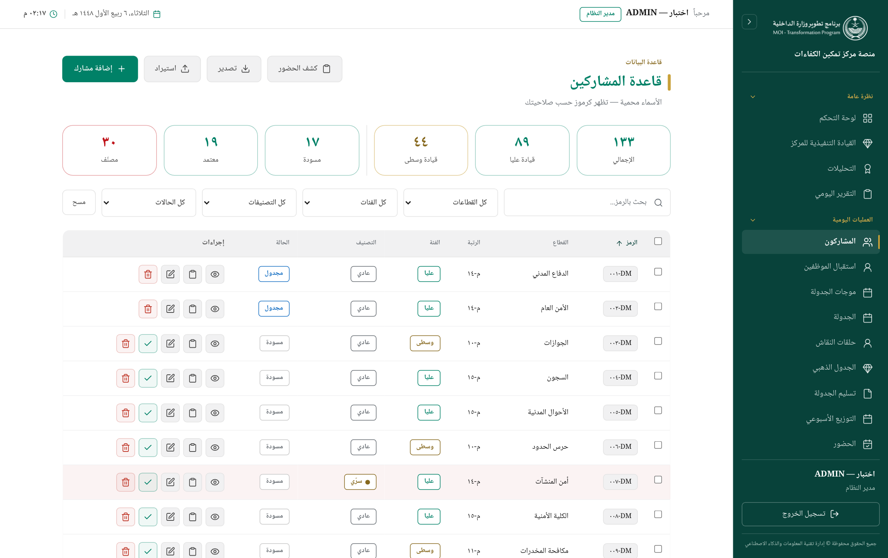

#### ما لا تستطيعه — ولماذا

| ما يمنعه النظام عنك | سببه التصميمي |
|---|---|
| تسجيل الوصول، وأخذ التوقيع، وتعديل وقت الوصول — ولا يظهر عندك جدول **المنتظَرون** | `reception.record` للاستقبال ومدير النظام. لكل مرحلة في المسار صلاحية مستقلّة: من يسجّل ليس بالضرورة من يوزّع، ومن يوزّع ليس من يقرّر، ومن يقرّر ليس من يعتمد |
| **استلام** مرشّح أو **ردّه** — ولا يظهر عندك قسم **المُسنَد إليّ اليوم** | `reception.decide` للمقيّم المُسنَد إليه وحده. أنت من يوزّع، وفصلُ التوزيع عن القرار هو ما يجعل الردّ قراراً مهنياً لا إجراءً إدارياً |
| رؤية أسماء المرشحين — عمود **الاسم** غير موجود في كشفك | `candidate.view_names`. مسؤول العمليات لا يحملها ويعمل بالرمز؛ والأسماء المكشوفة على شاشة مفتوحة لا تحتاجها أي مهمّة يومية |
| فتح السيرة الذاتية — عمود **السيرة** يعرض «—» | `candidate.cv_view`. قراءة سيرة الزائر لمن يستقبله في يومه أو لحامل الصلاحية؛ والتوزيع يقع على الرمز والنشاط لا على محتوى السيرة |
| رؤية المرشحين المصنَّفين (سرّي / سرّي للغاية) | `candidate.view_classified`. المصنَّف محجوب عنك لا في الصفوف ولا في العدد الكلّي — عدّادٌ أوسع من القائمة يُفشي حجم ما يُخفى عنك |
| إسناد مقيّم من قطاع غير قطاع المرشّح | `candidate.cross_sector` صريحة، يحملها مسؤول الجدولة ومدير النظام. القاعدة نفسها المطبَّقة في الجدولة |
| تسجيل حضور أو غياب — شاشة الحضور عندك قراءة | `attendance.record`. القاعدة: «الذي يستقبله يسجّله»؛ بلا هذا التمييز يسجّل من لم ير المشارك حضوره |
| إنشاء جلسة أو تعديلها أو حذفها | `schedule.manage` لمدير النظام ومدير المركز ومسؤول الجدولة. من لا يحملها يرى الجدول بلا زرّ **جلسة جديدة** وبلا عمود الأزرار |
| إضافة مرشّح أو تعديله أو اعتماده أو حذفه، وتغيير تصنيفه الأمني | `candidate.create` و`candidate.edit` و`candidate.approve` و`candidate.view_classified`. بيانات المرشّح ملك مسؤول الجدولة ومدير المركز، والتوزيع لا يحتاج تعديلها |
| **إسناد لمجموعة** (أ / ب) في شاشة المرشحين | `roster.manage`. المجموعة تحدّد أيّ فترة يبدأ بها كلٌّ منهم، وهي قرار جدولة لا قرار توزيع يومي |
| طباعة أرقام الهوية في كشف الحضور — خيار **إظهار** معطَّل | `candidate.view_names`. الخيار مُعطَّل في الشاشة ومُلغى في الخادم ثانيةً — وثيقة تخرج من المركز أولى بالحصر لا أدنى منه |
| التوزيع الأسبوعي، والتقييم، وأدوات القياس، والتقارير، وخطط التطوير، والتحليلات، واللوحة التنفيذية، والتقرير اليومي، والمحادثات، وسجل التدقيق | ليست من صلاحيات دورك، فلا تظهر روابطها في القائمة الجانبية. وكتابة عنوان أيٍّ منها تعيدك إلى لوحة التحكم لا إلى شاشة خطأ |
| تجاوز أيٍّ ممّا سبق بكتابة العنوان أو باستدعاء الواجهة البرمجية | كل منع مفروض على الخادم؛ إخفاء الزرّ في الواجهة راحة للعين لا حماية |

#### إن واجهتك رسالة

| الرسالة | معناها | ما تفعله |
|---|---|---|
| لم يوقّع المرشح ولم يُقرّ بصحّة بياناته بعد | حاولت التوزيع قبل التوقيع والإقرار | اطلب من الاستقبال أخذ التوقيع، ثم وزّع |
| لا مقيّم مؤهّل لهذا النشاط في قطاع المرشح. أضف مستخدماً بالدور المناسب من شاشة المستخدمين. | لا مستخدم نشط يجمع دور النشاط وصلاحية الاستلام وقطاع المرشّح | غيّر النشاط، أو راجِع مدير النظام لإنشاء الحساب المناسب |
| المقيّم من قطاع آخر — يلزم صلاحية الإسناد عبر القطاعات | اخترت مقيّماً محصوراً بقطاع غير قطاع المرشّح | اختر مقيّماً من قطاع المرشّح، أو أوكِل الإسناد لمسؤول الجدولة |
| بقي إسناد بانتظار قرار المقيّم — انتظر البتّ أو اسحب الإسناد | ضغطت **اعتماد وترحيل** وثمّة إسناد معلّق | انتظر قرار المقيّم، أو اسحب الإسناد ثم اعتمِد |
| لا إسناد مستلَم بعد — لا شيء يُرحَّل | لا إسناد استلمه مقيّم، فلا جلسة تُنشأ | وزّع المرشّح وانتظر الاستلام |

---

### المستخدم الخارجي (إضافة مرشحين)

المستخدم الخارجي هو ممثّل الجهة المرشِّحة خارج المركز. مسؤوليّته أوّل خطوة في مسار المرشّح: إدخال المشارك بنموذج السيرة الذاتية المعتمد، ورفع طلب تحديث لمن كان مسجّلاً مسبقاً، ومتابعة مصير ما رفعه. لا يرى قاعدة المرشحين، ولا يعرف ما جرى للمرشّح بعد استلامه.

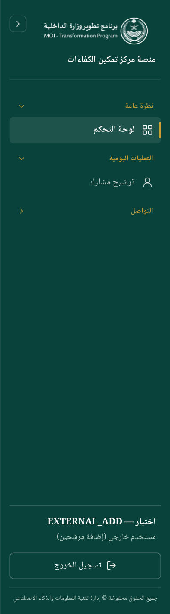

**شاشاتك:** لوحة التحكم · ترشيح مشارك · الإشعارات.

#### يومك في المنصّة

**١ — الدخول أول مرّة** *(شاشة تسجيل الدخول)*

1. اكتب **اسم المستخدم** و**كلمة المرور** كما سلّمهما مدير النظام في المركز.
2. اضغط **تسجيل الدخول** أو مفتاح Enter.
3. إن كان حسابك جديداً أو أُعيد ضبطه، تُساق إلى **تغيير كلمة المرور**: اكتب الحالية، ثم الجديدة حتى تخضرّ الشروط الأربعة (**٨ أحرف على الأقل** · **حرف كبير (A-Z)** · **حرف صغير (a-z)** · **رقم (0-9)**)، ثم أعِد كتابتها، ثم اضغط **تغيير كلمة المرور**.

النتيجة: تُنزَل بعدها مباشرةً على **ترشيح مشارك** — فهي شاشتك الأولى، لأنك تملك إضافة المرشحين ولا تملك عرضهم. ولا تسجيل ذاتي ولا استعادة كلمة مرور من شاشة الدخول: «لطلب حساب أو استعادة كلمة المرور، تواصل مع مدير النظام في المركز.»

**٢ — رشّح مشاركاً جديداً** *(شاشة ترشيح مشارك، تبويب **الترشيح**)*

1. عبّئ خانات **بيانات المشارك** الإلزامية كلها — والنجمة الحمراء تعني حقلاً إلزامياً.
2. أدخِل تاريخ الميلاد بالميلادي أو بالهجري — الخانة الأخرى تُملأ وحدها، ويظهر **العمر** محسوباً.
3. أضِف المؤهلات والخبرات والدورات بأزرار **إضافة مؤهل** و**إضافة خبرة** و**إضافة دورة**. اترك ما لا يلزم فارغاً — الصفّ الذي لم يُلمس يُسقَط بصمت.
4. اضغط **إرسال الترشيح**.

النتيجة: يُطوى النموذج ويحلّ محلّه إيصال **تم استلام الترشيح** فيه **رمز المشارك** وبجانبه زرّ **نسخ**، ووسم الفئة القيادية (**قيادة عليا** أو **قيادة وسطى**)، ووسم **حُفظ نموذج السيرة**، ووسم **جُدولت رسالة تأكيد للمشارك** إن كان له جوال مسجَّل، وزرّ **ترشيح مشارك آخر**. احتفظ بالرمز للمراجعة.

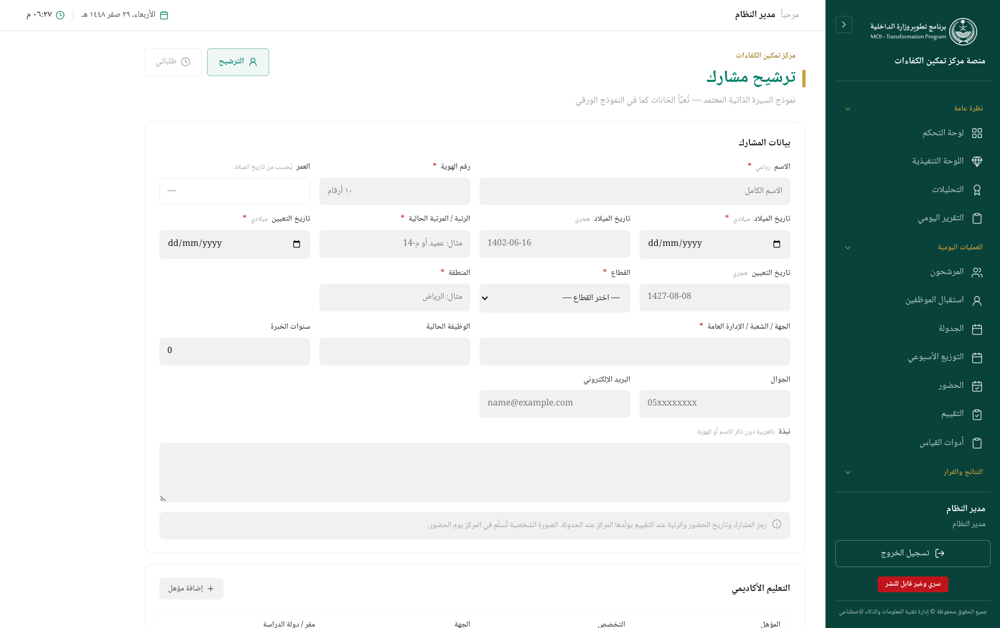

**٣ — أكمِل ما نقص إن رُدَّ الإرسال** *(شاشة ترشيح مشارك)*

1. اقرأ الشريط الأحمر أعلى الشاشة — يذكر أول نقص.
2. انزل إلى الخانات المحدَّدة بالأحمر وأكمِلها.
3. أعِد الضغط على **إرسال الترشيح**.

النتيجة: إن نقص شيء لم يُرسَل شيء — لا يُحفظ ترشيح ناقص جزئياً. وزرّ **تفريغ النموذج** يمسح كل ما أُدخل ويعيد الشاشة إلى حالتها الأولى.

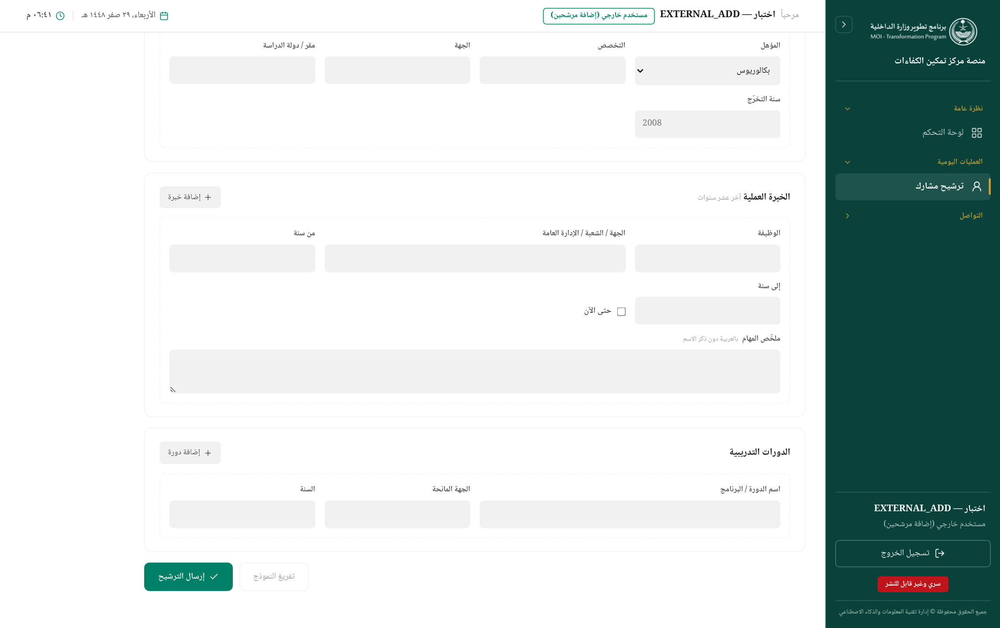

**٤ — أضِف صفوف التعليم والخبرة والدورات** *(شاشة ترشيح مشارك)*

1. اضغط **إضافة مؤهل** (أو **إضافة خبرة** أو **إضافة دورة**).
2. عبّئ الصفّ الجديد أسفل السابق.
3. لحذف صفّ اضغط أيقونة السلّة في زاويته — تظهر متى زاد عدد الصفوف على واحد.

النتيجة: تُضاف الصفوف حتى ١٥ مؤهلاً و٢٠ خبرة و٢٠ دورة. وفي **الخبرة العملية** تُعطِّل علامة **حتى الآن** خانة **إلى سنة**.

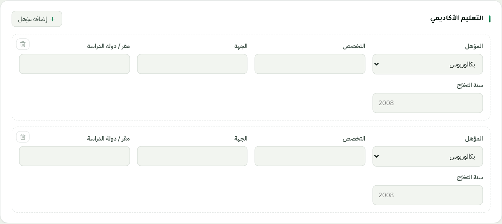

**٥ — إذا كان المشارك مسجّلاً مسبقاً** *(شاشة ترشيح مشارك)*

1. أرسِل الاستمارة كالمعتاد.
2. اقرأ الإيصال البرتقالي أعلى الشاشة: **هذا المشارك مُضاف مسبقاً** — يذكر **تاريخ تسجيله** لا أكثر.
3. إن ظهر بدل الزرّ سطرٌ نصّه *«يوجد طلب تحديث معلّق لهذا المشارك رُفع بتاريخ … — بانتظار البتّ فيه»* فلا تُرسِل شيئاً: طلب سابق لم يُبتّ فيه بعد.

النتيجة: لا يُكتب فوق السجلّ القائم، ويُفتح لك طريق **طلب تحديث بيانات المشارك**.

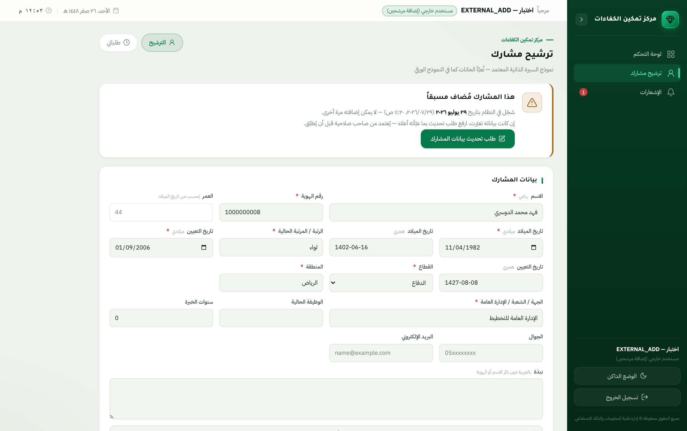

**٦ — ارفع طلب تحديث بيانات** *(شاشة ترشيح مشارك، وضع طلب التحديث)*

1. من الإيصال اضغط **طلب تحديث بيانات المشارك**.
2. اقرأ الشريط البرتقالي أعلى الاستمارة: **وضع طلب التحديث** — *لن تتغيّر بيانات المشارك حتى يعتمد الطلبَ صاحبُ صلاحية*. الاستمارة كما عبّأتها هي المقترح، فلا تُعاد كتابتها.
3. راجِع الخانات وصحّح ما تغيّر.
4. اكتب في قسم **سبب طلب التحديث** ما يصل المعتمِد مع الطلب (اختياري، حتى ٥٠٠ حرف).
5. اضغط **إرسال طلب التحديث**.

النتيجة: يظهر إيصال **أُرسل طلب تحديث البيانات** ومعه تاريخ الطلب وزرّان: **عرض طلباتي** و**ترشيح مشارك آخر**. وزرّ **إلغاء الوضع** في الشريط البرتقالي يعيدك إلى الترشيح العادي في أي لحظة.

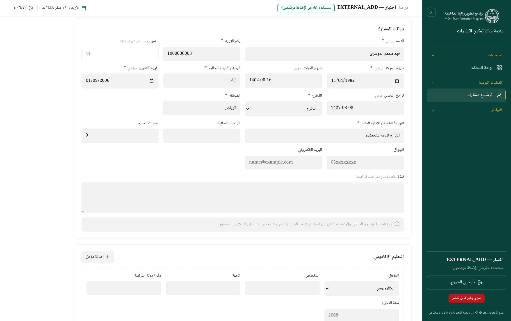

**٧ — تابِع طلباتك** *(شاشة ترشيح مشارك، تبويب **طلباتي**)*

1. اضغط تبويب **طلباتي** — الرقم البرتقالي بجانبه هو عدد الطلبات التي لم يُبتّ فيها بعد.
2. اقرأ الجدول: **المشارك** (الاسم كما كتبتَه أنت) · **تاريخ الطلب** · **الحالة** (بانتظار الاعتماد / مُعتمد / مرفوض) · **تاريخ البتّ** · **ملاحظة الاعتماد**.

النتيجة: ترى مصير كل طلب رفعتَه أنت وحدك. وملاحظة المعتمِد أو سبب الرفض يظهران في العمود الأخير ويصلانك أيضاً إشعاراً في المنصّة. وإن لم ترفع طلباً بعد ظهرت العبارة: *«لم ترفع طلبات تحديث بعد.»*

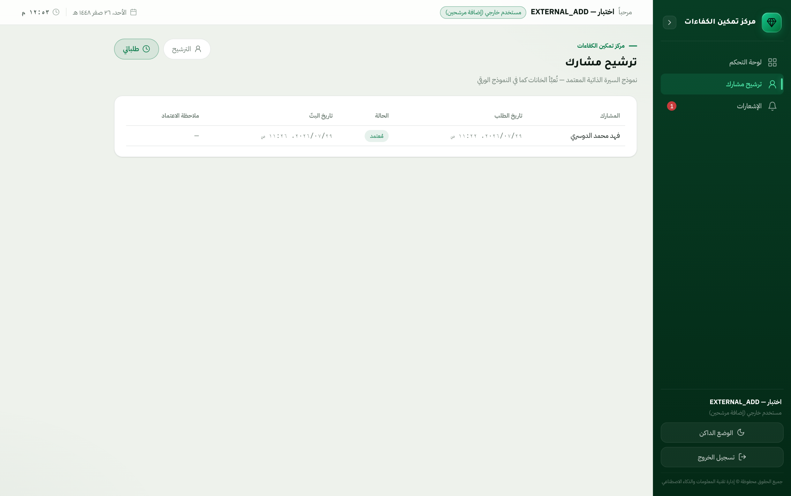

**٨ — اقرأ إشعاراتك** *(شاشة الإشعارات)*

1. افتح **الإشعارات** من القائمة الجانبية.
2. اضغط بطاقة الإشعار لتعليمها مقروءةً، أو اضغط **تعليم الكل كمقروء**.

النتيجة: تصلك هنا نتيجة طلباتك: **اعتُمد طلب تحديث بيانات المرشح** أو **رُفض طلب تحديث بيانات المرشح** ومعه السبب نصّاً. والرقم بجانب **الإشعارات** في القائمة الجانبية يتحدّث كل دقيقة وعند كل تنقّل.

> **لوحة التحكم عندك شبه خالية:** لا بطاقة مؤشّر ولا جدول ولا تحليلات — كل قسم لا تملك صلاحيته يختفي من الصفحة بالكامل. وبطاقة **إجراءات سريعة** تظهر لكل المستخدمين، وروابطها الأربعة (المرشحون · بدء تقييم · الحضور · التقارير) تعيدك إلى لوحة التحكم نفسها لأنك لا تملك صلاحيات شاشاتها.

#### ما لا تستطيعه — ولماذا

| ما يمنعه النظام عنك | سببه التصميمي |
|---|---|
| فتح شاشة المرشحين، أو رؤية من رشّحتهم بعد إرسالهم، أو معرفة حالتهم | `candidate.view` ليست في دورك. أنت تملك الإضافة ولا تملك القراءة، ولهذا تُنزَل على `/nominate` مباشرةً بعد الدخول |
| الكتابة فوق سجلّ مشاركٍ قائم بإعادة إدخال هويته | `candidate.edit` ليست لك. الكتابة فوق سجلٍّ قائم تعديلٌ لا إضافة؛ وبدون هذا المنع كان صاحب صلاحية الإضافة وحدها يعيد تسمية أي مشارك وينقله بين القطاعات بمجرّد «إضافته» بهويته |
| معرفة رمز المشارك المسجَّل أو اسمه أو حالته من ردّ التكرار | الردّ يذكر **تاريخ التسجيل فقط**. حارس «الدورة النشطة» يذكر الرمز في نصّ خطئه، فوُضع فحص التكرار قبله عمداً كي لا تُحصد الرموز بتجريب أرقام الهوية |
| معرفة أن المشارك مسجَّل إن كان مصنَّفاً أمنياً | المشارك المصنَّف يُعطيك الردّ نفسه الذي يُعطيه غير الموجود، فلا يصير الطلب طريقاً لمعرفة من هو مسجَّل ومصنَّف |
| رفع طلب تحديث ثانٍ قبل البتّ في الأول | طلب معلّق واحد لكل مشارك. القيد مفروض في قاعدة البيانات نفسها، فلا يمرّ حتى مع إرسالين متزامنين |
| البتّ في طلبك أنت — اعتماده أو رفضه | `candidate.update_approve` لمدير النظام ومسؤول الجدولة. الطلب لا يمسّ السجلّ حتى يعتمده صاحب صلاحية |
| كتابة اسم المشارك أو رقم هويته أو جواله أو بريده أو رابط داخل السيرة | السيرة تصل المقيّم بلا اسم. وطلب التحديث ليس معفىً من الفحص — وإلا صار باباً خلفياً لإدراج المعرّفات |
| كتابة **النبذة** أو **ملخّص المهام** بحروف لاتينية | النصّ اللاتيني يفلت من مطابِق الاسم العربي |
| تغيير رقم الهوية أو التصنيف الأمني عبر طلب التحديث | الهوية مفتاح الشخص، والتصنيف حوكمة تُدار من شاشة المشاركين وحدها؛ الاعتماد لا يغيّرهما |
| تجاوز ١٥ مؤهلاً أو ٢٠ خبرة أو ٢٠ دورة، أو حجم الإرسال، أو ٢٠ طلب تحديث في كل عشر دقائق | سقوف على الحجم والعدد والوتيرة — منعاً لنفخ الحمولة على بوّابة مفتوحة لجهة خارجية |
| إدخال رمز المشارك أو تاريخ الحضور أو الرتبة عند التقييم | يولّدها المركز عند الجدولة. والصورة الشخصية تُسلَّم في المركز يوم الحضور |
| الحضور، والجدولة، والتقييم، والتقارير، والمحادثات، وسائر شاشات المركز | ليست من صلاحيات دورك، فلا تظهر روابطها. وكتابة العنوان تعيدك إلى لوحة التحكم |
| تجاوز أيٍّ ممّا سبق بكتابة العنوان أو باستدعاء الواجهة البرمجية | كل ما سبق مفروض على الخادم؛ الإخفاء في الواجهة راحة لا حماية |

#### إن واجهتك رسالة

| الرسالة | معناها | ما تفعله |
|---|---|---|
| هذا المرشح مُضاف مسبقاً في النظام | الهوية مسجَّلة في المركز | لا تُعِد الإضافة — اضغط **طلب تحديث بيانات المشارك** |
| يوجد طلب تحديث معلّق لهذا المرشح — بانتظار البتّ فيه | طلب سابق لم يُبتّ فيه بعد | انتظر البتّ — لا يُقبل طلب ثانٍ. تابِع الحالة من تبويب **طلباتي** |
| السيرة تحوي اسم المرشح أو معرّفاً — أزِله | في نصّ حرّ بالسيرة اسمٌ أو هوية أو جوال أو بريد أو رابط | احذف المعرّف من الخانة — التقييم يجري دون معرفة الاسم |
| رقم الهوية غير صحيح (فشل التحقق) | الرقم لم يجتز التحقّق الحسابي | راجِع الأرقام رقماً رقماً من الوثيقة الرسمية |
| تعذّرت المعالجة | الهوية تخصّ مشاركاً مصنَّفاً أمنياً لا تملك رؤيته | راجِع المركز — لا تُعِد المحاولة بالرقم نفسه |

### مستشار المقابلة

مستشار المقابلة هو من يُجري المقابلة الشخصية مع المشارك ويرصد درجاته على كفاءات هذا النشاط. مسؤوليّته في مسار المرشّح تبدأ حين يُسنَد إليه المشارك في شاشة **استقبال الموظفين**، فيستلمه أو يردّه بسبب، ثم يسجّل حضور جلسته، ثم يفتح جلسة التقييم ويرسل درجاتها للاعتماد. وبعد كتابة التقرير النهائي يقف التقرير عند مرحلة **بانتظار اعتماد المقيّم**، وهي مرحلته هو. يعمل بالرمز لا بالاسم، وداخل قطاعه وحده.


**شاشاتك:** لوحة التحكم، المرشحون، استقبال الموظفين، الحضور، التقييم، التقارير، خطط التطوير، المحادثات، الإشعارات.

#### يومك في المنصّة

**١ — اقرأ نظرة اليوم** *(لوحة التحكم)*

1. افتح **لوحة التحكم** من الشريط الجانبي.
2. اقرأ بطاقات المؤشرات وبطاقة **حضور اليوم**.
3. راجع بطاقة **مسوداتي**: كل صفّ فيه رمز المشارك، والنشاط، و«N كفاءة مُقيّمة».

النتيجة: تعرف ما بقي عليك من تقييمات قبل فتح أي شاشة أخرى. لوحتك لا تحمل بطاقة تهيئة، ولا مقياس جاهزية، ولا اتجاه اثني عشر شهراً، ولا خريطة كفاءات، ولا رؤى تلقائية، ولا جدول اليوم — الأقسام التحليلية لحامل `analytics.view` وحده.

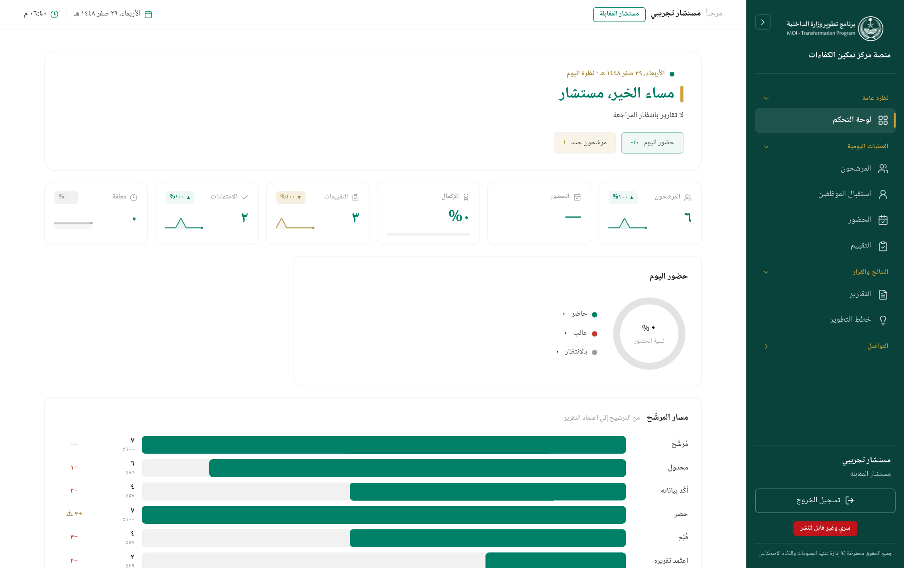

**٢ — استلم المرشّح المُسنَد إليك أو ردّه** *(استقبال الموظفين)*

1. افتح **استقبال الموظفين** وتأكّد من أن حقل التاريخ على اليوم.
2. انزل إلى قسم **المُسنَد إليّ اليوم**. لكل بطاقة: رمز المشارك، واسم النشاط، و«وصل HH:MM».
3. اضغط **استلام**.

النتيجة: تتحوّل البطاقة إلى الوسم **مُستلَم**، ويظهر زرّ **السيرة الذاتية**، وتظهر الرسالة «استُلم ‹الرمز›».

وإن لم يكن الإسناد لك:

1. اضغط **ردّ**.
2. اكتب في «سبب الردّ» سبباً لا يقلّ عن ثلاثة أحرف.
3. اضغط **ردّ المرشح**.

النتيجة: تظهر «رُدّ المرشح وأُشعِرت العمليات»، ويصل السبب إشعاراً إلى كل من يملك صلاحية إعادة الإسناد. القرار الواحد لا يُعاد: بعد الاستلام أو الردّ يُقفَل الإسناد. وإن لم يُسنَد إليك أحد ظهر **لا مرشّح مُسنَد إليك اليوم** مع التلميح «سيصلك إشعار فور إسناد مرشّح إليك.»

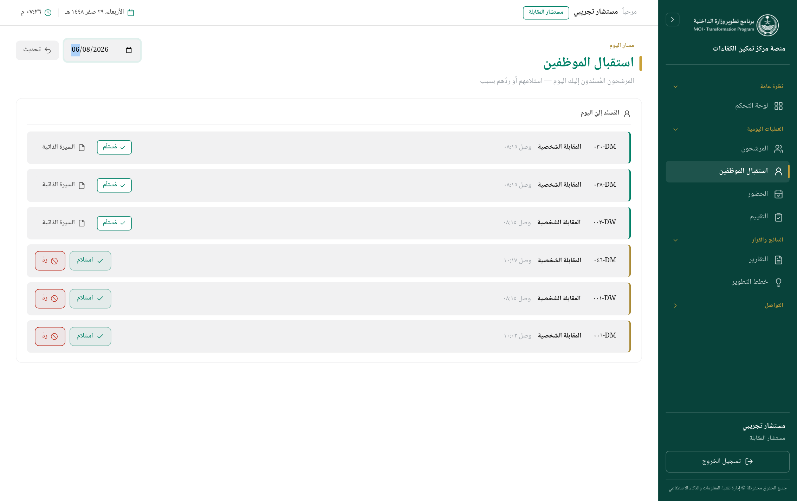

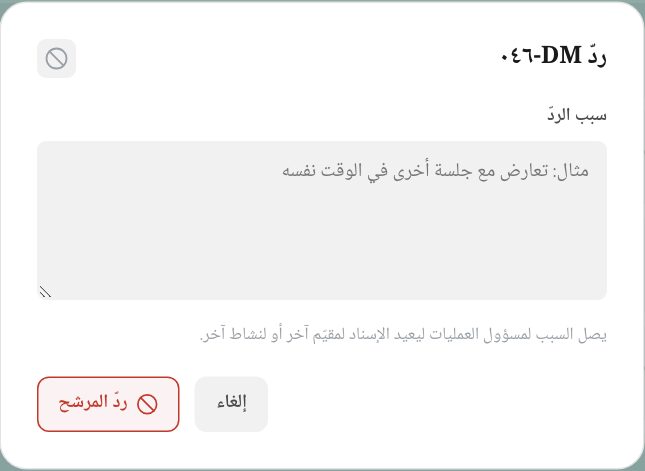

**٣ — اقرأ سيرة من استلمته** *(استقبال الموظفين)*

1. اضغط **السيرة الذاتية** في بطاقة موسومة **مُستلَم**.
2. اقرأ السيرة.

النتيجة: تُفتَح بلا اسم ولا رقم هوية ولا وسيلة تواصل، ويعلوها التنبيه «التقييم يتم بالرمز: اسم المرشح ورقم هويته محجوبان عن المقيّم.» وأي معرّف كتبه المرشّح داخل نصّ حرّ يُطمَس آلياً قبل العرض. وقبل الاستلام لا تُفتَح: «استلم المرشّح أولاً لعرض سيرته».

**٤ — سجّل حضور جلستك** *(الحضور)*

1. افتح **الحضور** من القائمة الجانبية.
2. ابحث عن صفّ المشارك برمزه في عمود **الرمز**.
3. اضغط **حضور**.

النتيجة: تظهر رسالة «تم تسجيل حضور» متبوعةً برمز المشارك، وتصير الحالة «حاضر»، ويصير عمود **إجراء** «تم». ووقت الحضور هو لحظة الضغط.

ولتسجيل الغياب:

1. اضغط **غياب** في صفّ المشارك.
2. أبقِ **غياب بعذر** مؤشَّراً إن كان الغياب بعذر، وأزل التأشير إن كان بلا عذر.
3. اكتب السبب في «سبب الغياب (اختياري)» — حدّه ٥٠٠ حرف.
4. اضغط **حفظ**.

النتيجة: «تم تسجيل غياب» ومعها الرمز، والسبب المكتوب يظهر بعدها في **التقرير اليومي** تحت «الغياب والأسباب»، وفي رحلة المشارك. الشاشة تعرض جلسات **اليوم وحده**، ولكل جلسة حالة واحدة تُسجَّل مرّة واحدة.

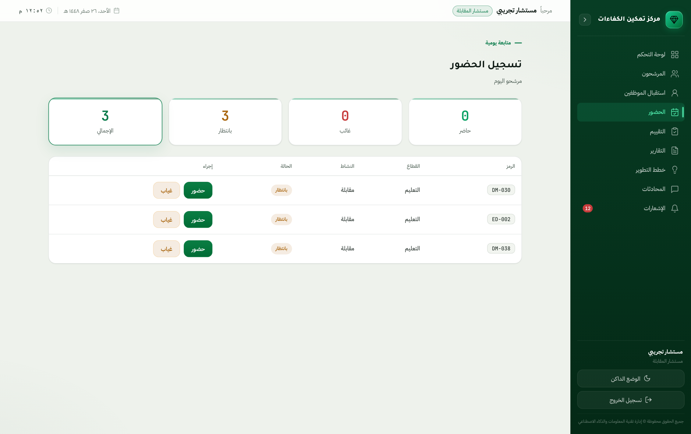

**٥ — افتح جلسة التقييم وارصد الدرجات** *(التقييم)*

1. افتح **التقييم** من الشريط الجانبي.
2. اختر المشارك من قائمة **المرشح** — تظهر بصيغة «الرمز — القطاع».
3. اختر **نوع النشاط**: «مقابلة شخصية» — وهو النشاط الذي يُسنَد إليك في الاستقبال.
4. اضغط **بدء الجلسة**.

النتيجة: يُنشأ التقييم مسودةً على الخادم، ويُفتح نموذج الدرجات بكفاءات ذلك النشاط وحدها، ويبدأ العدّاد من `00:00`.

5. لكل كفاءة اضغط رقم المستوى الذي تراه — يُضيء هو وما دونه، ويتحدّث العدّاد بجانبه إلى «{الدرجة} / {الحدّ الأقصى}».
6. لتغيير درجة، اضغط رقماً آخر في الصفّ نفسه.
7. اكتب ملاحظاتك في **ملاحظات المستشار**.

النتيجة: الكفاءة التي لم تُضغط لها درجة تبقى على `0` ولا تُرسَل ضمن الدرجات إطلاقاً.

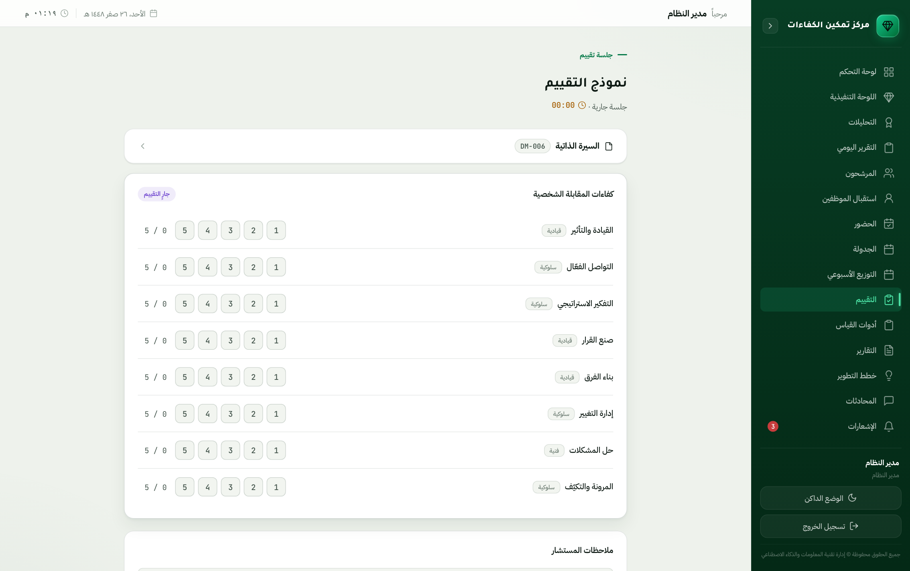

**٦ — راجع السيرة داخل الجلسة** *(التقييم)*

1. اضغط **السيرة الذاتية** أعلى النموذج.
2. اقرأ المنصب الحالي وسنوات الخبرة والنبذة، ثم المؤهلات العلمية، ثم الخبرات العملية، ثم الشهادات.

النتيجة: المعروض هو لقطة الدورة المجمَّدة التي تُلتقَط عند أول تقييم في الدورة، لا السيرة الحيّة — فما تقرؤه لا يتبدّل تحتك أثناء الجلسة. وإن لم يُدخل المشارك سيرة ظهر «لم يُدخل المرشح سيرة ذاتية.»

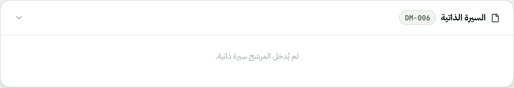

**٧ — احفظ مسودة أو استكملها لاحقاً** *(التقييم / لوحة التحكم)*

1. اضغط **حفظ مسودة**.
2. للعودة إليها: اضغط **استكمال** بجانب المسودة في بطاقة **استكمال مسودة**، أو من بطاقة **مسوداتي** في **لوحة التحكم**.

النتيجة: تظهر «تم حفظ المسودة». الحفظ يستبدل الدرجات المحفوظة كلها بما هو معروض أمامك — إمّا كلّها أو لا شيء. والمسودة تُفتَح بدرجاتها وملاحظاتها المحفوظة وبنشاطها المخزَّن. وزرّ **إلغاء الجلسة** لا يحذف المسودة: التقييم أُنشئ لحظة الضغط على **بدء الجلسة**.


**٨ — أرسل التقييم للاعتماد** *(التقييم)*

1. تأكّد من رصد درجةٍ لـ**كل** كفاءة من كفاءات النشاط.
2. اضغط **إرسال للاعتماد**.

النتيجة: تظهر «تم إرسال التقييم للاعتماد ✓»، ويتوقّف العدّاد، وتعود الشاشة إلى نموذج البدء بعد ثانيتين. ينتقل التقييم إلى حالة «مُرسل»، وتنتقل حالة المشارك من **مجدول** إلى **مُقيَّم**، ويصل إشعار «تقييم بانتظار الاعتماد» إلى مدير إدارة التقييم. وإن أُرجع إليك التقييم بسبب مكتوب، عاد إلى حالة **مسودة** ووصلك إشعار «تقييم مُرجع للتعديل» يحمل السبب، وظهر من جديد في **استكمال مسودة**.

**٩ — اعتمد التقرير الواقف عند مرحلتك** *(التقارير)*

1. افتح **التقارير** من القائمة الجانبية.
2. اضغط مرشّح **المقيّم** — وهو التقارير الواقفة عند اعتماد مستشار المقابلة، وبجانبه عددها.
3. اقرأ شارة الحالة على البطاقة ورقم موضعها في السلسلة (مثل `1/3`).
4. اضغط **مستند مفصّل** لمراجعة التقرير قبل قرارك.
5. اضغط **اعتماد**.

النتيجة: تظهر رسالة «تم اعتماد تقرير ‹رمز المشارك›»، وتتقدّم البطاقة إلى المرحلة التالية ويُشعَر صاحبها. قائمتك لا تعرض إلا تقارير من قيّمتهم أنت، وشريط الأدوات فيها بلا زرّي **إنشاء تقرير** و**تصدير CSV**، وبلا زرّ **إرجاع للتعديل**.

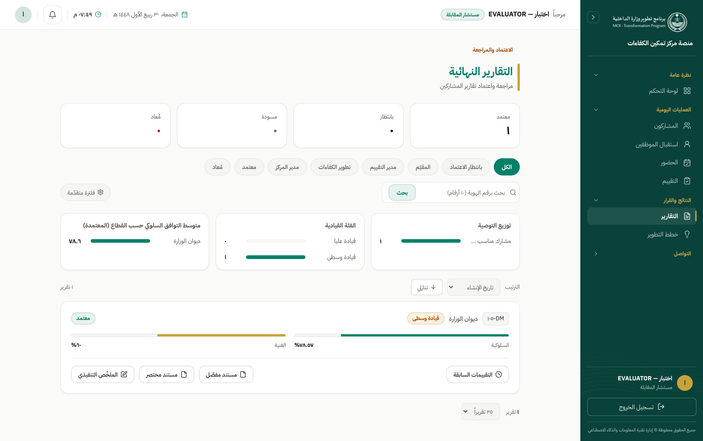

**١٠ — اقرأ خطة تطوير المشارك** *(خطط التطوير)*

1. افتح **خطط التطوير** من القائمة الجانبية.
2. اضغط قائمة **المرشّح** واختر رمز مشارك قيّمته أنت.

النتيجة: تظهر بنود الدورة الأخيرة، وفوقها ملخّص «{n} بند · {n} مكتمل». البنود المكتملة تظهر باهتة ومجالها مشطوب. قائمة الحالة معطّلة عندك، ولا زرّ حذف، ولا بطاقة **إضافة بند**، ولا زرّ **توليد من التقرير**.

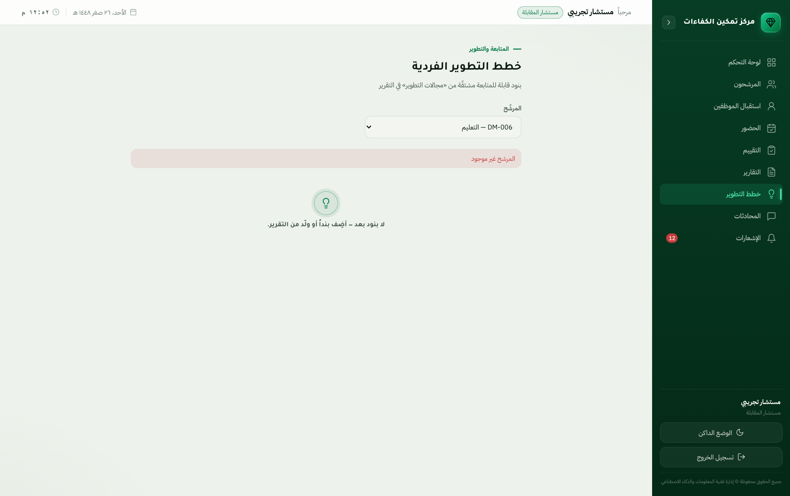

**١١ — تابع نقاش التقرير** *(المحادثات)*

1. افتح **المحادثات** من القائمة الجانبية.
2. اضغط بطاقة التقرير في قائمة «التقارير» — كل بطاقة سطران: رمز المشارك ثم اسم القطاع.
3. اقرأ الفقاعة الوسطى إن كان التقرير مُرجعاً: «أُعيد التقرير للتعديل. السبب: …».
4. اكتب في حقل «اكتب رسالة...» واضغط **إرسال**.

النتيجة: يُفرَّغ الحقل وتظهر رسالتك في آخر المجرى، ويصل إشعار «رسالة جديدة من ‹اسمك›» إلى كل من سبق أن كتب في المحادثة نفسها. القائمة عندك لا تعرض إلا تقارير من قيّمتهم أنت. والشاشة لا تُحدِّث نفسها تلقائياً: رسائل الآخرين تظهر عند إرسالك رسالة، أو عند إعادة اختيار التقرير.


**١٢ — تابع إشعاراتك** *(الإشعارات)*

1. راقب الرقم بجانب **الإشعارات** في القائمة الجانبية — يتحدّث كل دقيقة وعند كل انتقال بين الشاشات.
2. افتح **الإشعارات** واضغط بطاقة الإشعار.

النتيجة: تختفي النقطة الخضراء عن البطاقة وينقص الرقم الأحمر واحداً. الضغط لا ينقلك إلى الشاشة المعنيّة — افتحها بنفسك من القائمة الجانبية. أهمّ ما يصلك: «مرشّح مُسنَد إليك: ‹الرمز›»، و«تقييم مُرجع للتعديل»، و«اعتُمد ورُحّل: ‹الرمز›»، و«تقرير بانتظار اعتمادك».

**١٣ — ارجع إلى قاعدة المرشحين عند الحاجة** *(المرشحون)*

1. افتح **المرشحون**.
2. اكتب رمز المشارك في «بحث بالرمز...» — البحث بالرمز وحده.
3. اضغط أيقونة **تفاصيل** في صفّه.

النتيجة: تُفتح بطاقة المشارك بالرمز والقطاع والرتبة والفئة والحالة والتصنيف الأمني. وفي موضع البيانات الشخصية يظهر: «ليس لديك صلاحية عرض البيانات الشخصية.» شريط الأدوات عندك فيه **تصدير** وحده، والصفوف بلا أزرار تعديل واعتماد وحذف.

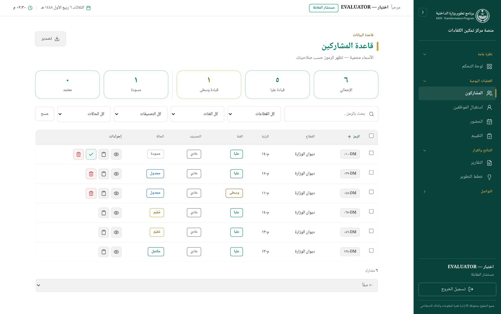

#### ما لا تستطيعه — ولماذا

| ما يمنعه النظام عنك | سببه التصميمي |
|---|---|
| تسجيل وصول مرشّح، وتعديل وقت وصوله، وأخذ توقيعه وإقراره | لكل مرحلة في الاستقبال صلاحية مستقلّة: فمن يسجّل ليس بالضرورة من يوزّع، ومن يوزّع ليس من يقرّر، ومن يقرّر ليس من يعتمد |
| توزيع مرشّح على نشاط ومقيّم، وسحب إسناد قائم | التوزيع والسحب للاستقبال أو العمليات؛ والقرار الذي تتّخذه أنت يقع على إسنادك وحدك — إسناد غيرك يُعامَل كغير موجود فلا تعلم بوجوده أصلاً |
| **اعتماد وترحيل** الزيارة إلى الجدولة | الاعتماد يُنشئ الجلسات في الجدولة، وهو خارج يد من يُجري النشاط |
| فتح سيرة المُسنَد إليك قبل الضغط على **استلام** | القرار يقع على الرمز والنشاط، لا على محتوى سيرة يُطّلَع عليها ثم تُردّ |
| تسجيل حضور جلسة ليست مُسنَدة إليك — يظهر لك «مُسنَدة لغيرك» | القاعدة: «الذي يستقبله يسجّله»؛ بلا هذا التمييز يسجّل أيُّ مقيّم حضور مشاركٍ لم يره |
| تسجيل الحضور أو الغياب لغير جلسات اليوم | الحضور يُسجَّل في يومه، وما فات يُعالَج بإعادة الجدولة |
| رؤية اسم المرشّح أو رقم هويته في أي موضع | القاعدة هنا إجرائية لا صلاحية: إتاحة الاسم لمن يقابل تفتح باباً لمعرفة من يقابل قبل أن يقابله |
| رؤية المشاركين المصنَّفين (سرّي / سرّي للغاية) ورؤية مشاركي غير قطاعك | حدّ التصنيف وحدّ القطاع، والعدّادات محصورة بالمثل — مؤشّرٌ أوسع من القائمة يُفشي حجم ما تخفيه |
| تعديل تقييم بعد إرساله أو اعتماده | الدرجات تُقفل عند الإرسال، فما يراجعه المعتمِد هو ما أُرسل بعينه؛ وللتعديل طريق واحد: أن يُرجعه صاحب صلاحية الاعتماد |
| اعتماد تقييم أو إرجاعه | من يُجري النشاط ليس من يعتمده — فلا يصير من يقابل هو من يعتمد |
| قراءة تقييم غيرك | سرّية الدرجات بين المستشار ومراجعه؛ ومن يفتح تقييماً ليس له يُردّ «التقييم غير موجود» |
| رؤية تقرير مشارك لم تقيّمه، ولو كان في قطاعك | تقريرٌ لم تشارك في تقييمه ليس شأنك |
| إنشاء تقرير، وتعديل تقرير غيرك، وإرجاع تقرير | الإرجاع لحاملي `report.return` وحدهم (مدير المركز ومدير النظام)؛ كان موزّعاً على كل مرحلة فكان كلُّ معتمِدٍ يردّ التقرير خطوات للوراء |
| تصدير `reports.csv`، وظهور اسم المشارك في المستند المطبوع | المستند يُطبع ويخرج من النظام، فحدّه أضيق من حدّ الشاشات |
| كتابة الملخّص التنفيذي — يظهر لك «للعرض فقط — الكتابة بصلاحية مدير المركز.» | الملخّص التنفيذي بصلاحية `report.exec_summary` |
| إضافة بند في خطة التطوير أو تعديل حالته أو حذفه أو توليده من التقرير | الفتح والإدارة صلاحيتان مختلفتان: الشاشة تُفتح بـ`development_plan.view`، والكتابة فيها بـ`report.create` |
| فتح الجدولة، والتوزيع الأسبوعي، وأدوات القياس، والتحليلات، واللوحة التنفيذية، والتقرير اليومي، وإطار الكفاءات، وسجل التدقيق، والمستخدمين، والأدوار، وسير العمل، والإعدادات | ليست في قائمتك ولا في صلاحياتك؛ والرؤى التلقائية بالذات تقارن القطاعات ببعضها، و«القطاع الأعلى جاهزية» جملةٌ تُفشي ما وراء حدّك |

كل ما سبق مفروض على الخادم. إخفاء زرّ في الواجهة راحة للعين، ومحاولة تجاوزه بالرابط أو بالواجهة البرمجية تُردّ بالرسالة نفسها.

#### إن واجهتك رسالة

| الرسالة | معناها | ما تفعله |
|---|---|---|
| هذه الجلسة ليست مُسنَدة لك | الجلسة لمستشار آخر، وأنت لا تملك تسجيل أي جلسة | اتركها لصاحبها أو للاستقبال؛ والمحاولة تُقيَّد في سجل التدقيق |
| استلم المرشّح أولاً لعرض سيرته | حاولت فتح السيرة قبل الاستلام | اضغط **استلام** ثم افتح السيرة |
| التقييم ناقص: تم تقييم {عدد} من {عدد} كفاءة لهذا النشاط | بقيت كفاءات بلا درجة | أكمل الكفاءات الباقية ثم أرسل |
| توجد مسودة تقييم لهذا المرشح في هذا النشاط — استكملها بدل بدء جلسة جديدة | التقييم مفتوح أصلاً في هذه الدورة | استعمل بطاقة **استكمال مسودة** |
| المرشح غير موجود | المشارك خارج قطاعك أو تصنيفك، أو لم تقيّمه أنت | راجع مسؤول الجدولة أو التوزيع؛ لا تُعِد المحاولة بالمعرّف |
| ليس لديك صلاحية اعتماد هذه المرحلة | التقرير واقف عند مرحلة لا تملك صلاحيتها | اترك الاعتماد لصاحب المرحلة |

---

### مستشار حلقة النقاش

مستشار حلقة النقاش هو من يُدير حلقة النقاش الجماعية ويرصد درجات المشاركين على كفاءات هذا النشاط. مسؤوليّته في مسار المرشّح تبدأ حين يُسنَد إليه المشارك في **استقبال الموظفين**، فيستلمه أو يردّه بسبب، ثم يسجّل حضور جلسته، ثم يرصد الدرجات ويرسلها للاعتماد. مسارُه ينتهي عند الإرسال: لا يفتح شاشة التقارير ولا خطط التطوير. يعمل بالرمز لا بالاسم، وداخل قطاعه وحده.

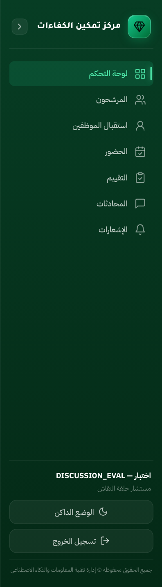

**شاشاتك:** لوحة التحكم، المرشحون، استقبال الموظفين، الحضور، التقييم، المحادثات، الإشعارات.

#### يومك في المنصّة

**١ — اقرأ نظرة اليوم** *(لوحة التحكم)*

1. افتح **لوحة التحكم** من الشريط الجانبي.
2. اقرأ بطاقات المؤشرات وبطاقة **حضور اليوم**.
3. راجع بطاقة **مسوداتي**: رمز المشارك، والنشاط، و«N كفاءة مُقيّمة»، وزرّ **استكمال**.

النتيجة: تعرف ما بقي عليك قبل فتح أي شاشة أخرى. الأقسام التحليلية — جاهزية القيادة، واتجاه اثني عشر شهراً، وخريطة الكفاءات، والرؤى التلقائية — لا تظهر لك؛ فهي لحامل `analytics.view`. و**مسوداتي** مسوداتك أنت: لا تظهر فيها مسودة زميل ولو كان في قطاعك.

**٢ — استلم المرشّح المُسنَد إليك أو ردّه** *(استقبال الموظفين)*

1. افتح **استقبال الموظفين** وتأكّد من أن حقل التاريخ على اليوم.
2. انزل إلى قسم **المُسنَد إليّ اليوم**. لكل بطاقة: رمز المشارك، واسم النشاط، و«وصل HH:MM».
3. اضغط **استلام**.

النتيجة: تتحوّل البطاقة إلى **مُستلَم**، ويظهر زرّ **السيرة الذاتية**، وتظهر الرسالة «استُلم ‹الرمز›».

وللردّ:

1. اضغط **ردّ**.
2. اكتب في «سبب الردّ» سبباً لا يقلّ عن ثلاثة أحرف (وحدّه الأعلى ٥٠٠ حرف).
3. اضغط **ردّ المرشح**.

النتيجة: «رُدّ المرشح وأُشعِرت العمليات»، ويصل السبب إشعاراً إلى كل من يملك صلاحية إعادة الإسناد. الشاشة عندك بلا بطاقات إحصاء وبلا جدول الحاضرين وبلا قائمة المنتظَرين — قسم **المُسنَد إليّ اليوم** وحده.


**٣ — اقرأ سيرة من استلمته** *(استقبال الموظفين)*

1. اضغط **السيرة الذاتية** في بطاقة موسومة **مُستلَم**.
2. اقرأ السيرة.

النتيجة: تُفتَح بلا اسم ولا رقم هوية ولا وسيلة تواصل، ويعلوها التنبيه «التقييم يتم بالرمز: اسم المرشح ورقم هويته محجوبان عن المقيّم.»

**٤ — سجّل حضور جلستك** *(الحضور)*

1. افتح **الحضور** من القائمة الجانبية.
2. ابحث عن صفّ المشارك برمزه في عمود **الرمز**، وتحقّق من عمود **النشاط** أنه «حلقة نقاش».
3. اضغط **حضور**، أو **غياب** ثم اضبط «غياب بعذر» واكتب السبب واضغط **حفظ**.

النتيجة: تظهر «تم تسجيل حضور» أو «تم تسجيل غياب» متبوعةً بالرمز، وتصير الحالة «حاضر» أو «غائب بعذر» أو «غائب»، ويصير عمود **إجراء** «تم». الجلسات التي ليست مُسنَدة إليك يظهر في إجرائها **مُسنَدة لغيرك**، والبطاقات الأربع تعدّ ما تعرضه القائمة وحده.

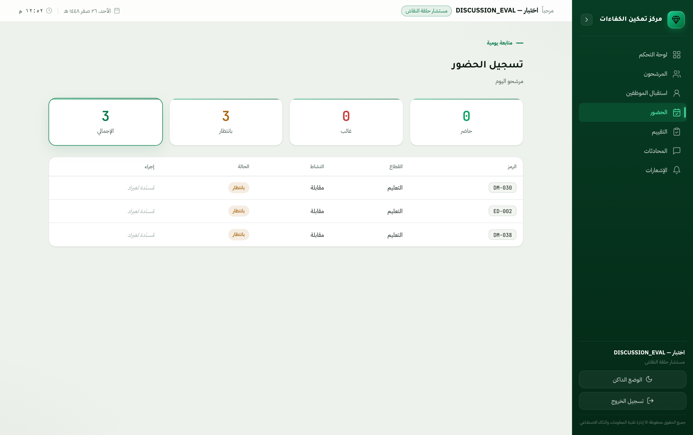

**٥ — افتح جلسة التقييم** *(التقييم)*

1. افتح **التقييم** من الشريط الجانبي.
2. اختر المشارك من قائمة **المرشح** — بصيغة «الرمز — القطاع». القائمة لا تعرض إلا من حالته **مجدول** أو **مُقيَّم**.
3. اختر **نوع النشاط**: «حلقة نقاش» — وهو النشاط الذي يُسنَد إليك في الاستقبال.
4. اضغط **بدء الجلسة**.

النتيجة: يُنشأ التقييم مسودةً على الخادم، ويُفتح نموذج الدرجات بعنوان **كفاءات حلقة النقاش**، ويبدأ العدّاد من `00:00`.

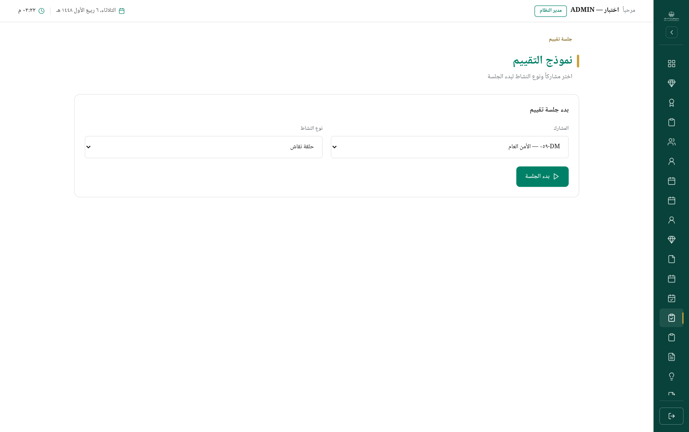

**٦ — ارصد الدرجات واكتب ملاحظاتك** *(التقييم)*

1. لكل كفاءة اضغط رقم المستوى الذي تراه — يُضيء هو وما دونه، ويتحدّث العدّاد بجانبه إلى «{الدرجة} / {الحدّ الأقصى}».
2. لتغيير درجة، اضغط رقماً آخر في الصفّ نفسه.
3. اضغط **السيرة الذاتية** أعلى النموذج لقراءة لقطة الدورة المجمَّدة إن احتجتها.
4. اكتب ملاحظاتك في **ملاحظات المستشار**.

النتيجة: الكفاءة التي لم تُضغط لها درجة تبقى على `0` ولا تُرسَل ضمن الدرجات إطلاقاً. وبجانب اسم كل كفاءة وسم نوعها: «سلوكية» أو «قيادية» أو «فنية».


**٧ — احفظ مسودة أو استكملها** *(التقييم / لوحة التحكم)*

1. اضغط **حفظ مسودة**؛ تظهر «تم حفظ المسودة».
2. للعودة إليها: اضغط **استكمال** في بطاقة **استكمال مسودة**، أو من بطاقة **مسوداتي** في **لوحة التحكم**.

النتيجة: تُفتح المسودة بدرجاتها وملاحظاتها المحفوظة، وبنشاطها المخزَّن لا بالنشاط المختار في شاشة البدء. وزرّ **إلغاء الجلسة** لا يحذف المسودة.

**٨ — أرسل التقييم للاعتماد** *(التقييم)*

1. تأكّد من رصد درجةٍ لـ**كل** كفاءة من كفاءات حلقة النقاش.
2. اضغط **إرسال للاعتماد**.

النتيجة: «تم إرسال التقييم للاعتماد ✓»، ويتوقّف العدّاد، وتعود الشاشة إلى نموذج البدء بعد ثانيتين. ينتقل التقييم إلى حالة «مُرسل»، وتنتقل حالة المشارك من **مجدول** إلى **مُقيَّم**، ويصل إشعار «تقييم بانتظار الاعتماد» إلى مدير إدارة التقييم. وإن أُرجع تقييمك عاد إلى حالة **مسودة**، ووصلك إشعار «تقييم مُرجع للتعديل» يحمل السبب، وظهر من جديد في **استكمال مسودة**.

**٩ — ارجع إلى قاعدة المرشحين عند الحاجة** *(المرشحون)*

1. افتح **المرشحون**.
2. اكتب رمز المشارك في «بحث بالرمز...» — البحث بالرمز وحده، والنتيجة تُجلب بعد توقّفك عن الكتابة بثلث ثانية.
3. اضغط أيقونة **تفاصيل** في صفّه.

النتيجة: تُفتح بطاقة المشارك بالرمز والقطاع والرتبة والفئة والحالة والتصنيف الأمني. وفي موضع البيانات الشخصية: «ليس لديك صلاحية عرض البيانات الشخصية.» والجدول رموز لا أسماء لكل الأدوار بلا استثناء.

**١٠ — تابع إشعاراتك** *(الإشعارات)*

1. راقب الرقم بجانب **الإشعارات** في القائمة الجانبية.
2. افتح **الإشعارات** واضغط بطاقة الإشعار، أو اضغط **تعليم الكل كمقروء**.

النتيجة: تختفي النقطة الخضراء وينقص الرقم الأحمر. أهمّ ما يصلك: «مرشّح مُسنَد إليك: ‹الرمز›»، و«تقييم مُرجع للتعديل»، و«اعتُمد ورُحّل: ‹الرمز›»، و«تذكير: جلسة غداً».

**١١ — المحادثات** *(المحادثات)*

1. افتح **المحادثات** من القائمة الجانبية.

النتيجة: الشاشة تفتح لك بصلاحية `chat.view`، لكن قائمة «التقارير» تظهر خالية: **لا توجد تقارير**، ومعها شريط الخطأ «تعذّر تحميل التقارير — تأكد أن الخادم يعمل». محادثة كل تقرير محصورة بنطاق التقرير نفسه، وأنت لا تملك عرض التقارير، فلا محادثة تُفتح لك.

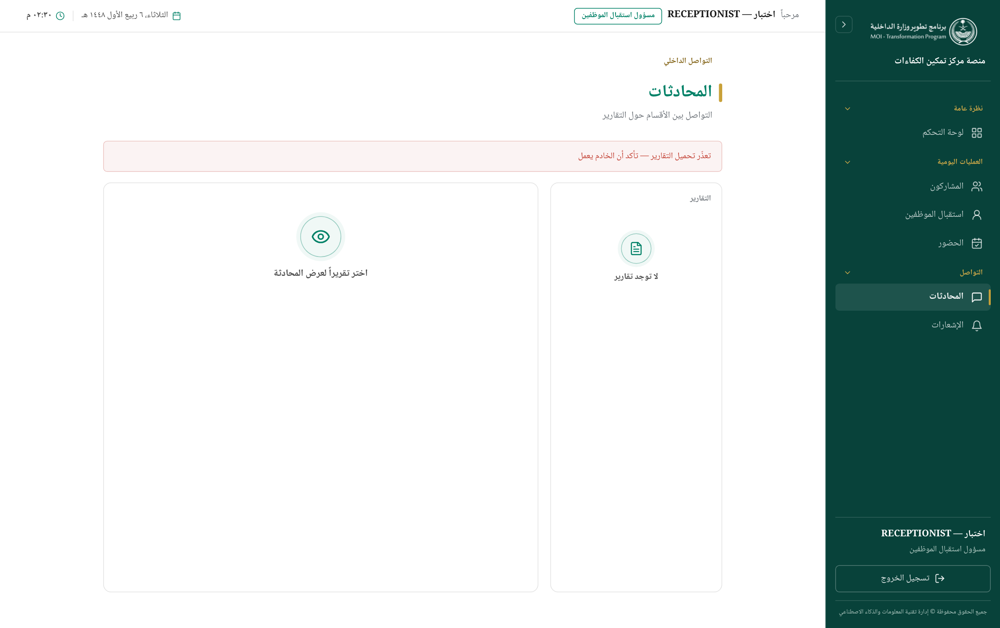

#### ما لا تستطيعه — ولماذا

| ما يمنعه النظام عنك | سببه التصميمي |
|---|---|
| تسجيل وصول مرشّح، وتعديل وقت وصوله، وأخذ توقيعه وإقراره | لكل مرحلة في الاستقبال صلاحية مستقلّة: فمن يسجّل ليس بالضرورة من يوزّع، ومن يوزّع ليس من يقرّر، ومن يقرّر ليس من يعتمد |
| توزيع مرشّح على نشاط ومقيّم، وسحب إسناد قائم، والاعتماد والترحيل إلى الجدولة | التوزيع والاعتماد خارج يد من يُجري النشاط؛ ولا يبتّ مقيّم في إسناد غيره — إسناد غيرك يُعامَل كغير موجود فلا تعلم بوجوده أصلاً |
| فتح سيرة المُسنَد إليك قبل الضغط على **استلام** | القرار يقع على الرمز والنشاط، لا على محتوى سيرة يُطّلَع عليها ثم تُردّ |
| تسجيل حضور جلسة ليست مُسنَدة إليك — يظهر لك «مُسنَدة لغيرك» | القاعدة: «الذي يستقبله يسجّله»؛ بلا هذا التمييز يسجّل أيُّ مقيّم حضور مشاركٍ لم يره |
| تسجيل الحضور أو الغياب لغير جلسات اليوم، أو تعديل حالة سُجّلت | حالة واحدة لكل جلسة، وفهرس فريد يحرسها حتى عند ضغطتين متزامنتين من جهازين |
| رؤية اسم المرشّح أو رقم هويته في أي موضع | القاعدة إجرائية لا صلاحية: إتاحة الاسم لمن يقيّم تفتح باباً لمعرفة من سيقيّم قبل أن يقيّمه |
| رؤية المشاركين المصنَّفين (سرّي / سرّي للغاية) ورؤية مشاركي غير قطاعك | حدّ التصنيف وحدّ القطاع، والقيد يُفرَض مرّةً أخرى عند بدء الجلسة لا عند التوزيع وحده |
| تعديل تقييم بعد إرساله أو اعتماده | الدرجات تُقفل عند الإرسال، فما يراجعه المعتمِد هو ما أُرسل بعينه |
| اعتماد تقييم أو إرجاعه، وقراءة تقييم غيرك | سرّية الدرجات بين المستشار ومراجعه؛ ومن يُجري النشاط ليس من يعتمده |
| فتح شاشة **التقارير** واعتماد أي مرحلة فيها | مرحلة اعتماد المقيّم في السلسلة لمستشار المقابلة؛ وشاشة التقارير تُفتح بـ`report.view` وهي ليست في صلاحياتك |
| فتح **خطط التطوير** | الشاشة تُفتح بـ`development_plan.view`، والمسار يفرضها ولا يقبل بديلاً عنها |
| فتح محادثة أي تقرير — القائمة تظهر خالية | بوّابتان لا واحدة: `chat.view` تفتح الميزة، و`report.view` تفتح محادثةً بعينها؛ والمحادثة تحمل سبب الإرجاع ونقاش المقيّمين، أي مضمون التقرير المحجوب |
| فتح الجدولة، والتوزيع الأسبوعي، وأدوات القياس، والتحليلات، واللوحة التنفيذية، والتقرير اليومي، وإطار الكفاءات، وسجل التدقيق، والمستخدمين، والأدوار، وسير العمل، والإعدادات | ليست في قائمتك ولا في صلاحياتك؛ والرؤى التلقائية بالذات تقارن القطاعات ببعضها، فتصلك قائمة فارغة لا رسالة منع |

كل ما سبق مفروض على الخادم؛ ومحاولة تجاوزه بالرابط أو بالواجهة البرمجية تُردّ بالرسالة نفسها، وتُقيَّد في سجل التدقيق.

#### إن واجهتك رسالة

| الرسالة | معناها | ما تفعله |
|---|---|---|
| هذه الجلسة ليست مُسنَدة لك | الجلسة لمستشار آخر، وأنت لا تملك تسجيل أي جلسة | اتركها لصاحبها أو للاستقبال |
| اذكر سبب الردّ — العمليات تبني عليه إعادة الإسناد | حقل السبب فارغ أو أقصر من ثلاثة أحرف | اكتب سبباً واضحاً (٣ أحرف فأكثر، ٥٠٠ حدّاً أعلى) |
| التقييم ناقص: تم تقييم {عدد} من {عدد} كفاءة لهذا النشاط | بقيت كفاءات بلا درجة | أكمل الكفاءات الباقية ثم أرسل |
| لا يمكن تعديل تقييم تم إرساله أو اعتماده | حاولت الحفظ على تقييم مُقفل | اطلب إرجاعه ممّن يعتمده |
| المرشح غير موجود | المشارك خارج قطاعك أو تصنيفك، أو غير موجود فعلاً | راجع مسؤول الجدولة أو التوزيع |
| تعذّر تحميل التقارير — تأكد أن الخادم يعمل | يظهر لك في **المحادثات**: دورك بلا صلاحية عرض التقارير | الشاشة لا تعمل لدورك — لا إجراء |

### مساعد التقييم

مساعد التقييم موظّف مُلحَق بمدير إدارة التقييم ومحصور بقطاع واحد. لا يرصد درجات الكفاءات — الرصد للمستشارين — بل يحضر الجلسات المُسنَدة إليه ويسجّل حضورها، ثم يكتب **التقرير النهائي** للمشارك من درجات المستشارين ونتائج أدوات القياس، ويدفعه إلى سلسلة الاعتماد، ويبني عليه **خطة التطوير الفردية**. حسابه لا يُنشأ بلا قطاع ولا بلا مدير: القطاع بتنبيه «لا يُقيّم إلا مرشحي هذا القطاع»، والمدير بتنبيه «مديره هو من يعتمد تقاريره». والشاشات كلها تعمل عنده **بالرمز لا بالاسم**.

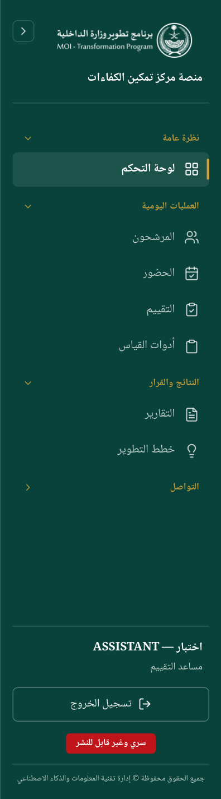

**شاشاتك:** لوحة التحكم · المرشحون · الحضور · التقييم · أدوات القياس · التقارير · خطط التطوير · المحادثات · الإشعارات.

#### يومك في المنصّة

**١ — تسجيل حضور جلساتك** *(شاشة الحضور)*

1. افتح **الحضور** من القائمة الجانبية.
2. ابحث عن صفّ المشارك برمزه في عمود **الرمز**.
3. اضغط **حضور**.

تظهر رسالة «تم تسجيل حضور» متبوعةً برمز المشارك، وتصير الحالة «حاضر»، ويصير عمود الإجراء «تم»، ويرتفع عدّاد **حاضر**. الشاشة تعرض جلسات **اليوم وحده** داخل قطاعك، والأزرار لا تظهر إلا في الجلسات المُسنَدة إليك — مقيّماً أو مساعداً — وفي غيرها يُكتب **مُسنَدة لغيرك**.


لتسجيل غياب: اضغط **غياب**، وأبقِ **غياب بعذر** مؤشَّراً إن كان بعذر، واكتب السبب في «سبب الغياب (اختياري)» — حدّه ٥٠٠ حرف — ثم اضغط **حفظ**. السبب يظهر بعدها في **التقرير اليومي** تحت «الغياب والأسباب» وفي رحلة المشارك.


**٢ — قراءة نتائج أدوات القياس** *(شاشة أدوات القياس)*

1. افتح **أدوات القياس**.
2. اضغط قائمة **المرشّح** واختر رمز المشارك — كل خيار بصيغة «الرمز — القطاع».
3. انتظر انتهاء «جارٍ التحميل…».

تظهر بطاقة الدرجات الثلاث — **المقياس الشخصي** و**القدرات التحليلية** و**اللغة الإنجليزية** — بالنتيجة المحفوظة، وتحتها سطر **«آخر تحديث»**. الحقول عندك معطّلة ولا زرّ حفظ، ومكانه سطر «عرض فقط — تحتاج صلاحية رفع القياس للتعديل.». هذه القراءة مقدّمة لكتابة التقرير: نتائج القياس تُطبع في المستند المفصّل.

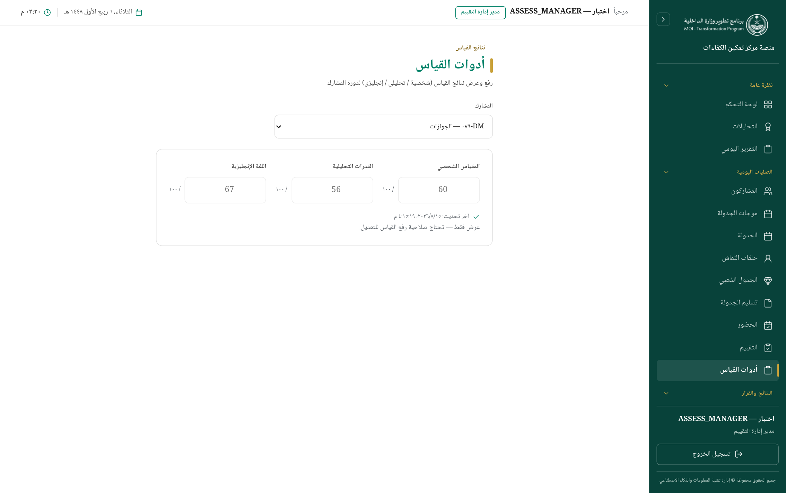

**٣ — قراءة تفاصيل المشارك وسجل دوراته** *(شاشة المرشحون)*

1. افتح **المرشحون**.
2. اكتب رمز المشارك في «بحث بالرمز...» — النتيجة تُجلب بعد ثلث ثانية من آخر حرف.
3. اضغط أيقونة **تفاصيل** في صفّه.
4. انزل إلى **سجل دورات التقييم**.

تقرأ القطاع والرتبة والفئة والحالة والتصنيف، ثم لكل دورة رمزها وحالتها وتاريخها وتقييماتها بنشاطها وحالتها. الاسم لا يظهر لك في الجدول ولا في البطاقة.


**٤ — كتابة التقرير النهائي** *(شاشة التقارير)*

1. افتح **التقارير** واضغط **إنشاء تقرير**.
2. اختر المشارك من قائمة «اختر مرشحاً منتهي التقييم…» — القائمة لا تضمّ إلا من انتهى تقييمه ولا تقرير لدورته الحالية.
3. راجع لوحة **الاحتساب الآلي من الدرجات**: «سلوكي» و«فني» و«عام»، وعدد الكفاءات والتقييمات المحتسَبة، وتفصيل كل كفاءة.
4. راجع لوحة **تحليل الفجوة** — تقارن كل كفاءة بالمستوى المستهدف لفئة المشارك وتُظهر «… / … محقّق».
5. عدّل «التوافق السلوكي (%)» و«التوافق الفني (%)» إن لزم؛ فهما مُعبّآن تلقائياً كما يقول التنبيه «عُبّئت قيمتا التوافق تلقائياً — يمكنك تعديلهما.».
6. اختر «التوصية» من: «يوصى به بقوة»، «يوصى به»، «يوصى به بتحفّظ»، «لا يوصى به».
7. اكتب «نظرة عامة»، وأضف بنود «نقاط القوة» و«مجالات التطوير» بزر **إضافة**.
8. اضغط **حفظ كمسودة**، أو **حفظ وإرسال للاعتماد**.

تظهر «تم حفظ المسودة» أو «أُرسل التقرير للاعتماد». وعند الإرسال يُشعَر صاحب المرحلة الأولى وحده. هذه اللوحة هي مصدر الدرجات عندك: شاشة **التقييم** تفتح لك النموذج ولا تبدأ به جلسة.

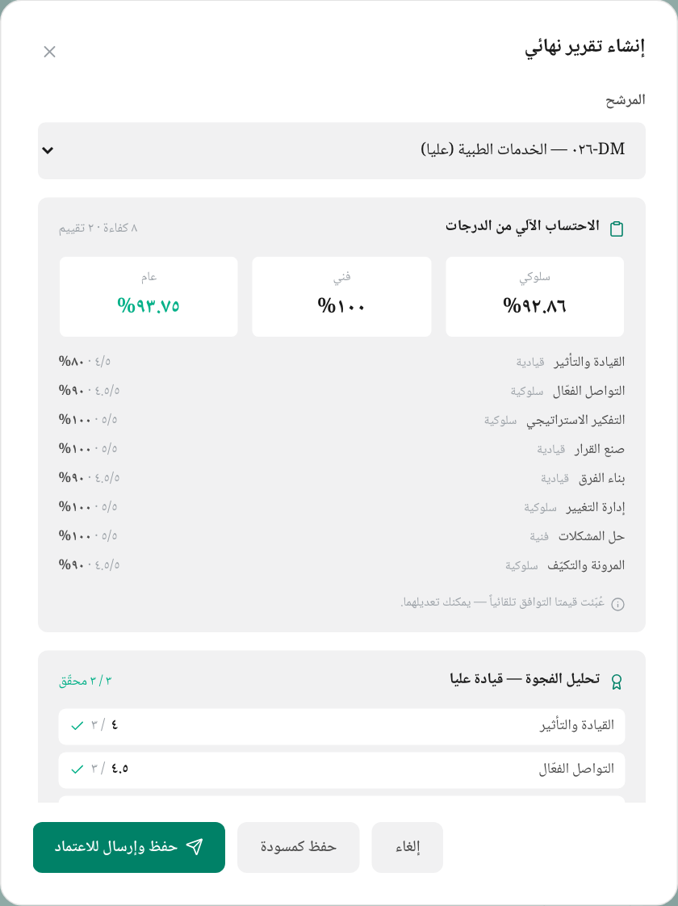

**٥ — معالجة تقرير أُعيد إليك** *(شاشة التقارير، ومعها المحادثات والإشعارات)*

1. عند وصول إشعار «أُعيد تقرير للتعديل»، افتح **التقارير**.
2. اضغط مرشّح **مُعاد**.
3. افتح **المحادثات** واختر التقرير، واقرأ الفقاعة الوسطى: «أُعيد التقرير للتعديل. السبب: …».
4. ارجع إلى بطاقة التقرير واضغط **تعديل التقرير**.
5. عالِج السبب ثم اضغط **حفظ وإرسال للاعتماد**.

التقرير المُعاد يعود بالإرسال إلى **أول** السلسلة لا إلى المرحلة التي أُعيد منها. ولا زرّ منفصلاً لإعادة الإرسال. ولاحظ أن حقلَي التوافق في وضع التعديل يُحفظان كما تتركهما — لا يُعاد احتسابهما آلياً كما في الإنشاء.

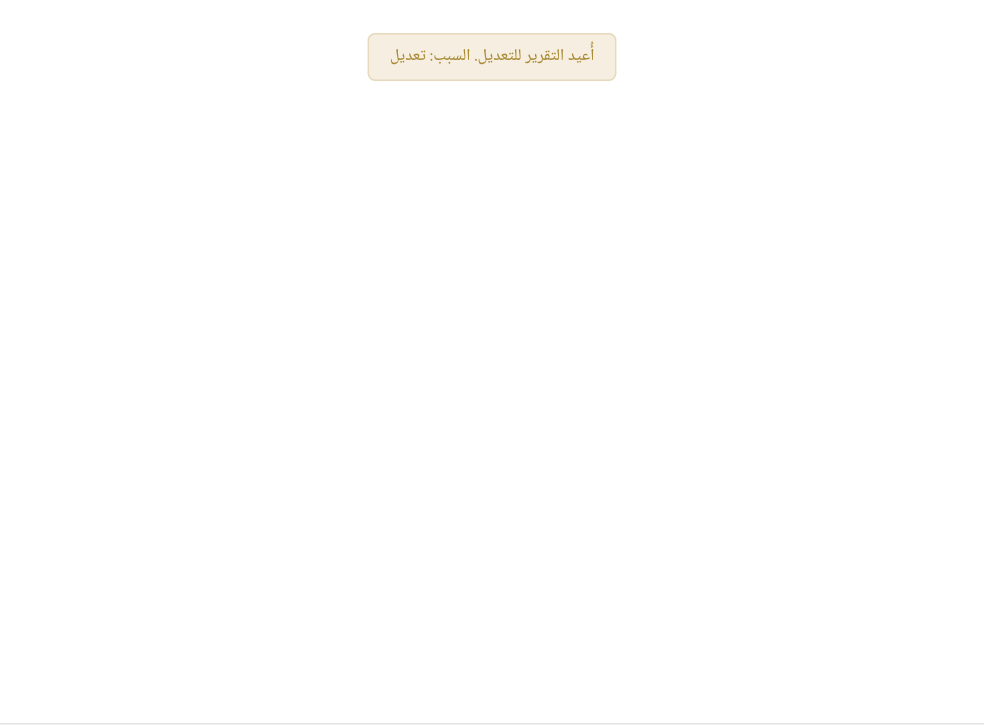

**٦ — بناء خطة التطوير الفردية** *(شاشة خطط التطوير)*

1. افتح **خطط التطوير** واختر رمز المشارك من قائمة **المرشّح**.
2. اضغط **توليد من التقرير**.
3. أضف ما ينقص يدوياً: اكتب **مجال التطوير \*** (إلزامي، حدّه ٥٠٠ حرف)، و**الإجراء / التوصية (اختياري)** (حدّه ١٠٠٠ حرف)، واختر تاريخاً مستهدفاً، ثم اضغط **إضافة**.
4. تابع البنود لاحقاً: اضغط قائمة الحالة بجانب البند واختر **قيد التنفيذ** أو **مكتمل**.

يُنشأ بند بحالة «بالانتظار» لكل مجال تطوير في تقرير الدورة، ويظهر أعلى القائمة ملخّص «{n} بند · {n} مكتمل». المجال المُدرَج سابقاً لا يتكرّر، وإن لم يكن هناك جديد ظهرت «لا مجالات جديدة لإضافتها من التقرير». وعند وضع البند على **مكتمل** يُشطَب مجاله ويظهر فيه وسم **اكتمل**.


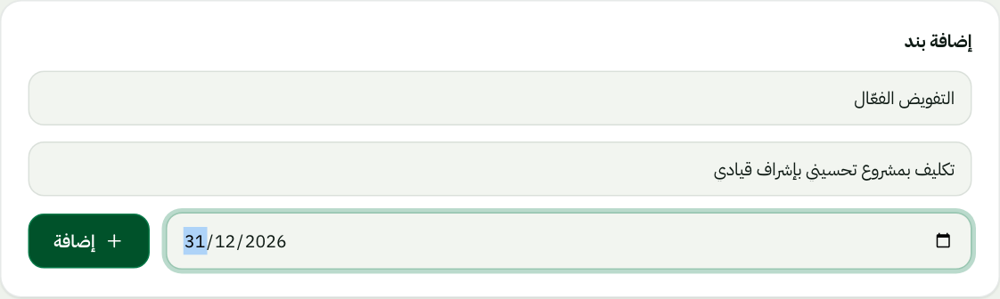

**٧ — متابعة إشعاراتك**

1. افتح **الإشعارات** من القائمة الجانبية.
2. اضغط بطاقة الإشعار لقراءتها.
3. اضغط **تعليم الكل كمقروء** إن تراكمت.

تختفي النقطة الخضراء وينقص الرقم الأحمر. الضغط لا ينقلك إلى الشاشة المعنيّة — افتحها بنفسك من القائمة الجانبية. أشهر ما يصلك: «أُعيد تقرير للتعديل»، و«اعتُمد التقرير نهائياً»، و«رسالة جديدة من ‹الاسم›».

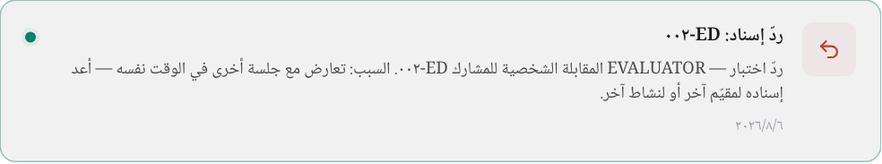

**٨ — تضييق قائمة التقارير حين تكثر** *(شاشة التقارير)*

1. اضغط **فلترة متقدّمة**.
2. اضبط **القطاع** أو **الفئة** أو **التوصية** أو **من تاريخ** / **إلى تاريخ**.
3. اضغط **تطبيق**.
4. للعودة اضغط **مسح**.

كل ترشيح جديد يعيدك إلى الصفحة الأولى، وتُعاد الرسوم البيانية على الترشيح الجديد. وللبحث عن مشارك بعينه اكتب رقم هويته **كاملاً** (عشرة أرقام) في حقل البحث واضغط **بحث**.

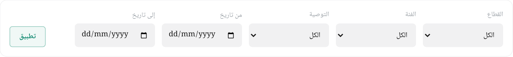

#### ما لا تستطيعه — ولماذا

| ما يمنعه النظام عنك | سببه التصميمي |
|---|---|
| بدء جلسة تقييم أو رصد درجة أو إرسال تقييم — لا تملك `evaluation.input` | من يكتب التقرير لا يرصد الدرجة التي يبني عليها. الرصد لمستشار المقابلة ومستشار حلقة النقاش، والصلاحية تُفحص قبل ملكية الجلسة |
| قراءة تقييم لست صاحبه | «التقييم غير موجود» — قراءة الدرجات مقصورة على راصدها وعلى من يملك اعتمادها. سرّية الدرجات بين المستشار ومراجعه |
| رفع نتيجة قياس أو تعديلها — لا تملك `measurement.upload` | العرض والرفع صلاحيتان منفصلتان: تقرأ القياس لأنه يدخل في التقرير، والرفع لمشرف أدوات القياس ومدير المركز |
| اعتماد أي مرحلة، أو إرجاع تقرير، أو إلغاؤه | من يكتب لا يعتمد. تقاريرك يعتمدها مديرك، والإرجاع لحاملي `report.return` وحدهم (مدير المركز ومدير النظام) — كان موزّعاً على كل مرحلة فكان كلُّ معتمِدٍ يردّ التقرير خطوات للوراء |
| تعديل تقرير أنشأه غيرك — لا تملك `report.edit_any` | «لا تملك صلاحية تعديل تقرير أنشأه غيرك». التقرير وثيقة منسوبة إلى كاتبها |
| تعديل تقريرك بعد إرساله | لا يُعدَّل إلا ما هو «مسودة» أو «مُعاد للتعديل» — وتقريرٌ في السلسلة لا يُعدَّل من تحت المعتمِدين. الطريق الوحيد: أن يُرجَع أولاً |
| تصدير `reports.csv` — لا تملك `report.export` | التصدير يُخرج البيانات من النظام، فحدّه أضيق من حدّ القراءة |
| كتابة الملخّص التنفيذي | «الملخّص التنفيذي بصلاحية مدير المركز فقط» — تقرؤه ولا تكتبه، ويظهر لك «للعرض فقط — الكتابة بصلاحية مدير المركز.» |
| رؤية اسم المشارك في أي شاشة، وفي المستند المطبوع | لا أسماء في الجداول لأي دور، والاسم في بطاقة التفاصيل لحامل `candidate.view_names` وحده. والمستند يُطبع ويخرج من النظام فحدّه أضيق: الاسم فيه لمدير المركز ومدير النظام |
| رؤية المشاركين المصنَّفين (سرّي / سرّي للغاية) | لا يظهرون في الجدول ولا في العدّادات ولا في التصدير، وفتحهم بالمعرّف يُردّ «المرشح غير موجود» — الردّ لا يفرّق بين «غير موجود» و«ليس لك» كي لا يصير المعرّف أداة كشف |
| فتح السيرة الذاتية من شاشة المرشحين، أو رحلة المشارك | صلاحيتان مستقلّتان (`candidate.cv_view` و`candidate.journey`) لا تملكهما. السيرة تصلك محتواها عبر التقرير لا عبر تصفّح القاعدة |
| العمل خارج قطاعك | مساعد التقييم من الأدوار المحصورة بقطاع، والحصر يُطبَّق **قبل** أي اختيار — فاختيار قطاع آخر من مرشّح القائمة لا يوسّع ما تراه، والعدّادات محصورة بالمثل |
| تسجيل حضور جلسة ليست لك | «هذه الجلسة ليست مُسنَدة لك». القاعدة: «الذي يستقبله يسجّله»؛ بلا هذا التمييز يسجّل أيُّ أحدٍ حضور مشاركٍ لم يره. وتسجيل أي جلسة (`attendance.record_any`) للاستقبال ومشرف أدوات القياس |
| إضافة مرشح أو تعديله أو اعتماده أو حذفه | أيقونتا **اعتماد** و**حذف** تظهران بحسب حالة الصفّ لا بحسب صلاحيتك، والمنع يقع على الخادم: «ليس لديك صلاحية الاعتماد». الإخفاء في الواجهة راحة لا حماية |
| فتح الجدولة والتوزيع الأسبوعي واستقبال الموظفين والتحليلات واللوحة التنفيذية والتقرير اليومي | ليست من عملك، ولا تظهر في قائمتك الجانبية. وكتابة رابطها يعيدك إلى **لوحة التحكم** |

#### إن واجهتك رسالة

| الرسالة | معناها | ما تفعله |
|---|---|---|
| «ليس لديك صلاحية إدخال التقييم» | حاولت بدء جلسة في شاشة التقييم | الرصد لمستشار المقابلة ومستشار حلقة النقاش. اكتفِ بالتقرير |
| «لا يمكن إنشاء تقرير قبل انتهاء تقييم المرشح» | دورة المشارك لم تُغلق بعد | انتظر انتهاء تقييماته؛ القائمة لا تعرضه قبلها |
| «يوجد تقرير لهذه الدورة — استخدم التعديل» | لدورة المشارك الحالية تقرير قائم | افتحه بزر **تعديل التقرير** بدل الإنشاء |
| «لا يمكن تعديل تقرير في هذه الحالة» | التقرير ليس «مسودة» ولا «مُعاد للتعديل» | لتعديله يجب أن يُعاد أولاً بيد صاحب صلاحية الإرجاع |
| «هذه الجلسة ليست مُسنَدة لك» | ضغطت تسجيلاً على جلسة مستشار آخر | اتركها لصاحبها أو للاستقبال |
| «المرشح غير موجود» | المشارك خارج قطاعك أو خارج تصنيفك | لا تُعِد المحاولة بالمعرّف؛ راجع من يملك نطاقاً أوسع |

---

### مشرف أدوات القياس

مشرف أدوات القياس صاحب محطّة **أدوات القياس** في مسار اليوم. يستلم من يُسنَد إليه من باب الاستقبال أو يردّه بسبب، ويسجّل حضور الجلسات، ثم يرفع نتائج أدوات القياس الثلاث — المقياس الشخصي والقدرات التحليلية واللغة الإنجليزية — على الدورة النشطة للمشارك. هو الجهة الوحيدة مع مدير المركز ومدير النظام التي تكتب هذه الدرجات، وهي تدخل بعدها في التقرير النهائي. يعمل بالرمز والقطاع: لا يظهر له اسم مشارك في أي شاشة.

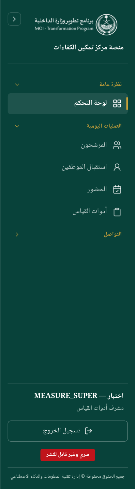

**شاشاتك:** لوحة التحكم · المرشحون · استقبال الموظفين · الحضور · أدوات القياس · المحادثات · الإشعارات.

#### يومك في المنصّة

**١ — استلام من أُسنِد إليك أو ردّه** *(شاشة استقبال الموظفين)*

1. افتح **استقبال الموظفين** من القائمة الجانبية، وتأكّد أن حقل التاريخ على اليوم.
2. انظر في قسم **المُسنَد إليّ اليوم**: لكل بطاقة رمز المشارك، واسم النشاط، و«وصل HH:MM».
3. للاستلام اضغط **استلام**.
4. للردّ اضغط **ردّ**، واكتب في «سبب الردّ» سبباً لا يقلّ عن ثلاثة أحرف، ثم اضغط **ردّ المرشح**.

بعد الاستلام تتحوّل البطاقة إلى **مُستلَم** ويظهر زرّ **السيرة الذاتية**، مع الرسالة «استُلم ‹الرمز›». وبعد الردّ تظهر «رُدّ المرشح وأُشعِرت العمليات»، ويصل السبب إشعاراً إلى كل من يملك صلاحية إعادة الإسناد. القرار الواحد لا يُعاد: بعد الاستلام أو الردّ يُقفَل الإسناد. وإن لم يُسنَد إليك أحد ظهر **لا مرشّح مُسنَد إليك اليوم** مع التلميح «سيصلك إشعار فور إسناد مرشّح إليك.».


**٢ — قراءة سيرة من استلمته** *(شاشة استقبال الموظفين)*

1. اضغط **السيرة الذاتية** في بطاقة موسومة **مُستلَم**.
2. اقرأها، ثم أغلق النافذة.

تُفتَح بلا اسم ولا رقم هوية ولا وسيلة تواصل، ويعلوها التنبيه «التقييم يتم بالرمز: اسم المرشح ورقم هويته محجوبان عن المقيّم.» وأي معرّف كتبه المرشّح داخل نصّ حرّ يُطمَس آلياً قبل العرض. وكل فتح للسيرة يُقيَّد في سجل التدقيق.

**٣ — تسجيل حضور جلسات اليوم** *(شاشة الحضور)*

1. افتح **الحضور**.
2. ابحث عن صفّ المشارك برمزه في عمود **الرمز**.
3. اضغط **حضور**.

تظهر «تم تسجيل حضور» متبوعةً برمز المشارك، وتصير الحالة «حاضر»، ويصير الإجراء «تم»، ويرتفع عدّاد **حاضر**. أنت — مع الاستقبال — تسجّل **أي جلسة** من جلسات اليوم لا جلساتك وحدها (`attendance.record_any`)، لأنك تستقبل من لا جلسة لك فيه.


لتسجيل غياب: اضغط **غياب**، وأبقِ **غياب بعذر** مؤشَّراً أو أزل التأشير، واكتب السبب في «سبب الغياب (اختياري)» — حدّه ٥٠٠ حرف — ثم **حفظ**.


**٤ — رفع نتيجة القياس** *(شاشة أدوات القياس)*

1. افتح **أدوات القياس**.
2. اضغط قائمة **المرشّح** واختر رمز المشارك — القائمة لا تعرض إلا من كانت حالته **مجدول** أو **مُقيّم**.
3. اكتب الدرجة في كل حقل من الثلاثة: **المقياس الشخصي** و**القدرات التحليلية** و**اللغة الإنجليزية** — من 0 إلى 100، وخطوة الإدخال 0.5.
4. اضغط **حفظ النتيجة**.

يظهر شريط أخضر **«تم حفظ نتيجة القياس»**، ويتحدّث سطر «آخر تحديث» إلى وقت الحفظ. والحفظ يستبدل نتيجة الدورة نفسها ولا يضيف سجلاً جديداً.

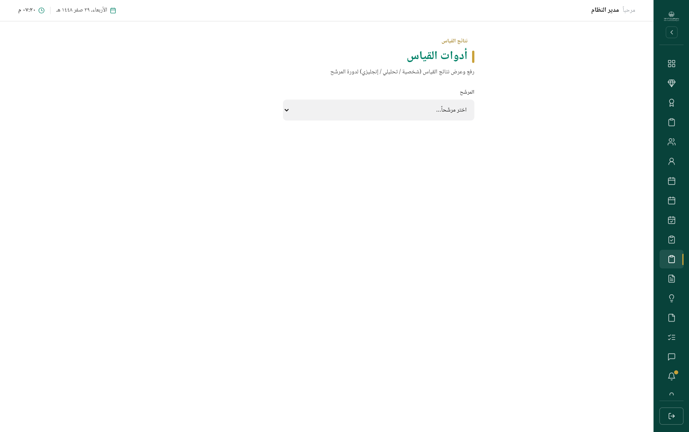

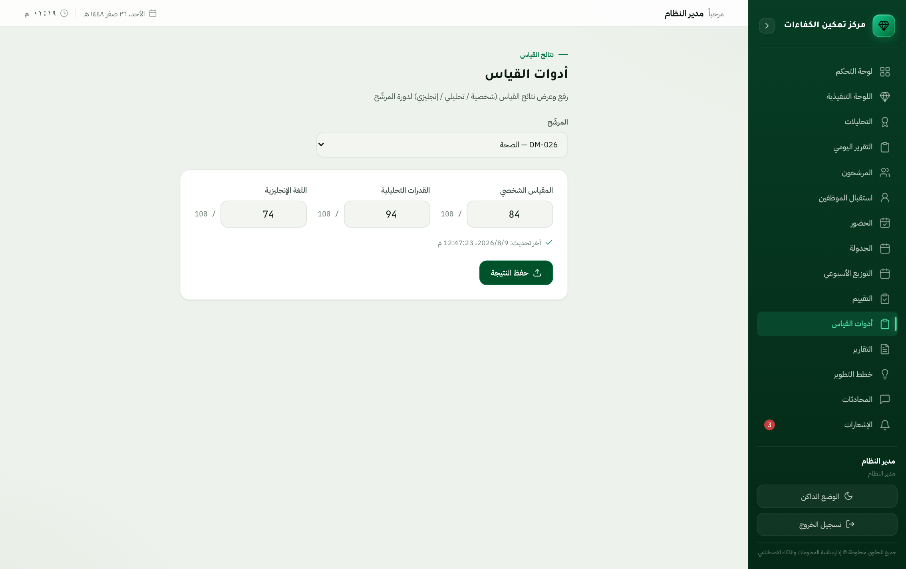

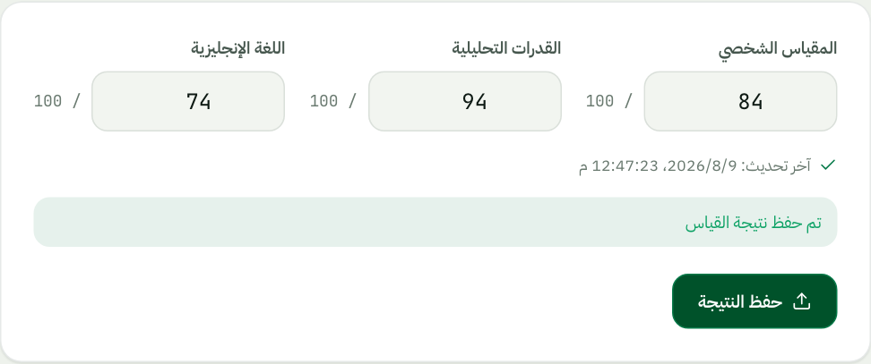

**٥ — رفع نتيجة جزئية ثم إكمالها** *(شاشة أدوات القياس)*

1. اختر المشارك.
2. اكتب الدرجات المتوفّرة فقط، واترك الحقل الذي لم تصل نتيجته **فارغاً**.
3. اضغط **حفظ النتيجة**.
4. عُد لاحقاً، واكتب الحقل الناقص، واضغط **حفظ النتيجة** من جديد.

الحقل الفارغ يُحفظ بلا قيمة ولا يُعدّ صفراً. وتبديل المشارك من القائمة يعيد تحميل الشاشة من الخادم ويمسح ما لم تحفظه ورسائل النجاح والخطأ — احفظ قبل أن تنتقل.

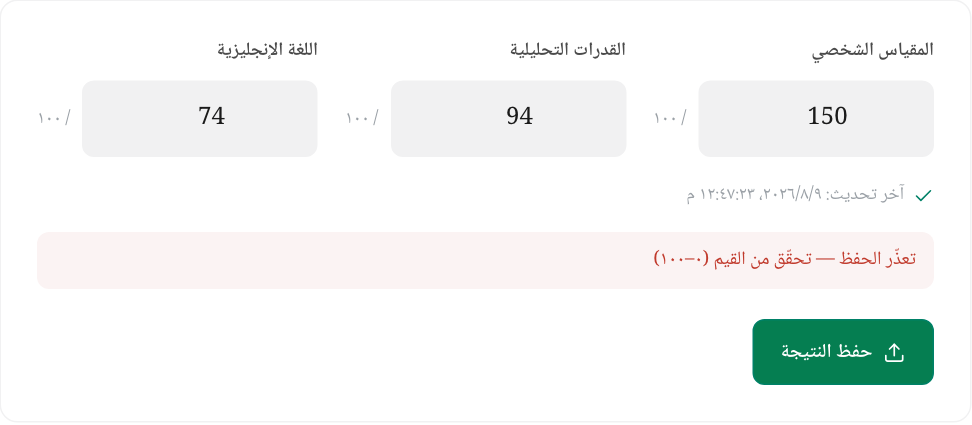

**٦ — التحقّق من رمز المشارك وحالته** *(شاشة المرشحون)*

1. افتح **المرشحون**.
2. اكتب الرمز في «بحث بالرمز...».
3. اقرأ الصفّ: القطاع، والرتبة، والفئة، والحالة.

البحث بالرمز وحده — لا بالاسم ولا بالهوية. وهذه أسرع طريقة للتأكّد من أن من أمامك هو صاحب الرمز الذي سترفع نتيجته.

**٧ — متابعة إشعاراتك**

1. افتح **الإشعارات**.
2. اضغط بطاقة الإشعار لقراءتها.

يصلك «مرشّح مُسنَد إليك: ‹الرمز›» عند كل إسناد، و«اعتُمد ورُحّل: ‹الرمز›» بعد اعتماد الزيارة وترحيل جلساتها، و«تذكير: جلسة غداً». والعدّاد بجانب **الإشعارات** في القائمة الجانبية يتحدّث كل دقيقة وعند كل تنقّل.

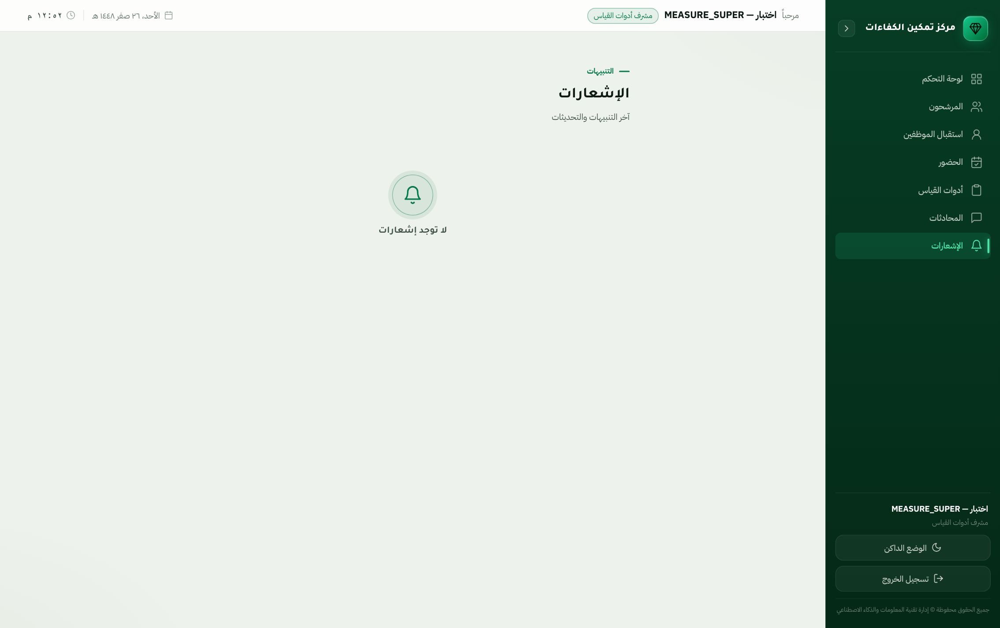

#### ما لا تستطيعه — ولماذا

| ما يمنعه النظام عنك | سببه التصميمي |
|---|---|
| تسجيل وصول مرشّح، أو تعديل وقت وصوله، أو أخذ توقيعه — لا تملك `reception.record` | هذه مرحلة الاستقبال. لكل مرحلة في مسار اليوم صلاحية مستقلّة: من يسجّل ليس من يوزّع، ومن يوزّع ليس من يقرّر |
| توزيع مرشّح على نشاط ومقيّم، أو سحب إسناد — لا تملك `reception.assign` | التوزيع للاستقبال والعمليات ومدير المركز والجدولة. أنت طرف القرار لا طرف الإسناد |
| **اعتماد وترحيل** الزيارة إلى الجدولة — لا تملك `reception.approve` | من يقرّر ليس من يعتمد. الاعتماد يُنشئ جلسات في الجدولة، فيبقى بيد من يملك الكشف كلّه |
| رؤية البطاقات الأربع وجدول «الحاضرون اليوم» وقائمة «المنتظَرون» | لا تظهر إلا لمن يدير الكشف (تسجيلاً أو إسناداً أو اعتماداً). شاشتك هي بطاقاتك أنت |
| البتّ في إسناد ليس إسنادك | صاحب الإسناد وحده يستلمه أو يردّه، وإسناد غيره يُعامَل كغير موجود فلا تُعلَم بوجوده أصلاً |
| فتح سيرة من لم تستلمه بعد | «استلم المرشّح أولاً لعرض سيرته» — القرار يقع على الرمز والنشاط، لا على محتوى سيرة يُطّلَع عليها ثم تُردّ |
| رؤية اسم المشارك أو رقم هويته في أي موضع من هذا المسار | القاعدة هنا إجرائية لا صلاحية: إتاحة الاسم لمن يقابل تفتح باباً لمعرفة من يقابل قبل أن يقابله |
| رؤية المشاركين المصنَّفين (سرّي / سرّي للغاية) | محجوبون عمّن لا يملك `candidate.view_classified` — لا في الصفوف ولا في العدد الكلّي، والمحاولة بالمعرّف تُردّ «المرشح غير موجود» ثم تُسجَّل |
| رفع قياس على دورة منتهية | الرفع يستهدف آخر دورة **غير مكتملة**؛ نتيجة الدورة المنتهية تبقى للقراءة ولا تُصحَّح بأثر رجعي |
| رفع قياس لمن ليس في دورة نشطة | القائمة لا تعرض إلا حالتَي **مجدول** و**مُقيّم**؛ من هو في «مسودة» أو «معتمد» أو «مكتمل» لا يظهر أصلاً |
| إدخال درجة خارج 0–100 | الخادم يتحقّق منها ويرفض ما خرج عن المدى قبل أن يمسّ القاعدة |
| فتح شاشة التقييم أو التقارير أو خطط التطوير | لا تملك `evaluation.view` ولا `report.view` ولا `development_plan.view`. أنت ترفع الدرجة، ولا تقرأ التقرير الذي تدخل فيه |
| استعمال المحادثات فعلياً | تملك `chat.view` بلا `report.view`، والمحادثة محادثة تقرير — فتفتح الشاشة وتجدها بلا تقارير. بوّابتان لا واحدة: الأولى تفتح الميزة والثانية تفتح محادثةً بعينها |
| إضافة مرشح أو تعديله أو اعتماده أو حذفه | أيقونتا **اعتماد** و**حذف** تظهران بحسب حالة الصفّ لا بحسب صلاحيتك، والمنع على الخادم: «ليس لديك صلاحية الاعتماد» |
| فتح الجدولة والتحليلات واللوحة التنفيذية والتقرير اليومي وسجل التدقيق | ليست في قائمتك، وكتابة رابطها يعيدك إلى **لوحة التحكم** |

#### إن واجهتك رسالة

| الرسالة | معناها | ما تفعله |
|---|---|---|
| «تعذّر الحفظ — تحقّق من القيم (0–100)» | إحدى الدرجات خارج المدى أو ليست رقماً | صحّح الحقل المخالف واحفظ. لم يُكتب شيء في القاعدة |
| «لا توجد دورة تقييم نشطة للمرشّح» | كل دورات المشارك مكتملة | لا يُرفع قياس على دورة منتهية. تُفتح له دورة جديدة أولاً |
| «المرشح غير موجود» | المشارك خارج تصنيفك المسموح، أو غير موجود | لا تتابع، ولا تُعِد المحاولة بالمعرّف. اطلب رفع نتيجته ممّن يملك رؤيته |
| «استلم المرشّح أولاً لعرض سيرته» | فتحت السيرة قبل الاستلام | اضغط **استلام** ثم افتح السيرة |
| «اذكر سبب الردّ — العمليات تبني عليه إعادة الإسناد» | حقل السبب فارغ أو أقصر من ثلاثة أحرف | اكتب سبباً واضحاً — حدّه الأعلى ٥٠٠ حرف |
| «لا يمكن تسجيل الحضور إلا لجلسات اليوم» | الجلسة ليست بتاريخ اليوم | الحضور يُسجَّل في يومه؛ وما فات يُعالَج بإعادة الجدولة |
| «بُتّ في هذا الإسناد من قبل» | استُلم أو رُدّ سابقاً | أعد تحميل الشاشة — القرار الواحد لا يُعاد |

### مدير إدارة التقييم

مدير إدارة التقييم هو مراجع مخرجات التقييم في المركز. لا يجلس في جلسة ولا يرصد درجة؛ عمله يبدأ حين تُرسَل التقييمات وتُكتب التقارير: يقرأ درجات المستشارين، ويكتب التقرير النهائي أو يعدّله، ويعتمد مرحلته في سلسلة الاعتماد ويتجاوز مرحلة المقيّم عند الحاجة، ثم يبني خطة التطوير الفردية من مجالات التطوير المكتوبة في التقرير. وهو واحد من خمسة أدوار تملك `candidate.view_names`، فيقرأ الأسماء داخل بطاقة التفاصيل حين يلزم التحقّق.

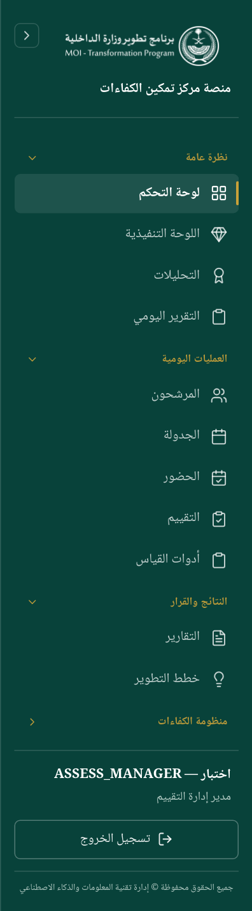

**شاشاتك:** لوحة التحكم · اللوحة التنفيذية · التحليلات · التقرير اليومي · المرشحون · الحضور · الجدولة · التقييم · أدوات القياس · التقارير · خطط التطوير · المحادثات · الإشعارات · إطار الكفاءات.

#### يومك في المنصّة

**١ — افتح لوحة التحكم واقرأ حجم اليوم** (شاشة: لوحة التحكم)

1. افتح **لوحة التحكم** من الشريط الجانبي.
2. اقرأ السطر أسفل التحية — يجمع جلسات اليوم وتقارير الانتظار في جملة واحدة.
3. اقرأ بطاقات المؤشرات الستّ، وتوقّف عند **معلّقة**.
4. اضغط بطاقة **معلّقة**.

النتيجة: تُفتح شاشة التقارير على مرشّح **بانتظار الاعتماد** مباشرةً — سلسلة الاعتماد كاملةً، لا الصفوف التي تبحث فيها. وارتفاع ▲ في **معلّقة** يُقرأ تحذيراً لا نجاحاً، ولذلك يُلوَّن بلون التحذير.

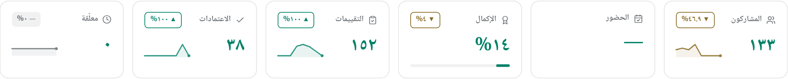

**٢ — راجع إشعاراتك** (شاشة: الإشعارات)

1. افتح **الإشعارات**.
2. اقرأ إشعارات نوع approval: «تقرير جديد بانتظار اعتمادك»، «تقرير بانتظار اعتمادك»، «تقرير معدّل بانتظار الاعتماد»، «تقرير متأخر بانتظار الاعتماد»، «تقييم بانتظار الاعتماد».
3. اضغط بطاقة الإشعار لتعليمه مقروءاً.

النتيجة: تختفي النقطة الخضراء وينقص الرقم الأحمر واحداً. الضغط لا ينقلك إلى الشاشة المعنيّة — افتحها بنفسك من القائمة الجانبية.


**٣ — اعتمد التقارير الواقفة عند مرحلتك** (شاشة: التقارير)

1. افتح **التقارير**، واضغط مرشّح **مدير التقييم** — بجانبه عدد التقارير الواقفة عندك.
2. اقرأ شارة الحالة على البطاقة والرقم الصغير داخلها (مثل `1/3`) — يُظهر كم بقي من السلسلة.
3. اضغط **مستند مفصّل** لمراجعة التقرير قبل قرارك.
4. ارجع واضغط **اعتماد**.

النتيجة: تظهر رسالة «تم اعتماد تقرير ‹رمز المشارك›»، وتتقدّم البطاقة إلى المرحلة التالية ويُشعَر صاحبها.

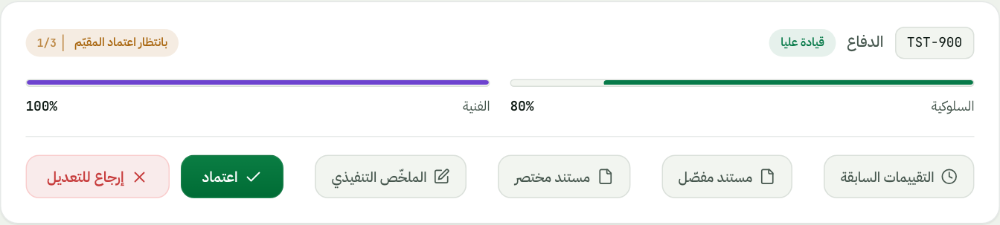

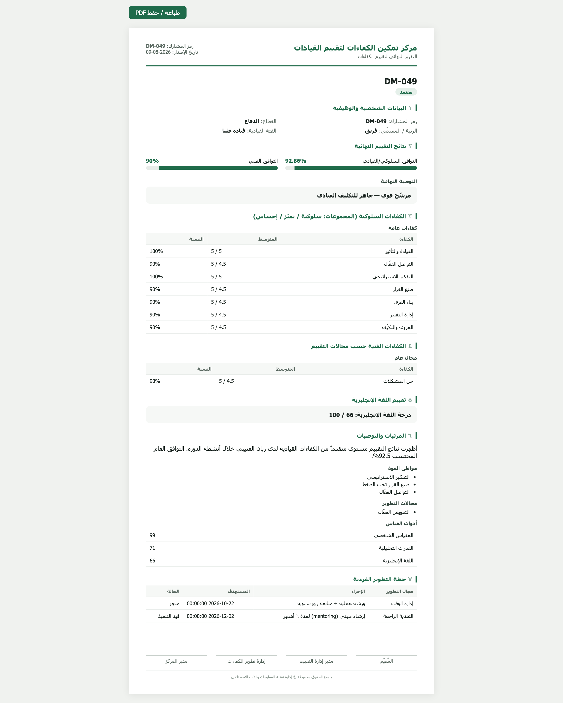

**٤ — تجاوز مرحلة المقيّم عند الحاجة** (شاشة: التقارير)

1. اضغط مرشّح **المقيّم**.
2. على التقرير الواقف عند المقيّم اضغط **اعتماد وتجاوز المقيّم**.

النتيجة: تُعتمد المرحلة ويُتخطّى المقيّم. التجاوز مسموح لطرف واحد فقط: من يملك المرحلة التالية مباشرةً، ولذلك يحمل الزرّ اسم المرحلة التي يتجاوزها. ولا يُسمح بتجاوز السلسلة كلها من أوّلها — ذلك نقضٌ لمعنى السلسلة. وقاعدة «من يكتب لا يعتمد» تُفحص عند التجاوز أيضاً، فلا يصير التخطّي باباً خلفياً يلتفّ عليها.

**٥ — اكتب التقرير النهائي** (شاشة: التقارير)

1. اضغط **إنشاء تقرير**.
2. اختر المشارك من قائمة «اختر مرشحاً منتهي التقييم…».
3. راجع لوحة **الاحتساب الآلي من الدرجات**: «سلوكي» و«فني» و«عام»، وعدد الكفاءات والتقييمات التي احتُسبت منها.
4. راجع لوحة **تحليل الفجوة** — تقارن كل كفاءة بالمستوى المستهدف لفئة المشارك.
5. عدّل «التوافق السلوكي (%)» و«التوافق الفني (%)» إن لزم، ثم اختر «التوصية».
6. اكتب «نظرة عامة»، وأضف بنود «نقاط القوة» و«مجالات التطوير» بزر **إضافة**.
7. اضغط **حفظ كمسودة** أو **حفظ وإرسال للاعتماد**.

النتيجة: تظهر «تم حفظ المسودة» أو «أُرسل التقرير للاعتماد»، وعند الإرسال يُشعَر صاحب المرحلة الأولى وحده. وانتبه: تقريرٌ كتبته أنت لا تعتمده أنت — يعتمده صاحب صلاحية أخرى في المرحلة نفسها.


**٦ — عدّل ما أُعيد للتعديل** (شاشة: التقارير)

1. اضغط مرشّح **مُعاد**.
2. اضغط **تعديل التقرير** — ويحقّ لك ذلك على تقارير غيرك أيضاً بصلاحية `report.edit_any`.
3. عدّل الحقول، ثم اضغط **حفظ وإرسال للاعتماد**.

النتيجة: التقرير المُعاد يعود بالإرسال إلى **أول** السلسلة لا إلى المرحلة التي أُعيد منها، فتُراجَع المراحل كلها من جديد. ولا زرّ منفصلاً لإعادة الإرسال. ولاحظ أنّ حقلَي التوافق في وضع التعديل يُحفظان كما تتركهما — لا يُعاد احتسابهما آلياً كما في الإنشاء.

**٧ — اقرأ سبب الإرجاع وناقش الكاتب** (شاشة: المحادثات)

1. افتح **المحادثات** واضغط بطاقة التقرير في قائمة «التقارير».
2. ابحث عن الفقاعة الوسطى في مجرى الرسائل: «أُعيد التقرير للتعديل. السبب: …».
3. اكتب ردّك في «اكتب رسالة...» واضغط **إرسال**.

النتيجة: تظهر رسالتك في آخر المحادثة، ويصل إشعار «رسالة جديدة من ‹اسمك›» إلى كل من سبق أن كتب في المحادثة نفسها. ومن لم يكتب فيها من قبل لا يصله شيء. الشاشة لا تُحدِّث نفسها تلقائياً — رسائل الآخرين تظهر عند إرسالك رسالة أو عند إعادة اختيار التقرير.


**٨ — ابنِ خطة التطوير الفردية وتابعها** (شاشة: خطط التطوير)

1. افتح **خطط التطوير** واختر رمز المشارك من قائمة **المرشّح**.
2. اضغط **توليد من التقرير**.
3. أضف ما ينقص يدوياً: اكتب **مجال التطوير \*** (إلزامي)، ثم **الإجراء / التوصية (اختياري)** وتاريخاً مستهدفاً، واضغط **إضافة**.
4. لمتابعة بند، اضغط قائمة حالته واختر **قيد التنفيذ** أو **مكتمل**.

النتيجة: يُنشأ بند بحالة «بالانتظار» لكل مجال تطوير في تقرير الدورة، والمجال المُدرَج سابقاً لا يتكرّر. وعند **مكتمل** يُسجَّل وقت الإكمال ويظهر وسم «اكتمل» ويُشطب عنوان البند.


**٩ — راجع درجات المشارك وأدوات قياسه قبل الحكم** (شاشتان: المرشحون، أدوات القياس)

1. افتح **المرشحون** واضغط أيقونة **تفاصيل** في صفّ المشارك.
2. انزل إلى **سجل دورات التقييم**: لكل دورة رمزها وحالتها وتاريخها، وتحتها تقييماتها (النشاط، وحالته: «مسودة» / «مُرسل» / «معتمد»، واسم المقيّم، ودرجات الكفاءات)، وسطر «التقرير — التوصية: …».
3. اضغط **رحلة المرشح** لقراءة الخط الزمني من الأقدم إلى الأحدث.
4. افتح **أدوات القياس** واختر الرمز نفسه لقراءة **المقياس الشخصي** و**القدرات التحليلية** و**اللغة الإنجليزية** وسطر «آخر تحديث».

النتيجة: تجتمع أمامك درجات الأنشطة ونتائج القياس قبل كتابة التقرير أو اعتماده. وفتح البيانات الشخصية يُكتب في سجل التدقيق باسمك (`VIEW_CANDIDATE_PII`).

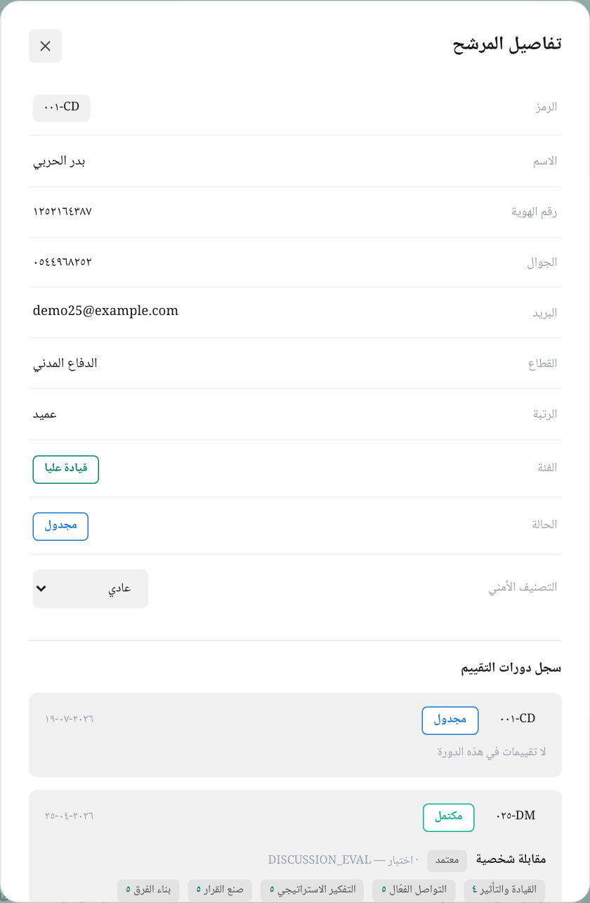


**١٠ — أغلق يومك بقراءة الاختناق** (شاشات: التحليلات، اللوحة التنفيذية، التقرير اليومي)

1. افتح **التحليلات** وانظر إلى بطاقة **حالة التقارير**: العمود الأطول بين **المقيّم** و**مدير التقييم** و**نهائي** هو المرحلة التي تتكدّس عندها التقارير.
2. اقرأ **فجوات الكفاءات (الأضعف أولاً)** — الأحمر دون ٦٠٪، والبرتقالي ٦٠–٨٠٪، والأخضر ٨٠٪ فأعلى.
3. افتح **اللوحة التنفيذية** واقرأ رؤيتَي **أولوية التطوير** و**اختناق الاعتماد**.
4. افتح **التقرير اليومي** وراجع **الغياب والأسباب** و**درجات اليوم**.

النتيجة: تعرف أين تقف التقارير، وأي الكفاءات أضعف، وما جرى في يوم المركز. ومتوسّطا التوافق يُحتسبان من التقارير المعتمدة وحدها — تقريرٌ ما زال في السلسلة لا يحرّك الرقم.

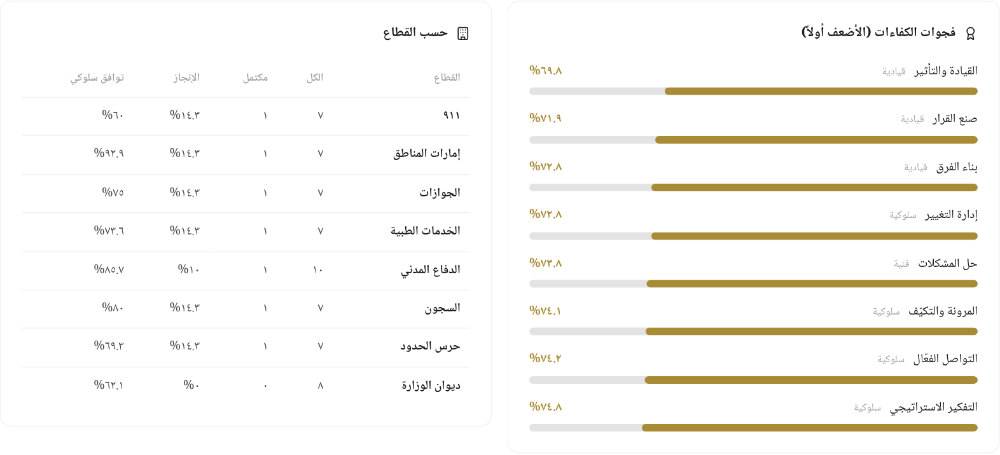

#### ما لا تستطيعه — ولماذا

| ما يمنعه النظام عنك | سببه التصميمي |
|---|---|
| بدء جلسة تقييم أو رصد درجة أو إرسالها — تفتح شاشة **التقييم** وتقرأ النموذج ولا تبدأ به جلسة | الرصد بـ`evaluation.input`، ولا يملكها إلا مدير النظام ومستشار المقابلة ومستشار حلقة النقاش. من يراجع الدرجات لا يرصدها؛ وسرّية الدرجات بين المستشار ومراجعه |
| **إرجاع للتعديل** — الزرّ لا يظهر لك | `report.return` لمدير المركز ومدير النظام وحدهما. كان موزّعاً على كل مرحلة فكان كلُّ معتمِدٍ يردّ التقرير خطوات للوراء |
| اعتماد تقرير كتبته بنفسك | مرحلة مدير إدارة التقييم مضبوطة على منع الكاتب من اعتماد ما كتبه — وتُفحص القاعدة عند التجاوز أيضاً |
| اعتماد تقرير كاتبه من خارج فريقك | المرحلة نفسها تشترط أن يكون الكاتب من فريق المعتمِد؛ وتقريرٌ بلا كاتب معروف لا يُنسب لفريق فلا يُعتمد بهذه القاعدة |
| كتابة **الملخّص التنفيذي** — تقرؤه ولا تحفظه، ويظهر لك «للعرض فقط — الكتابة بصلاحية مدير المركز.» | `report.exec_summary` بصلاحية مدير المركز |
| ظهور اسم المشارك في المستند المطبوع | `report.view_names` لمدير المركز ومدير النظام وحدهما. المستند يُطبع ويخرج من النظام، فحدّه أضيق من حدّ الشاشة |
| رفع نتائج **أدوات القياس** — الحقول معطّلة ومكان زرّ الحفظ سطر «عرض فقط — تحتاج صلاحية رفع القياس للتعديل.» | `measurement.upload` لمشرف أدوات القياس ومدير المركز ومدير النظام. فصلٌ مقصود: تقرأ القياس لأنه يدخل في التقرير، ولا ترفعه |
| إضافة كفاءة أو تعديلها في **إطار الكفاءات** — لا زرّ «إضافة كفاءة» ولا عمود التعديل | `competency.manage` لمدير المركز وإدارة تطوير الكفاءات. الإطار مرجع تقاريرك، وضبط الأوزان والمستويات المطلوبة ليس من عملك |
| **ربط الكفاءات** — لا يظهر في قائمتك أصلاً | الشاشة كلّها خلف `competency.manage`، ومن كتب رابطها يدوياً أُعيد إلى لوحة التحكم |
| إضافة مرشح أو تعديله أو اعتماده أو حذفه أو فتح دورة جديدة له | `candidate.create` و`candidate.edit` و`candidate.approve` لمسؤول الجدولة ومدير المركز ومدير النظام. أيقونتا «اعتماد» و«حذف» تتبعان حالة الصفّ لا صلاحيتك، والمنع يقع على الخادم |
| إنشاء جلسة أو تعديلها أو حذفها — ترى **الجدولة** بلا زرّ «جلسة جديدة» وبلا عمود الأزرار | `schedule.manage` لمسؤول الجدولة ومدير المركز ومدير النظام |
| تسجيل حضور أو غياب — ترى **الحضور** ولا تسجّل فيه | `attendance.record`. القاعدة: «الذي يستقبله يسجّله»؛ بلا هذا التمييز يسجّل من لم يرَ المشارك حضورَه |
| **إسناد لمجموعة** (أ / ب) | `roster.manage` لمسؤول الجدولة ومدير المركز ومدير النظام |
| **استقبال الموظفين** و**التوزيع الأسبوعي** — لا يظهران في قائمتك | `reception.view` و`schedule.distribute` ليستا لك؛ يوم التشغيل بيد الاستقبال والجدولة والعمليات |
| **سجل التدقيق** و**المستخدمون** و**الأدوار والصلاحيات** و**سير العمل** و**الإعدادات** | `audit.view` لمدير المركز ومدير النظام، وما بقي لمدير النظام وحده |

#### إن واجهتك رسالة

| الرسالة | معناها | ما تفعله |
|---|---|---|
| «ليس لديك صلاحية إدخال التقييم» | فتحت شاشة التقييم وحاولت بدء جلسة أو رصد درجة | الرصد لمستشار المقابلة ومستشار حلقة النقاش. راجع الدرجات من سجل دورات المشارك |
| «لا يمكنك اعتماد تقرير كتبته بنفسك — يعتمده صاحب صلاحية أخرى» | التقرير الواقف عند مرحلتك كتبته أنت | أحِل الاعتماد إلى صاحب صلاحية أخرى في المرحلة نفسها |
| «هذا التقرير كتبه من ليس ضمن فريقك» | مرحلتك تشترط أن يكون الكاتب من فريقك | يعتمده مدير الكاتب |
| «ليس لديك صلاحية اعتماد هذه المرحلة» | التقرير واقف عند مرحلة لا تملك صلاحيتها | اترك الاعتماد لصاحب المرحلة؛ زرّ الاعتماد لا يظهر إلا لصاحب المرحلة التي يقف عندها التقرير |
| «تغيّرت حالة التقرير — أعد التحميل» | غيّر مستخدم آخر حالة التقرير أثناء عملك | أعد تحميل الشاشة ثم كرّر الإجراء إن كان لا يزال لازماً |
| «ليس لديك صلاحية رفع القياس» | حاولت الحفظ في أدوات القياس | الرفع لمشرف أدوات القياس أو مدير المركز |


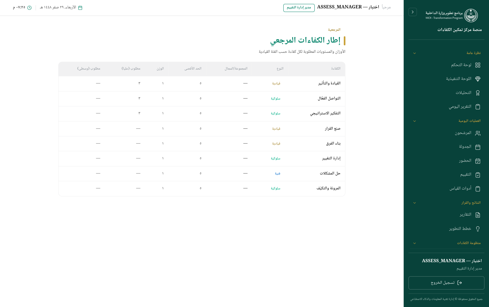

---

### إدارة تطوير الكفاءات

إدارة تطوير الكفاءات هي المرجعية المنهجية للمركز والمحطة قبل الأخيرة في سلسلة اعتماد التقارير. تملك وحدها مع مدير المركز ومدير النظام تعريف الكفاءات وأوزانها ومستوياتها المطلوبة، وربطها بالأنشطة التي تُرصد فيها — أي أنّها تضبط المسطرة التي يُقاس بها كل مشارك. ثم تعتمد المرحلة **نهائي** في التقارير، وتقرأ التحليلات والفجوات لتحديد أولويات التطوير المؤسسي. لا تملك `candidate.view_names`، فعملها كلّه على الرموز والأرقام والكفاءات لا على الأشخاص.

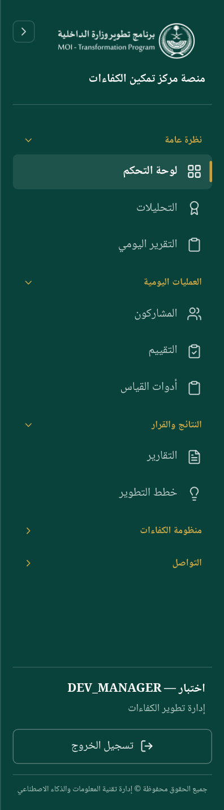

**شاشاتك:** لوحة التحكم · اللوحة التنفيذية · التحليلات · التقرير اليومي · المرشحون · التقييم · أدوات القياس · التقارير · خطط التطوير · المحادثات · الإشعارات · إطار الكفاءات · ربط الكفاءات.

#### يومك في المنصّة

**١ — افتح لوحة التحكم والإشعارات** (شاشتان: لوحة التحكم، الإشعارات)

1. افتح **لوحة التحكم** واقرأ مقياس **جاهزية القيادة** والبطاقات الستّ.
2. اضغط بطاقة **معلّقة** للوصول إلى التقارير الواقفة في السلسلة.
3. افتح **الإشعارات** واقرأ ما نوعه approval: «تقرير جديد بانتظار اعتمادك» و«تقرير متأخر بانتظار الاعتماد».

النتيجة: تعرف قبل أي شاشة أخرى كم تقريراً ينتظرك وما تأخّر منه. وبطاقتا **أحدث النشاط** و**تهيئة المنصّة** لا تظهران لك — الأولى لحاملي `audit.view` والثانية لحاملي `settings.manage`.

**٢ — اعتمد التقارير الواقفة عند مرحلتك** (شاشة: التقارير)

1. افتح **التقارير** واضغط مرشّح **نهائي** — بجانبه عدد التقارير الواقفة عندك.
2. اضغط **مستند مفصّل** لمراجعة التقرير كاملاً قبل قرارك؛ وهو سبعة أقسام مرقّمة آخرها خطة التطوير الفردية، وفي ذيله أربعة مواضع توقيع: المُقيّم، ومدير إدارة التقييم، وإدارة تطوير الكفاءات، ومدير المركز.
3. اضغط **التقييمات السابقة** إن أردت مقارنة الدورة بما قبلها.
4. اضغط **اعتماد نهائي**.

النتيجة: تُنهى مرحلتك. وسلسلة الاعتماد في هذا التنصيب أربع مراحل آخرها اعتماد مدير المركز، فالتقرير بعد اعتمادك يظهر برمز `pending_center`، ويبقى محسوباً في مؤشّر **بانتظار** وضمن مرشّح **بانتظار الاعتماد**، ولا يظهر له زرّ اعتماد في هذه الشاشة. وعند آخر مرحلة تصير الحالة **معتمد** وتصير حالة المشارك «مكتمل» فتُتاح له دورة تقييم جديدة.


**٣ — اقرأ الصورة المؤسسية وحدّد أولويات التطوير** (شاشتان: اللوحة التنفيذية، التحليلات)

1. افتح **اللوحة التنفيذية** واقرأ البطاقات الأربع؛ ومرّر المؤشر فوق شارة النسبة لترى تلميح «مقارنة بالفترة السابقة».
2. اقرأ **رؤى تلقائية**، وابدأ من **أولوية التطوير** و**اختناق الاعتماد** — هما البطاقتان اللتان تقودان إلى إجراء.
3. انظر إلى **خريطة إتقان الكفاءات × القطاع**؛ الخانات الفاتحة نقاط ضعف والداكنة نقاط قوة، ومرّر المؤشر فوق أي خانة لترى «الكفاءة — القطاع: النسبة (عدد العيّنات)».
4. انتقل إلى **التحليلات** واقرأ **فجوات الكفاءات (الأضعف أولاً)** من أعلاها.

النتيجة: قائمة أولويات تطوير مؤسسية بالكفاءة وبالقطاع معاً. ورؤيتا «أقوى كفاءة مؤسسياً» و«أولوية التطوير» لا تظهران لكفاءة درجاتها أقل من ثلاث — عتبة عيّنة تمنع استنتاجاً مؤسسياً من درجةٍ واحدة.


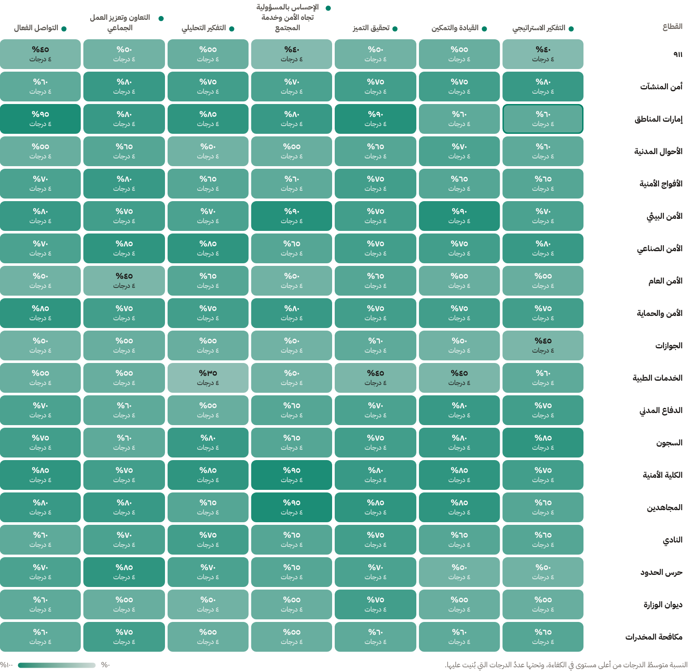

**٤ — عدّل إطار الكفاءات على ضوء ما قرأت** (شاشة: إطار الكفاءات)

1. افتح **إطار الكفاءات**.
2. لتعديل كفاءة قائمة اضغط أيقونة **تعديل** في صفّها، واضبط **الحد الأقصى** و**الوزن** و**مطلوب — قيادة عليا** و**مطلوب — قيادة وسطى**، ثم اضغط **حفظ**.
3. لإضافة كفاءة اضغط **إضافة كفاءة**، واكتب **الاسم**، واختر **النوع** (سلوكية / قيادية / فنية)، وأكمل بقية الحقول، ثم اضغط **حفظ**.
4. لإلغاء مستوى مطلوب، امسح محتوى حقله واحفظ.

النتيجة: تُغلق النافذة ويُعاد تحميل الجدول بالقيم الجديدة، وتظهر الكفاءة الجديدة في آخره. ويظهر «—» مكان المستوى الملغى. لاحظ أن **النوع** لا يظهر في نافذة التعديل: نوع الكفاءة يُثبَّت عند إنشائها لأنه يحكم موضعها في الرصد والتحليل.

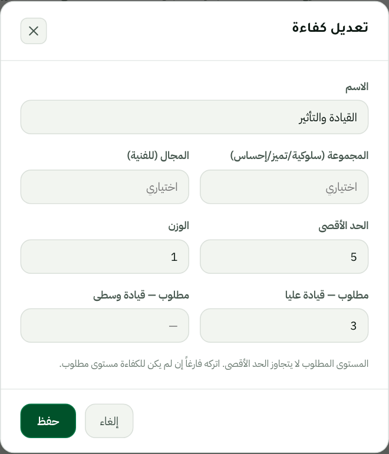

**٥ — اربط الكفاءات بالأنشطة** (شاشة: ربط الكفاءات)

1. افتح **ربط الكفاءات**.
2. في بطاقة **مقابلة شخصية** أو **حلقة نقاش** أشّر مربّع كل كفاءة تريد رصدها في ذلك النشاط.
3. راقب عدّاد «{n} كفاءة» في رأس البطاقة — يتحدّث فوراً قبل الحفظ.
4. اضغط **حفظ** في البطاقة نفسها.

النتيجة: يظهر «تم حفظ كفاءات المقابلة الشخصية ✓» أو «تم حفظ كفاءات حلقة النقاش ✓»، ويسري التغيير على شاشة التقييم مباشرة. وانتبه إلى أمرين: كل بطاقة تُحفظ على حدة — حفظ بطاقة المقابلة لا يحفظ ما غيّرته في بطاقة حلقة النقاش؛ والحفظ **استبدال كامل** لا إضافة تراكمية، فما لم يُؤشَّر يُفكّ ربطه.

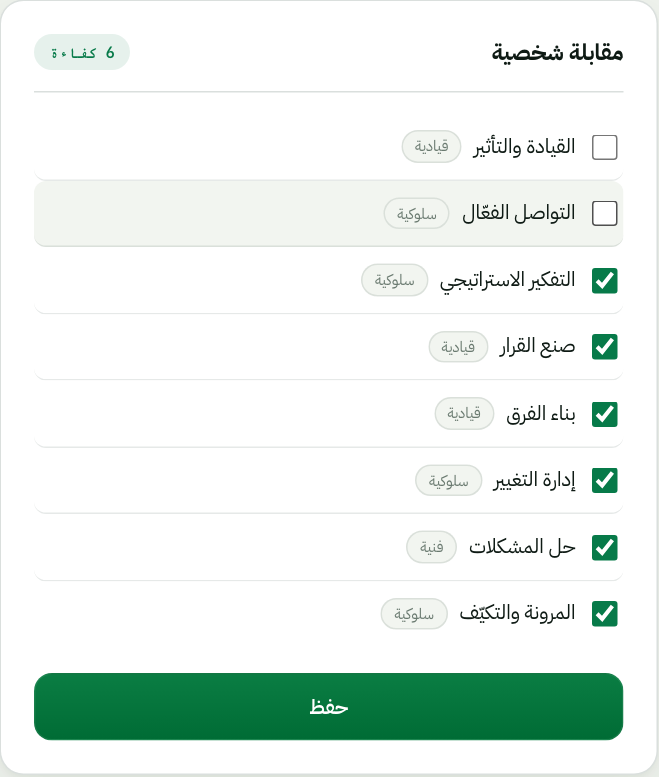

**٦ — تابع أثر ما ضبطته على المشاركين** (شاشات: خطط التطوير، أدوات القياس، المرشحون)

1. افتح **خطط التطوير** واختر رمز المشارك؛ اقرأ ملخّص «{n} بند · {n} مكتمل» وبنود دورته الأخيرة.
2. افتح **أدوات القياس** واختر الرمز نفسه لقراءة درجاته الثلاث وسطر «آخر تحديث».
3. افتح **المرشحون** واضغط **تفاصيل** ثم **رحلة المرشح** لقراءة الخط الزمني من «أُضيف المرشح إلى النظام» إلى «اعتُمد التقرير نهائياً».

النتيجة: تقرأ مسار المشارك كاملاً بالرمز. الشاشات الثلاث للقراءة فقط بحسابك: قائمة حالة البند معطّلة ولا زرّ حذف ولا بطاقة إضافة ولا زرّ توليد، وحقول القياس معطّلة، وبطاقة التفاصيل تقول «ليس لديك صلاحية عرض البيانات الشخصية.».

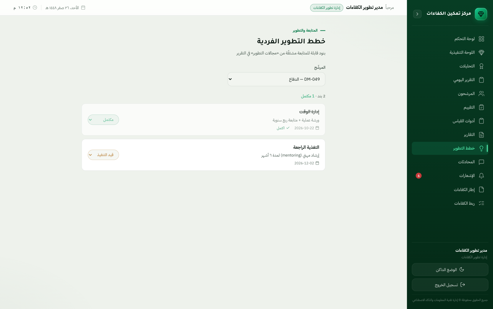


**٧ — اقرأ يوم المركز وناقش ما يحتاج نقاشاً** (شاشتان: التقرير اليومي، المحادثات)

1. افتح **التقرير اليومي**؛ يفتح على تاريخ اليوم، ولتغييره اضغط حقل التاريخ واختر اليوم المطلوب — لا يوجد زرّ بحث.
2. انزل إلى **درجات اليوم** واقرأ عمودَي **المتوسط** و**الكفاءات**، ثم انتقل إلى **حالة التقارير**.
3. اضغط **طباعة** لإخراج المستند الرسمي في تبويب جديد.
4. افتح **المحادثات** واضغط بطاقة التقرير لقراءة سبب إرجاعه أو لكتابة ملاحظتك.

النتيجة: تُعاد الأقسام لذلك اليوم فوراً. و«درجات اليوم» صفٌّ لكل جلسة تقييم لا لكل مشارك، فقد يتكرّر الرمز نفسه إن قُيّم في أكثر من جلسة. و«حالة التقارير» تعرض ما أُنشئ أو تحرّك في ذلك اليوم لا كل التقارير.

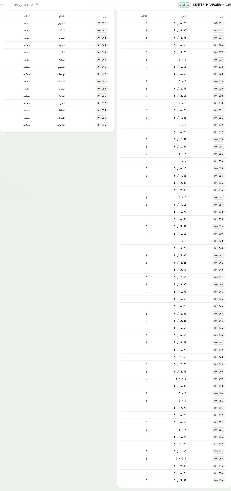

**٨ — أخرِج نسخة للعرض القيادي** (شاشتان: اللوحة التنفيذية، التقارير)

1. في **اللوحة التنفيذية** اختر نافذة الاتجاه: **آخر ٣ أشهر** أو **آخر ٦ أشهر** (الافتراضي) أو **آخر سنة** أو **آخر سنتين**.
2. اضغط **تصدير PDF**، ثم اختر «حفظ بصيغة PDF» في نافذة الطباعة.
3. في **التقارير** اضبط المرشّحات ثم اضغط **تصدير CSV**.

النتيجة: صفحة تحوي اللوحة وحدها بترويسة «اللوحة التنفيذية — مركز تمكين الكفاءات» وتاريخ اليوم، وملف `reports.csv` بالأعمدة: الرمز، القطاع، الفئة، الحالة، التوافق السلوكي، التوافق الفني، التوصية. الملف محصور بنطاقك نفسه — التصدير لا يكشف ما تُخفيه الشاشة. وتغيير نافذة الاتجاه يعيد رسم **الاتجاه الشهري** وحده؛ أمّا المؤشرات والخريطة ومقارنة القطاعات فلا تتأثّر بها.


#### ما لا تستطيعه — ولماذا

| ما يمنعه النظام عنك | سببه التصميمي |
|---|---|
| **إنشاء تقرير** — الزرّ لا يظهر لك، ولا **تعديل التقرير** على مسودة غيرك | `report.create` و`report.edit_any` ليستا لك. السلسلة مبنية على فصل من يكتب عمّن يعتمد، وأنت تملك المرحلة قبل الأخيرة فيها |
| **إرجاع للتعديل** | `report.return` لمدير المركز ومدير النظام وحدهما. كان موزّعاً على كل مرحلة فكان كلُّ معتمِدٍ يردّ التقرير خطوات للوراء |
| كتابة **الملخّص التنفيذي** — يظهر لك «للعرض فقط — الكتابة بصلاحية مدير المركز.» بلا زرّ حفظ | `report.exec_summary` بصلاحية مدير المركز |
| قراءة اسم المشارك أو رقم هويته في أي موضع — بطاقة التفاصيل تقول «ليس لديك صلاحية عرض البيانات الشخصية.»، والسيرة تُعرض مطموسة «•••»، والتصدير يخرج «(رموز فقط)» | لا تملك `candidate.view_names`. الأسماء المكشوفة لا تحتاجها أي مهمّة في عملك — والمنصّة كلها تعمل بالرمز والقطاع |
| إدارة بنود خطة التطوير: التوليد والإضافة وتغيير الحالة والحذف | الشاشة تُفتح بـ`development_plan.view`، والكتابة فيها بـ`report.create`. تقرأ الخطة لأنها مخرج تطويري، ولا تكتبها |
| رفع نتائج **أدوات القياس** — الحقول معطّلة ومكان زرّ الحفظ سطر «عرض فقط — تحتاج صلاحية رفع القياس للتعديل.» | `measurement.upload` لمشرف أدوات القياس ومدير المركز ومدير النظام. تقرأ القياس لأنه يدخل في التقرير، ولا ترفعه |
| بدء جلسة تقييم أو رصد درجة | `evaluation.input` لمدير النظام ومستشار المقابلة ومستشار حلقة النقاش. من يعرّف الكفاءات لا يرصد عليها |
| **الحضور** و**الجدولة** و**استقبال الموظفين** و**التوزيع الأسبوعي** — لا تظهر في قائمتك | لا تملك `attendance.view` ولا `schedule.view` ولا `reception.view` ولا `schedule.distribute`. يوم التشغيل بيد الاستقبال والجدولة والعمليات، وعملك على مخرجاته لا على مجرياته |
| **كشف الحضور** في شاشة المرشحين | الزرّ لحاملي `schedule.view` |
| إضافة مرشح أو تعديله أو اعتماده أو حذفه، وتغيير تصنيفه الأمني | `candidate.create` و`candidate.edit` و`candidate.approve` لمسؤول الجدولة ومدير المركز ومدير النظام. وتعيين التصنيف يقتضي `candidate.view_classified` — وهي عندك للقراءة، لا لتصير الإضافة باباً لإخفاء مرشّح عن غيره |
| حذف كفاءة من الإطار — لا مسار حذف أصلاً | الكفاءة مرتبطة بدرجات مرصودة وتقارير معتمدة، فحذفها يُيتّمها. إن استُغني عنها فأزِل ربطها بالأنشطة من **ربط الكفاءات** |
| تعديل **النوع** بعد إنشاء الكفاءة | نوع الكفاءة يحكم موضعها في الرصد والتحليل، وتبديله بأثر رجعي يغيّر معنى درجات مرصودة سلفاً |
| فكّ ربط كفاءة عن نشاطٍ له تقييمات جارية | التقييم الجاري مرصود على قائمة الكفاءات القائمة، وسحبُ كفاءة من تحته يُيتّم درجاتها أو يُفشل إرساله. **الإضافة تبقى مسموحة دائماً** لأنها لا تكسر شيئاً مرصوداً |
| **سجل التدقيق** و**المستخدمون** و**الأدوار والصلاحيات** و**سير العمل** و**الإعدادات** | `audit.view` لمدير المركز ومدير النظام، وما بقي لمدير النظام وحده |

#### إن واجهتك رسالة

| الرسالة | معناها | ما تفعله |
|---|---|---|
| «لا يمكن حذف/تبديل كفاءات نشاط له تقييمات نشطة قيد التنفيذ (الإضافة فقط مسموحة)» | أزلت كفاءة أو استبدلتها بينما للنشاط تقييم واحد على الأقل بحالة «مسودة» أو «مُرسَل» | أعد التأشير كما كان. لم يتغيّر شيء في القاعدة. أنهِ اعتماد التقييمات الجارية أوّلاً، أو اكتفِ بالإضافة الآن |
| «تحقّق من الحقول: المستوى المطلوب لا يتجاوز الحد الأقصى» | مستوى مطلوب أكبر من الحد الأقصى للكفاءة، أو قيمة خارج المدى (الحد الأقصى ١–١٠، والوزن ٠–١٠) | صحّح الرقم واحفظ. لم يُكتب شيء في القاعدة |
| «ليس لديك صلاحية اعتماد هذه المرحلة» | التقرير واقف عند مرحلة غير مرحلتك | اترك الاعتماد لصاحب المرحلة؛ زرّ الاعتماد لا يظهر إلا لصاحب المرحلة التي يقف عندها التقرير |
| «ليس لديك صلاحية إدارة خطة التطوير» | حاولت الإضافة أو التعديل أو الحذف أو التوليد في خطط التطوير | الإدارة لمن يملك «كتابة تقرير»: مدير المركز أو مدير إدارة التقييم أو مساعد التقييم |
| «تغيّرت حالة التقرير — أعد التحميل» | غيّر مستخدم آخر حالة التقرير أثناء عملك | أعد تحميل الشاشة ثم كرّر الاعتماد إن كان لا يزال لازماً |
| «لا توجد درجات تقييم كافية بعد لبناء الخريطة.» | لا تقييمات مُرسَلة أو معتمدة ضمن تصنيفاتك | لا شيء — تُبنى الخريطة بعد أول تقييم يُرسَل |


---

## ٦. المسارات الكاملة خطوة بخطوة

ثلاثة مسارات تعبر عدّة شاشات وعدّة أدوار. من نفّذها كما هي هنا أنجز دورة المرشّح كاملة.

### من ترشيح مرشّح جديد إلى جدولته ودعوته

يبدأ المسار بإدخال مرشّح لم يُسجَّل من قبل، وينتهي بتأكيد المشارك بياناته ومواعيده من بوّابته الخاصة.

| المرحلة | مَن ينفّذها | الشاشة | الصلاحية |
|---|---|---|---|
| ١ — إدخال الترشيح وتوليد الرمز | المستخدم الخارجي (إضافة مرشحين)، أو مسؤول الجدولة، أو مدير النظام | **ترشيح مشارك** `/nominate` — أو **المرشحون** ← **إضافة مرشح** | `candidate.create` |
| ٢ — اعتماد الترشيح | مدير النظام، مدير المركز، مسؤول الجدولة | **المرشحون** | `candidate.approve` |
| ٣ — الجدولة وتعيين مستشار المقابلة | مدير النظام، مدير المركز، مسؤول الجدولة | **الجدولة** | `schedule.manage` |
| ٤ — الدعوة: رسالة التأكيد ورابطها | النظام آلياً لحظة إنشاء الدورة؛ وإعداد البوّابة بيد مدير النظام | تُجدوَل من شاشة الإدخال — والبوّابة تُضبط في **الإعدادات** ← «بوّابة الرسائل النصية» | لا صلاحية للإرسال؛ `settings.manage` لضبط البوّابة |
| ٥ — تأكيد المشارك لبياناته | المشارك نفسه | **بوّابة المشارك** `/confirm/<رمز الرابط>` | لا شيء — يحرسها رقم الهوية |

#### ١ — إدخال الترشيح وتوليد الرمز

**أ) من الجهة الخارجية**

المستخدم الخارجي يملك الإضافة ولا يملك القراءة، فيُنزَل على شاشة **ترشيح مشارك** مباشرةً بعد تسجيل الدخول. قائمته الجانبية ثلاثة روابط لا غير: **لوحة التحكم**، و**ترشيح مشارك**، و**الإشعارات**.


1. عبّئ خانات **بيانات المشارك** الإلزامية كلها: الاسم رباعياً، ورقم الهوية، وتاريخ الميلاد، والرتبة / المرتبة الحالية، وتاريخ التعيين، والقطاع، والمنطقة، والجهة / الشعبة / الإدارة العامة.
2. أدخِل تاريخ الميلاد بالميلادي أو بالهجري — الخانة الأخرى تُملأ وحدها، ويظهر **العمر** محسوباً.
3. أدخِل **الجوال** بصيغة تبدأ بـ 05 وتتكوّن من ١٠ أرقام. هذا الرقم هو ما تصله رسالة التأكيد ورابطها؛ وبدونه لا تُجدوَل رسالة.
4. أضِف ما يلزم بأزرار **إضافة مؤهل** و**إضافة خبرة** و**إضافة دورة**. الصفّ الذي لم يُلمس يُسقَط بصمت.
5. اضغط **إرسال الترشيح**.

إن نقص شيء لم يُرسَل شيء: يظهر شريط أحمر أعلى الشاشة برسالة أول نقص، وتُلوَّن حدود كل خانة ناقصة بالأحمر.


وعند القبول يُطوى النموذج ويحلّ محلّه إيصال **تم استلام الترشيح** فيه: **رمز المشارك** وبجانبه زرّ **نسخ**، ووسم الفئة القيادية (**قيادة عليا** أو **قيادة وسطى**)، ووسم **حُفظ نموذج السيرة** إن رافقت السيرةُ الترشيحَ، ووسم **جُدولت رسالة تأكيد للمشارك** إن كان له جوال مسجَّل.

**ب) من مسؤول الجدولة أو مدير النظام**

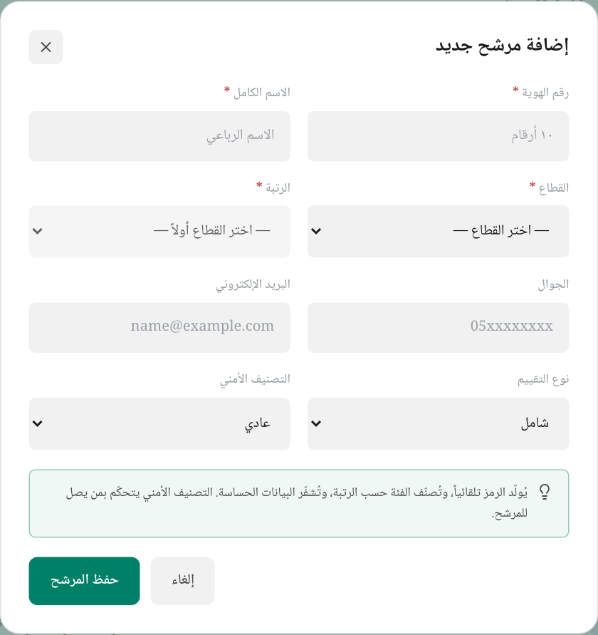

1. افتح **المرشحون** واضغط **إضافة مرشح**.
2. أدخل **رقم الهوية** — عشرة أرقام تبدأ بـ١ للمواطن أو ٢ للمقيم.
3. أدخل **الاسم الكامل** رباعياً، ثم اختر **القطاع** — واختياره يفتح قائمة **الرتبة** (عسكري) أو **المرتبة** (مدني).
4. أدخل **الجوال** بصيغة `05xxxxxxxx` و**البريد الإلكتروني** إن وُجدا.
5. اختر **نوع التقييم**: «شامل» أو «تنفيذي»، و**التصنيف الأمني**: «عادي» أو «سرّي» أو «سرّي للغاية».
6. اضغط **حفظ المرشح**.

تظهر بطاقة «تمت إضافة المرشح» تحمل **رمز المشارك** وزرّ **نسخ**، وفئة القيادة، وسطر حالة الرسالة: «جُدولت رسالة تأكيد للمرشح» أو «تعذّرت جدولة رسالة التأكيد» أو «لا جوّال مسجّل — لم تُجدول رسالة».

الرمز يُولَّد هنا لا عند الجدولة: يُبنى تلقائياً من بادئة القطاع لحظة حفظ الترشيح، ومعه دورة تقييم بحالة **مسودة** ورمز رابط فريد لهذه الدورة. لا تُدخِل الرمز يدوياً. والفئة القيادية تُحسب من الرتبة.

**يتوقّف المسار إن:** كانت الهوية مسجَّلة لمشارك قائم. من لا يملك `candidate.edit` — والمستخدم الخارجي منهم — يُردّ عليه «هذا المرشح مُضاف مسبقاً في النظام» مع تاريخ التسجيل وحده، بلا رمز ولا اسم ولا حالة، ويُفتح له طريق **طلب تحديث بيانات المشارك**. الكتابة فوق سجلٍّ قائم تعديلٌ لا إضافة، وبدون هذا المنع كان صاحب صلاحية الإضافة وحدها يعيد تسمية أي مشارك وينقله بين القطاعات. ويتوقّف المسار كذلك إن لم يجتز رقم الهوية التحقّق الحسابي («رقم الهوية غير صحيح (فشل التحقق)»)، أو حوت السيرة اسم المشارك أو رقم هويته أو جواله أو بريده («السيرة تحوي اسم المرشح أو معرّفاً — أزِله») — لأن هذه الوثيقة نفسها تصل المقيّم بلا اسم.


#### ٢ — اعتماد الترشيح

الترشيح يدخل بحالة **مسودة**، ولا يُجدوَل قبل اعتماده.


1. افتح **المرشحون**.
2. من مُرشِّح **كل الحالات** اختر «مسودة» لتحصر القائمة على المنتظِرين.
3. ابحث عن الصفّ برمزه في «بحث بالرمز...» — الجدول رموز لا أسماء لكل الأدوار، والبحث بالرمز وحده.
4. اضغط أيقونة **تفاصيل** لقراءة بطاقته قبل القرار (الاسم يظهر لحامل `candidate.view_names` وحده، وفتحه يُدوَّن في سجل التدقيق).
5. اضغط أيقونة **اعتماد** (✓) في صفّه.

النتيجة: «تم اعتماد <الرمز>»، وتصير الحالة **مجدول**، وتُزامَن معها دورة التقييم الحالية.

**يتوقّف المسار إن:** كانت حالة الصفّ ليست «مسودة» — يردّ الخادم «لا يمكن اعتماد مرشح غادر حالة المسودة»، لئلا يُعيد اعتمادٌ متأخّر دورةً مكتملة إلى «مجدول». وإن كان الحساب بلا `candidate.approve` رُدّ بـ«ليس لديك صلاحية الاعتماد» — وإخفاء الأيقونة في الشاشة راحة لا حماية، فالمنع مطبَّق على الخادم أيضاً. وإن كان المشارك مصنَّفاً أمنياً أو خارج قطاعك رُدّ بـ«المرشح غير موجود»: الردّ لا يفرّق بين «غير موجود» و«ليس لك»، كي لا يصير المعرّف أداةً لكشف من هو مسجَّل.

#### ٣ — الجدولة وتعيين مستشار المقابلة


1. افتح **الجدولة** واضغط **جلسة جديدة**.
2. اختر المشارك من قائمة **المرشّح** — تُعرض بصيغة «الرمز — القطاع»، ولا تضمّ إلا المعتمدين للتقييم.
3. اختر **النشاط**: المقابلة الشخصية / حلقة النقاش / أدوات القياس / التمرين التكاملي.
4. للمقابلة الشخصية: اضغط **استعراض السيرة الذاتية** لقراءة منصبه وسنوات خبرته ونبذته ومؤهلاته وخبراته، ثم اختر الاسم من قائمة **مستشار المقابلة**. القائمة مبنيّة من مقيّمي **قطاع المشارك** الفعّالين وحدهم، ومعها الخيار **— بلا تعيين —**.
5. اختر **التاريخ**، ثم **الوقت**، واكتب **المكان** إن وُجد.
6. اضغط **إنشاء**.

تُغلق النافذة وتظهر الجلسة في الجدول بحالة حضور **بالانتظار**، ويظهر اسم المستشار في عمود **المُقيّم**.


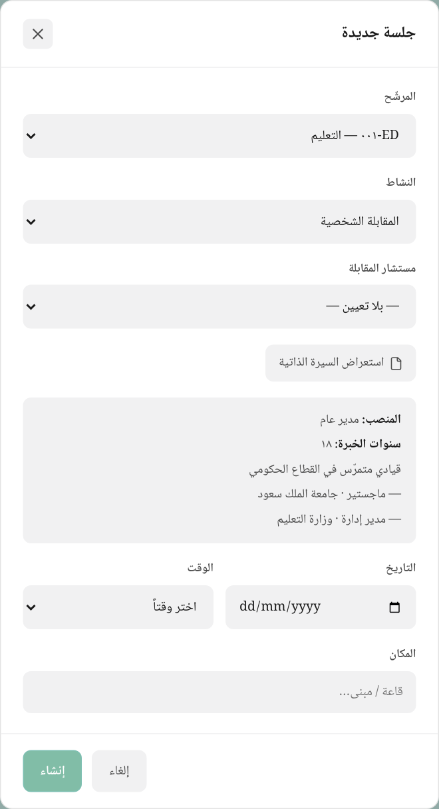

كرّر الخطوات لكل نشاط في برنامج المشارك. ولجدولة أسبوع كامل دفعةً واحدة يُستعمل **التوزيع الأسبوعي** (`schedule.distribute`): يقترح توزيع الجاهزين على مستشاري المقابلة بحدٍّ يومي لكل مستشار، ثم **اعتماد وإنشاء الجلسات** يُنشئ جلسات المقابلات فتظهر فوراً في شاشة **الجدولة** — وهذه الجلسات تُنشأ بلا وقت، فيظهر في عمود **الوقت** رمز **—**.

اختيارياً — ولحامل `roster.manage` وحده — حدّد المشاركين من مربّعات صفوفهم في شاشة **المرشحون**، ثم اضغط **إسناد لمجموعة**، واختر **اليوم** والمجموعة **أ** أو **ب**. المجموعة تحدّد أيّ فترة يبدأ بها كلٌّ منهم — المقابلة أو حلقة النقاش.

**يتوقّف المسار إن:** لم يُعتمد الترشيح. غير المعتمد لا يظهر في قائمة **المرشّح** أصلاً، والخادم يردّ «لا يمكن جدولة مرشّح غير معتمد للتقييم» — الجدولة تفترض ترشيحاً اكتمل اعتماده. وإن لم يبقَ للمشارك دورة غير مكتملة رُدّ الإنشاء بـ«لا توجد دورة تقييم نشطة للمرشّح»، كي لا تُعلَّق جلسة حيّة في دورة أُغلقت. والتاريخ لا يسبق اليوم، والوقت إلزامي عند الإنشاء لأن كشف الحضور المطبوع يوزّع الجلسات على أعمدة الأوقات المعتمدة. وإن كان قطاع المشارك بلا مستشار مقابلة فعّال ظهرت تحت القائمة عبارة «لا مستشارون متاحون في قطاع المرشّح.» — ولا يُسنَد مستشار من قطاع آخر من هذه الشاشة؛ إمّا أن يُنشأ للقطاع مستخدم بدور مستشار المقابلة، وإمّا أن تُحفظ الجلسة **— بلا تعيين —**.

#### ٤ — الدعوة: رسالة التأكيد ورابطها

الدعوة لا تُرسَل بزرّ منفصل: تُجدوَل آلياً لحظة حفظ الترشيح، لكل دورة تقييم جديدة، إن كان للمشارك جوال مسجَّل. نصّها: «عزيزي …، تم تسجيلك في مركز تمكين الكفاءات لتقييم القيادات. رمز المشارك: … لتأكيد بياناتك وتسجيل الوصول: …».

1. تحقّق من سطر حالة الرسالة في إيصال الإدخال: **جُدولت رسالة تأكيد للمشارك** في شاشة الترشيح، أو «جُدولت رسالة تأكيد للمرشح» في شاشة المرشحون.
2. إن ظهر «لا جوّال مسجّل — لم تُجدول رسالة»، أضِف الجوال بأيقونة **تعديل** في صفّ المشارك (تحتاج `candidate.edit`).
3. تأكّد من أن **بوّابة الرسائل النصية** في **الإعدادات** مفعّلة — «عند الإيقاف، تُسجَّل الرسائل بلا إرسال (وضع التطوير)». ضبط البوّابة بيد مدير النظام وحده.

الرسالة تُجدوَل مرّةً واحدة عند إنشاء الدورة، ورمز الرابط فريد لها ولا يتغيّر بعدها. والرابط وحده لا يكشف شيئاً: المواعيد المجدولة تظهر في البوّابة بعد المرحلة الثالثة، فالمشارك الذي يفتح رابطه قبل الجدولة لا يجد قسم **مواعيد الجلسات** أصلاً.

**يتوقّف المسار إن:** لم يكن للمشارك جوال، أو كانت بوّابة الرسائل موقوفة — فتُسجَّل الرسالة بلا إرسال. الرابط هو طريق المشارك الوحيد إلى بياناته، ولا يصله بغير هذه الرسالة.

#### ٥ — تأكيد المشارك لبياناته

هذه الشاشة لا يفتحها أي دور من أدوار المنصّة، ولا تظهر في القائمة الجانبية. يفتحها المشارك من رابط رسالته.

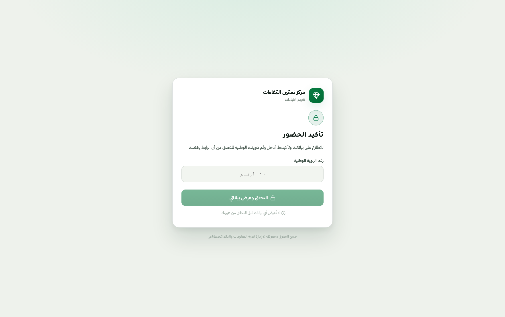

1. يفتح المشارك الرابط الوارد في الرسالة النصية.
2. يكتب رقم هويته الوطنية (عشرة أرقام) في **رقم الهوية الوطنية**، ثم يضغط **التحقق وعرض بياناتي**.
3. تُفتح الشاشة الرئيسة بعنوان **مرحباً {اسمك}**، وفيها رمز المشارك والقطاع ونوع التقييم و**مواعيد الجلسات** وحالتا التأكيد والوصول.
4. يراجع البيانات والمواعيد ثم يضغط **تأكيد بياناتي**.
5. تظهر رسالة **تم تأكيد بياناتك بنجاح**، وتتحوّل الحالة من **بانتظار التأكيد** إلى **تم تأكيد البيانات**، ويختفي الزرّ. ومن أكّد سابقاً تظهر له **بياناتك مؤكّدة مسبقاً**.


من الشاشة نفسها يملأ المشارك **سيرتي الذاتية** (اختيارية) ويفتح **بطاقة المشارك** ويطبعها — وهي تحمل الرمز والقطاع ونوع التقييم والمواعيد بلا اسم، لأن الاستقبال يعمل بالرمز. وزرّ **تسجيل الوصول** لاحقٌ لهذا المسار: مخصَّص ليوم الجلسة عند حضوره المركز.


**يتوقّف المسار إن:** لم يطابق رقم الهوية صاحبَ الرابط. لا يُعرض أي بيان قبل المطابقة: الرابط وحده لا يكفي — رابطٌ تملكه ورقمُ هوية تعرفه، فرابطٌ يتسرّب أو يُعاد توجيهه لا يكشف اسماً ولا موعداً. وللرابط خمس محاولات، ثم قفلٌ ربع ساعة برسالة «محاولات كثيرة. حاول بعد {عدد} دقيقة.»، والمحاولة الفاشلة تعرض «رقم الهوية غير مطابق لهذا الرابط. — تبقّى {عدد} محاولة». والرابط غير الصحيح والهوية غير المطابقة يُردّان بالردّ نفسه كي لا يُستدلّ من شكل الردّ على وجود الرابط. وجلسة التحقّق عشرون دقيقة، وانتهاؤها يعيد المشارك إلى إدخال رقم الهوية.

#### ما الذي يُدوَّن

يُقيَّد في سجل التدقيق من هذا المسار: **إضافة المرشح** برمز المشارك المولَّد، و**محاولة إضافة مرشح مسجّل مسبقاً** حين تُردّ هوية قائمة، و**اعتماد المرشح** برمزه، و**جدولة جلسة** لكل جلسة تُنشأ — ومعها **تعديل جلسة** و**حذف جلسة** إن وقعا. وتُدوَّن **الاطلاع على البيانات الشخصية** كلما فُتحت بطاقة تحمل الاسم، و**تصدير القائمة** بعدده وبما إذا حوى أسماء. أفعال بوّابة المشارك مدوَّنة كذلك: التحقّق الناجح والفاشل، والتأكيد، وتسجيل الوصول، وحفظ السيرة أو ردّها لتسرّب معرّف — وهذه ليس لها وصف عربي في قائمة **كل الإجراءات**، فتظهر في عمود **الإجراء** برموزها الإنجليزية كما هي (`PUBLIC_VERIFY_OK`، `PUBLIC_VERIFY_FAIL`، `PUBLIC_CONFIRM`، `PUBLIC_ARRIVE`، `PUBLIC_CV_SAVE`، `PUBLIC_CV_BLOCKED`) ولا تُرشَّح من القائمة. وكذلك تجاوزات الجدولة — تجاوز حدّ القطاع وتجاوز قفل الحضور — تُدوَّن بأفعال مستقلّة تُميَّز بالعين. كل صفّ يحمل وقته، ومنفّذه، والكيان (رمز المشارك إن حملته تفاصيل العملية)، وعنوان الجهاز. والشاشة تُفتح لمدير النظام ومدير المركز وحدهما، وهي للقراءة فقط: لا مسار في المنصّة يعدّل صفّاً فيها أو يحذفه.

### يوم استقبال كامل — من باب المركز إلى جدول الجلسات

يبدأ المسار بمرشّح واقف أمام مكتب الاستقبال لم تُسجَّل له زيارة في تاريخ اليوم، وينتهي بزيارة معتمَدة وجلسات مقيَّدة في شاشة **الجدولة** باسم مقيّميها.

| المرحلة | مَن ينفّذها | الشاشة | الصلاحية |
|---|---|---|---|
| ١ — تسجيل الوصول | مسؤول استقبال الموظفين | استقبال الموظفين `/reception` — جدول **المنتظَرون** | `reception.record` |
| ٢ — التوقيع والإقرار | مسؤول استقبال الموظفين | الشاشة نفسها — عمود **التوقيع والإقرار** | `reception.record` |
| ٣ — التوزيع على الأنشطة | مسؤول استقبال الموظفين أو مسؤول العمليات | الشاشة نفسها — عمود **التوزيع** | `reception.assign` |
| ٤ — الاستلام أو الردّ | مستشار المقابلة، مستشار حلقة النقاش، مشرف أدوات القياس | الشاشة نفسها — قسم **المُسنَد إليّ اليوم** | `reception.decide` |
| ٥ — إعادة إسناد المردود | مسؤول العمليات | الشاشة نفسها — عمود **التوزيع** | `reception.assign` |
| ٦ — الاعتماد والترحيل | مسؤول العمليات | الشاشة نفسها — العمود الأخير | `reception.approve` |

المراحل الستّ كلّها على مسار واحد هو `/reception`، والشاشة تتشكّل بحسب صلاحيات فاتحها: كل دور يرى ما يخصّ مرحلته وحدها. ويشارك مسؤولَ العمليات في المرحلتين الخامسة والسادسة **مدير المركز** و**مسؤول الجدولة** — كلاهما يحمل `reception.assign` و`reception.approve`.

#### ١ — تسجيل الوصول


1. افتح **استقبال الموظفين**، وتأكّد من أن حقل التاريخ على اليوم الصحيح.
2. انزل إلى جدول **المنتظَرون**، وهو لا يظهر إلا لحامل `reception.record`.
3. إن طالت القائمة فاكتب رمز المشارك في «ابحث برمز المشارك…» واضغط **بحث**. البحث على الخادم **برمز المشارك وحده**، ولا يشمل جدول الحاضرين.
4. اضغط **تسجيل الوصول** في صفّ المرشّح.

ينتقل المرشّح إلى جدول **الحاضرون اليوم** بوقت وصول مثبَّت تلقائياً، وتظهر الرسالة «سُجّل وصول ‹الرمز›». الضغط مرّتين لا يُنشئ زيارتين: الزيارة واحدة لكل دورة في اليوم. وإن أخطأتَ الوقت فاضغط الوقت المكتوب في عمود **وقت الوصول** ليتحوّل إلى محرِّر داخل الصفّ، ثم احفظ بعلامة الصحّ؛ تظهر «حُدّث وقت الوصول».

**يتوقّف المسار إن:** لم يكن للمرشّح دورة قائمة في التاريخ المختار — الدورات المنتهية لا تظهر في **المنتظَرون** أصلاً؛ أو كان المرشّح مصنَّفاً (سرّي / سرّي للغاية) والفاتح لا يملك `candidate.view_classified`، فلا يظهر في الصفوف ولا في العدد الكلّي؛ أو حاولها من لا يملك `reception.record` فيُردّ بـ«ليس لديك صلاحية تسجيل وصول المرشحين». وانتبه إلى أن قائمة المنتظَرين مقصوصة عند ٤٠ صفّاً، والشريط فوقها يذكر العدد الكلّي صراحةً: «يُعرَض ٤٠ من … منتظَراً — ابحث بالرمز للوصول إلى البقيّة.» القصّ معلَن عمداً، لأن قائمة مقصوصة صامتة تُقرأ «هذا كل من ينتظر» فيُصرَف مرشّح حاضر لأنه لم يظهر في الشاشة.

#### ٢ — التوقيع والإقرار


1. في صفّ المرشّح، اضغط **عرض** في عمود **السيرة**، وطابِق معه ما هو مسجَّل: المنصب الحالي، والنبذة، والمؤهلات، والخبرات، والشهادات. المعروض هو نسخة السيرة المحفوظة مع الدورة إن وُجدت، وإلا السيرة الحالية للمرشّح. وإن لم يُدخِلها ظهر «لم يُدخِل المرشح سيرته الذاتية بعد.»
2. أغلِق النافذة، واضغط **أخذ التوقيع** في عمود **التوقيع والإقرار**.


3. اقرأ على المرشّح نصّ الإقرار الظاهر باسمه.
4. سلّمه الجهاز ليوقّع داخل اللوحة المكتوب فيها «وقّع هنا» — بإصبعه أو بالفأرة. زرّ **مسح** يمحو التوقيع لإعادته.
5. علّم خانة **قرأ المرشح الإقرار أعلاه ووافق عليه**.
6. اضغط **حفظ التوقيع**.

يتحوّل العمود إلى الوسم **وقّع وأقرّ**، وتظهر «وقّع ‹الرمز› وأقرّ بصحّة بياناته». التوقيع يُخزَّن مشفَّراً.

**يتوقّف المسار إن:** بقيت خانة الإقرار غير معلَّمة — زرّ **حفظ التوقيع** يظلّ معطّلاً، والخادم يردّ «لا بدّ من إقرار المرشح بصحّة بياناته»؛ أو كانت اللوحة فارغة، فيردّ «لم يوقّع المرشح بعد»؛ أو أُرسل ما ليس صورة توقيع، فيردّ «صيغة التوقيع غير صالحة» — الحقل لأخذ توقيع لا لرفع ملفّ. ومن لا يملك `reception.record` لا يرى الزرّ أصلاً بل الوسم **لم يوقّع**، ومحاولته تُردّ بـ«ليس لديك صلاحية أخذ توقيع المرشح».

#### ٣ — التوزيع على الأنشطة


1. اضغط **توزيع** في عمود **التوزيع**.
2. اختر **النشاط**: المقابلة الشخصية، أو حلقة النقاش، أو أدوات القياس. تُفتَح النافذة على أول نشاط غير مُسنَد.
3. اختر **المقيّم** من القائمة؛ كل سطر فيها «الاسم — الدور (القطاع)».
4. اضغط **إسناد وإشعار**.
5. كرّر الخطوات لبقيّة أنشطة اليوم.

يظهر الإسناد في الصفّ بحالة **بانتظار المقيّم**، وتظهر «أُسنِد المرشح وأُشعِر المقيّم»، ويصل المقيّم إشعارٌ عنوانه «مرشّح مُسنَد إليك: ‹الرمز›» — بالرمز لا بالاسم. وإن أخطأتَ في الإسناد قبل أن يبتّ فيه المقيّم فاضغط «سحب الإسناد» داخل البطاقة الموسومة **بانتظار المقيّم**؛ تظهر «سُحب الإسناد».

**يتوقّف المسار إن:** لم يوقّع المرشّح بعد — الخادم يردّ «لم يوقّع المرشح ولم يُقرّ بصحّة بياناته بعد»، لأن توزيع من لم يُقرّ بصحّة بياناته يُدخِل المقيّم على بيانات لم يُصادَق عليها؛ أو كان للنشاط إسناد فعّال، فيردّ «هذا النشاط مُسنَد بالفعل — اسحب الإسناد القائم أولاً»، إذ لا يكون المرشّح في مقابلتين في وقت واحد؛ أو كان دور المقيّم لا يمارس النشاط، فيردّ «المقيّم المختار لا يمارس ‹النشاط›»؛ أو سُحبت منه `reception.decide` باستثناء فردي، فيردّ «المقيّم المختار لا يملك صلاحية استلام المرشحين»؛ أو كان محصوراً بقطاع غير قطاع المرشّح، فيردّ «المقيّم من قطاع آخر — يلزم صلاحية الإسناد عبر القطاعات» ولا يتجاوزها إلا حامل `candidate.cross_sector` (مسؤول الجدولة ومدير النظام). وإن خلت قائمة المقيّمين ظهر «لا مقيّم مؤهّل لهذا النشاط في قطاع المرشح. أضف مستخدماً بالدور المناسب من شاشة المستخدمين.» وأُقفل زرّ الإسناد. ولاحظ أن **مدير إدارة التقييم خارج قائمة المقيّمين عمداً**: هو معتمِد المرحلة الأولى لا مُجريها، فلا يصير من يقابل هو من يعتمد.

#### ٤ — استلام المقيّم أو ردّه


المقيّم يفتح الشاشة نفسها فلا يرى منها إلا قسم **المُسنَد إليّ اليوم**: بلا بطاقات إحصاء، وبلا جدول حاضرين، وبلا قائمة منتظَرين. لكل بطاقة رمز المشارك، واسم النشاط، و«وصل HH:MM».

1. افتح الشاشة على تاريخ اليوم وابحث عن بطاقتك.
2. للاستلام: اضغط **استلام**. تتحوّل البطاقة إلى **مُستلَم** ويظهر زرّ **السيرة الذاتية**، مع الرسالة «استُلم ‹الرمز›».
3. لقراءة السيرة بعد الاستلام: اضغط **السيرة الذاتية**. تُفتَح بلا اسم ولا رقم هوية ولا وسيلة تواصل، ويعلوها التنبيه «التقييم يتم بالرمز: اسم المرشح ورقم هويته محجوبان عن المقيّم.» وأي معرّف كتبه المرشّح داخل نصّ حرّ يُطمَس آلياً قبل العرض.


4. للردّ: اضغط **ردّ**، ثم اكتب في «سبب الردّ» سبباً لا يقلّ عن ثلاثة أحرف ولا يزيد على ٥٠٠، ثم اضغط **ردّ المرشح**.

تظهر «رُدّ المرشح وأُشعِرت العمليات»، ويصل السبب إشعاراً عنوانه «ردّ إسناد: ‹الرمز›» إلى **كل من يملك صلاحية إعادة الإسناد** — لا إلى دور بعينه، لأن مركزاً لم يُنشئ دور «مسؤول العمليات» كان الإشعار يذهب فيه إلى لا أحد.

**يتوقّف المسار إن:** حاول مقيّم أن يبتّ في إسناد غيره — يُردّ بـ«الإسناد غير موجود» لا بمنع صريح، فإسناد غيره ليس شأنه فلا يُعلَم بوجوده؛ أو تكرّر القرار، فيُردّ «بُتّ في هذا الإسناد من قبل» — الاستلام والردّ يقعان مرّة واحدة؛ أو فُتحت السيرة قبل الاستلام، فيُردّ «استلم المرشّح أولاً لعرض سيرته»، لأن القرار يقع على الرمز والنشاط لا على محتوى سيرة يُطّلَع عليها ثم تُردّ؛ أو تُرك حقل السبب فارغاً، فيُردّ «اذكر سبب الردّ — العمليات تبني عليه إعادة الإسناد». ولا يظهر القسم كلّه لمن لا يملك `reception.decide`، ومحاولته تُردّ بـ«ليس لديك صلاحية البتّ في الإسناد».

#### ٥ — إعادة إسناد المردود


1. افتح **الإشعارات** واقرأ إشعار «ردّ إسناد: ‹الرمز›» وسببه، أو افتح كشف اليوم وابحث عن السطر الأحمر في عمود **التوزيع** بصيغة «ردّ ‹المقيّم› ‹النشاط› — ‹السبب›».
2. اقرأ السبب واحكم به: هل يُعاد الإسناد لمقيّم آخر، أم يُبدَّل النشاط؟
3. اضغط **توزيع** في الصفّ نفسه.
4. اختر النشاط ثم مقيّماً غير الرادّ، واضغط **إسناد وإشعار**.

يظهر إسناد جديد بحالة **بانتظار المقيّم**. والإسناد المردود يبقى في السجلّ بسببه واسم رادّه: إعادة الإسناد سجلّ جديد بجانبه، لا استبدال له.

**يتوقّف المسار إن:** لم يوجد مستخدم نشط يملك `reception.assign` — يقف المرشّح المردود بلا من يعيد إسناده، ويُقيّد النظام ذلك في سجل التدقيق بـ`RECEPTION_REJECT_UNROUTED`؛ أو كانت الزيارة قد اعتُمدت، فيُردّ «الزيارة معتمدة — أعد فتحها قبل التوزيع»؛ أو حاول سحب الإسناد المردود أو المستلَم، فيُردّ «لا يُسحب إسنادٌ بُتّ فيه» — المستلَم لا يُنتزع من تحت المقيّم، بل يُردّ منه أو يُعتمد.

#### ٦ — الاعتماد والترحيل


مسؤول العمليات يعمل **بالرمز**: لا يظهر له عمود **الاسم** لأنه لا يحمل `candidate.view_names`، ويعرض عمود **السيرة** «—»، ولا يظهر له قسم **المنتظَرون**. قراره إجرائي — مَن يقابل مَن — لا محتوائي.

1. راجع صفّ المرشّح: **وقّع وأقرّ**، وإسناداته كلّها مبتوت فيها، وفيها إسناد واحد على الأقل **مُستلَم**.
2. إن بقي إسناد **بانتظار المقيّم**: انتظر قراره أو اسحبه.
3. إن ظهر سطر ردّ أحمر: أعد الإسناد كما في المرحلة الخامسة.
4. اضغط **اعتماد وترحيل**.

تُنشَأ جلسة في **الجدولة** لكل إسناد مُستلَم بتاريخ الزيارة ونشاطها ومقيّمها، ويتحوّل الصفّ إلى **معتمد**، وتظهر «اعتُمد ‹الرمز› ورُحّلت جلساته»، ويصل كل مقيّم إشعار «اعتُمد ورُحّل: ‹الرمز›». والإسناد المُرحَّل لا يُرحَّل مرّتين.

**يتوقّف المسار إن:** لم يكتمل شرط الزرّ — يبقى **معطّلاً**، وسببُ التعطيل يظهر عند مرور المؤشّر عليه: «لم يوقّع المرشح ولم يُقرّ بصحّة بياناته» أو «بقي إسناد بانتظار قرار المقيّم» أو «لا إسناد مستلَم — وزّع المرشح أولاً». والخادم يردّ بالمثل: «لم يوقّع المرشح ولم يُقرّ بصحّة بياناته»، و«بقي إسناد بانتظار قرار المقيّم — انتظر البتّ أو اسحب الإسناد» لأن الاعتماد حينها يُسقط قراراً لم يُتّخذ بلا أن يعلم به أحد، و«لا إسناد مستلَم بعد — لا شيء يُرحَّل». والاعتماد المكرّر يُردّ بـ«الزيارة معتمدة من قبل». وبعد الاعتماد تُقفَل الزيارة: «الزيارة معتمدة — لا يُعدَّل وقتها»، و«الزيارة معتمدة — لا يُعدَّل توقيعها» — الوثيقة المعتمَدة تبقى هي التي اعتُمدت.

ولاحظ أن **مسؤول استقبال الموظفين لا يملك `reception.approve`**: من يوزّع لا يعتمد توزيعه بنفسه. وكل ما سبق مفروض على الخادم؛ إخفاء زرّ في الواجهة راحة للعين، ومحاولة تجاوزه بالرابط أو بالواجهة البرمجية تُردّ بالرسالة نفسها.

#### ما الذي يُدوَّن

يترك هذا المسار في **سجل التدقيق** أثراً في كل مرحلة، باسم منفّذه ووقته وعنوان جهازه: `RECEPTION_ARRIVE` عند تسجيل الوصول ومعه رمز المشارك، و`RECEPTION_ARRIVAL_EDIT` عند تعديل الوقت ومعه الوقت قبل التعديل وبعده، و`RECEPTION_SIGN` عند التوقيع والإقرار، و`RECEPTION_VIEW_CV` عند كل فتح لسيرة الزائر من الاستقبال، و`RECEPTION_ASSIGN` عند الإسناد ومعه النشاط والمقيّم، و`RECEPTION_WITHDRAW` عند سحبه، و`RECEPTION_ACCEPT` أو `RECEPTION_REJECT` عند قرار المقيّم، و`RECEPTION_EVAL_VIEW_CV` عند فتح المقيّم سيرة من استلمه، و`RECEPTION_APPROVE` عند الاعتماد ومعه عدد الجلسات المُرحَّلة. ويُضاف `RECEPTION_REJECT_UNROUTED` وحده حين يُردّ مرشّح ولا يصل الإشعار إلى أحد.

**التوقيع نفسه لا يُكتب في السجل** — هو بيان شخصي، ووجود نسخة منه في السجل يضعها خارج التشفير. وهذه الرموز ليس لها وصف عربي في قائمة الإجراءات، فتظهر في عمود **الإجراء** برموزها الإنجليزية كما هي، ولا تظهر في قائمة **كل الإجراءات** فلا تُرشَّح منها؛ الوصول إليها يكون بتضييق **كل المستخدمين** و**من تاريخ** و**إلى تاريخ**. والسجل يُقرأ بـ`audit.view` — لمدير النظام ومدير المركز فقط، وهي صلاحية لا تُفوَّض ولا تُمنح استثناءً.

### من رصد الدرجات إلى تقريرٍ معتمد وخطة تطوير

يبدأ هذا المسار عند أوّل درجة يرصدها المستشار في جلسة التقييم، وينتهي ببندٍ في خطة تطوير المشارك بعد اكتمال اعتماد تقريره وإخراج مستنده المطبوع.

| المرحلة | مَن ينفّذها | الشاشة | الصلاحية |
|---|---|---|---|
| رصد درجات المقابلة الشخصية | مستشار المقابلة | التقييم | `evaluation.input` |
| رصد درجات حلقة النقاش | مستشار حلقة النقاش | التقييم | `evaluation.input` |
| رفع نتائج أدوات القياس | مشرف أدوات القياس، مدير المركز | أدوات القياس | `measurement.upload` |
| كتابة التقرير وإرساله | مساعد التقييم، مدير إدارة التقييم، مدير المركز | التقارير النهائية | `report.create` |
| اعتماد المقيّم — الأولى | مستشار المقابلة | التقارير النهائية | `report.approve_evaluator` |
| اعتماد مدير إدارة التقييم — الثانية | مدير إدارة التقييم | التقارير النهائية | `report.approve_manager` |
| اعتماد إدارة تطوير الكفاءات — الثالثة | إدارة تطوير الكفاءات | التقارير النهائية | `report.approve` |
| الاعتماد النهائي — مدير المركز — الرابعة | مدير المركز | لا زرّ لها في شاشة التقارير | `report.approve_center` |
| الإرجاع للتعديل | مدير المركز | التقارير النهائية | `report.return` |
| إلغاء التقرير | مدير المركز | لا زرّ له في الشاشة | `report.cancel` |
| الملخّص التنفيذي | مدير المركز | التقارير النهائية | `report.exec_summary` |
| تصدير CSV | مدير المركز، مدير إدارة التقييم، إدارة تطوير الكفاءات | التقارير النهائية | `report.export` |
| خطة التطوير الفردية | مدير إدارة التقييم، مساعد التقييم، مدير المركز | خطط التطوير | `development_plan.view` للفتح و`report.create` للإدارة |

مدير النظام يملك كل صلاحيات هذا الجدول. وأسماء المراحل الأربع وترتيبها وتفعيلها بيانات تُضبط من شاشة **سير العمل**، ولا يفتحها إلا مدير النظام.

#### المرحلة الأولى — رصد الدرجات في نشاطَي التقييم

أنشطة المركز ثلاثة: المقابلة الشخصية، وحلقة النقاش، وأدوات القياس. الأوّلان تُرصَد درجاتهما في شاشة **التقييم**، والثالث تُرفع نتائجه في شاشة **أدوات القياس**.

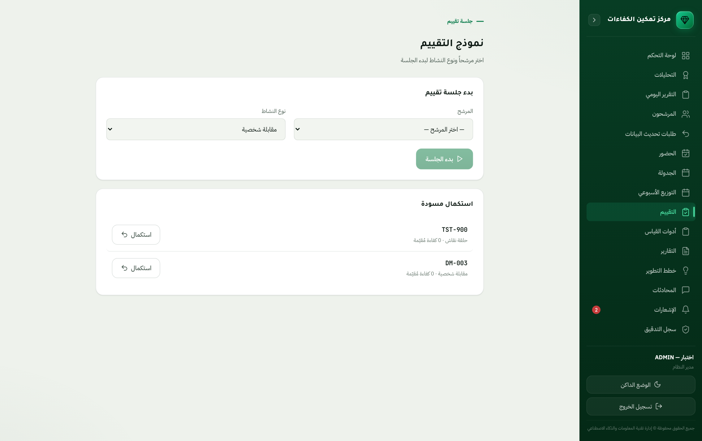

1. افتح **التقييم** من الشريط الجانبي.
2. اختر المشارك من قائمة **المرشح** — تظهر بصيغة «الرمز — القطاع»، ولا تعرض إلا من حالته **مجدول** أو **مُقيَّم**.
3. اختر **نوع النشاط**: «مقابلة شخصية» أو «حلقة نقاش». هو ما يحدّد الكفاءات التي ستُرصَد.
4. اضغط **بدء الجلسة**. يُنشأ التقييم مسودةً على الخادم ويُفتح نموذج الدرجات.
5. اضغط **السيرة الذاتية** أعلى النموذج لقراءة لقطة الدورة المجمَّدة قبل الرصد.
6. لكل كفاءة اضغط رقم المستوى — يُضيء هو وما دونه، ويتحدّث العدّاد إلى «{الدرجة} / {الحدّ الأقصى}». والكفاءة التي لم تُضغط لها درجة تبقى على `0`.
7. اكتب ملاحظاتك في **ملاحظات المستشار**.
8. اضغط **حفظ مسودة** لتُبقيها قابلة للتعديل، أو **إرسال للاعتماد** بعد رصد **كل** كفاءات النشاط.


عند الإرسال تظهر «تم إرسال التقييم للاعتماد ✓»، ويُقفَل التقييم، وتنتقل حالة المشارك من **مجدول** إلى **مُقيَّم**، ويصل إشعار «تقييم بانتظار الاعتماد» إلى مدير إدارة التقييم. و**إلغاء الجلسة** يُغلق النموذج ولا يحذف المسودة — تجدها في بطاقة **استكمال مسودة**، وهي مسوداتك أنت لا مسودات غيرك.

الاعتماد والإرجاع في هذه المرحلة بصلاحية `evaluation.approve` (مدير النظام، مدير المركز، مدير إدارة التقييم). والإرجاع يوجب سبباً لا يقلّ عن خمسة أحرف، فيعود التقييم إلى **مسودة**، ويصل المستشار إشعار «تقييم مُرجع للتعديل» يحمل السبب، ويظهر التقييم من جديد في **استكمال مسودة**.

**يتوقّف المسار إن:** لم تُرصَد كل كفاءات النشاط — الردّ «التقييم ناقص: تم تقييم {عدد} من {عدد} كفاءة لهذا النشاط»؛ أو لم تُرصَد أي درجة — «أدخل درجة واحدة على الأقل» و«لا يمكن إرسال تقييم بدون درجات»؛ أو كان للمشارك تقييم مفتوح في النشاط نفسه — «توجد مسودة تقييم لهذا المرشح في هذا النشاط — استكملها بدل بدء جلسة جديدة»؛ أو كان قد قُيّم فيه أصلاً — «تم تقييم هذا المرشح في هذا النشاط مسبقاً»، ولا يُعاد إلا بدورة تقييم جديدة؛ أو فُتحت الشاشة بحساب يملك `evaluation.view` دون `evaluation.input` — «ليس لديك صلاحية إدخال التقييم». والمنع الأخير مقصود: الرصد فعلُ مقابلة، لا فعلُ إشراف.


#### المرحلة الثانية — رفع نتائج أدوات القياس

1. افتح **أدوات القياس** من القائمة الجانبية.
2. اختر المشارك من قائمة **المرشّح** — لا تعرض إلا من حالته **مجدول** أو **مُقيَّم**.
3. اكتب الدرجات في **المقياس الشخصي** و**القدرات التحليلية** و**اللغة الإنجليزية**، كلٌّ من 100 وخطوة الإدخال 0.5.
4. اترك الحقل الذي لم تصل نتيجته فارغاً — يُحفَظ بلا قيمة ولا يُعدّ صفراً.
5. اضغط **حفظ النتيجة**.


يظهر شريط أخضر «تم حفظ نتيجة القياس»، ويتحدّث سطر «آخر تحديث». والحفظ يستبدل نتيجة الدورة نفسها ولا يضيف سجلاً جديداً، فعُد لاحقاً وأكمل الحقل الناقص. وتبديل المشارك من القائمة يمسح ما لم تحفظه — احفظ قبل أن تنتقل.


**يتوقّف المسار إن:** خرجت درجة عن المدى — «تعذّر الحفظ — تحقّق من القيم (0–100)» ولم يُكتب شيء في القاعدة؛ أو كانت كل دورات المشارك مكتملة — «لا توجد دورة تقييم نشطة للمرشّح»، فنتيجة الدورة المنتهية تبقى للقراءة ولا تُصحَّح بأثر رجعي؛ أو كان الحساب يملك `measurement.view` دون `measurement.upload` — تُعطَّل الحقول ويحلّ محلّ الزرّ سطر «عرض فقط — تحتاج صلاحية رفع القياس للتعديل.». وهذا فصل مقصود: مدير إدارة التقييم ومساعد التقييم وإدارة تطوير الكفاءات يقرؤون القياس لأنه يدخل في التقرير، ولا يرفعونه.

#### المرحلة الثالثة — كتابة التقرير النهائي وإرساله


1. افتح **التقارير** واضغط **إنشاء تقرير**.
2. اختر المشارك من قائمة «اختر مرشحاً منتهي التقييم…». لا تضمّ القائمة إلا من صارت حالته **مُقيَّم** ولا تقرير لدورته الحالية؛ وإن خلت ظهر «لا يوجد مرشحون منتهو التقييم بلا تقرير حالياً.».
3. راجع لوحة **الاحتساب الآلي من الدرجات**: «سلوكي» و«فني» و«عام»، وعدد الكفاءات والتقييمات المحتسبة، وتفصيل كل كفاءة.
4. راجع لوحة **تحليل الفجوة** — تقارن كل كفاءة بالمستوى المستهدف لفئة المشارك وتُظهر «… / … محقّق».
5. عدّل «التوافق السلوكي (%)» و«التوافق الفني (%)» إن لزم؛ فهما مُعبّآن تلقائياً كما يقول التنبيه «عُبّئت قيمتا التوافق تلقائياً — يمكنك تعديلهما.».
6. اختر «التوصية»: «يوصى به بقوة» أو «يوصى به» أو «يوصى به بتحفّظ» أو «لا يوصى به».
7. اكتب «نظرة عامة»، وأضف بنود «نقاط القوة» و«مجالات التطوير» بزر **إضافة**. وبنود مجالات التطوير هي التي تُبنى منها خطة التطوير لاحقاً، فاكتبها بصياغة قابلة للمتابعة.
8. اضغط **حفظ كمسودة**، أو **حفظ وإرسال للاعتماد** لتدفعه إلى المرحلة الأولى.

عند الإرسال يُشعَر صاحب المرحلة الأولى وحده بإشعار «تقرير بانتظار اعتمادك». ولتعديل مسودة أو تقرير مُعاد اضغط **تعديل التقرير** على البطاقة — والحقلان في وضع التعديل يُحفظان كما تتركهما ولا يُعاد احتسابهما.

**يتوقّف المسار إن:** لم تُغلق دورة تقييم المشارك — «لا يمكن إنشاء تقرير قبل انتهاء تقييم المرشح»، منعاً لتجاوز مسار التقييم بأكمله؛ أو كان لدورته تقرير قائم — «يوجد تقرير لهذه الدورة — استخدم التعديل»؛ أو تُركت التوصية فارغة — «اختر التوصية»؛ أو خرجت قيمة عن حدّها — «تحقّق من الحقول المدخلة» (التوافق من ٠ إلى ١٠٠، والنظرة العامة حتى ٥٠٠٠ حرف، والبنود حتى ٢٠ بنداً لكل قائمة)؛ أو حاولت تعديل تقرير غيرك بلا `report.edit_any` — «لا تملك صلاحية تعديل تقرير أنشأه غيرك».

قبل الإرسال تحقّق من ارتباط الكاتب بمديره: **المدير إلزامي لمساعد التقييم، ولا بدّ أن يملك اعتماد تقارير فريقه**، وإلا وقف التقرير في المرحلة الثانية كما يلي.

#### المرحلة الرابعة — سلسلة الاعتماد الأربع

السلسلة في هذا التنصيب أربع مراحل مفعّلة، تُقرأ من بطاقة **المسار الحالي** في شاشة سير العمل:

| # | المرحلة | صاحبها | الصلاحية | شارة التقرير |
|---|---|---|---|---|
| ١ | اعتماد المقيّم | مستشار المقابلة | `report.approve_evaluator` | «بانتظار اعتماد المقيّم» |
| ٢ | اعتماد مدير إدارة التقييم | مدير إدارة التقييم | `report.approve_manager` | «بانتظار اعتماد مدير التقييم» |
| ٣ | اعتماد إدارة تطوير الكفاءات | إدارة تطوير الكفاءات | `report.approve` | «بانتظار الاعتماد النهائي» |
| ٤ | الاعتماد النهائي — مدير المركز | مدير المركز | `report.approve_center` | `pending_center` |


1. اضغط مرشّح مرحلتك: **المقيّم** أو **مدير التقييم** أو **نهائي**، أو **بانتظار الاعتماد** لترى السلسلة كاملةً.
2. اقرأ شارة الحالة على البطاقة والرقم الصغير فيها (مثل `1/3`) — يُظهر كم بقي من المراحل المسمّاة.
3. راجع التقرير بزر **مستند مفصّل** قبل قرارك.
4. اضغط **اعتماد**. وفي المرحلة الثالثة يقرأ الزرّ **اعتماد نهائي**.


تظهر «تم اعتماد تقرير ‹رمز المشارك›»، ويتقدّم التقرير إلى المرحلة التالية ويُشعَر صاحبها. وعند نهاية السلسلة تصير الحالة **معتمد**، ويصل كاتب التقرير إشعار «اعتُمد التقرير نهائياً»، وتصير حالة المشارك «مكتمل» فتُتاح له دورة تقييم جديدة.

**من يكتب لا يعتمد.** المرحلة الثانية مضبوطة على قاعدتين معاً: «لا يعتمد ما كتبه» و«كاتبه من فريقه». فمن يعتمد فيها لا يعتمد تقريراً كتبه بنفسه — «لا يمكنك اعتماد تقرير كتبته بنفسك — يعتمده صاحب صلاحية أخرى» — ولا يعتمد إلا ما كتبه مرؤوسوه المباشرون — «هذا التقرير كتبه من ليس ضمن فريقك». وتقريرٌ بلا كاتب معروف لا يُنسب لفريق فلا يُعتمد بهذه القاعدة — «تعذّر تحديد كاتب التقرير — لا يمكن اعتماده بقاعدة الفريق». عملياً: يكتب التقرير مساعد التقييم المرتبط بمدير إدارة التقييم في شاشة المستخدمين، فيعتمده مديره.

**التجاوز لطرف واحد فقط.** من يملك المرحلة **التالية مباشرةً** يعتمد من المرحلة الحالية، ولذلك يقرأ الزرّ **اعتماد وتجاوز المقيّم** لمدير إدارة التقييم على تقرير واقف عند المقيّم. والقاعدتان تُفحصان على المرحلة المتخطّاة والوجهة معاً، فلا يصير التخطّي باباً خلفياً يلتفّ على «من يكتب لا يعتمد». ولا يُسمح بتجاوز السلسلة كلها من أوّلها، فذلك نقضٌ لمعنى السلسلة.

**المرحلة الرابعة.** الشاشة تسمّي المراحل الثلاث الأولى وحدها، فالتقرير الذي يبلغ مرحلة مدير المركز تظهر شارته برمزها `pending_center`، ويبقى محسوباً في مؤشّر **بانتظار** وضمن مرشّح **بانتظار الاعتماد**، ولا يظهر له في هذه الشاشة زرّ **اعتماد** ولا زرّ **إرجاع للتعديل**. تغيير ترتيب المراحل أو تعطيلها من شاشة **سير العمل** بيد مدير النظام وحده، ولا تُعطَّل مرحلة عليها تقارير واقفة — «لا يمكن تعطيل مرحلة فيها تقارير».

**يتوقّف المسار إن:** ضغطتَ اعتماداً على مرحلة ليست لك — «ليس لديك صلاحية اعتماد هذه المرحلة»، فالزرّ لا يظهر أصلاً إلا لصاحب المرحلة التي يقف عندها التقرير؛ أو لم يكن التقرير في مرحلة اعتماد — «لا يمكن اعتماد تقرير في هذه الحالة»؛ أو غيّر مستخدم آخر حالته أثناء عملك — «تغيّرت حالة التقرير — أعد التحميل»، فاعتمادٌ بحالة قديمة لا يطمس إرجاعاً متزامناً ولا يُقدّم التقرير مرتين؛ أو كان التقرير خارج نطاقك — «التقرير غير موجود»، لا «ممنوع»، كي لا يصير رقم التقرير أداةً لكشف ما هو موجود.


#### الإرجاع والإلغاء

الإرجاع لحاملي `report.return` وحدهم: **مدير المركز** ومدير النظام. وقد كان موزّعاً على كل مرحلة، فكان كلُّ معتمِدٍ يردّ التقرير خطوات للوراء.


1. اضغط **إرجاع للتعديل** على بطاقة تقرير واقف في مرحلة اعتماد.
2. اكتب السبب في حقل «سبب الإرجاع (إلزامي)» — خمسة أحرف فأكثر.
3. اضغط **تأكيد الإرجاع**.

تظهر «أُعيد تقرير ‹الرمز› للتعديل»، وتصير حالته **مُعاد للتعديل**، ويصل كاتبه إشعار «أُعيد تقرير للتعديل» بالسبب، ويُقيَّد السبب رسالةً في محادثة التقرير، ويزيد عدّاد مرّات الإرجاع — وهو أحد خيارات الفرز. والتقرير المُعاد يعود بالإرسال إلى **أول** السلسلة لا إلى المرحلة التي أُعيد منها، فتُراجَع المراحل كلها من جديد، ولا زرّ منفصلاً لإعادة الإرسال.

الإلغاء بصلاحية `report.cancel` — مدير المركز ومدير النظام — ويوجب سبباً بين خمسة أحرف وخمسمئة، ولا زرّ له في هذه الشاشة. والمعتمَد لا يُلغى: «لا يمكن إلغاء تقرير معتمد أو ملغى مسبقاً»؛ وثيقة نافذة قد تكون طُبعت ووُقّعت، وسحبها يحتاج إجراءً موثّقاً لا زرّاً.

**يتوقّف المسار إن:** كان التقرير معتمداً أو مسودة — «لا يمكن إرجاع تقرير غير مُرسل للاعتماد»، منعاً لإفساد حالة المشارك؛ أو كان السبب أقصر من خمسة أحرف — «تعذّر الإرجاع»، فالكاتب يُشعَر بالسبب وسببٌ فارغ لا يُصلح شيئاً؛ أو لم يملك حسابك `report.return` — «ليس لديك صلاحية الإرجاع».

#### الملخّص التنفيذي


1. اضغط **الملخّص التنفيذي** على بطاقة التقرير.
2. اكتب النصّ في الحقل — يظهر فوقه التنبيه «يُعرض في المستند المختصر. بصلاحية مدير المركز.».
3. اضغط **حفظ**.

يُحفظ النصّ ويظهر في **المستند المختصر**. ومن لا يملك `report.exec_summary` يقرأ فقط، ويظهر له «للعرض فقط — الكتابة بصلاحية مدير المركز.» بلا زرّ حفظ.

**يتوقّف المسار إن:** حاولت الحفظ بلا الصلاحية — «الملخّص التنفيذي بصلاحية مدير المركز فقط»؛ أو تجاوز النصّ ٥٠٠٠ حرف — «تعذّر حفظ الملخّص».

#### التصدير وإخراج المستندات


1. اضغط **مستند مفصّل** أو **مستند مختصر** على بطاقة التقرير — يفتح المستند في تبويب جديد.
2. اضغط فيه **طباعة / حفظ PDF**.
3. لتصدير القائمة اضغط **تصدير CSV** — يُنزَّل ملف `reports.csv` بالأعمدة: الرمز، القطاع، الفئة، الحالة، التوافق السلوكي، التوافق الفني، التوصية.

المستند المفصّل سبعة أقسام مرقّمة: البيانات الشخصية والوظيفية، ونتائج التقييم النهائية، والكفاءات السلوكية، والكفاءات الفنية حسب مجالات التقييم، وتقييم اللغة الإنجليزية، والمرئيات والتوصيات ومعها مواطن القوة ومجالات التطوير وأدوات القياس، وخطة التطوير الفردية؛ وفي ذيله أربعة مواضع توقيع: المُقيّم، ومدير إدارة التقييم، وإدارة تطوير الكفاءات، ومدير المركز. والمستند المختصر ورقة واحدة: القطاع والفئة، والتوافق السلوكي والفني والتوصية، والملخّص التنفيذي، وتوقيع مدير المركز. ولأن القسم السابع يُقرأ من بنود خطة التطوير، فبناء الخطة قبل الطباعة يجعلها تخرج مع المستند.

اسم المشارك في المستند المطبوع لا يظهر إلا لحاملي `report.view_names` — مدير المركز ومدير النظام — لا لكل من يرى الأسماء في الشاشات: المستند يُطبع ويخرج من النظام، فحدّه أضيق. وملف CSV محصور بنطاقك نفسه؛ التصدير لا يكشف ما تُخفيه الشاشة.

**يتوقّف المسار إن:** منع المتصفّح فتح التبويب — «فعّل النوافذ المنبثقة لعرض المستند»؛ أو كان التقرير خارج نطاقك — «تعذّر فتح المستند»؛ أو لم يملك حسابك `report.export` — «ليس لديك صلاحية تصدير التقارير».

#### خطة التطوير الفردية


1. افتح **خطط التطوير** من القائمة الجانبية واختر المشارك من قائمة **المرشّح**.
2. اضغط **توليد من التقرير** — يُنشأ بند بحالة «بالانتظار» لكل مجال تطوير في تقرير الدورة، والمجال المُدرَج سابقاً لا يتكرّر.
3. لإضافة بند خارج التقرير: اكتب **مجال التطوير \*** (إلزامي، حتى ٥٠٠ حرف)، ثم **الإجراء / التوصية (اختياري)** (حتى ١٠٠٠ حرف)، ثم اختر تاريخاً مستهدفاً، واضغط **إضافة**.
4. لمتابعة البند اضغط قائمة الحالة بجانبه واختر **قيد التنفيذ** أو **مكتمل**. تُحفظ الحالة فوراً، وعند «مكتمل» يُسجَّل وقت الإكمال ويظهر وسم «اكتمل» ويُشطَب عنوان البند.
5. لحذف بند اضغط أيقونة **حذف** وأكّد رسالة «حذف هذا البند؟». الحذف نهائي ولا تراجع عنه من الشاشة.


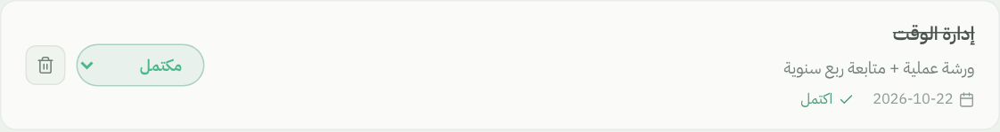

المعروض فوق القائمة ملخّص «{n} بند · {n} مكتمل»، والبنود المعروضة هي بنود **الدورة الأخيرة** للمشارك وحدها.

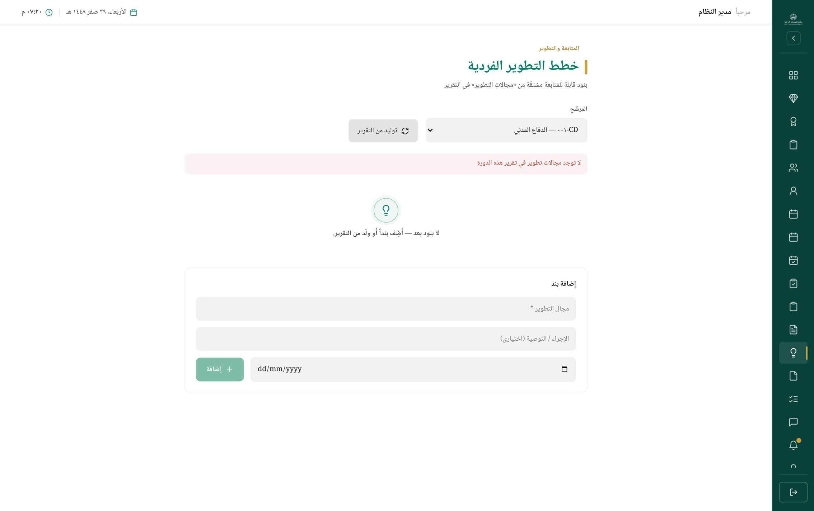

**يتوقّف المسار إن:** خلا تقرير الدورة من مجالات تطوير أو لم يكن له تقرير — «لا توجد مجالات تطوير في تقرير هذه الدورة»؛ أو كانت كل المجالات مُدرَجة — «لا مجالات جديدة لإضافتها من التقرير»؛ أو لم تكن للمشارك دورة تقييم — «لا توجد دورة تقييم لهذا المرشح»، لأن البند يُربط بمعرّف الدورة؛ أو فُتحت الشاشة بحساب يملك `development_plan.view` دون `report.create` — «ليس لديك صلاحية إدارة خطة التطوير»، فمستشار المقابلة وإدارة تطوير الكفاءات يقرآن الخطة ولا يعدّلانها.

#### ما الذي يُدوَّن

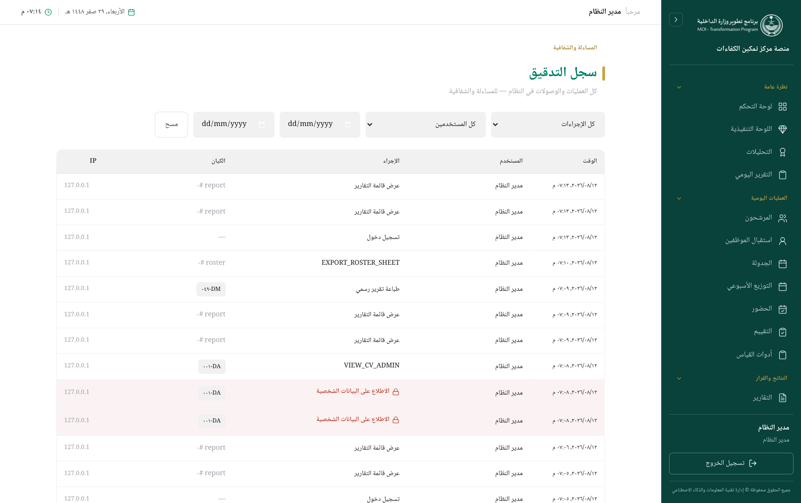

هذا المسار كلّه مقيَّد في **سجل التدقيق**، ولا يفتحه إلا مدير النظام ومدير المركز بصلاحية `audit.view` غير القابلة للتفويض.

من التقييم: «بدء تقييم» `START_EVALUATION`، و«حفظ درجات» `SAVE_SCORES` ومعه القيم السابقة، و«عرض درجات تقييم» `VIEW_EVALUATION`، و«إرسال تقييم للاعتماد» `SUBMIT_EVALUATION`، و«اعتماد تقييم» `APPROVE_EVALUATION`، و«إرجاع تقييم للمقيّم» `RETURN_EVALUATION` مع سببه. ومن القياس: «رفع نتيجة قياس» `UPLOAD_MEASUREMENT` مع رمز المشارك ورقم من رفعه وعنوان الشبكة. ومن التقارير: إنشاء التقرير وتعديله وإرساله بالرموز `CREATE_REPORT` و`CREATE_SUBMIT_REPORT` و`UPDATE_REPORT` و`UPDATE_SUBMIT_REPORT`، و«اعتماد تقرير نهائي» `APPROVE_REPORT` مع اسم المرحلة والحالة قبلها وبعدها، والاعتماد بتجاوز `APPROVE_REPORT_SKIPPED_EVALUATOR`، و«إرجاع تقرير للتعديل» `RETURN_REPORT` مع السبب وعدّاد الإرجاع، وحفظ الملخّص `SAVE_EXEC_SUMMARY`، و«طباعة تقرير رسمي» `EXPORT_REPORT` ومعه ما إن كان المستند يحمل الاسم، والمستند المختصر `EXPORT_REPORT_BRIEF`، و«تصدير التقارير» `EXPORT_REPORTS` بعدد ما صُدِّر، و«عرض قائمة التقارير» `VIEW_REPORTS`. ومن الخطة: «توليد خطة تطوير من التقرير» `SEED_DEV_PLAN` بعدد ما أُنشئ، و«إضافة بند خطة تطوير» `CREATE_DEV_ITEM`، و«تحديث بند خطة تطوير» `UPDATE_DEV_ITEM`، و«حذف بند خطة تطوير» `DELETE_DEV_ITEM`.

وتُدوَّن المحاولات المرفوضة كما تُدوَّن الناجحة: الاعتماد المردود بقاعدة المرحلة `DENIED_APPROVE_STAGE_RULE`، والوصول خارج النطاق `DENIED_REPORT_OUT_OF_SCOPE` و`DENIED_EVAL_OUT_OF_SCOPE`، ومحاولات التقييم والتقارير على المصنَّفين `DENIED_EVAL_CLASSIFIED` و`DENIED_REPORT_CLASSIFIED` — وكل محاولة وصول مرفوضة تُظلَّل في الجدول بخلفية تحذيرية. والإجراء الذي لا وصف عربي له يظهر برمزه الإنجليزي كما هو، ولا يظهر في قائمة **كل الإجراءات** فلا يُرشَّح منها. وتغيير سلسلة الاعتماد نفسها من شاشة سير العمل يُدوَّن بحالتَي السلسلة قبل وبعد: تغيير السلسلة قرار حوكمي لا إعداد شاشة.


---

## ٧. مرجع الشاشات

كل شاشة: من يفتحها، وعناصرها، وكيف تعمل فيها، وما يمنعه النظام ولماذا.

### لوحة التحكم

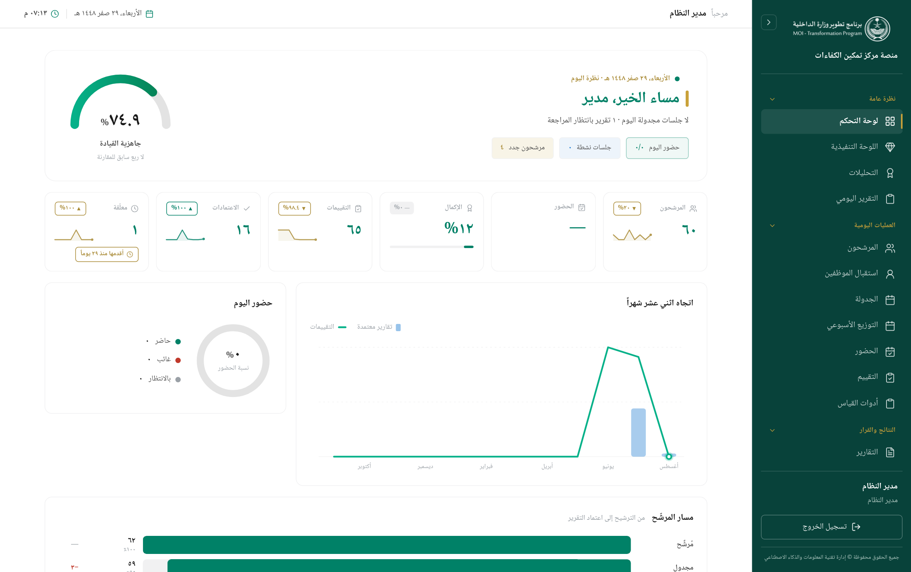

**من يفتحها:** كل مستخدم مُصادَق. المسار `/dashboard` وحده بلا `meta.perm` في موجّه الصفحات، وهو أيضاً الوجهة التي يُعاد إليها من كتب رابط شاشة لا يملك صلاحيتها. ومسار الخادم `GET /dashboard/overview` بلا بوّابة صلاحية واحدة على الطلب كلّه: **المنع هنا قسمٌ قسم لا 403 على الصفحة** — وإلا صار لبعض الأدوار نظامٌ بلا مدخل.

الشاشة نداءٌ واحد يغذّي الأقسام العليا، وندَاءان مستقلّان لبطاقتَي **مسوداتي** و**أحدث النشاط**، ونداءٌ رابع لبطاقة **تهيئة المنصّة**. كل قسم لا تملك صلاحيته يعود من الخادم `null` فيختفي من الصفحة بالكامل بدل أن يترك فجوة.

#### ما تراه في الشاشة

| العنصر | معناه |
|---|---|
| **تهيئة المنصّة** | بطاقة إرشاد أعلى الصفحة، تظهر ما دامت خطوة إلزامية ناقصة |
| «أكمل الخطوات بالترتيب — كل خطوة تعتمد على ما قبلها.» | الترتيب تبعيّ لا تفضيلي: لا مشارك بلا قطاع، ولا تقييم بلا كفاءات مربوطة بأنشطة |
| العدّاد `٣/٤` وشريط التقدّم | المنجَز من **الخطوات الإلزامية** وحدها، لا من الستّ كلها |
| **ابدأ** / **مراجعة** | زرّ الخطوة: «ابدأ» لغير المنجَزة، و«مراجعة» للمنجَزة |
| **اختياري الآن** | خطوة غير إلزامية — لا توقف التشغيل ولا تُحتسب في العدّاد |
| الخطوات الستّ | القطاعات · الرتب المُدارة · الكفاءات · ربط الكفاءات بالأنشطة · حسابات الموظّفين · المشاركون |
| شريط الترحيب | التاريخ الهجري ثم «· نظرة اليوم»، والتحية تتبع الساعة: **صباح الخير** قبل الظهر و**مساء الخير** بعده، يليها اسمك الأول |
| السطر تحت التحية | جلسات اليوم وتقارير الانتظار. بلا أيّ منهما يُكتب «نظرة موجزة على حال المركز اليوم.» |
| شريحة **حضور اليوم** | حاضر/إجمالي جلسات اليوم |
| شريحة **جلسات نشطة** | عدد جلسات اليوم |
| شريحة **مرشحون جدد** | المضافون في آخر ٣٠ يوماً |
| **جاهزية القيادة** | متوسط (التوافق السلوكي + الفنّي) ÷ ٢ على التقارير المعتمدة ضمن نطاقك |
| «لا ربع سابق للمقارنة» | السطر تحت المقياس حين لا يوجد ربعٌ سابق بتقارير معتمدة تُقارن به |
| «+٣ نقطة عن الربع السابق» | الفرق **بالنقاط المئوية** بين الربع الحالي والذي قبله، لا نسبة تغيّر |

**بطاقات المؤشرات الستّ** — كلٌّ منها رابط يفتح الشاشة التي تشرح رقمها:

| البطاقة | ما تعدّه | تفتح |
|---|---|---|
| **المرشحون** | إجمالي من تراهم أنت | `/candidates` |
| **الحضور** | نسبة حضور جلسات اليوم | `/attendance` |
| **الإكمال** | نسبة المشاركين المكتملين من إجماليهم | `/candidates?status=completed` |
| **التقييمات** | التقييمات المُسلَّمة والمعتمدة | `/assessment` |
| **الاعتمادات** | التقارير المعتمدة | `/reports?status=approved` |
| **معلّقة** | التقارير في أي مرحلة من سلسلة الاعتماد | `/reports?status=pending` |

الفرق أعلى كل بطاقة (▲ أو ▼ ونسبة) يقارن آخر ٣٠ يوماً بالـ٣٠ يوماً التي قبلها. **معلّقة** وحدها يُقرأ صعودها تحذيراً لا نجاحاً: ارتفاع طابور الاعتماد سيّئ، فيُلوَّن ▲ فيها بلون التحذير. و«—» في موضع الرقم تعني أن القيمة مجهولة لا صفر.


**البطاقات الكبرى:**

| البطاقة | ما فيها |
|---|---|
| **اتجاه اثني عشر شهراً** | أعمدة = **تقارير معتمدة**، خطّ = **التقييمات**. بلا بيانات: «لا توجد بيانات كافية لعرض الاتجاه» |
| **حضور اليوم** | حلقة **نسبة الحضور**، وثلاثة روابط: **حاضر** · **غائب** · **بالانتظار** |
| **خريطة الكفاءات حسب اليوم** | ستّ كفاءات كحدٍّ أقصى × أيام الأسبوع. بلا قياسات: «لا توجد قياسات لهذا الأسبوع» |
| **رؤى تلقائية** | حتى أربع رؤى مولّدة من بيانات المركز. بلا رؤى: «لا توجد رؤى متاحة حالياً» |
| **جدول اليوم** | حتى ستّ جلسات: الوقت ثم «النشاط — الفئة القيادية». بلا جلسات: «لا جلسات مجدولة اليوم.» |
| **مسوداتي** | تقييماتك أنت التي لم تُرسَل بعد: رمز المشارك، والنشاط، و«N كفاءة مُقيّمة»، وزرّ **استكمال** |
| **أحدث النشاط** | آخر ستّ حركات من سجل التدقيق: الفاعل · الإجراء · «قبل N دقيقة» |
| **إجراءات سريعة** | **المرشحون** · **بدء تقييم** · **الحضور** · **التقارير** |

#### كيف تعمل فيها

**١) قراءة نظرة اليوم**

1. افتح **لوحة التحكم** من الشريط الجانبي.
2. اقرأ السطر أسفل التحية — يجمع جلسات اليوم وتقارير الانتظار في جملة واحدة.
3. اقرأ الشرائح الثلاث تحته، ثم مقياس **جاهزية القيادة** على الطرف.

النتيجة: تعرف حجم يومك وحال الجاهزية قبل فتح أي شاشة أخرى.

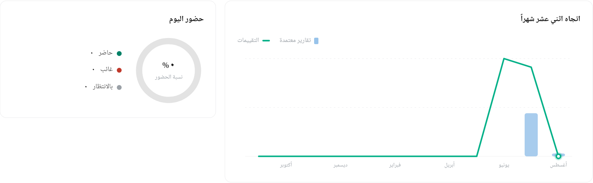

**٢) الانتقال من مؤشّر إلى شاشته**

1. اضغط بطاقة المؤشّر (مثلاً **معلّقة**).
2. تُفتح الشاشة المعنيّة والمرشِّح مطبَّقٌ فيها مسبقاً.

النتيجة: تصل إلى الصفوف التي كوّنت الرقم مباشرةً، لا إلى قائمة كاملة تبحث فيها.

**٣) إكمال تهيئة المنصّة**

1. اضغط **ابدأ** أمام أول خطوة غير مكتملة.
2. أنجز ما تطلبه الشاشة التي فُتحت.
3. ارجع إلى **لوحة التحكم**.

النتيجة: يرتفع العدّاد وشريط التقدّم، ويتحوّل زرّ الخطوة إلى **مراجعة** ويظهر بجانب عنوانها عدد ما أُدخل. وعند اكتمال الخطوات الإلزامية الأربع تختفي البطاقة من تلقائها.


**٤) استكمال مسودة تقييم**

1. في بطاقة **مسوداتي** حدّد الصفّ برمز المشارك ونشاطه.
2. اضغط **استكمال**.

النتيجة: تُفتح شاشة التقييم على المسودة نفسها لا على تقييم جديد.

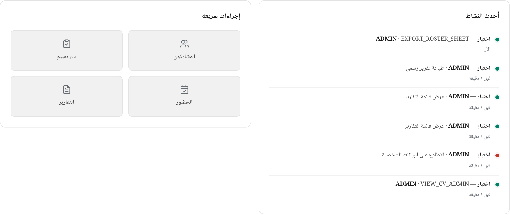

**٥) متابعة حضور اليوم**

1. في بطاقة **حضور اليوم** اضغط **حاضر** أو **غائب** أو **بالانتظار**.

النتيجة: تُفتح شاشة الحضور مقصورةً على تلك الحالة وحدها.

**٦) فتح جدول اليوم كاملاً**

1. البطاقة تعرض ستّ جلسات بحدٍّ أقصى. إن كان اليوم أزحم ظهر أسفلها سطر **و{العدد} جلسة أخرى — عرض الجدول كاملاً**.
2. اضغطه.

النتيجة: تُفتح شاشة الجدولة بالجلسات كلها.

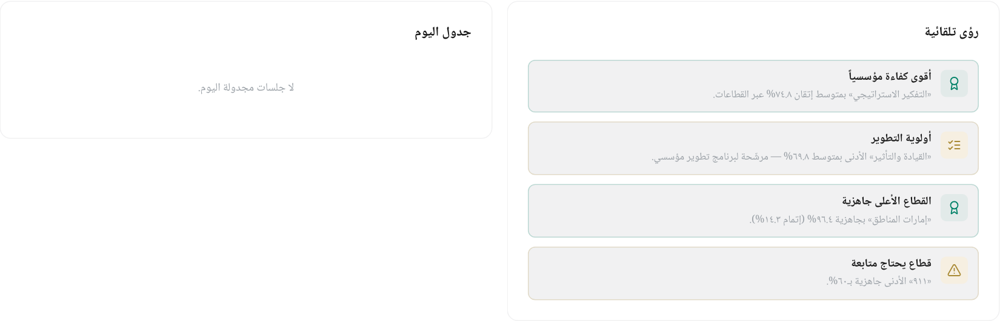

**٧) قراءة خريطة الكفاءات**

1. مرّر المؤشر فوق أي خليّة.
2. تظهر الكفاءة واليوم والنسبة وعدد العيّنات.
3. اقرأ طرفَي التدرّج المكتوبين أسفل الخريطة قبل الحكم على لون خليّة.

النتيجة: تعرف موضع الخليّة من مدى **هذه الشاشة** لا من مدى ٠–١٠٠٪ — فالتدرّج مُعايَر على بيانات الأسبوع نفسها، والخليّة الباهتة قد تكون ٦٤٪ لا ضعيفة.

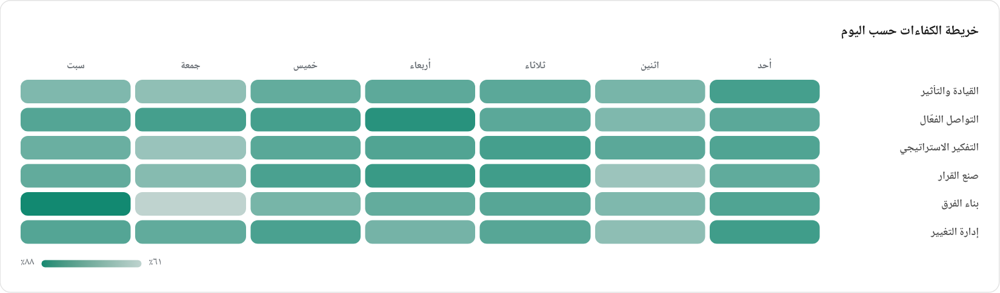

**٨) إعادة المحاولة بعد فشل التحميل**

1. عند ظهور شريط **تعذّر تحميل نظرة اليوم.** اضغط **إعادة المحاولة**.

النتيجة: يُعاد نداء النظرة وحده دون إعادة تحميل الصفحة.

#### ما يمنعه النظام ولماذا

- **لا 403 على الشاشة كلها.** المنع قسمٌ قسم: من لا يملك التحليلات يبقى له جدوله وحضوره. جعْلُ الصفحة كلها محروسةً كان يترك بعض الأدوار بلا مدخل إلى النظام.
- **الأقسام التحليلية الأربعة** — جاهزية القيادة، واتجاه اثني عشر شهراً، وخريطة الكفاءات، والرؤى التلقائية — لا تظهر إلا لحامل `analytics.view`. مستشار المقابلة والاستقبال لا يرونها إطلاقاً.
- **بطاقة جدول اليوم** تحتاج `schedule.view`، و**حضور اليوم** تحتاج `attendance.view`، وكل بطاقة مؤشّر تحتاج صلاحية بابها: `candidate.view` للمرشحين والإكمال، و`evaluation.view` للتقييمات، و`report.view` للاعتمادات والمعلّقة.
- **لا اسم في جدول اليوم إطلاقاً.** عنوان الجلسة نشاطٌ وفئةٌ قيادية فقط («مقابلة شخصية — القيادة العليا»). الاسم صلاحية مستقلّة، والبطاقة تُعرض لكل من يملك `schedule.view` — فلا اسم فيها أصلاً بدل أن يُحجب لاحقاً.
- **ما تعدّه اللوحة لا يتجاوز ما تعرضه شاشة القائمة لصاحبها.** كل عدّاد يمرّ بحدّ التصنيف وحدّ القطاع نفسهما اللذين يحرسان شاشات القوائم. عملياً: مدير النظام يقرأ **٥٩** في بطاقة المرشحين، ومسؤول الاستقبال يقرأ **٤٥** — الفرق هم المصنَّفون الذين لا يملك رؤيتهم.
- **المقيّم المحصور بقطاع لا يَعدّ إلا تقييماته هو وتقارير من قيّمهم**، لا كل ما في قطاعه — وإلا أفشى العدّاد حجم ما تخفيه عنه شاشة تقييماته.
- **المحصور بقطاع لا يُعطى رؤى تلقائية البتّة.** الرؤى تقارن القطاعات ببعضها، و«القطاع الأعلى جاهزية» جملةٌ تُفشي ما وراء حدّه. تصله قائمة فارغة لا رسالة منع.
- **بطاقة تهيئة المنصّة لحامل `settings.manage` وحده.** غيره يتلقّى ردّ منع من الخادم ولا يرى شيئاً: الإرشاد لمن يستطيع تنفيذه، ولا فائدة من دلالة أحدٍ على شاشات لا يملكها.
- **مسوداتي مسوداتك أنت.** القائمة محصورة بالمقيّم صاحب الحساب في الخادم، فلا تظهر فيها مسودة زميل ولو كان في قطاعك.
- **أحدث النشاط لحامل `audit.view` وحده** (مدير النظام ومدير المركز). غيره لا يرى البطاقة ولا رسالة منع.
- **نقص الصلاحية يُخفي بصمت، والعطل يُقال صراحةً.** فشل الشبكة يظهر شريطاً بزرّ إعادة محاولة، لأن مستخدماً انقطعت شبكته كان سيقرأ «ليس لك صلاحية» ولا يجد ما يعيد به المحاولة.
- **يومٌ بلا جلسات نسبةُ حضوره «—» لا صفر.** الصفر كان يُقرأ «لم يحضر أحد»، فيصير كلُّ يوم عطلة إنذارَ انهيارِ حضورٍ أحمر بلا واقعة.
- **خليّة بلا عيّنة في الخريطة باهتة لا مظلمة**: «لا نعلم» ليست «صفر إتقان».
- **الإخفاء في الواجهة راحة لا حماية.** كل ما سبق مطبَّق على الخادم؛ استدعاء `/api/dashboard/overview` مباشرةً يعيد `null` في الأقسام نفسها.


#### رسائل الخطأ

| الرسالة | معناها | ما تفعله |
|---|---|---|
| **تعذّر تحميل نظرة اليوم.** | لم تعُد استجابة النظرة — انقطاع شبكة أو الخادم لا يستجيب. ليست نقص صلاحية | اضغط **إعادة المحاولة**. إن تكرّر فراجع اتصالك ثم مدير النظام |
| قسم غائب بلا أي رسالة | لا تملك صلاحيته — الإخفاء مقصود | لا شيء. اطلب الصلاحية من مدير النظام إن كانت من عملك |
| «—» في بطاقة مؤشّر | القيمة مجهولة لا صفر (مثلاً نسبة حضورٍ ليوم بلا جلسات) | لا شيء — يظهر الرقم حين تتوافر بياناته |
| «لا ربع سابق للمقارنة» | لا تقارير معتمدة في الربع السابق تُقارن بها الجاهزية | لا شيء — يظهر الفرق بعد اكتمال ربع كامل |
| «لا جلسات مجدولة اليوم.» | لا جلسة في جدول اليوم ضمن نطاقك | راجع شاشة **الجدولة** إن كنت تتوقّع جلسات |
| «لا توجد بيانات كافية لعرض الاتجاه» | لا تقييمات ولا تقارير معتمدة في الاثني عشر شهراً الماضية | لا شيء — يُرسَم الاتجاه بعد أول شهر بمعطيات |
| «لا توجد قياسات لهذا الأسبوع» | لا درجات مرصودة على كفاءات في المدى المعروض | لا شيء |
| «لا توجد رؤى متاحة حالياً» | لا بيانات تكفي لتوليد رؤية، أو أنت محصور بقطاع فلا تُعطى مقارنات القطاعات | لا شيء |

---

### المرشحون


**من يفتحها:** `candidate.view` — مدير النظام، ومدير المركز، ومسؤول الجدولة، ومسؤول استقبال الموظفين، ومسؤول العمليات، ومدير إدارة التقييم، ومستشار المقابلة، ومستشار حلقة النقاش، ومساعد التقييم، وإدارة تطوير الكفاءات، ومشرف أدوات القياس. المستخدم الخارجي لا يفتحها.

عنوان الشاشة **قاعدة المرشحين**، وتحته سطر ثابت: «الأسماء محمية — تظهر كرموز حسب صلاحيتك». منها يُدخَل المشارك ويُعتمد ويُعدَّل ويُحذف، وتُقرأ تفاصيله وسيرته ورحلته، وتُطبع بطاقته وكشف اليوم.

الجدول **رموز لا أسماء لكل الأدوار بلا استثناء**، والبحث فيه بالرمز وحده. الاسم يظهر داخل بطاقة التفاصيل، ولحامل `candidate.view_names` فقط.

#### عناصر الشاشة

**شريط الأدوات (أعلى اليسار)**

| الزرّ | ما يفعله | من يراه |
|---|---|---|
| **كشف الحضور** | يفتح نافذة طباعة كشف حضور المشاركين ليومٍ محدَّد | حامل `schedule.view` |
| **تصدير** | ينزّل ملف CSV بما تُظهره المرشّحات الحالية — لا الصفحة المعروضة وحدها | كل من يفتح الشاشة |
| **استيراد** | استيراد جماعي من ملف Excel، مع نموذج جاهز ومعاينة قبل الإرسال | حامل `candidate.create` |
| **إضافة مرشح** | يفتح نموذج «إضافة مرشح جديد» | حامل `candidate.create` |

**العدّادات**: «الإجمالي»، «قيادة عليا»، «قيادة وسطى»، ثم «مسودة» و«معتمد»، وبطاقة «مصنّف» تظهر فقط إن وُجد سرّي أو سرّي للغاية ضمن نطاقك. العدّادات محصورة بنطاقك مثل الجدول تماماً.

**المرشّحات**

| المرشّح | ما يفعله |
|---|---|
| **بحث بالرمز...** | بحث جزئي في **رمز المشارك** فقط، يُنفَّذ بعد ثلث ثانية من آخر حرف تكتبه |
| **كل القطاعات** | حصر على قطاع واحد |
| **كل الفئات** | «قيادة عليا» أو «قيادة وسطى» |
| **كل التصنيفات** | «عادي» أو «سرّي» أو «سرّي للغاية» |
| **كل الحالات** | «مسودة»، «مجدول»، «مُقيّم»، «معتمد»، «مكتمل» |
| **مسح** | يمسح المرشّحات كلها والتحديد ويعيدك إلى الصفحة الأولى |

**أعمدة الجدول** — كلها قابلة للفرز بالضغط على عنوانها عدا «إجراءات»:

| العمود | ما يعرضه |
|---|---|
| مربّع التحديد | تحديد الصفّ. المربّع في الترويسة يحدّد **صفوف هذه الصفحة** فقط |
| **الرمز** | رمز المشارك، ومعه وسم **غياب** إن سُجّل له غياب في جلسة |
| **القطاع** | اسم القطاع (الفرز فيه هجائي باسم القطاع) |
| **الرتبة** | الرتبة أو المرتبة كما أُدخلت |
| **الفئة** | «عليا» أو «وسطى» — تُحسب آلياً من الرتبة |
| **التصنيف** | «عادي» أو «سرّي» أو «سرّي للغاية»؛ صفوف المصنَّفين بخلفية مميّزة |
| **الحالة** | «مسودة» / «مجدول» / «مُقيّم» / «معتمد» / «مكتمل» |
| **إجراءات** | أيقونات الصفّ أدناه |

**أيقونات الصفّ**

| الأيقونة | ما تفعله | متى تظهر |
|---|---|---|
| **تفاصيل** | تفتح بطاقة المشارك وسجل دوراته | دائماً |
| **طباعة بطاقة المشارك** | تفتح بطاقة هذا المشارك في تبويب جديد | دائماً |
| **إعادة جدولة الغياب** | تفتح نافذة إعادة جدولة جلسة تغيّب عنها | إن كان في صفّه وسم **غياب** ولديك `candidate.edit` |
| **تعديل** | تفتح النموذج معبّأً ببياناته | لحامل `candidate.edit` |
| **اعتماد** | ينقل الحالة من «مسودة» إلى «مجدول» | لصفٍّ حالته «مسودة» |
| **حذف** | يفتح تأكيد الحذف الموثّق | لصفٍّ حالته «مسودة» أو «مجدول» |

**شريط التحديد** (يظهر فور تحديد صفٍّ واحد): «N محدَّد»، و**مسح التحديد**، و**طباعة بطاقات المشاركين**، و**إسناد لمجموعة** لحامل `roster.manage`.

**شريط الترقيم** (أسفل الجدول): عدّاد «١–٥٠ من ٥٩» حين تتعدّد الصفحات، أو «٥٩ مرشّح» حين تسعها صفحة واحدة؛ وأزرار ««» و«السابقة» و«صفحة ١ من ٢» و«التالية» و«»»؛ وقائمة حجم الصفحة: «٢٥ صفّاً» / «٥٠ صفّاً» / «١٠٠ صفّ» / «٢٠٠ صفّ».

حين لا تطابق المرشّحاتِ نتيجةٌ تظهر رسالة **«لا يوجد مرشحون مطابقون»** مكان الجدول.

#### كيف تعمل فيها

**١) البحث والترشيح والفرز**

1. اكتب رمز المشارك في «بحث بالرمز...» — النتيجة تُجلب بعد توقّفك عن الكتابة بثلث ثانية.
2. اختر ما تحتاجه من «كل القطاعات» و«كل الفئات» و«كل التصنيفات» و«كل الحالات».
3. اضغط عنوان أي عمود لفرزه، واضغطه ثانيةً لعكس الاتجاه.
4. اضغط «مسح» للعودة إلى القائمة كاملة.

كل تغيير في مرشّح أو في الفرز يعيدك إلى **الصفحة الأولى**، ويُطلب من الخادم صفحةً واحدة لا القائمة كلها.

**٢) إضافة مرشح**


1. اضغط **إضافة مرشح**.
2. أدخل **رقم الهوية** — عشرة أرقام تبدأ بـ١ للمواطن أو ٢ للمقيم.
3. أدخل **الاسم الكامل** رباعياً، ثم اختر **القطاع** — واختياره يفتح قائمة الرتب: **«الرتبة»** للقطاعات العسكرية و**«المرتبة»** للمدنية، ولا يُقبل غير ما فيها. تبديل القطاع بعد الاختيار يُفرِّغ الرتبة، لأن رتبةً عسكرية على قطاع مدني تصنيفها بلا معنى.
4. أدخل **الجوال** بصيغة `05xxxxxxxx` و**البريد الإلكتروني** إن وُجدا — الجوال هو ما تُرسَل إليه رسالة التأكيد ورابطها.
5. اختر **نوع التقييم**: «شامل» أو «تنفيذي»، و**التصنيف الأمني**: «عادي» أو «سرّي» أو «سرّي للغاية».
6. اضغط **حفظ المرشح**.

النتيجة: تظهر بطاقة «تمت إضافة المرشح» تحمل **رمز المشارك** وزرّ **نسخ**، وفئة القيادة، وسطر حالة الرسالة: «جُدولت رسالة تأكيد للمرشح» أو «تعذّرت جدولة رسالة التأكيد» أو «لا جوّال مسجّل — لم تُجدول رسالة». وإن كانت بوّابة التحقق من الهوية مُعَدّة أُضيف سطر: «تطابقت هوية المرشّح» أو «لم تتطابق الهوية — راجِع البيانات» أو «تعذّر التحقق من الهوية» أو «التحقق من الهوية في وضع التطوير».

الرمز يُولَّد تلقائياً من بادئة القطاع، والفئة تُحسب من الرتبة، والبيانات الحسّاسة تُشفَّر. لا تُدخِل الرمز يدوياً.

**٣) تعديل بيانات مرشح**

1. اضغط أيقونة **تعديل** في صفّه.
2. عدّل ما تحتاجه في النموذج نفسه.
3. اضغط **حفظ التعديل**.

النتيجة: «تم تحديث بيانات المرشح». تغيير الرتبة أو القطاع يُعيد حساب الفئة، وتغيير نوع التقييم يُزامَن مع **الدورة الحالية غير المكتملة فقط** — الدورة المكتملة سجلٌّ تاريخي لا يُعاد كتابته.

**٤) اعتماد مرشح**

1. اضغط أيقونة **اعتماد** (✓) في صفٍّ حالته «مسودة».

النتيجة: «تم اعتماد <الرمز>»، وتصير الحالة «مجدول» وتُزامَن معها دورة التقييم الحالية.

**٥) حذف موثّق**

1. اضغط أيقونة **حذف** في صفٍّ حالته «مسودة» أو «مجدول».
2. اكتب **سبب الحذف** (خمسة أحرف على الأقل) في حقل «مثال: مُدخل بالخطأ، مكرّر...».
3. اضغط **حذف موثّق**.

النتيجة: «تم حذف <الرمز> (موثّق)». الحذف وكتابة سببه في سجل التدقيق يقعان في معاملة واحدة.

**٦) قراءة تفاصيل المشارك وسجل دوراته**


1. اضغط أيقونة **تفاصيل** في صفّه.
2. اقرأ البطاقة: الرمز، ثم الاسم ورقم الهوية والجوال والبريد (لحامل صلاحية الأسماء وحده)، ثم القطاع والرتبة والفئة والحالة والتصنيف الأمني.
3. انزل إلى **سجل دورات التقييم**: لكل دورة رمزها وحالتها وتاريخها، وتحتها تقييماتها (النشاط: «مقابلة شخصية» أو «حلقة نقاش»، وحالته: «مسودة» / «مُرسل» / «معتمد»، واسم المقيّم، ودرجات الكفاءات)، وسطر «التقرير — التوصية: …» إن وُجد تقرير.

من لا يملك `candidate.view_names` يرى في البطاقة: «ليس لديك صلاحية عرض البيانات الشخصية.»

**٧) تغيير التصنيف الأمني**

1. افتح **تفاصيل** المشارك.
2. من قائمة **التصنيف الأمني** اختر «عادي» أو «🟠 سرّي» أو «🔴 سرّي للغاية».

النتيجة: «تم تحديث التصنيف»، ويُكتب في سجل التدقيق التصنيف السابق والجديد معاً. تحتاج `candidate.view_classified`.

**٨) السيرة الذاتية**

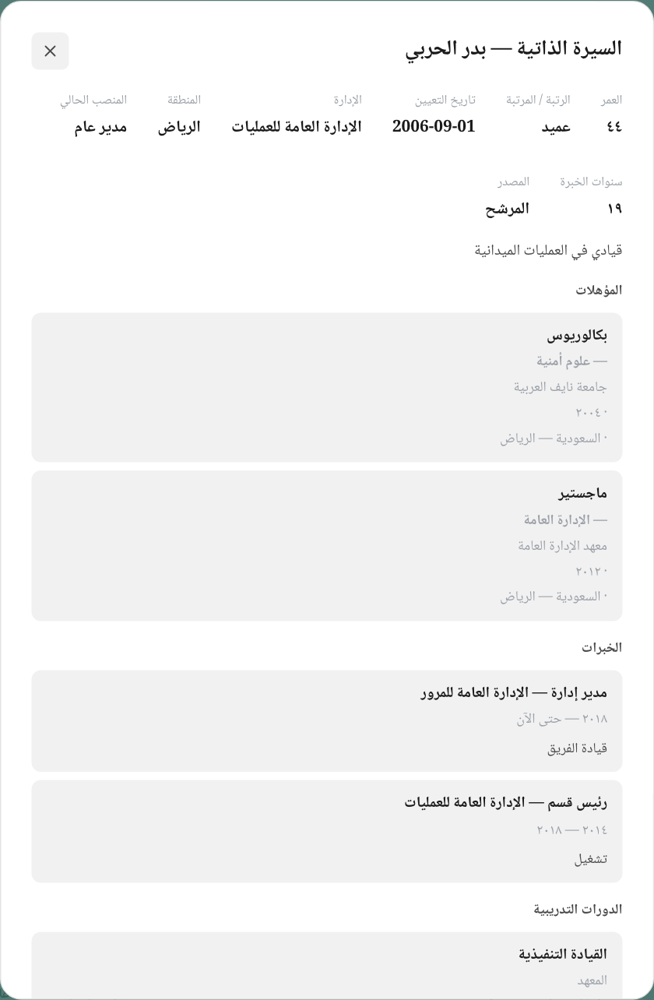

1. افتح **تفاصيل** المشارك ثم اضغط **السيرة الذاتية** (تحتاج `candidate.cv_view`).
2. اقرأ البطاقة العلوية: العمر، الرتبة / المرتبة، تاريخ التعيين، الإدارة، المنطقة، المنصب الحالي، سنوات الخبرة، و**المصدر**: «الإدارة» أو «المرشح» أو «جهة خارجية».
3. اقرأ أسفلها: النبذة، ثم **المؤهلات** و**الخبرات** و**الدورات التدريبية**.
4. للطباعة اضغط **طباعة النموذج** — يفتح نموذج السيرة المعتمد في تبويب جديد.
5. للتصحيح اضغط **تعديل السيرة** (تحتاج `candidate.edit` مع صلاحية رؤية الأسماء)، وعبّئ **البيانات الوظيفية**: تاريخ الميلاد (ميلادي وهجري متقابلان — إدخال أحدهما يملأ الآخر)، تاريخ التعيين، الرتبة / المرتبة، الإدارة، المنطقة.
6. أضف العناصر بأزرار **إضافة مؤهل** و**إضافة خبرة** و**إضافة دورة**، واحذف ما لا يلزم بأيقونة السلة في رأس العنصر.
7. اضغط **حفظ**.

النتيجة: «تم حفظ السيرة»، ويصير مصدر السيرة «الإدارة».

إن اختلفت الرتبة التي أقرّ بها المرشّح عن رتبته في ملفّه ظهر تنبيه أعلى السيرة: «أقرّ المرشّح برتبة «…» وفي ملفّه «…» — راجِع أيّهما الصحيح. الرتبة في الملفّ لم تتغيّر، وهي التي تقود تصنيف الفئة.» — القرار قرارك، والنظام لا يستبدل الرتبة الرسمية من تلقائه.

**٩) رحلة المرشح**

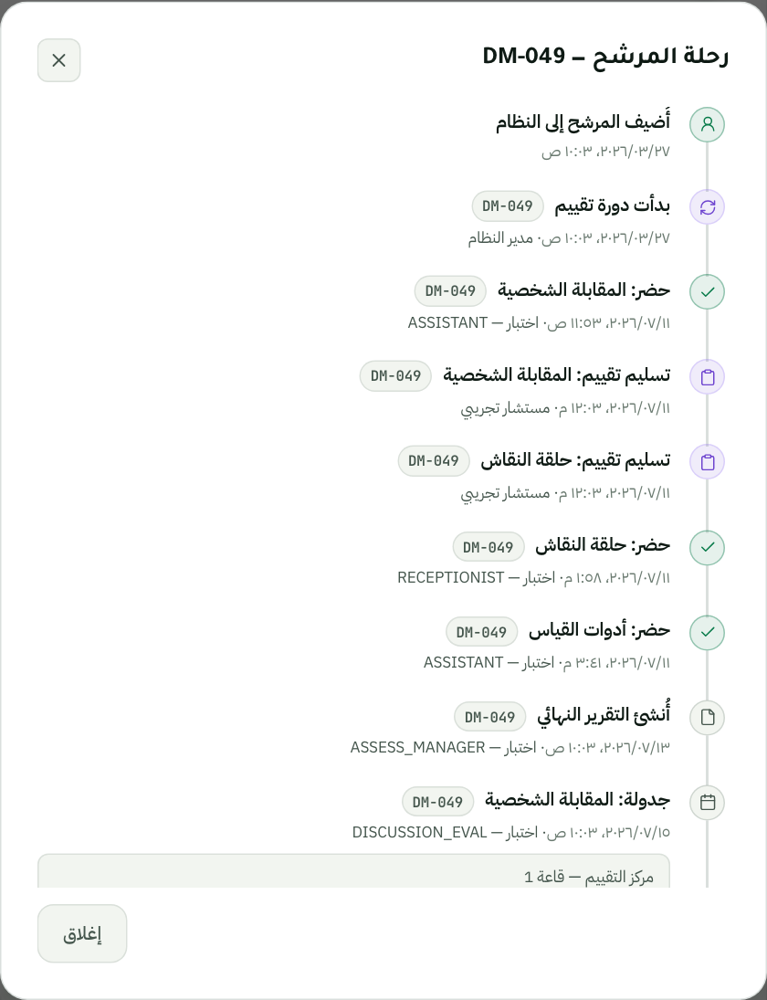

1. افتح **تفاصيل** المشارك ثم اضغط **رحلة المرشح** (تحتاج `candidate.journey`).
2. اقرأ الخط الزمني من الأقدم إلى الأحدث: «أُضيف المرشح إلى النظام»، «بدأت دورة تقييم»، «جدولة: …»، «حضر: …» أو «غياب: …»، «تسليم تقييم: …» أو «مسودة تقييم: …»، «أُنشئ التقرير النهائي»، «أُعيد التقرير للتعديل»، «أُرسل التقرير للاعتماد»، «اعتُمد التقرير نهائياً».

كل حدث يحمل وقته ومنفّذه ورمز الدورة التي وقع فيها.

**١٠) طباعة بطاقات المشاركين**

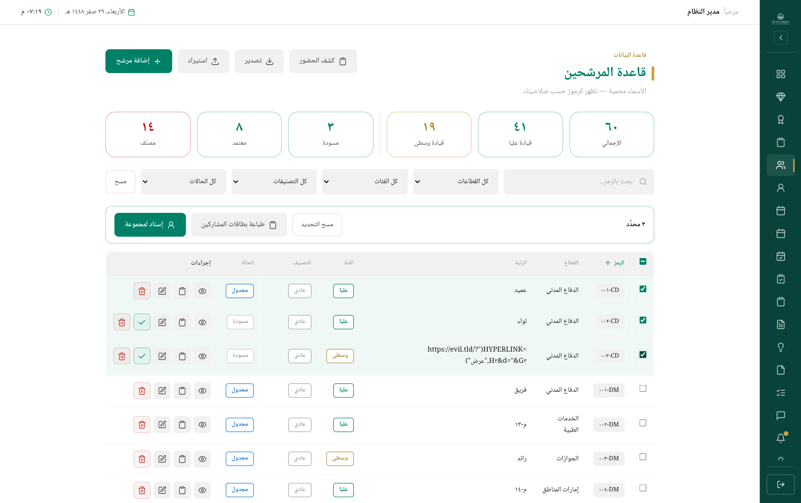

1. لبطاقة واحدة: اضغط أيقونة **طباعة بطاقة المشارك** في صفّه.
2. لعدّة بطاقات: حدّد الصفوف من مربّعاتها، ثم اضغط **طباعة بطاقات المشاركين** في شريط التحديد.
3. اطبع من التبويب الجديد أو احفظه PDF.

البطاقة تحمل **رمز المشارك وحده** بلا اسم. الحدّ الأعلى ٥٠٠ بطاقة في المرة، ويلزم السماح بالنوافذ المنبثقة في المتصفّح.

**١١) إسناد مجموعة كشف اليوم (أ / ب)**


1. حدّد المشاركين من مربّعات صفوفهم.
2. اضغط **إسناد لمجموعة** (تحتاج `roster.manage`).
3. اختر **اليوم**، ثم المجموعة **أ** أو **ب**.
4. اضغط **إسناد**.

النتيجة: «تم إسناد N مشاركاً للمجموعة أ»، ويُلحق بها « — سقط N خارج نطاقك» إن كان في تحديدك من ليس ضمن نطاقك. المجموعة تحدّد أيّ فترة يبدأ بها كلٌّ منهم — المقابلة أو حلقة النقاش. الحدّ ٢٠٠ مشارك في المرة الواحدة.

**١٢) كشف حضور المشاركين**

1. اضغط **كشف الحضور**.
2. اختر **اليوم**.
3. من **الهوية الوطنية** اختر «إخفاء» أو «إظهار». الخيار الثاني مُعطَّل لمن لا يملك صلاحية رؤية الأسماء، ويظهر تحته: «صلاحيتك لا تسمح بطباعة أرقام الهوية — يُطبع الكشف بالرموز». ولمن يملكها: «إظهار الهوية يُسجَّل في سجل التدقيق باسمك».
4. اضغط **فتح الكشف**.

النتيجة: يفتح الكشف في تبويب جديد بأعمدته المعتمدة: «م»، «ج»، «الهوية الوطنية»، «الرتبة/المرتبة»، «رمز المشارك»، «التوقيع»، وأعمدة المقيّمين ومساعديهم.

**١٣) تصدير القائمة**

1. اضبط المرشّحات على الشريحة التي تريدها.
2. اضغط **تصدير**.

النتيجة: ينزّل ملف `candidates-<التاريخ>.csv` وتظهر رسالة «تم تصدير N مرشح (مع الأسماء)» أو «(رموز فقط)» بحسب صلاحيتك. أعمدة الملف: الرمز، القطاع، الرتبة، الفئة، الحالة، التصنيف — ويُضاف الاسم والهوية لحامل `candidate.view_names`. التصدير يُصدّر **كل** المطابق للمرشّحات لا الصفحة المعروضة، ويُسجَّل في سجل التدقيق بعدده وبما إذا حوى أسماء.

**١٤) استيراد جماعي من ملف Excel**

1. اضغط **استيراد**.
2. اضغط **تنزيل النموذج**. ينزّل ملف `نموذج-استيراد-المرشحين.xlsx` فيه ورقتان: «المرشحون» بأعمدتها وصفَّين مثالين تحذفهما، و«القطاعات» بأسماء القطاعات المتاحة في المنصّة ورموزها.
3. عبّئ الملف في Excel — صفٌّ لكل مشارك — واحفظه.
4. ارجع إلى النافذة وأسقط الملف في المربّع، أو اضغطه لتختاره. يُقبل `.xlsx` و`.csv`، وحتى ٥٠٠ صفّ في المرّة.
5. **راجِع الجدول قبل أن تضغط شيئاً.** يُفحص كل صفّ في متصفّحك قبل أن يُرسَل أيّ شيء إلى الخادم: تظهر ثلاثة عدّادات (صالح · مرفوض · الإجمالي)، وجدولٌ فيه كل صفّ وحالته، والمرفوض بجانبه **كل** أسباب رفضه لا أوّلها فقط. تستطيع عرض «المرفوض» وحده لتصحيحه.
6. اضغط **استيراد N مرشحاً**.

**الأعمدة الستّة**: رقم الهوية · الاسم الكامل · الجوال · البريد الإلكتروني · القطاع · الرتبة / المرتبة. الجوال والبريد وحدهما اختياريان.

**ترتيبها لا يهمّ، وأسماؤها هي التي تهمّ.** تُقرأ الأعمدة بأسماء ترويستها أينما وقعت، فملفّ الجهة بثمانين عموداً يُرفع كما هو ولا يُعاد بناؤه — يكفي أن تحمل ترويسته هذه الأسماء (أو مرادفاتها المعروفة مثل «الهوية» و«رقم الجوال»). والترويسة لا يُشترط أن تكون أول صفّ: يُبحَث عنها في أول خمسة صفوف. **وتُعرض لك الأعمدة التي قُرئت قبل الاستيراد** — راجِعها، فالملفّ قد يحمل عمودين متشابهين.

**الرتبة / المرتبة** تُطابَق على القائمة المعتمدة بحسب نوع القطاع: العسكرية للقطاعات العسكرية والمدنية للمدنية. وغير المُدرَج يُرفض — ومن الرتبة تُصنَّف الفئة القيادية (عليا أو وسطى)، فرتبةٌ غير معروفة كانت تدخل وتُصنَّف «وسطى» صامتةً. وورقة **«الرتب والمراتب»** في النموذج تسرد المتاح وفئة كلٍّ منه.

**القطاع** يُكتب بالاسم العربي كما يظهر في المنصّة (مثل «الأمن العام»)، ويُقبل كذلك رمزه. والمطابقة تتسامح مع الهمزات والتاء المربوطة و«ال» التعريف، فـ«الامن العام» و«الأمن العام» سواء.

**رقم الهوية** يُفحص كما يُفحص في نموذج الإضافة تماماً: عشرة أرقام، يبدأ بـ١ (مواطن) أو ٢ (مقيم)، ويجتاز المجموع التحقّقي. واحفظ العمود نصّاً في Excel كي لا يُسقط البرنامج صفراً بادئاً.

النتيجة: يُستورَد الصالح وحده. الصفوف المرفوضة **لا تُرسَل ولا تُنشئ شيئاً**، وتبقى معروضة بأسبابها لتصحيحها في ملفّك وإعادة رفعه — والمصحَّح وحده يُرفع، فلا تكرار للناجح. وكل مستورَد يُدخَل بنوع تقييم «شامل» وحالة «مسودة»، وتُنشأ له دورة تقييم ورمز مشارك مثل الإضافة المفردة.

> **ملاحظة**: هوية مسجّلة مسبقاً في المنصّة لا يكشفها متصفّحك (لا يرى القاعدة) بل الخادمُ عند الإرسال، فتعود إلى الجدول بسببها. أمّا تكرار الهوية **داخل ملفّك نفسه** فيُكشف قبل الإرسال.

**١٥) دورة تقييم جديدة لمرشح موجود**

1. افتح **تفاصيل** المشارك.
2. اضغط **تقييم جديد** (تحتاج `candidate.create`).

النتيجة: بطاقة «دورة تقييم جديدة» برمز جديد، وتعود حالته إلى «مسودة». لا يُقبل ما دامت له دورة لم تكتمل.

**١٦) إعادة جدولة جلسة غياب**

1. في صفٍّ يحمل وسم **غياب** اضغط أيقونة **إعادة جدولة الغياب**.
2. اختر **جلسة الغياب** من القائمة (تُختار تلقائياً إن كانت واحدة).
3. حدّد **التاريخ الجديد**، و**الوقت** و**المكان** إن أردت تغييرهما — واتركهما فارغين للإبقاء على السابق.
4. اضغط **إعادة الجدولة**.

النتيجة: «تمت إعادة جدولة <الرمز>». تُنشأ جلسة جديدة بنفس النشاط ونفس الإسناد، وتبقى جلسة الغياب في السجل للتدقيق.

#### ما يمنعه النظام ولماذا


- **لا أسماء في الجدول لأي دور.** القائمة تُبنى بالرموز، والاسم يُقرأ في بطاقة التفاصيل لحامل `candidate.view_names` وحده — وفتحه يُكتب في سجل التدقيق (`VIEW_CANDIDATE_PII`). الأسماء المكشوفة على شاشة مفتوحة أمام الجميع لا تحتاجها أي مهمّة يومية.
- **البحث بالرمز فقط.** الاستعلام يطابق `participant_code` لا الاسم ولا الهوية — كي لا تصير شاشة البحث بابَ استخراجٍ بالاسم.
- **المصنَّفون لا يظهرون** لمن لا يملك `candidate.view_classified`: لا في الجدول، ولا في العدّادات، ولا في التصدير. وفتحهم بالمعرّف مباشرةً يُردّ بـ«المرشح غير موجود» — الردّ لا يفرّق بين «غير موجود» و«ليس لك» كي لا يصير المعرّف أداةً لكشف من هو موجود، والمحاولة تُسجَّل.
- **حدّ القطاع.** مستشار المقابلة ومستشار حلقة النقاش ومساعد التقييم محصورون بقطاعهم، والحصر يُطبَّق **قبل** أي مرشّح يختاره المستخدم — فاختيار قطاعٍ آخر من القائمة لا يوسّع ما يراه. والعدّادات محصورة بالمثل: مؤشّرٌ أوسع من القائمة يُفشي حجم ما تخفيه.
- **التصنيف الأمني لا يُمنح بالإضافة ولا بالتعديل.** تعيين «سرّي» أو «سرّي للغاية» عند الإضافة، وتغييره من نموذج التعديل، كلاهما يتطلّب `candidate.view_classified` — وإلا صار من يملك الإضافة قادراً على إخفاء مرشّح عن غيره.
- **الاعتماد من «مسودة» فقط.** اعتماد مرشّح غادر المسودة مرفوض، لئلا يُعيد اعتمادٌ متأخّر دورةً مكتملة إلى «مجدول».
- **الحذف من «مسودة» أو «مجدول» فقط، وبسبب.** من بدأت عملية تقييمه لا يُحذف، والسبب إلزامي لا يقلّ عن خمسة أحرف، والحذف وسجلّه في معاملة واحدة — فلا حذف بلا أثر، ولا أثر لحذفٍ لم يقع.
- **الهوية المسجّلة مسبقاً لا تُنشئ شخصاً ثانياً.** من يملك `candidate.edit` تُفتح له دورة جديدة للشخص نفسه، ومن لا يملكه يُردّ عليه «هذا المرشح مُضاف مسبقاً في النظام» مع **تاريخ الإضافة فقط** — بلا رمز ولا اسم، ويُفتح له طريق «طلب تحديث البيانات» ليمرّ التغيير باعتماد صاحب صلاحية.
- **دورة نشطة واحدة لكل مشارك.** «تقييم جديد» يُرفض ما دامت له دورة لم تكتمل، فلكل رمز تقييمه.
- **أرقام الهوية في الكشف المطبوع** لا تُطبع إلا لحامل `candidate.view_names`؛ الخيار مُعطَّل في الشاشة، ومُلغى في الخادم ثانيةً، والطباعة تُسجَّل ومعها ما إذا طُلبت الهوية. وثيقة تخرج من المركز أولى بالحصر لا أدنى منه.
- **البطاقات وإسناد المجموعات محصورة بنطاقك.** المعرّفات خارج نطاقك تسقط صامتةً، ويظهر عددها في رسالة الإسناد. البطاقة نفسها تحمل الرمز وحده لأنها تُعلَّق على الصدر.
- **السيرة تُعرض مطموسة «•••»** لمن لا يملك رؤية الأسماء، والتعديل مغلق عليه — وإلا حُفظت النسخة المطموسة فوق السيرة الحقيقية.
- **اسم المرشّح ممنوع داخل السيرة حتى من الإدارة.** حفظ سيرة تحوي اسمه أو معرّفاً يُرفض، لأن هذه الوثيقة نفسها تصل المقيّم بلا اسم.
- **حفظٌ فوق نسخة عُدّلت من جهة أخرى مرفوض** — تُطلب إعادة الفتح بدل الكتابة فوق تعديل غيرك.
- **أزرار الصفّ تتبع حالة الصفّ لا صلاحيتك.** أيقونتا «اعتماد» و«حذف» تظهران بحسب الحالة، والمنع يقع على الخادم: من لا يملك `candidate.approve` يُردّ عليه «ليس لديك صلاحية الاعتماد». والإخفاء في الواجهة راحة لا حماية — كل منع مطبَّق على الخادم أيضاً.

#### رسائل الخطأ

| الرسالة | معناها | ما تفعله |
|---|---|---|
| «تعذّر تحميل المرشحين — تأكد أن الخادم يعمل» | لم تصل القائمة من الخادم | تحقّق من الاتصال ثم أعد تحميل الصفحة |
| «رقم الهوية يجب أن يكون ١٠ أرقام» | الطول غير صحيح | أدخل عشرة أرقام بلا فواصل ولا مسافات |
| «الهوية تبدأ بـ ١ (مواطن) أو ٢ (مقيم)» | أول رقم غير مقبول | صحّح الرقم — الهويات السعودية تبدأ بـ١ أو ٢ |
| «رقم الهوية غير صحيح (فشل التحقق)» | الرقم لم يجتز التحقق الحسابي | راجِع الرقم من مصدره؛ غالباً خطأ نسخ |
| «رقم الجوال يجب أن يبدأ بـ 05 ويتكون من 10 أرقام» | صيغة الجوال غير مقبولة | اكتبه بصيغة `05xxxxxxxx` أو اتركه فارغاً |
| «الاسم مطلوب» / «اختر القطاع» / «الرتبة مطلوبة» | حقل إلزامي فارغ | أكمل الحقل ثم أعد الحفظ |
| «هذا المرشح مُضاف مسبقاً في النظام» | الهوية مسجّلة، وليس لديك صلاحية التعديل | لا تُعِد إدخاله — ارفع «طلب تحديث بيانات المشارك» |
| «رقم الهوية مسجّل مسبقاً لمرشح آخر» | تحاول نقل هوية مستعملة إلى سجلٍّ آخر | راجِع السجلّ صاحب الهوية بدل تكراره |
| «لدى المرشح دورة تقييم نشطة (…) — يجب إكمالها قبل إنشاء دورة جديدة» | له دورة لم تكتمل | أكمل الدورة القائمة ثم أعد المحاولة |
| «لدى المرشح دورة نشطة (…) — يجب إكمالها أولاً» | ضغطت «تقييم جديد» وله دورة مفتوحة | أغلق الدورة الحالية ثم افتح دورة جديدة |
| «لا يمكن اعتماد مرشح غادر حالة المسودة» | حالته ليست «مسودة» | لا إجراء — الاعتماد تمّ سابقاً |
| «لا يمكن حذف مرشح بدأت عملية تقييمه» | حالته «مُقيّم» أو «معتمد» أو «مكتمل» | لا يُحذف؛ عالِج الحالة من مسارها الصحيح |
| «يجب ذكر سبب الحذف (٥ أحرف على الأقل)» / «سبب الحذف قصير جداً» | السبب فارغ أو قصير | اكتب سبباً مفهوماً — يُحفظ في سجل التدقيق |
| «المرشح غير موجود» | خارج نطاقك (قطاع أو تصنيف)، أو محذوف | راجِع من يملك نطاقاً أوسع؛ لا تُعِد المحاولة بالمعرّف |
| «ليس لديك صلاحية …» (الإضافة/التعديل/الحذف/الاعتماد/تغيير التصنيف/عرض السيرة/تعديل السيرة/عرض رحلة المرشح/إسناد مجموعات المشاركين/إعادة الجدولة) | الخادم ردّ الإجراء لغياب الصلاحية | اطلبها من مدير النظام أو حوّل الإجراء لمن يملكها |
| «لا يوجد مشاركون ضمن نطاقك في هذا الاختيار» | كل ما حدّدته خارج نطاقك | راجِع التحديد؛ الصفوف خارج النطاق تسقط صامتة |
| «اختر مشاركاً واحداً على الأقل» | ضغطت الطباعة أو الإسناد بلا تحديد | حدّد صفّاً واحداً على الأقل |
| «الحدّ الأقصى 200 مشارك في المرة الواحدة» | تجاوزت حدّ الإسناد | قسّم التحديد على دفعات |
| «فعّل النوافذ المنبثقة لعرض البطاقات» / «… لعرض الكشف» / «… لعرض النموذج» | المتصفّح منع فتح التبويب | اسمح بالنوافذ المنبثقة لهذا الموقع ثم أعد المحاولة |
| «لا توجد بيانات للتصدير» | المرشّحات الحالية بلا نتيجة | وسّع المرشّحات ثم صدّر |
| «تعذّرت قراءة الملف — تأكّد أنه ‎.xlsx‎ أو ‎.csv‎» | الملف تالف أو بصيغة أخرى (‎.xls‎ القديمة، أو ‎.numbers‎، أو ملفّ محميّ بكلمة مرور) | افتحه في Excel واحفظه باسمٍ جديد بصيغة **مصنّف Excel (‎.xlsx‎)** |
| «الملفّ لا يحتوي صفوفاً» | ورقةٌ فارغة، أو البيانات في ورقةٍ ثانية | ضَع البيانات في **الورقة الأولى** — تُقرأ هي وحدها |
| «الملفّ فيه N صفّاً — عُرضت أول ٥٠٠ فقط» | تجاوزت سقف الدفعة | قسّم الملف على دفعات من ٥٠٠ صفّ |
| «رقم الهوية يجب أن يكون ١٠ أرقام» | خانة ناقصة، أو أسقط Excel صفراً بادئاً بتحويل العمود إلى رقم | نسّق عمود الهوية **نصّاً** في Excel ثم أعد إدخال الأرقام |
| «يجب أن يبدأ بـ١ (مواطن) أو ٢ (مقيم)» | رقم إقامة أو رقم آخر ليس هوية وطنية | راجِع مصدر البيانات |
| «رقم الهوية غير صحيح (فشل التحقّق)» | رقمٌ بعشر خانات لكنه لا يجتاز المجموع التحقّقي — غالباً خطأ نسخٍ أو رقمٌ مقلوب | قارِنه بالمستند الأصلي |
| «الاسم مفقود» / «القطاع مفقود» / «الرتبة مفقودة» أو «المرتبة مفقودة» | خلية إلزامية فارغة | أكملها في الملف |
| «لم أجد عمود «رقم الهوية» ولا عمود «الاسم الكامل» في ترويسة الملفّ» | الترويسة لا تحمل الأسماء المتوقّعة — كثيرٌ من نماذج الجهات لا يحوي عمود هوية أصلاً | أضِف العمودين بهذين الاسمين إلى ملفّك، أو انقل بياناتك إلى النموذج المنزَّل |
| «الرتبة «…» ليست في قائمة الرتب العسكرية» / «المرتبة «…» ليست في قائمة المراتب المدنية» | تسمية خارج القائمة المعتمدة، أو رتبة عسكرية على قطاع مدني | انسخ التسمية من ورقة «الرتب والمراتب» في النموذج. والقائمة تُدار من **الإعدادات** |
| «قطاع غير معروف (…)» | اسمٌ لا يطابق أي قطاع في المنصّة، أو خطأ إملائي | انسخه من ورقة «القطاعات» في النموذج. القطاع الناقص يُضاف من **الإعدادات ← القطاعات** |
| «الجوال يجب أن يبدأ بـ05 ويكون ١٠ أرقام» | صيغة دولية مثل `9665…` أو رقمٌ ناقص | اكتبه بالصيغة المحلّية `05XXXXXXXX` — وإلا لم تصل صاحبَه رسالة الدعوة |
| «صيغة البريد الإلكتروني غير صحيحة» | بريدٌ ناقص أو فيه مسافة | صحّحه أو اتركه فارغاً (اختياري) |
| «مكرّر — ورد في الصفّ N» | الهوية نفسها في صفَّين داخل ملفّك | احذف أحد الصفَّين |
| «هذه الهوية مسجّلة مسبقاً في المنصّة» | المشارك مضاف من قبل — يظهر بعد الإرسال لا قبله | احذف صفّه؛ ولدورة تقييم جديدة استعمل **تقييم جديد** من تفاصيله |
| «تعذّر توليد رمز فريد (تعارض متزامن) — أعد المحاولة» | تصادم رموز لحظي مع مستخدمٍ آخر يضيف في اللحظة نفسها | أعد رفع الصفّ وحده |
| «الحدّ الأقصى ٥٠٠ صفّاً في المرّة الواحدة» | الخادم ردّ دفعةً أكبر من السقف | قسّمها |
| «لا صفّ صالح للاستيراد» | كل الصفوف مرفوضة | صحّح الملف بحسب الأسباب المعروضة وأعد رفعه |
| «أكمل الحقول المميّزة» | حقول إلزامية ناقصة في نموذج السيرة | الحقول الناقصة مُعلَّمة — أكملها |
| «أزِل اسم المرشح أو معرّفاته من السيرة» | السيرة تحوي اسم المشارك أو معرّفاً | احذف الاسم والمعرّفات من النبذة والملخّصات |
| «عُدّلت السيرة من جهة أخرى — أعد الفتح» | عدّلها غيرك أثناء عملك | أغلق النافذة وافتح السيرة من جديد ثم أعد إدخال تعديلك |
| «اختر اليوم» / «اختر جلسة الغياب» / «حدّد التاريخ الجديد» | حقل إلزامي في نافذة الإسناد أو إعادة الجدولة | أكمله ثم أعد الإرسال |
| «تاريخ إعادة الجدولة يجب ألا يكون في الماضي» | اخترت تاريخاً منقضياً | اختر اليوم أو تاريخاً بعده |
| «لا تُعاد جدولة إلا جلسة سُجّل فيها غياب» | الجلسة ليست غياباً | أعِد الجدولة من الجلسة التي سُجّل فيها الغياب |
| «أُعيدت جدولة هذا الغياب مسبقاً» | الغياب استُهلك بجلسة بديلة | افتح الجدولة وراجِع الجلسة الجديدة |

---

### ترشيح مشارك


**من يفتحها:** `candidate.create` — مدير النظام، ومسؤول الجدولة، والمستخدم الخارجي. رابط **ترشيح مشارك** في القائمة الجانبية يُخفى عمّن يملك `candidate.view` (مدير النظام ومسؤول الجدولة) فلا يزدوج عليه بابان لعملٍ واحد، والمسار `/nominate` يبقى مفتوحاً لهما بكتابة العنوان. والمستخدم الخارجي يملك الإضافة ولا يملك القراءة، فيُنزَل على هذه الشاشة مباشرةً بعد تسجيل الدخول. تبويب **طلباتي** لا يظهر إلا لمن يملك `candidate.update_request`: المستخدم الخارجي ومدير النظام.

الشاشة مرآة لنموذج السيرة الذاتية الورقي المعتمد في المركز: بيانات المشارك، ثم التعليم الأكاديمي، ثم الخبرة العملية، ثم الدورات التدريبية — بالترتيب نفسه والمسمّيات نفسها. بيانات المشارك ونموذج سيرته يُرسلان معاً في إرسال واحد. ومن كان مسجّلاً في النظام لا يُكتب فوقه: يُفتح لمقدّم الترشيح طريق **طلب تحديث بيانات المشارك**، ولا يتغيّر السجلّ حتى يعتمده صاحب صلاحية.

**التبويبان والأزرار العامة**

| العنصر | معناه |
|---|---|
| **الترشيح** | استمارة الترشيح — التبويب المفتوح ابتداءً |
| **طلباتي** | سجلّ طلبات التحديث التي رفعتها أنت وحدك. الرقم البرتقالي بجانبه = عدد الطلبات التي لم يُبتّ فيها بعد |
| **تفريغ النموذج** | يمسح كل ما أُدخل ويعيد الشاشة إلى حالتها الأولى |
| **إرسال الترشيح** | إرسال الاستمارة. يصير نصّه **إرسال طلب التحديث** في وضع طلب التحديث، و**جارٍ الإرسال…** أثناء الإرسال |

**قسم «بيانات المشارك»** — النجمة الحمراء تعني حقلاً إلزامياً.

| الخانة | إلزامية | ما يُقبل فيها |
|---|---|---|
| **الاسم** *رباعي* | ✔ | حتى ٢٠٠ حرف |
| **رقم الهوية** | ✔ | ١٠ أرقام، تبدأ بـ ١ (مواطن) أو ٢ (مقيم)، وتجتاز التحقّق الحسابي |
| **العمر** *يُحسب من تاريخ الميلاد* | — | خانة للقراءة فقط، لا تُكتب |
| **تاريخ الميلاد** *ميلادي* | ✔ | بين ٧٠ سنة و١٨ سنة مضت |
| **تاريخ الميلاد** *هجري* | — | مرآة للميلادي — إدخال أحدهما يملأ الآخر |
| **الرتبة / المرتبة** | ✔ | تُختار من القائمة المعتمدة — العسكرية: ملازم، ملازم أول، نقيب، رائد، مقدم، عقيد، عميد، لواء. والمدنية: السادسة إلى الخامسة عشرة |
| **تاريخ التعيين** *ميلادي* | ✔ | لا يكون في المستقبل، ولا قبل بلوغ الثامنة عشرة |
| **تاريخ التعيين** *هجري* | — | مرآة للميلادي |
| **القطاع** | ✔ | من قائمة قطاعات المركز |
| **المنطقة** | ✔ | حتى ١٠٠ حرف |
| **الجهة / الشعبة / الإدارة العامة** | ✔ | حتى ١٥٠ حرفاً |
| **الوظيفة الحالية** | — | حتى ١٥٠ حرفاً |
| **سنوات الخبرة** | — | من ٠ إلى ٦٠ |
| **الجوال** | — | يبدأ بـ 05 ويتكوّن من ١٠ أرقام |
| **البريد الإلكتروني** | — | بريد صحيح |
| **نبذة** *بالعربية دون ذكر الاسم أو الهوية* | — | حتى ٦٠٠ حرف، بلا حروف لاتينية |

> رمز المشارك وتاريخ الحضور والرتبة عند التقييم يولّدها المركز عند الجدولة. الصورة الشخصية تُسلَّم في المركز يوم الحضور.

**الأقسام المتكرّرة**

| القسم | خاناته | زرّ الإضافة | الحدّ الأعلى |
|---|---|---|---|
| **التعليم الأكاديمي** | المؤهل (دبلوم / بكالوريوس / ماجستير / دكتوراه / زمالة)، التخصص، الجهة، مقر / دولة الدراسة، سنة التخرّج | **إضافة مؤهل** | ١٥ مؤهلاً |
| **الخبرة العملية** *آخر عشر سنوات* | الوظيفة، الجهة / الشعبة / الإدارة العامة، من سنة، إلى سنة، **حتى الآن**، ملخّص المهام | **إضافة خبرة** | ٢٠ خبرة |
| **الدورات التدريبية** | اسم الدورة / البرنامج، الجهة المانحة، السنة | **إضافة دورة** | ٢٠ دورة |

كل صفّ فيه أيقونة سلّة أعلاه (**حذف الصف**) تظهر متى زاد عدد الصفوف على واحد. والصفّ الذي لم يُلمس يُسقَط بصمت ولا يُرفض — كالصفوف الفارغة في النموذج الورقي. السنوات المقبولة من ١٩٥٠ إلى السنة الحالية، وسنة التخرّج تقبل السنة القادمة أيضاً. وعلامة **حتى الآن** تُعطّل خانة **إلى سنة**.

#### كيف تعمل فيها

**١) ترشيح مشارك جديد**

1. عبّئ خانات **بيانات المشارك** الإلزامية كلها.
2. أدخِل تاريخ الميلاد بالميلادي أو بالهجري — الخانة الأخرى تُملأ وحدها، ويظهر **العمر** محسوباً.
3. أضِف المؤهلات والخبرات والدورات بأزرار **إضافة مؤهل** و**إضافة خبرة** و**إضافة دورة**. اترك ما لا يلزم فارغاً.
4. اضغط **إرسال الترشيح**.

إن نقص شيء لم يُرسَل شيء: يظهر شريط أحمر أعلى الشاشة برسالة أول نقص، وتُلوَّن حدود كل خانة ناقصة بالأحمر.


وعند القبول يُطوى النموذج ويحلّ محلّه إيصال **تم استلام الترشيح** فيه:

- **رمز المشارك** وبجانبه زرّ **نسخ** (يصير **نُسخ ✓** لحظة النسخ) — احتفظ به للمراجعة.
- وسم الفئة القيادية: **قيادة عليا** أو **قيادة وسطى**.
- وسم **حُفظ نموذج السيرة** إن رافقت السيرةُ الترشيحَ.
- وسم **جُدولت رسالة تأكيد للمشارك** إن كان له جوال مسجَّل — تحمل الرسالة رمز المشارك ورابطاً لتأكيد بياناته.
- زرّ **ترشيح مشارك آخر** لبدء استمارة نظيفة.

**٢) حين يكون المشارك مسجّلاً مسبقاً**

1. أرسِل الاستمارة كالمعتاد.
2. يظهر أعلى الشاشة إيصال برتقالي عنوانه **هذا المشارك مُضاف مسبقاً** يذكر **تاريخ تسجيله** لا أكثر — لا رمزه ولا حالته.


3. إن كان لديه طلب تحديث معلّق ظهر بدل الزرّ سطرٌ يذكر تاريخ رفعه: *«يوجد طلب تحديث معلّق لهذا المشارك رُفع بتاريخ … — بانتظار البتّ فيه»*، ولا يُقبل طلب ثانٍ.

**٣) رفع طلب تحديث بيانات**

1. من إيصال «مُضاف مسبقاً» اضغط **طلب تحديث بيانات المشارك**.
2. تنتقل الشاشة إلى الاستمارة ويظهر أعلاها شريط برتقالي: **وضع طلب التحديث** — *لن تتغيّر بيانات المشارك حتى يعتمد الطلبَ صاحبُ صلاحية*. الاستمارة كما عبّأتها هي المقترح، فلا تُعاد كتابتها.


3. راجِع الخانات وصحّح ما تغيّر.
4. اكتب في قسم **سبب طلب التحديث** ما يصل المعتمِد مع الطلب (اختياري، حتى ٥٠٠ حرف).
5. اضغط **إرسال طلب التحديث**.

يظهر إيصال **أُرسل طلب تحديث البيانات** ومعه تاريخ الطلب وزرّان: **عرض طلباتي** و**ترشيح مشارك آخر**. وزرّ **إلغاء الوضع** في الشريط البرتقالي يعيدك إلى الترشيح العادي في أي لحظة.

**٤) متابعة طلباتك**

1. اضغط تبويب **طلباتي**.
2. تُعرض طلباتك وحدها في جدول: **المشارك** (الاسم كما كتبتَه أنت) | **تاريخ الطلب** | **الحالة** (بانتظار الاعتماد / مُعتمد / مرفوض) | **تاريخ البتّ** | **ملاحظة الاعتماد**.


ملاحظة المعتمِد أو سبب الرفض يظهران في العمود الأخير، ويصلانك أيضاً إشعاراً في المنصّة. وإن لم ترفع طلباً بعد ظهرت العبارة: *«لم ترفع طلبات تحديث بعد.»*

**٥) إضافة صفوف التعليم والخبرة والدورات**

1. اضغط **إضافة مؤهل** (أو **إضافة خبرة** أو **إضافة دورة**).
2. يُضاف صفّ جديد أسفل السابق، وتظهر أيقونة **حذف الصف** على كل صفّ.


3. لحذف صفّ اضغط أيقونة السلّة في زاويته.

#### ما يمنعه النظام ولماذا

- **لا كتابة فوق سجلٍّ قائم.** من لا يملك `candidate.edit` — والمستخدم الخارجي منهم — إذا أدخل هوية مسجَّلة رُدَّ طلبه. الكتابة فوق سجلٍّ قائم تعديلٌ لا إضافة، وبدون هذا المنع كان صاحب صلاحية الإضافة وحدها يعيد تسمية أي مشارك وينقله بين القطاعات بمجرّد «إضافته» بهويته.
- **الردّ لا يُفشي شيئاً عن المسجَّل.** يُذكر تاريخ التسجيل فقط: لا رمز مشارك ولا اسم ولا حالة. حارس «الدورة النشطة» يذكر الرمز في نصّ خطئه، فوُضع فحص التكرار قبله عمداً كي لا تُحصد الرموز بتجريب أرقام الهوية.
- **طلب معلّق واحد لكل مشارك.** الطلب الثاني يُردّ بـ«يوجد طلب تحديث معلّق لهذا المشارك». القيد مفروض في قاعدة البيانات نفسها، فلا يمرّ حتى مع إرسالين متزامنين.
- **السيرة تصل المقيّم بلا اسم.** يُرفض حفظ السيرة إن حوت اسم المشارك أو رقم هويته أو جواله أو بريده أو رابطاً أو أي سلسلة من تسعة أرقام فأكثر. طلب التحديث ليس معفىً من هذا الفحص — وإلا صار باباً خلفياً لإدراج المعرّفات.
- **النبذة وملخّص المهام بالعربية.** أي حرف لاتيني فيهما مرفوض: النصّ اللاتيني يفلت من مطابِق الاسم العربي.
- **مصنَّفٌ لا تراه = غير موجود.** المشارك المصنَّف أمنياً يُعطي مقدّمَ الطلب الردَّ نفسه الذي يُعطيه غيرُ الموجود، فلا يصير الطلب طريقاً لمعرفة من هو مسجَّل ومصنَّف.
- **التصنيف الأمني والهوية خارج نطاق الطلب.** الاعتماد لا يغيّرهما: الهوية مفتاح الشخص، والتصنيف حوكمة تُدار من شاشة المشاركين وحدها.
- **سقوف على الحجم والعدد.** ١٥ مؤهلاً و٢٠ خبرة و٢٠ دورة، وسقف على حجم الإرسال كلّه — منعاً لنفخ الحمولة على بوّابة مفتوحة لجهة خارجية.
- **حدّ على وتيرة الرفع.** عشرون طلب تحديث لكل مستخدم في كل عشر دقائق.
- **الإخفاء في الواجهة راحة لا حماية.** كل ما سبق مفروض على الخادم؛ كتابة العنوان أو استدعاء الواجهة البرمجية مباشرةً لا يتجاوز منها شيئاً.

#### رسائل الخطأ

| الرسالة | معناها | ما تفعله |
|---|---|---|
| رقم الهوية يجب أن يكون ١٠ أرقام | الخانة فارغة أو عدد أرقامها ليس عشرة | صحّح رقم الهوية |
| الهوية تبدأ بـ ١ (مواطن) أو ٢ (مقيم) | أول رقم غير مقبول | راجِع الرقم من الوثيقة الرسمية |
| رقم الهوية غير صحيح (فشل التحقق) | الرقم لم يجتز التحقّق الحسابي | راجِع الأرقام رقماً رقماً |
| أدخل اسم المشارك | خانة الاسم فارغة | اكتب الاسم رباعياً |
| الجوال يبدأ بـ 05 ويتكوّن من ١٠ أرقام | صيغة الجوال غير صحيحة | صحّحه أو اتركه فارغاً |
| البريد الإلكتروني غير صحيح | صيغة البريد غير صحيحة | صحّحه أو اتركه فارغاً |
| اختر القطاع | لم يُختر قطاع | اختر القطاع من القائمة |
| أدخل الرتبة أو المرتبة | الخانة فارغة | اكتب الرتبة أو المرتبة الحالية |
| تاريخ الميلاد غير منطقي — راجِعه | التاريخ خارج نافذة ٧٠—١٨ سنة | تأكّد أنك أدخلت سنة الميلاد لا سنة اليوم |
| تاريخ التعيين لا يكون في المستقبل | تاريخ التعيين بعد اليوم | صحّح التاريخ |
| تاريخ التعيين قبل بلوغ الثامنة عشرة — راجِع التاريخين | الغالب أن الحقلين تبادلا | راجِع تاريخ الميلاد وتاريخ التعيين معاً |
| أدخل الجهة / الشعبة / الإدارة العامة | الخانة فارغة | اكتب اسم الجهة |
| أدخل المنطقة | الخانة فارغة | اكتب المنطقة |
| اكتب النبذة بالعربية دون حروف لاتينية | في النبذة حرف لاتيني | احذف الحروف اللاتينية |
| أدخل الجهة التعليمية / أدخل مقر / دولة الدراسة / أدخل سنة تخرّج صحيحة | صفّ مؤهل بُدئ ولم يكتمل | أكمل الصفّ أو فرّغه تماماً ليُسقَط |
| أدخل الوظيفة / أدخل سنة بداية الخدمة / أدخل سنة النهاية أو علّم «حتى الآن» | صفّ خبرة ناقص | أكمل الصفّ أو علّم **حتى الآن** |
| سنة النهاية قبل سنة البداية | السنتان معكوستان | صحّح السنتين |
| اكتب الملخّص بالعربية دون حروف لاتينية | في ملخّص المهام حرف لاتيني | احذف الحروف اللاتينية |
| أدخل اسم الدورة / البرنامج — أدخل سنة الدورة | صفّ دورة ناقص | أكمل الصفّ أو فرّغه |
| السيرة تحوي اسم المرشح أو معرّفاً — أزِله | نصّ حرّ في السيرة فيه الاسم أو الهوية أو الجوال أو البريد أو رابط | احذف المعرّف من الخانة — التقييم يجري دون معرفة الاسم |
| بيانات السيرة غير صحيحة | خانة في السيرة خالفت قواعد الخادم | راجِع الخانة التي يذكرها النصّ المرافق |
| عناصر أكثر من المسموح | تجاوزت سقف المؤهلات أو الخبرات أو الدورات | احذف الصفوف الزائدة |
| الحجم كبير جداً | حجم الإرسال تجاوز السقف | اختصر النصوص الطويلة |
| هذا المرشح مُضاف مسبقاً في النظام | الهوية مسجَّلة | ارفع **طلب تحديث بيانات المشارك** بدل إعادة الإضافة |
| يوجد طلب تحديث معلّق لهذا المرشح — بانتظار البتّ فيه | طلب سابق لم يُبتّ فيه | انتظر البتّ — لا يُقبل طلب ثانٍ |
| لا يوجد مرشح مسجّل بهذا الرقم — أضِفه كمرشح جديد | طلب تحديث لهوية غير مسجَّلة | أرسِلها ترشيحاً جديداً لا طلب تحديث |
| ليس لديك صلاحية إضافة مرشح | حسابك لا يملك `candidate.create` | راجِع مدير النظام |
| ليس لديك صلاحية طلب تحديث بيانات مرشح | حسابك لا يملك `candidate.update_request` | راجِع مدير النظام |
| طلبات كثيرة، حاول لاحقاً | تجاوزت عشرين طلب تحديث في عشر دقائق | انتظر ثم أعِد المحاولة |
| تعذّرت المعالجة | الهوية تخصّ مشاركاً مصنَّفاً أمنياً لا تملك رؤيته | راجِع المركز |
| تعذّر الإرسال — حاول مجدداً | لم يصل ردّ مفهوم من الخادم | أعِد المحاولة، وإن تكرّر راجِع الدعم الفني |

---

### طلبات تحديث بيانات المرشحين

> **هذه الشاشة مُخفاة حالياً بمفتاح تشغيل.** الرابط لا يظهر في القائمة الجانبية، وكتابة العنوان `/update-requests` تُعيد إلى لوحة التحكم. الشيفرة والمسارات والبيانات قائمة كما هي؛ إعادتها سطرٌ واحد: `updateRequests` في `frontend/src/services/features.js` بقيمة `true`. الإخفاء عرضٌ فقط — مسارات الخادم تبقى محروسة بصلاحياتها على أي حال. وما دون هذا السطر يصف الشاشة كما تعمل عند إعادتها، والصورة أدناه ملتقطة منها.

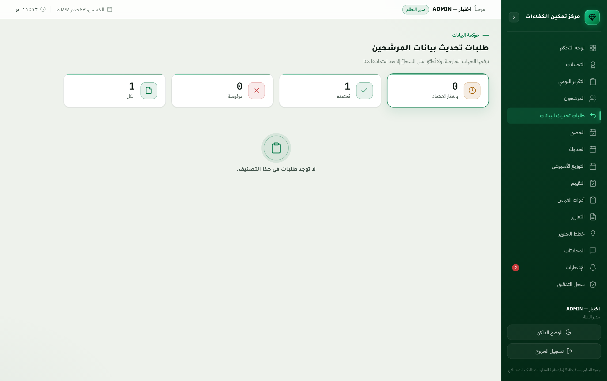

**من يفتحها:** `candidate.update_approve` — مدير النظام ومسؤول الجدولة. ومسؤول الجدولة يملكها لأنه مالك بيانات المشاركين أصلاً (`candidate.edit`)، فالاعتماد امتداد لسلطته لا سلطة جديدة.

الطلب يرفعه مستخدم خارجي حين يجد المشارك مسجّلاً مسبقاً. لا يمسّ السجلّ حتى يُعتمد هنا. الشاشة تعرض المقارنة بين **الحالي لحظة الرفع** و**المقترح** حقلاً بحقل، فيُتّخذ القرار على ما تغيّر لا على وثيقتين تُقرآن كاملتين.

**بطاقات التصنيف** — بطاقة واحدة مضيئة في كل وقت، والضغط عليها يرشّح الجدول:

| البطاقة | ماذا تعرض |
|---|---|
| **بانتظار الاعتماد** | الطلبات التي لم يُبتّ فيها — وهي التصنيف المفتوح عند دخول الشاشة |
| **مُعتمدة** | الطلبات التي طُبِّقت على سجلّ المشارك |
| **مرفوضة** | الطلبات التي رُدّت مع سببها |
| **الكل** | مجموع الثلاثة |

**أعمدة الجدول**

| العمود | معناه |
|---|---|
| **المشارك** | رمز المشارك — لا اسمه |
| **القطاع** | قطاع المشارك |
| **مقدّم الطلب** | اسم المستخدم الذي رفع الطلب |
| **ما تغيّر** | أسماء الحقول المتغيّرة (تُعرض ثلاثة، والباقي كعدد `+n`). و«لا فرق» تعني أن المقترح مطابق للمسجَّل |
| **تاريخ الطلب** | لحظة رفعه |
| **الحالة** | بانتظار الاعتماد / مُعتمد / مرفوض |
| **مراجعة** | يفتح نافذة الطلب والمقارنة |

الطلبات المعلّقة تتصدّر القائمة دائماً، ثم الأحدث فالأقدم. وإن خلا التصنيف ظهرت العبارة: *«لا توجد طلبات في هذا التصنيف.»*

**داخل نافذة المراجعة**

| العنصر | معناه |
|---|---|
| ترويسة النافذة | **مراجعة طلب التحديث — <رمز المشارك>** |
| **مقدّم الطلب** / **تاريخ الطلب** / **الحالة** / **تاريخ البتّ** / **البتّ بواسطة** | بيانات الطلب؛ الأخيران يظهران بعد البتّ |
| **سبب الطلب: …** | ما كتبه مقدّم الطلب |
| **ملاحظة البتّ: …** | ما كتبه المعتمِد أو الرافض |
| **ما يُقترح تغييره** + عدد الحقول | جدول ثلاثي: **الحقل** \| **الحالي** (مشطوب) \| **المقترح**. والقيمة الفارغة تُكتب **— (فارغ)** |
| **المؤهلات / الخبرات / الدورات التدريبية** `(عدد قبل ← عدد بعد)` | تُعرض ككتلتين جنباً إلى جنب: **الحالي** و**المقترح** |
| **ملاحظة الاعتماد** *اختيارية — تصل مقدّم الطلب* | تُحفظ مع القرار وتصل مقدّم الطلب |
| **سبب الرفض** *يصل مقدّم الطلب* | إلزامي عند الرفض |
| **إغلاق** / **رفض الطلب** / **تراجع** / **تأكيد الرفض** / **اعتماد وتطبيق التحديث** | أزرار القرار |

#### كيف تعمل فيها

**١) فرز الطلبات ومراجعة طلب**

1. الشاشة تفتح على **بانتظار الاعتماد**. اضغط بطاقة أخرى إن أردت تصنيفاً غيره.
2. اقرأ عمود **ما تغيّر** لتعرف مدى الطلب قبل فتحه.
3. اضغط **مراجعة** في صفّ الطلب.
4. تُفتح النافذة على المقارنة: الحقول المفردة في جدول، والأقسام المتكرّرة كتلتين متقابلتين.

فتح الطلب يُسجَّل في سجل التدقيق.

**٢) اعتماد طلب**

1. راجِع جدول **ما يُقترح تغييره** سطراً سطراً.
2. اكتب **ملاحظة الاعتماد** إن أردت أن تصل مقدّم الطلب.
3. اضغط **اعتماد وتطبيق التحديث**.

تُغلق النافذة، وتظهر رسالة خضراء **اعتُمد الطلب وطُبِّق على بيانات المرشح**: تُكتب البيانات المقترحة على سجلّ المشارك، وتُحفظ نسخة جديدة من سيرته، وتُعاد فئته القيادية إلى الحساب من رتبته الجديدة، ويصل مقدّمَ الطلب إشعار **اعتُمد طلب تحديث بيانات المرشح**.

**٣) رفض طلب**

1. اضغط **رفض الطلب** — يظهر مكان ملاحظة الاعتماد حقل **سبب الرفض**.
2. اكتب السبب (خمسة أحرف على الأقل).
3. اضغط **تأكيد الرفض**، أو **تراجع** للعودة.

تظهر رسالة **رُفض الطلب وأُبلغ مقدّمه**، ويصله السبب نصّاً في إشعار **رُفض طلب تحديث بيانات المرشح**.

**٤) طلب عُدِّلت سيرة صاحبه بعده**

1. إن ظهر شريط برتقالي داخل النافذة نصّه: *«عُدِّلت سيرة المرشّح بعد رفع هذا الطلب — المقارنة أدناه تُقاس على الحالة وقت الرفع، والاعتماد سيكتب فوق التعديل الأحدث»* فالمقارنة المعروضة أقدم من السجلّ.
2. راجِع سيرة المشارك الحالية من شاشة المشاركين قبل القرار.
3. اعتمِد إن كان المقترح هو الأصحّ، وإلّا فارفضه واطلب رفع طلب جديد.

#### ما يمنعه النظام ولماذا

- **الشاشة لا تُوسّع ما تراه من القاعدة.** الطلبات والعدّادات محصورة بنطاق المشاركين نفسه: تصنيفهم الأمني وقطاعك. وعدّادٌ أوسع من القائمة يفشي حجم ما تخفيه عنك، فحُصر معها.
- **الطلب خارج نطاقك «غير موجود».** لا يفرَّق بين «ليس لك» و«لا وجود له»، فلا يصير المعرّف أداةً لكشف الموجود.
- **لا بتّ مرتين.** أول قرار يُغلق الطلب؛ والثاني يُردّ بـ«بُتّ في هذا الطلب مسبقاً». الطلب يُقفَل في قاعدة البيانات أثناء البتّ، فمعتمِدان متزامنان يُسلسَلان ولا يُطبَّق التحديث مرّتين.
- **الرفض بلا سبب لا يُقبل.** السبب يصل مقدّم الطلب، وهو كل ما يعرفه عن سبب ردّه.
- **الاعتماد لا يمسّ رقم الهوية ولا التصنيف الأمني.** الأول مفتاح الشخص، والثاني حوكمة تُدار من شاشة المشاركين وحدها.
- **قطاعٌ حُذف يمنع الاعتماد.** إن لم يعد القطاع المطلوب موجوداً رُدّ الاعتماد وطُلب رفض الطلب — لا يُطبَّق تحديثٌ ناقص.
- **كل خطوة مدوَّنة.** رفع الطلب وفتحه واعتماده ورفضه — أربعتها في سجل التدقيق.
- **مصدر السيرة يبقى معلناً.** السيرة المعتمَدة تُسجَّل «من جهة خارجية» ومعها اسم من اعتمدها، فيُقرأ أصلها ومَن أجازها معاً.

#### رسائل الخطأ

| الرسالة | معناها | ما تفعله |
|---|---|---|
| ليس لديك صلاحية البتّ في طلبات التحديث | حسابك لا يملك `candidate.update_approve` | راجِع مدير النظام |
| تعذّر تحميل الطلبات | لم يستجب الخادم | أعِد تحميل الصفحة |
| تعذّر فتح الطلب | لم يُقرأ الطلب | أغلِق النافذة وأعِد المحاولة |
| الطلب غير موجود | الطلب حُذف أو أنه خارج نطاق قطاعك أو تصنيفك | حدِّث القائمة |
| بُتّ في هذا الطلب مسبقاً | اعتمده أو رفضه شخصٌ آخر قبلك | حدِّث القائمة واقرأ نتيجته |
| اذكر سبب الرفض (٥ أحرف على الأقل) — يصل مقدّم الطلب | حقل السبب فارغ أو أقصر من خمسة أحرف | اكتب سبباً مفهوماً |
| محتوى الطلب تالف — تعذّر تطبيقه | تعذّرت قراءة محتوى الطلب المحفوظ | ارفض الطلب واطلب رفعه من جديد |
| القطاع المطلوب لم يعد موجوداً — ارفض الطلب | القطاع المقترح حُذف من الإعدادات | ارفض الطلب مع ذكر السبب |
| تعذّر الاعتماد / تعذّر الرفض | لم يصل ردّ مفهوم من الخادم | أعِد المحاولة، وإن تكرّر راجِع الدعم الفني |
| لا فرق بين المُقترح والمسجَّل — الاعتماد لن يغيّر شيئاً | ليست رسالة خطأ: الطلب لا يحمل تغييراً | أغلِقه أو ارفضه بذكر السبب |

---

### بوّابة المشارك — تأكيد الحضور


**من يفتحها:** المشارك وحده. صفحة عامة بلا مصادقة على المسار `/confirm/<رمز الرابط>`، ورمزُ الرابط فريد لكل دورة تقييم ويصله في رسالة نصية عند تسجيله: «عزيزي …، تم تسجيلك في مركز تمكين الكفاءات لتقييم القيادات. رمز المشارك: … لتأكيد بياناتك وتسجيل الوصول: …». لا يفتحها أي دور من أدوار المنصّة، ولا تظهر في القائمة الجانبية.

الصفحة أربع شاشات متتابعة: بوّابة الهوية، ثم الشاشة الرئيسة (تأكيد البيانات وتسجيل الوصول)، ومنها **سيرتي الذاتية** و**بطاقة المشارك**.

| الشاشة | العنصر | معناه |
|---|---|---|
| البوّابة | **رقم الهوية الوطنية** — placeholder **١٠ أرقام** | العامل الثاني. الزر معطَّل حتى تُكتب عشرة أرقام |
| البوّابة | **التحقق وعرض بياناتي** ← **جارٍ التحقق…** | يفتح بياناتك إن طابق الرقم صاحبَ الرابط |
| البوّابة | **لا تُعرض أي بيانات قبل التحقق من هويتك.** | ملاحظة ثابتة تصف سلوك الخادم فعلاً |
| الرئيسة | **مرحباً {اسمك}** | يظهر اسمك بعد التحقق وحده |
| الرئيسة | **رمز المشارك** · **القطاع** · **نوع التقييم** | بياناتك المختصرة. نوع التقييم: **شامل** أو **تنفيذي** |
| الرئيسة | **مواعيد الجلسات** | كل جلسة: النشاط، ثم التاريخ والوقت والقاعة. الأنشطة: **المقابلة الشخصية** · **حلقة النقاش** · **أدوات القياس** · **التمرين التكاملي** |
| الرئيسة | **بانتظار التأكيد** / **تم تأكيد البيانات** | حالة التأكيد |
| الرئيسة | **لم يُسجّل الوصول بعد** / **تم تسجيل الوصول** | حالة الوصول |
| الرئيسة | **تأكيد بياناتي** | يختفي بعد التأكيد |
| الرئيسة | **تسجيل الوصول** | يُعطَّل بعد تسجيل الوصول ويصير نصّه **تم تسجيل الوصول** |
| الرئيسة | **سيرتي الذاتية** — **اختياري** / **مكتملة · تعديل** | يفتح نموذج السيرة |
| الرئيسة | **بطاقة المشارك** — **عرض وطباعة** | يفتح البطاقة |
| السيرة | **البيانات الوظيفية** · **المؤهلات العلمية** · **الخبرات العملية** · **الدورات التدريبية** | مجموعات النموذج |
| السيرة | **حفظ السيرة** ← **جارٍ الحفظ…** | يحفظ النموذج كاملاً |
| السيرة | **جلستك صالحة ٢٠ دقيقة — احفظ أولاً بأول.** | مدّة جلسة الوصول فعلاً |
| البطاقة | **رمز المشارك** بخطّ كبير، و**تُبرَز هذه البطاقة عند الاستقبال** | البطاقة بلا اسم — بالرمز وحده |
| البطاقة | **طباعة** | يطبع البطاقة وحدها |

#### كيف تعمل فيها

**١) فتح بياناتك**

1. افتح الرابط الوارد في الرسالة النصية.
2. اكتب رقم هويتك الوطنية (عشرة أرقام) في **رقم الهوية الوطنية**.
3. اضغط **التحقق وعرض بياناتي**.

النتيجة: تُفتح الشاشة الرئيسة بعنوان **مرحباً {اسمك}**، وفيها رمز المشارك والقطاع ونوع التقييم ومواعيد الجلسات وحالتا التأكيد والوصول.


**٢) تأكيد بياناتك**

1. راجع رمز المشارك والقطاع ونوع التقييم والمواعيد.
2. اضغط **تأكيد بياناتي**.

النتيجة: تظهر رسالة **تم تأكيد بياناتك بنجاح**، وتتحوّل الحالة إلى **تم تأكيد البيانات**، ويختفي الزر. وإن كنت قد أكّدت من قبل ظهرت **بياناتك مؤكّدة مسبقاً**.


**٣) تسجيل الوصول يوم الجلسة**

1. افتح الرابط نفسه بعد وصولك إلى المركز.
2. أدخل رقم هويتك واضغط **التحقق وعرض بياناتي**.
3. اضغط **تسجيل الوصول**.

النتيجة: تظهر **تم تسجيل وصولك وحضور {عدد} جلسة** إن كان لك جلسات في اليوم نفسه، أو **تم تسجيل وصولك** إن لم يكن. حضورك يُثبَّت آلياً في جلسات اليوم دون تدخّل موظّف.

**٤) تعبئة السيرة الذاتية**

1. اضغط بطاقة **سيرتي الذاتية**.
2. املأ **البيانات الوظيفية**: تاريخ الميلاد وتاريخ التعيين من مُنتقي التاريخ (أو اكتب الهجري في الحقل المجاور فيُترجَم آلياً)، ثم **الرتبة / المرتبة** و**الإدارة** و**المنطقة**.
3. اضغط **إضافة مؤهل** لكل مؤهل، و**إضافة خبرة** لكل خبرة، و**إضافة دورة** لكل دورة، واملأ سطورها.
4. اضغط **حفظ السيرة**.

النتيجة: تظهر **تم حفظ سيرتك الذاتية**، وتتحوّل بطاقة السيرة في الشاشة الرئيسة إلى **مكتملة · تعديل**. أيّ سطر ناقص يُحدَّد بإطار أحمر مع رسالة **أكمل الحقول المطلوبة في السطور المميّزة**.


**٥) طباعة بطاقة المشارك**

1. اضغط **رجوع** إن كنت داخل السيرة.
2. اضغط بطاقة **بطاقة المشارك**.
3. اضغط **طباعة**.

النتيجة: تُطبع البطاقة وحدها — رمز المشارك والقطاع ونوع التقييم والمواعيد، بلا اسم. وإن تعذّرت الطباعة فالتقط لقطة شاشة كما تقول الملاحظة أسفلها.


#### ما يمنعه النظام ولماذا

- **لا يُعرض أي بيان قبل مطابقة رقم الهوية.** الرابط وحده لا يكفي: عاملان مطلوبان — رابطٌ تملكه ورقمُ هوية تعرفه. رابطٌ يتسرّب أو يُعاد توجيهه لا يكشف اسماً ولا موعداً.
- **خمس محاولات لكل رابط، ثم قفلٌ ربع ساعة.** العدّاد يُزاد قبل المقارنة، فلا يُتجاوَز الحدّ بطلبات متزامنة. المحاولة الفاشلة تُقيَّد في سجل التدقيق باسم `PUBLIC_VERIFY_FAIL`، والناجحة باسم `PUBLIC_VERIFY_OK`، ويُصفَّر العدّاد عند النجاح فلا يُعاقَب صاحب الرابط.
- **الرابط غير الصحيح والهوية غير المطابقة يُردّان بالردّ نفسه.** المقارنة ثابتة الزمن، كي لا يُستدلّ من شكل الردّ ولا من سرعته على وجود الرابط.
- **جلسة الوصول عشرون دقيقة**، ورمزها مشفَّر لا يُخزَّن ومربوط بدورة التقييم نفسها. انتهاؤها أثناء تحرير السيرة يفتح نافذة **انتهت الجلسة** لإعادة إدخال الهوية، ثم يُستأنف الحفظ تلقائياً — ومسودّتك تبقى في الصفحة.
- **لا تُكتب اسمك ولا رقم هويتك ولا جوالك ولا بريدك في السيرة.** الخادم يفحص كل حقل، فإن وجد أحدها ردّ الحفظ وقيّد الحدث باسم `PUBLIC_CV_BLOCKED`. السبب: سيرتك تُعرض على المقيّم **دون اسمك**، وحياد التقييم يسقط بذكرٍ واحد للاسم.
- **تُقفَل السيرة بعد بدء التقييم** — لا بعد وصولك. عندها تظهر بحالة عرض فقط ولا زرّ حفظ، لأن ما قُيّم يجب ألّا يتغيّر بعد تقييمه.
- **حدود على حجم السيرة وعددها:** ١٥ مؤهلاً، و٢٠ خبرة، و٢٠ دورة، وسقف للحمولة كاملةً — بوّابة عامة لا تُترك بلا سقف. وحفظ السيرة محدود بعشر مرّات كل عشر دقائق لكل مشارك.
- **قفلٌ تفاؤلي على نسخة السيرة:** إن عُدّلت من جهة أخرى بعد فتحك النموذج، رُدّ الحفظ ولم تُكتب نسختك فوق نسخة غيرك.
- **حدود التواريخ:** تاريخ الميلاد بين سبعين سنة وثماني عشرة سنة مضت، وتاريخ التعيين لا يتجاوز اليوم، والسنوات بين ١٩٥٠ والسنة الحالية (وسنة التخرّج تقبل السنة القادمة). العمر يُحسب آلياً ولا يُكتب.
- **زرّ تسجيل الوصول مخصّص ليوم الجلسة.** يعمل في أي يوم، لكنه لا يُثبّت حضوراً إلا في جلسات اليوم نفسه — والملاحظة تظهر لمن أكّد ولم يصل ولا جلسة له اليوم. وتسجيل الوصول يؤكّد بياناتك ضمناً إن لم تكن أكّدتها.
- **البطاقة بلا اسم**، والطباعة مقصورة على البطاقة وحدها — تُبرَز عند الاستقبال، والاستقبال يعمل بالرمز.

#### رسائل الخطأ

| الرسالة | معناها | ما تفعله |
|---|---|---|
| **رقم الهوية يجب أن يكون ١٠ أرقام** | ما كتبته ليس عشرة أرقام | اكتب رقم الهوية كاملاً بالأرقام |
| **رقم الهوية غير مطابق لهذا الرابط. — تبقّى {عدد} محاولة** | الرقم لا يخصّ صاحب هذا الرابط | تأكّد من الرقم؛ لا يبقى إلا العدد المذكور من المحاولات |
| **محاولات كثيرة. حاول بعد {عدد} دقيقة.** | استُنفدت خمس محاولات على هذا الرابط | انتظر المدّة المذكورة؛ الحقل والزر معطَّلان حتى ذلك |
| **تعذّر التحقق، حاول لاحقاً** | عطل شبكة أو خدمة | أعد المحاولة، ثم راجع المركز |
| **انتهت الجلسة، أعد إدخال رقم الهوية** | مضت عشرون دقيقة على تحقّقك | أعد إدخال رقم الهوية من البوّابة |
| **انتهت الجلسة** (نافذة أثناء تحرير السيرة) | انتهت الجلسة وأنت تكتب | أدخل رقم هويتك واضغط **متابعة الحفظ** — بياناتك محفوظة في الصفحة. أو **لاحقاً (تبقى بياناتي)** |
| **أكمل الحقول المطلوبة في السطور المميّزة** | حقول إلزامية ناقصة أو قيم خارج المدى | راجع السطور ذات الإطار الأحمر |
| **أزِل اسمك أو معرّفاتك من الحقل قبل الحفظ** | الخادم وجد اسمك أو رقم هويتك أو جوالك أو بريدك في السيرة | احذفها؛ السيرة تُعرض دون اسمك |
| **بعض الحقول غير صحيحة** | قيمة مرفوضة في الخادم (سنة أو درجة أو طول نصّ) | راجع سطور المؤهلات والخبرات والدورات |
| **عُدِّلت السيرة من جهة أخرى — أعد فتح الصفحة قبل الحفظ** | حُفظت نسخة أحدث من سيرتك | أعد فتح الرابط وتحقّق ثم أعد الإدخال |
| **المحتوى أكبر من المسموح** / **عناصر أكثر من المسموح** | تجاوزت سقف الحجم أو عدد السطور | اختصر النصوص أو احذف سطوراً |
| **لا يمكن تعديل السيرة بعد بدء التقييم** | بدأ تقييمك فقُفلت السيرة | لا تعديل بعد اليوم؛ راجع المركز عند الحاجة |
| **محاولات حفظ كثيرة، حاول لاحقاً** | أكثر من عشر عمليات حفظ في عشر دقائق | انتظر قليلاً ثم احفظ |
| **تعذّر تنفيذ العملية** / **تعذّر الحفظ** | لم يصل ردّ مفهوم من الخادم | أعد المحاولة، ثم راجع المركز |

---

### استقبال الموظفين


**من يفتحها:** `reception.view` — مسؤول استقبال الموظفين، ومسؤول العمليات، ومدير المركز، ومسؤول الجدولة، ومستشار المقابلة، ومستشار حلقة النقاش، ومشرف أدوات القياس، ومدير النظام.

شاشة واحدة على المسار `/reception` تُدير مسار المرشّح من باب المركز إلى جدول الجلسات: تسجيل الوصول، ثم التوقيع والإقرار بصحّة البيانات، ثم التوزيع على نشاط ومقيّم، ثم قرار المقيّم استلاماً أو ردّاً، ثم الاعتماد الذي يُرحّل المستلَم إلى الجدولة.

**الشاشة تتشكّل بحسب صلاحيات فاتحها.** لكل مرحلة صلاحية مستقلّة، فمن يسجّل ليس بالضرورة من يوزّع، ومن يوزّع ليس من يقرّر، ومن يقرّر ليس من يعتمد.

| الصلاحية | ما تفتحه داخل الشاشة | من يملكها اليوم |
|---|---|---|
| `reception.view` | فتح الشاشة وقراءة كشف اليوم | الأدوار الثمانية أعلاه |
| `reception.record` | قسم «المنتظَرون»، **تسجيل الوصول**، تعديل وقت الوصول، **أخذ التوقيع** | مسؤول استقبال الموظفين، مدير النظام |
| `reception.assign` | زرّ **توزيع** وسحب الإسناد | مسؤول الاستقبال، مسؤول العمليات، مدير المركز، مسؤول الجدولة، مدير النظام |
| `reception.decide` | قسم «المُسنَد إليّ اليوم» وزرّا **استلام** و**ردّ** | مستشار المقابلة، مستشار حلقة النقاش، مشرف أدوات القياس، مدير النظام |
| `reception.approve` | زرّ **اعتماد وترحيل** | مسؤول العمليات، مدير المركز، مسؤول الجدولة، مدير النظام |

ويُضاف إليها صلاحيتان من خارج المجموعة تغيّران ما يُعرَض:

- `candidate.view_names` — بها وحدها يظهر عمود **الاسم**. يحملها هنا: مسؤول الاستقبال، مدير المركز، مسؤول الجدولة، مدير النظام. **مسؤول العمليات لا يحملها ويعمل بالرمز.**
- `candidate.view_classified` — بدونها لا يظهر المصنَّفون (سرّي/سرّي للغاية) لا في الحاضرين ولا في المنتظَرين ولا في العدد الكلّي.

#### ما تراه في أعلى الشاشة

| العنصر | معناه |
|---|---|
| **مسار اليوم / استقبال الموظفين** | عنوان الشاشة |
| السطر الوصفي | يتغيّر بحسب دورك: «تسجيل الوصول والتوقيع، وتوزيع المرشحين على المقابلة وحلقة النقاش وأدوات القياس» لمن يسجّل، و«إعادة إسناد المردود، واعتماد البيانات وترحيل الجلسات إلى الجدول» لمن يعتمد، و«المرشحون المُسنَدون إليك اليوم — استلامهم أو ردّهم بسبب» للمقيّم |
| حقل التاريخ | يبدأ على تاريخ اليوم. تغييره يُعيد تحميل كشف ذلك اليوم |
| **تحديث** | يُعيد تحميل الكشف بلا تغيير التاريخ |
| البطاقات الأربع | **وصلوا** · **وقّعوا وأقرّوا** · **بانتظار قرار المقيّم** · **معتمدون** — محسوبة على ما تراه أنت من صفوف، لا على قاعدة البيانات كلّها. لا تظهر للمقيّم |

#### جدول «الحاضرون اليوم»


| العمود | ما يعرضه |
|---|---|
| **الرمز** | رمز المشارك — هوية المرشّح المعتمدة في هذه الشاشة |
| **الاسم** | لا يظهر إلا لحامل `candidate.view_names` |
| **القطاع** | قطاع المرشّح — به تُصفّى قائمة المقيّمين عند التوزيع |
| **الرتبة** | رتبة المرشّح |
| **السيرة** | **عرض** إن كانت له سيرة، و**لا سيرة** معطّلاً إن لم يُدخِلها، و«—» لمن لا يملك قراءتها (مسؤول العمليات) |
| **وقت الوصول** | الوقت بصيغة HH:MM. قابل للنقر لتعديله لمن يملك `reception.record`، ومعطّل بعد الاعتماد |
| **التوقيع والإقرار** | **وقّع وأقرّ** إن تمّ، أو زرّ **أخذ التوقيع** لمن يسجّل، أو الوسم **لم يوقّع** لغيره |
| **التوزيع** | بطاقة لكل إسناد قائم: اسم النشاط، واسم المقيّم، وحالته — **بانتظار المقيّم** أو **مُستلَم**. ومعها زرّ **توزيع**، وسطر أحمر لكل إسناد مردود بصيغة «ردّ ‹المقيّم› ‹النشاط› — ‹السبب›» |
| العمود الأخير | **اعتماد وترحيل** لمن يعتمد، أو الوسم **معتمد**، أو حالة الزيارة: **وصل** / **مُوزَّع** / **معتمد** |

إن لم يصل أحد بعد يظهر مكان الجدول: **لم يصل أحد بعد** مع التلميح «سجّل وصول أول مرشّح من قائمة المنتظَرين أدناه.»

#### جدول «المنتظَرون»

لا يظهر إلا لحامل `reception.record`. يعرض الدورات التي لم تُسجَّل لها زيارة في التاريخ المختار ولم تُنجَز بعد.

| العنصر | معناه |
|---|---|
| **الرمز** · **الاسم** · **القطاع** · **الرتبة** | بيانات المنتظَر |
| **تسجيل الوصول** | يُنشئ زيارة اليوم ويثبّت وقت الوصول تلقائياً |
| حقل «ابحث برمز المشارك…» وزرّ **بحث** | بحث على الخادم **برمز المشارك وحده**. لا يشمل جدول الحاضرين |
| شريط «يُعرَض ٤٠ من … منتظَراً — ابحث بالرمز للوصول إلى البقيّة.» | القائمة مقصوصة عند ٤٠ صفّاً. الشريط يظهر حين يزيد العدد الكلّي عن المعروض |

وإن خلت القائمة ظهر **لا مرشّح منتظَر**، أو **لا نتيجة لهذا البحث** إن كان حقل البحث ممتلئاً.

#### قسم «المُسنَد إليّ اليوم»


لا يظهر إلا لحامل `reception.decide`، ولا يعرض إلا إسنادات صاحب الحساب في التاريخ المختار. لكل بطاقة: **رمز المشارك**، واسم النشاط، و«وصل HH:MM».

- ما زال بانتظار القرار: زرّا **استلام** و**ردّ**.
- بعد الاستلام: الوسم **مُستلَم** وزرّ **السيرة الذاتية**.
- بلا إسنادات: **لا مرشّح مُسنَد إليك اليوم** مع التلميح «سيصلك إشعار فور إسناد مرشّح إليك.»

#### كيف تعمل فيها

**١ — تسجيل وصول مرشّح** *(يلزمها `reception.record`)*

1. تأكّد من أن حقل التاريخ على اليوم الصحيح.
2. ابحث عن المرشّح في جدول **المنتظَرون**، أو اكتب رمزه في «ابحث برمز المشارك…» واضغط **بحث**.
3. اضغط **تسجيل الوصول** في صفّه.

ينتقل المرشّح إلى جدول **الحاضرون اليوم** بوقت وصول مثبَّت تلقائياً، وتظهر الرسالة «سُجّل وصول ‹الرمز›». الضغط مرّتين لا يُنشئ زيارتين — الزيارة واحدة لكل دورة في اليوم.

**٢ — تعديل وقت الوصول** *(يلزمها `reception.record`)*

1. اضغط الوقت المكتوب في عمود **وقت الوصول**؛ يتحوّل الحقل إلى محرِّر وقت داخل الصفّ.
2. اكتب الوقت الصحيح.
3. اضغط علامة الصحّ للحفظ، أو علامة المنع للإلغاء.

تظهر الرسالة «حُدّث وقت الوصول». الوقت يُركَّب على **تاريخ الزيارة** لا على اليوم الحالي، فتعديل زيارة يوم مضى يبقيها في كشف يومها.

**٣ — مطابقة السيرة الذاتية قبل الإقرار**


1. اضغط **عرض** في عمود **السيرة**.
2. طابِق مع المرشّح ما هو مسجَّل: المنصب الحالي، والنبذة، والمؤهلات، والخبرات، والشهادات.
3. أغلِق النافذة.

المعروض هو نسخة السيرة المحفوظة مع الدورة إن وُجدت، وإلا السيرة الحالية للمرشّح. وإن لم يُدخِلها ظهر «لم يُدخِل المرشح سيرته الذاتية بعد.» كل فتح للسيرة يُقيَّد في سجل التدقيق.

**٤ — أخذ التوقيع والإقرار** *(يلزمها `reception.record`)*


1. اضغط **أخذ التوقيع** في عمود **التوقيع والإقرار**.
2. اقرأ على المرشّح نصّ الإقرار الظاهر باسمه.
3. سلّمه الجهاز ليوقّع داخل اللوحة المكتوب فيها «وقّع هنا» — بإصبعه أو بالفأرة. زرّ **مسح** يمحو التوقيع لإعادته.
4. علّم خانة **قرأ المرشح الإقرار أعلاه ووافق عليه**.
5. اضغط **حفظ التوقيع**.

يتحوّل عمود التوقيع إلى الوسم **وقّع وأقرّ**، وتظهر الرسالة «وقّع ‹الرمز› وأقرّ بصحّة بياناته». زرّ الحفظ يبقى معطّلاً حتى تُعلَّم خانة الإقرار، والحفظ يُرفَض إن كانت اللوحة فارغة. التوقيع يُخزَّن **مشفَّراً**، ولا يُكتب في سجل التدقيق.

**٥ — توزيع المرشّح على نشاط ومقيّم** *(يلزمها `reception.assign`)*


1. اضغط **توزيع** في عمود **التوزيع**.
2. اختر **النشاط**: المقابلة الشخصية، أو حلقة النقاش، أو أدوات القياس. تُفتَح النافذة على أول نشاط غير مُسنَد.
3. اختر **المقيّم** من القائمة؛ كل سطر فيها «الاسم — الدور (القطاع)».
4. اضغط **إسناد وإشعار**.

يظهر الإسناد في الصفّ بحالة **بانتظار المقيّم**، وتظهر الرسالة «أُسنِد المرشح وأُشعِر المقيّم»، ويصل المقيّم إشعارٌ عنوانه «مرشّح مُسنَد إليك: ‹الرمز›» — بالرمز لا بالاسم.

القائمة لا تعرض إلا **من يستطيع الاستلام فعلاً**: صاحب دور ذلك النشاط، ونشِط، ويملك `reception.decide`، ويغطّي قطاع المرشّح. فإن خلت ظهر «لا مقيّم مؤهّل لهذا النشاط في قطاع المرشح. أضف مستخدماً بالدور المناسب من شاشة المستخدمين.» وأُقفل زرّ الإسناد.

**٦ — سحب إسناد قبل البتّ فيه** *(يلزمها `reception.assign`)*

1. ابحث عن بطاقة الإسناد الموسومة **بانتظار المقيّم**.
2. اضغط الزرّ الصغير المسمّى «سحب الإسناد» داخلها.

يختفي الإسناد وتظهر الرسالة «سُحب الإسناد». لا يُسحب إسنادٌ استلمه المقيّم أو ردّه.

**٧ — استلام مرشّح أو ردّه** *(يلزمها `reception.decide`)*


1. افتح الشاشة على تاريخ اليوم وابحث عن بطاقتك في **المُسنَد إليّ اليوم**.
2. للاستلام: اضغط **استلام** — تتحوّل البطاقة إلى **مُستلَم** ويظهر زرّ **السيرة الذاتية**، مع الرسالة «استُلم ‹الرمز›».
3. للردّ: اضغط **ردّ**، ثم اكتب في «سبب الردّ» سبباً لا يقلّ عن ثلاثة أحرف، ثم اضغط **ردّ المرشح**.

يظهر بعد الردّ «رُدّ المرشح وأُشعِرت العمليات»، ويصل السبب إشعاراً إلى **كل من يملك صلاحية إعادة الإسناد** — لا إلى دور بعينه. القرار الواحد لا يُعاد: بعد الاستلام أو الردّ يُقفَل الإسناد.

**٨ — قراءة سيرة من استلمته** *(يلزمها `reception.decide`)*

1. اضغط **السيرة الذاتية** في بطاقة موسومة **مُستلَم**.
2. اقرأ السيرة.

تُفتَح بلا اسم ولا رقم هوية ولا وسيلة تواصل، ويعلوها التنبيه «التقييم يتم بالرمز: اسم المرشح ورقم هويته محجوبان عن المقيّم.» وأي معرّف كتبه المرشّح داخل نصّ حرّ يُطمَس آلياً قبل العرض.

**٩ — الاعتماد وترحيل الجلسات** *(يلزمها `reception.approve`)*


1. راجع صفّ المرشّح: وقّع وأقرّ، وإسناداته كلّها مبتوت فيها، وفيها إسناد واحد على الأقل **مُستلَم**.
2. إن بقي إسناد **بانتظار المقيّم**: انتظر قراره أو اسحبه.
3. إن ظهر سطر ردّ أحمر: اضغط **توزيع** وأعد إسناده لمقيّم آخر أو لنشاط آخر.
4. اضغط **اعتماد وترحيل**.

تُنشَأ جلسة في **الجدولة** لكل إسناد مُستلَم بتاريخ الزيارة ونشاطها ومقيّمها، ويتحوّل الصفّ إلى **معتمد**، وتظهر الرسالة «اعتُمد ‹الرمز› ورُحّلت جلساته»، ويصل كل مقيّم إشعار «اعتُمد ورُحّل: ‹الرمز›». الزرّ يبقى **معطّلاً** ما لم يكتمل شرطه، وسببُ التعطيل يظهر عند مرور المؤشّر عليه: «لم يوقّع المرشح ولم يُقرّ بصحّة بياناته» أو «بقي إسناد بانتظار قرار المقيّم» أو «لا إسناد مستلَم — وزّع المرشح أولاً».

#### ما يمنعه النظام ولماذا

- **لا توزيع قبل التوقيع والإقرار.** توزيع من لم يُقرّ بصحّة بياناته يُدخِل المقيّم على بيانات لم يُصادَق عليها.
- **لا إسنادان فعّالان للنشاط نفسه.** المرشّح لا يكون في مقابلتين في وقت واحد؛ يلزم سحب الإسناد القائم أولاً.
- **لا إسناد لدور لا يمارس النشاط.** المقابلة الشخصية لمستشار المقابلة، وحلقة النقاش لمستشار حلقة النقاش، وأدوات القياس لمشرف أدوات القياس. ومدير إدارة التقييم خارج القائمة عمداً لأنه معتمِد المرحلة الأولى لا مُجريها — فلا يصير من يقابل هو من يعتمد.
- **لا إسناد لمقيّم من قطاع آخر** إلا بصلاحية `candidate.cross_sector` الصريحة (يحملها مسؤول الجدولة ومدير النظام). القاعدة نفسها المطبَّقة في الجدولة.
- **لا إسناد لمن سُحبت منه صلاحية الاستلام** ولو كان دوره مطابقاً — القائمة تُصفّى بالصلاحية الفعلية لا بالدور وحده.
- **لا يبتّ مقيّم في إسناد غيره.** صاحب الإسناد وحده يستلمه أو يردّه، وإسناد غيره يُعامَل كغير موجود فلا يُعلَم بوجوده أصلاً.
- **لا سحب لإسناد بُتّ فيه.** المستلَم لا يُنتزع من تحت المقيّم؛ يُردّ منه أو يُعتمد.
- **لا قرار مكرّر.** الاستلام والردّ يقعان مرّة واحدة.
- **لا تُفتَح السيرة للمقيّم قبل الاستلام.** القرار يقع على الرمز والنشاط، لا على محتوى سيرة يُطّلَع عليها ثم تُردّ.
- **لا اسم ولا رقم هوية للمقيّم في هذا المسار مهما كانت صلاحيته.** القاعدة هنا إجرائية لا صلاحية: إتاحة الاسم لمن يقابل تفتح باباً لمعرفة من يقابل قبل أن يقابله.
- **لا تعديل على زيارة معتمدة** — لا وقتُها ولا توقيعها: الوثيقة المعتمَدة تبقى هي التي اعتُمدت.
- **لا اعتماد وثمّة إسناد معلّق.** الاعتماد حينها يُسقط قراراً لم يُتّخذ بلا أن يعلم به أحد.
- **لا اعتماد بلا إسناد مستلَم.** لا شيء يُرحَّل.
- **قائمة المنتظَرين مقصوصة عند ٤٠** ويُذكَر العدد الكلّي فوقها صراحةً — قائمة مقصوصة صامتة تُقرأ «هذا كل من ينتظر»، فيُصرَف مرشّح حاضر لأنه لم يظهر في الشاشة.
- **الدورات المنتهية لا تظهر في المنتظَرين.** دورة اكتملت ليست موعداً قادماً.
- **المصنَّفون محجوبون** عمّن لا يملك رؤيتهم — لا في الصفوف ولا في العدد الكلّي.
- **التوقيع صورة PNG بحدّ أقصى للحجم** — الحقل لأخذ توقيع لا لرفع ملفّ.
- **الإسناد المردود يبقى في السجلّ** بسببه واسم رادّه؛ إعادة الإسناد سجلّ جديد بجانبه لا استبدال له.
- **كل ما سبق مفروض على الخادم.** إخفاء زرّ في الواجهة راحة للعين، ومحاولة تجاوزه بالرابط أو بالواجهة البرمجية تُردّ بالرسالة نفسها.

> **تنبيه تشغيلي:** إن لم يوجد مستخدم نشط يملك `reception.assign`، وقف المرشّح المردود بلا من يعيد إسناده. النظام يُقيّد ذلك في سجل التدقيق بـ`RECEPTION_REJECT_UNROUTED`.

#### رسائل الخطأ

| الرسالة | معناها | ما تفعله |
|---|---|---|
| ليس لديك صلاحية عرض شاشة استقبال الموظفين | لا تملك `reception.view` | راجع مدير النظام |
| تعذّر تحميل كشف الاستقبال | الخادم لم يستجب | اضغط **تحديث**، فإن تكرّر فراجع الدعم الفنّي |
| ليس لديك صلاحية تسجيل وصول المرشحين | لا تملك `reception.record` | تسجيل الوصول عمل الاستقبال |
| ليس لديك صلاحية تعديل وقت الوصول | لا تملك `reception.record` | اطلب من الاستقبال تعديله |
| ليس لديك صلاحية أخذ توقيع المرشح | لا تملك `reception.record` | التوقيع يُؤخذ عند الاستقبال |
| ليس لديك صلاحية توزيع المرشحين | لا تملك `reception.assign` | التوزيع للاستقبال أو العمليات |
| ليس لديك صلاحية سحب الإسناد | لا تملك `reception.assign` | اطلب من العمليات سحبه |
| ليس لديك صلاحية البتّ في الإسناد | لا تملك `reception.decide` | الاستلام والردّ للمقيّم المُسنَد إليه |
| ليس لديك صلاحية اعتماد بيانات الاستقبال | لا تملك `reception.approve` | الاعتماد للعمليات أو مدير المركز أو الجدولة |
| ليس لديك صلاحية عرض السيرة الذاتية | لا تملك قراءة سيرة الزائر — وهي لمن يستقبله في يومه أو لحامل `candidate.cv_view` | اطلب المطابقة من الاستقبال |
| ليس لديك صلاحية عرض سيرة المُسنَد إليك | لا تملك `reception.decide` | هذا المسار للمقيّم المُسنَد إليه وحده |
| الدورة غير موجودة | الدورة غير قائمة، أو خارج نطاقك (قطاع أو تصنيف) | تحقّق من الرمز؛ وإن كان المرشّح مصنَّفاً فراجع من يملك رؤيته |
| الزيارة غير موجودة | الزيارة غير قائمة أو خارج نطاقك | أعد تحميل الكشف بـ**تحديث** |
| الإسناد غير موجود | الإسناد غير قائم، أو ليس إسنادك أنت | لا تبتّ في إسناد غيرك |
| المقيّم غير موجود أو غير مفعّل | الحساب المختار محذوف أو موقوف | اختر مقيّماً آخر، وراجع شاشة المستخدمين |
| لم يوقّع المرشح ولم يُقرّ بصحّة بياناته بعد | حاولت التوزيع قبل التوقيع | خذ التوقيع والإقرار أولاً |
| هذا النشاط مُسنَد بالفعل — اسحب الإسناد القائم أولاً | للنشاط إسناد فعّال | اسحب الإسناد القائم، أو اختر نشاطاً آخر |
| المقيّم المختار لا يمارس ‹النشاط› | دور المقيّم لا يطابق النشاط | اختر مقيّماً من دور النشاط |
| المقيّم المختار لا يملك صلاحية استلام المرشحين | سُحبت منه `reception.decide` باستثناء فردي | اختر غيره، أو أعد الصلاحية من شاشة المستخدمين |
| المقيّم من قطاع آخر — يلزم صلاحية الإسناد عبر القطاعات | المقيّم محصور بقطاع غير قطاع المرشّح | اختر مقيّماً من قطاع المرشّح، أو أوكِل الإسناد لمن يملك `candidate.cross_sector` |
| الزيارة معتمدة — أعد فتحها قبل التوزيع | الزيارة اعتُمدت | لا يُضاف إسناد بعد الاعتماد |
| الزيارة معتمدة — لا يُعدَّل وقتها | الزيارة اعتُمدت | الوقت المعتمَد نهائي |
| الزيارة معتمدة — لا يُعدَّل توقيعها | الزيارة اعتُمدت | التوقيع المعتمَد نهائي |
| الزيارة معتمدة من قبل | اعتماد مكرّر | لا إجراء |
| لم يوقّع المرشح ولم يُقرّ بصحّة بياناته | اعتماد قبل التوقيع | اطلب من الاستقبال أخذ التوقيع |
| لا إسناد مستلَم بعد — لا شيء يُرحَّل | لا إسناد استلمه مقيّم | وزّع المرشّح وانتظر الاستلام |
| بقي إسناد بانتظار قرار المقيّم — انتظر البتّ أو اسحب الإسناد | إسناد معلّق | انتظر قرار المقيّم أو اسحب الإسناد |
| لا يُسحب إسنادٌ بُتّ فيه | الإسناد مُستلَم أو مردود | المستلَم يُردّ من المقيّم أو يُعتمد |
| بُتّ في هذا الإسناد من قبل | استُلم أو رُدّ سابقاً | أعد تحميل الشاشة |
| اذكر سبب الردّ — العمليات تبني عليه إعادة الإسناد | حقل السبب فارغ | اكتب سبباً واضحاً (٣ أحرف فأكثر، ٥٠٠ حدّاً أعلى) |
| استلم المرشّح أولاً لعرض سيرته | محاولة فتح السيرة قبل الاستلام | اضغط **استلام** ثم افتح السيرة |
| صيغة التوقيع غير صالحة | ما أُرسل ليس صورة توقيع | وقّع داخل اللوحة وأعد الحفظ |
| لا بدّ من إقرار المرشح بصحّة بياناته | خانة الإقرار غير معلَّمة | علّم **قرأ المرشح الإقرار أعلاه ووافق عليه** |
| لم يوقّع المرشح بعد | لوحة التوقيع فارغة | اطلب من المرشّح التوقيع |
| اختر المقيّم | حُفظ التوزيع بلا مقيّم | اختر مقيّماً من القائمة |
| اذكر سبب الردّ | السبب أقصر من ثلاثة أحرف | اكتب سبباً مفهوماً |
| لا مقيّم مؤهّل لهذا النشاط في قطاع المرشح. أضف مستخدماً بالدور المناسب من شاشة المستخدمين. | لا مستخدم نشط يجمع دور النشاط وصلاحية الاستلام وقطاع المرشّح | أنشئ الحساب المناسب، أو غيّر النشاط |
| تعذّر جلب المقيّمين | الخادم لم يستجب | أغلق النافذة وأعد فتحها |
| تعذّر عرض السيرة الذاتية | الخادم لم يستجب، أو السيرة خارج نطاقك | أعد المحاولة، فإن تكرّر فراجع الدعم الفنّي |
| تعذّر إتمام الإجراء | خطأ غير متوقّع من الخادم | اضغط **تحديث** وأعد المحاولة |

---

### الجدولة


**من يفتحها:** `schedule.view` — مدير النظام، ومدير المركز، ومسؤول الجدولة، ومدير إدارة التقييم، ومسؤول العمليات. أمّا الإنشاء والتعديل والحذف فبصلاحية `schedule.manage`، ويحملها مدير النظام ومدير المركز ومسؤول الجدولة وحدهم. من لا يحملها يرى الجدول بلا زرّ **جلسة جديدة** وبلا عمود الأزرار.

مواعيد جلسات التقييم: لكل جلسة مشاركٌ ونشاطٌ وتاريخٌ ووقتٌ ومكانٌ ومُقيّم. الجلسة تُربط بدورة التقييم غير المكتملة للمشارك، فلا تُنشأ جلسة خارج دورة قائمة.

بلا مُرشِّح تعرض الشاشة جلسات آخر ستين يوماً وما بعدها، مرتّبةً بالتاريخ ثم الوقت، بسقف ألفَي جلسة. ولا تُعرض إلا جلسات من يجوز لك رؤيتهم: المشارك المصنَّف لا يظهر لمن لا يملك `candidate.view_classified`، والمحصور بقطاع لا يرى غير قطاعه.

| العنصر | معناه |
|---|---|
| **التاريخ** (شريط الأدوات) | مُرشِّح يوم واحد. اختيار تاريخ يعيد تحميل القائمة فوراً |
| **الكل** | يظهر بعد اختيار تاريخ، ويُلغي المُرشِّح ويعيد النافذة الافتراضية |
| **جلسة جديدة** | يفتح نافذة الإنشاء — بـ`schedule.manage` فقط |
| عمود **المشارك** | رمز المشارك (`ED-001`) لا اسمه — هذه الشاشة تعمل بالرمز |
| عمود **النشاط** | المقابلة الشخصية / حلقة النقاش / أدوات القياس / التمرين التكاملي |
| عمود **التاريخ** | تاريخ الجلسة |
| عمود **الوقت** | وقت الجلسة، و**—** إن كانت بلا وقت (جلسات التوزيع الأسبوعي تُنشأ بلا وقت) |
| عمود **المكان** | القاعة أو المبنى، و**—** إن لم يُدخَل |
| عمود **المُقيّم** | مستشار المقابلة المُسنَد، و**—** إن لم يُسنَد |
| عمود **الحضور** | **بالانتظار** أو **حاضر** أو **غياب بعذر** أو **غياب** |
| زرّ التعديل (قلم) | يفتح نافذة **تعديل جلسة**. معطَّل وتلميحه **سُجّل حضورها** متى خرجت الجلسة عن **بالانتظار** |
| زرّ الحذف (سلّة) | يحذف الجلسة بعد تأكيد. معطَّل بالشرط نفسه |

**حقول نافذة الجلسة**

| الحقل | معناه |
|---|---|
| **المرشّح** | قائمة المشاركين المعتمدين للجدولة وحدهم، بصيغة «الرمز — القطاع». يظهر عند الإنشاء فقط، فالمشارك لا يُبدَّل بالتعديل |
| **النشاط** | أحد الأنشطة الأربعة |
| **مستشار المقابلة** | يظهر للمقابلة الشخصية وحدها بعد اختيار المشارك. القائمة = مقيّمو **قطاع المشارك** الفعّالون، ومعها الخيار **— بلا تعيين —** |
| **استعراض السيرة الذاتية** | يفتح ملخّص سيرة المشارك تحت الزرّ: المنصب، وسنوات الخبرة، والنبذة، والمؤهلات، والخبرات |
| **التاريخ** | إلزامي، ولا يسبق اليوم |
| **الوقت** | قائمة الأوقات المعتمدة في الإعدادات لمن يملك إدارة الإعدادات، وحقل وقت حرّ لمن لا يملكها |
| **المكان** | نصّ حرّ حتى ٢٠٠ حرف — `قاعة / مبنى…` |
| **إلغاء** / **إنشاء** / **حفظ** | زرّ الحفظ معطَّل حتى يكتمل المشارك والتاريخ والوقت عند الإنشاء، والتاريخ عند التعديل |

#### كيف تعمل فيها

**١ — جدولة جلسة جديدة**


1. اضغط **جلسة جديدة**.
2. اختر المشارك من قائمة **المرشّح** (الرمز — القطاع).
3. اختر **النشاط**.
4. اختر **التاريخ**، ثم **الوقت** من الأوقات المعتمدة.
5. اكتب **المكان** إن وُجد.
6. اضغط **إنشاء**.

تُغلق النافذة وتظهر الجلسة في الجدول بحالة حضور **بالانتظار**.

**٢ — تعيين مستشار المقابلة بعد مراجعة السيرة**


1. في نافذة الجلسة اختر المشارك، وأبقِ النشاط على **المقابلة الشخصية**.
2. اضغط **استعراض السيرة الذاتية** لقراءة منصبه وخبرته ومؤهلاته قبل التعيين.
3. اختر الاسم من قائمة **مستشار المقابلة**.
4. أكمل التاريخ والوقت ثم اضغط **إنشاء**.

يظهر اسم المستشار في عمود **المُقيّم**.


إن لم يُدخل المشارك سيرته ظهر بجانب الزرّ: **لم يُدخل المرشّح سيرة بعد**.

**٣ — تعديل جلسة**

1. اضغط زرّ القلم في صفّ الجلسة.
2. عدّل النشاط أو التاريخ أو الوقت أو المكان أو المستشار.
3. اضغط **حفظ**.

تُحدَّث الجلسة في الجدول. وإن غيّرت التاريخ أو الوقت، حُذف الحضور المسجَّل لتلك الجلسة — لأن حضوراً لموعدٍ تبدّل لم يعد صحيحاً. وتغيير النشاط إلى غير المقابلة يُلغي تعيين المستشار.

**٤ — حذف جلسة**

1. اضغط زرّ السلّة في صفّ الجلسة.
2. أكّد السؤال **حذف جلسة … للمشارك …؟**.

تختفي الجلسة من الجدول. وإن كان لها سجلّ حضور ظهرت رسالة **لا يمكن حذف جلسة سُجّل حضورها** ولم يُحذف شيء.

**٥ — التصفية بالتاريخ**


1. اختر تاريخاً في حقل **التاريخ** أعلى الشاشة.
2. لعودة القائمة كاملةً اضغط **الكل**.

الجدول يعرض جلسات ذلك اليوم وحده. ويوم انتهى تسجيل حضوره تظهر جلساته بشارة **حاضر** وأزراره معطَّلة.

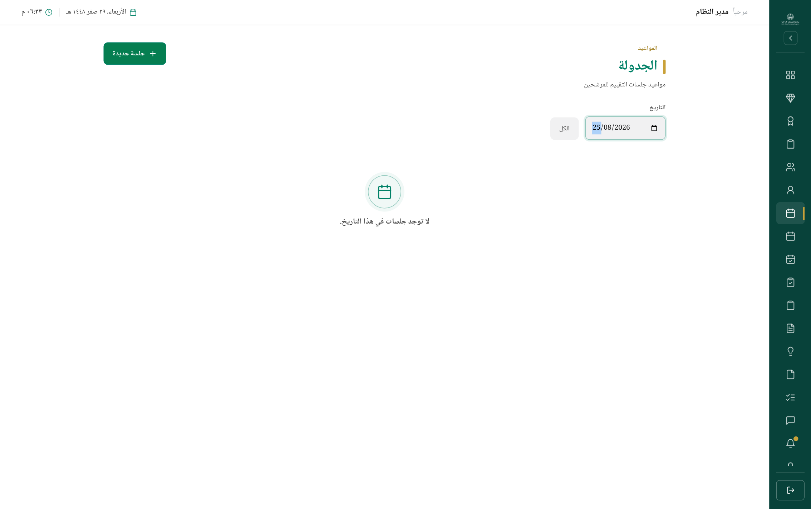

#### ما يمنعه النظام ولماذا

- **لا تُجدوَل إلا حالة «معتمد للتقييم».** قائمة **المرشّح** تقتصر على من حالته `scheduled` أو `assessed`، والخادم يرفض غيرهم بـ«لا يمكن جدولة مرشّح غير معتمد للتقييم» — الجدولة تفترض ترشيحاً اكتمل اعتماده.
- **الجلسة تحتاج دورة تقييم نشطة.** بلا دورة غير مكتملة يُرفض الإنشاء — كي لا تُعلَّق جلسة حيّة في دورة أُغلقت.
- **الوقت إلزامي عند الإنشاء.** كشف الحضور المطبوع يوزّع الجلسات على أعمدة الأوقات المعتمدة، وجلسة بلا وقت لا مكان لها فيه. ولهذا أيضاً لا يُرسَل الوقت فارغاً عند التعديل: الفراغ لا يمسح وقتاً مسجَّلاً.
- **التاريخ لا يسبق اليوم.**
- **لا تعديل ولا حذف بعد تسجيل الحضور.** الزرّان معطَّلان في الشاشة، والخادم يرفض الحذف أيضاً — القفل يمنع تنافر «حضورٌ لجلسة تغيّر تاريخها». وحامل `candidate.edit` (مدير المركز ومسؤول الجدولة) يستطيع التعديل مع تدوين التجاوز في سجل التدقيق، ولا يستطيع الحذف.
- **الحذف يُرفض حتى لو كان الحضور «بالانتظار».** الرفض معلَّق على **وجود** سجلّ حضور للجلسة لا على حالته، فقد تبدو الجلسة في الجدول **بالانتظار** وزرّ حذفها فعّالاً ثم يردّ الخادم **لا يمكن حذف جلسة سُجّل حضورها**.
- **الإسناد محصور بقطاع المشارك.** قائمة **مستشار المقابلة** تُبنى من مقيّمي قطاعه الفعّالين وحدهم، فلا يمكن الإسناد عبر القطاعات من هذه الشاشة. وإن كانت الجلسة مُسنَدة لمقيّم خارج القطاع، أُسقط التعيين عند فتح التعديل بدل أن يُرسَل مقيّمٌ مخفيّ.
- **ما خرج عن نطاقك «غير موجود».** جلسة مشاركٍ مصنَّف أو من قطاع آخر تعود بـ«الجلسة غير موجودة» لا برسالة منع — كي لا يصير المعرّف أداةً لكشف من هو موجود في القاعدة.
- **كل إنشاء وتعديل وحذف يُدوَّن** في سجل التدقيق، وتجاوز حدّ القطاع أو قفل الحضور يُدوَّن بفعلٍ مستقل يُميَّز بالعين.

#### رسائل الخطأ

| الرسالة | معناها | ما تفعله |
|---|---|---|
| ليس لديك صلاحية عرض الجدولة. | حسابك بلا `schedule.view` | راجع مدير النظام |
| ليس لديك صلاحية إدارة الجدولة | حاولت الإنشاء أو التعديل أو الحذف بلا `schedule.manage` | اطلب من مسؤول الجدولة إتمام العملية |
| تعذّر الحفظ — تحقّق من الحقول | فشل تحقّق الحقول: تاريخ في الماضي، أو وقت ناقص أو بغير صيغة `HH:MM`، أو مكان تجاوز ٢٠٠ حرف | صحّح الحقل ثم أعد الحفظ |
| لا يمكن جدولة مرشّح غير معتمد للتقييم | حالة المشارك ليست `scheduled` ولا `assessed` | اعتمد ترشيحه أولاً من شاشة المشاركين |
| لا توجد دورة تقييم نشطة للمرشّح | كل دورات المشارك مكتملة | افتح له دورة تقييم جديدة قبل الجدولة |
| المرشح غير موجود | المشارك محذوف أو خارج نطاقك (تصنيف أو قطاع) | تحقّق من الرمز، وراجع صلاحيتك على تصنيفه |
| الجلسة غير موجودة | حُذفت الجلسة، أو هي خارج نطاقك | أعِد تحميل الشاشة |
| لا يمكن حذف جلسة سُجّل حضورها | للجلسة سجلّ حضور | لا تُحذف. عدّلها إن كنت تملك `candidate.edit` |
| لا يمكن تعديل جلسة سُجّل حضورها | يظهر لمن مُنح `schedule.manage` بلا `candidate.edit` | اطلب التعديل من مسؤول الجدولة أو مدير المركز |
| تعذّر الحذف | ردّ الخادم بلا رسالة (انقطاع أو عطل) | أعِد المحاولة، فإن تكرّرت فراجع مدير النظام |
| تعذّر عرض السيرة | لا صلاحية `candidate.cv_view`، أو المشارك خارج نطاقك | اقرأ السيرة من شاشة المشاركين، أو راجع صلاحيتك |
| لا مرشّحين معتمدين للجدولة (الحالة scheduled/assessed). | لا مشارك جاهزاً للجدولة | اعتمد ترشيحات جديدة أولاً |
| لا مستشارون متاحون في قطاع المرشّح. | قطاع المشارك بلا مستشار مقابلة فعّال | أنشئ للقطاع مستخدماً بدور مستشار المقابلة، أو احفظ الجلسة **— بلا تعيين —** |
| لم يُدخل المرشّح سيرة بعد | المشارك لم يملأ سيرته في بوّابته | يمكن المضيّ في الجدولة، والسيرة تُراجَع لاحقاً |

---

### التوزيع الأسبوعي


**من يفتحها:** `schedule.distribute` — مدير النظام، ومدير المركز، ومسؤول الجدولة. من لا يحملها لا يرى الرابط في القائمة، وكتابة العنوان تعيده إلى لوحة التحكم.

خطوتان منفصلتان عمداً: **اقتراح** يحسب توزيعاً عادلاً ويحفظه مسودّة بلا أن يُنشئ جلسة، ثم **اعتماد** يعيد التحقّق من كل بند على البيانات الحيّة ويُنشئ جلسات المقابلات الناجية. الفجوة بين الاقتراح والاعتماد قد تُبطل بنوداً، فالاعتماد لا ينسخ المسودّة بل يبنيها من جديد.

الأسبوع الموزَّع هو **الأحد القادم إلى الخميس** — خمسة أيام عمل — ويُحسب هكذا من أي يوم فُتحت الشاشة، حتى لو كان اليوم أحداً.

| العنصر | معناه |
|---|---|
| **الأسبوع القادم** | تاريخ بداية الأسبوع المستهدَف، ويصير مدىً كاملاً (البداية — النهاية) بعد وجود اقتراح |
| **جاهزون للتوزيع** | عدد المشاركين المعتمدين للتقييم بلا جلسة مقابلة، ضمن التصنيفات التي يحقّ لك رؤيتها |
| **الحدّ لكل مقيّم / يوم** | سقف المقابلات لكل مستشار في اليوم الواحد — يُضبط في الإعدادات، وقيمته الافتراضية ٥ |
| **اقترح توزيع الأسبوع** | يبني المسودّة. معطَّل إذا كان عدد الجاهزين صفراً |
| **مسودّة — بانتظار الاعتماد** / **مُعتمد** | حالة الاقتراح القائم |
| **… بند** | عدد بنود الاقتراح |
| **جُدوِل …** / **سقط …** | بعد الاعتماد: كم بنداً صار جلسة، وكم سقط لتغيّر بياناته |
| **إلغاء الاقتراح** | يحذف المسودّة لإعادة التوزيع من جديد — يظهر للمسودّة وحدها |
| **اعتماد وإنشاء الجلسات** | يعتمد المسودّة ويُنشئ الجلسات — يظهر للمسودّة وحدها |
| كتلة لكل مقيّم | اسم المستشار، وشريحة قطاعه، وعدد مرشّحيه |
| جدول الكتلة: **الرمز** / **التاريخ** / **الحالة** | رمز المشارك، واليوم المقترَح، وحالته: **مجدول** أو سبب الإسقاط |

#### كيف تعمل فيها

**١ — اقتراح توزيع الأسبوع**

1. افتح **التوزيع الأسبوعي** وراجع البطاقات الثلاث: الأسبوع المستهدَف، وعدد الجاهزين، والحدّ اليومي.
2. اضغط **اقترح توزيع الأسبوع**.

تظهر رسالة **تم اقتراح التوزيع — راجعه ثم اعتمده**، وتتحوّل الشاشة إلى لافتة **مسودّة — بانتظار الاعتماد** وتحتها كتلة لكل مستشار بمرشّحيه وأيامهم. لم تُنشأ أي جلسة بعد.


**٢ — مراجعة الاقتراح**

1. اقرأ كتل المستشارين واحدة واحدة: عدد مرشّحي كلٍّ منهم وتوزيعهم على أيام الأسبوع.
2. تحقّق من عدد **البنود** في اللافتة مقابل عدد **الجاهزين** في البطاقة — الفرق هو ما تجاوز سعة الأسبوع أو ما قطاعه بلا مستشار.


**٣ — اعتماد التوزيع**

1. اضغط **اعتماد وإنشاء الجلسات**.
2. أكّد السؤال **اعتماد التوزيع سيُنشئ جلسات المقابلات. متابعة؟**.

تظهر رسالة **تم اعتماد التوزيع — جُدوِل … مرشّح**، أو **تم الاعتماد — جُدوِل …، وسقط … لتغيّر بياناتهم** إن سقط بعضهم. تتحوّل اللافتة إلى **مُعتمد**، ويظهر سبب الإسقاط في عمود **الحالة** أمام كل بند ساقط. الجلسات المُنشأة تظهر فوراً في شاشة **الجدولة** بنشاط المقابلة الشخصية.

**٤ — إلغاء الاقتراح وإعادة التوزيع**

1. اضغط **إلغاء الاقتراح**.
2. أكّد السؤال **حذف الاقتراح لإعادة التوزيع من جديد؟**.

تظهر رسالة **حُذف الاقتراح** وتعود الشاشة إلى حالتها الفارغة، فيمكنك الاقتراح من جديد.

#### ما يمنعه النظام ولماذا

- **اقتراح واحد لكل أسبوع.** محاولة اقتراح ثانٍ تُردّ بـ«يوجد اقتراح لهذا الأسبوع — احذفه أولاً لإعادة التوزيع»، والقيد مفروض في قاعدة البيانات على بداية الأسبوع، فحتى ضغطتان متزامنتان لا تُنشئان اقتراحين.
- **لا اعتماد آلي.** الاقتراح مسودّة لا تُنشئ جلسة، والاعتماد قرار بشري بتأكيد صريح — التوزيع الآلي يقترح، والمسؤول يقرّر.
- **الاعتماد يعيد التحقّق حيّاً ولا ينسخ المسودّة.** كل بند يُفحص من جديد: حالة المشارك، وقطاعه، وتفعيل المستشار وبقاؤه في القطاع، ووجود دورة نشطة، وألا يكون جُدوِل يدوياً منذ الاقتراح. ما بطل يسقط بسببه بدل أن يُجدوَل خطأً.
- **لا يُوزَّع مشاركٌ مرتين.** المحجوز في مسودّة أخرى لم تُعتمد بعد يُستثنى، ومن أُنشئت له جلسة مقابلة يدوياً يسقط عند الاعتماد بسبب **جُدوِل يدوياً**.
- **حدّ القطاع.** كل مشارك يُسنَد لمستشار من قطاعه وحده، وقطاعٌ بلا مستشار فعّال يُترك كاملاً بلا توزيع — لا يُسنَد مشاركوه لمستشار قطاع آخر.
- **الحدّ اليومي لا يُتجاوز.** الجلسات المجدولة يدوياً في أيام الأسبوع تُخصَم من سعة المستشار في يومها، والزائد عن السعة يُترك للأسبوع التالي بدل أن يُكدَّس فوق الحدّ.
- **التصنيف يحكم ما تراه وما توزّعه.** من لا يملك `candidate.view_classified` يُقصَر عدّه وتوزيعه على المشاركين غير المصنَّفين — كي لا يكشف العدّ وجود مشاركٍ مصنَّف، ولا يُسنَد لمستشار بلا تصريحه. والمصنَّفون يُجدوَلون يدوياً من شاشة **الجدولة**.
- **لا يُحذف اقتراح مُعتمد.** جلساته قائمة فعلاً، وحذفه يترك جلسات بلا مصدر.
- **الجلسات المُنشأة بالاعتماد بلا وقت ولا مكان.** التوزيع يقرّر اليوم والمستشار فقط، فتظهر الجلسة في **الجدولة** بـ**—** في عمودَي الوقت والمكان حتى تُستكمل بالتعديل.
- **الاقتراح والاعتماد والحذف تُدوَّن كلها** في سجل التدقيق بأفعال مستقلة.

#### رسائل الخطأ

| الرسالة | معناها | ما تفعله |
|---|---|---|
| ليس لديك صلاحية التوزيع | حسابك بلا `schedule.distribute` | راجع مدير النظام |
| تعذّر تحميل التوزيع | فشل جلب بيانات الشاشة | أعِد تحميل الصفحة، فإن تكرّرت فراجع مدير النظام |
| لا مرشّحون جاهزون للتوزيع حالياً. | لا مشارك معتمداً للتقييم بلا جلسة مقابلة | اعتمد ترشيحات جديدة، أو راجع صلاحيتك على التصنيفات |
| يوجد اقتراح لهذا الأسبوع — احذفه أولاً لإعادة التوزيع | لهذا الأسبوع اقتراح قائم | اضغط **إلغاء الاقتراح** ثم أعِد الاقتراح |
| أُنشئ اقتراح لهذا الأسبوع للتو | سبقك مستخدم آخر بجزء من الثانية | أعِد تحميل الصفحة لترى اقتراحه |
| الاقتراح غير موجود | حُذف الاقتراح من جلسة أخرى | أعِد تحميل الصفحة |
| الاقتراح مُعتمد أو مرفوض مسبقاً | اعتُمد الاقتراح فعلاً | أعِد تحميل الصفحة لترى نتيجة الاعتماد |
| لا يُحذف اقتراح مُعتمد — جلساته قائمة | حاولت حذف اقتراح صار جلسات | عدّل الجلسات أو احذفها من شاشة **الجدولة** |
| تعذّر الاقتراح / تعذّر الاعتماد / تعذّر الحذف | ردّ الخادم بلا رسالة (انقطاع أو عطل) | أعِد المحاولة، فإن تكرّرت فراجع مدير النظام |

**أسباب الإسقاط في عمود الحالة**

| السبب | معناه |
|---|---|
| حُذف المرشّح | حُذف سجلّ المشارك بين الاقتراح والاعتماد |
| تغيّرت حالة المرشّح | لم تعد حالته «معتمد للتقييم» |
| تغيّر قطاع المرشّح | نُقل إلى قطاع غير قطاع المستشار المقترَح |
| المقيّم غير متاح | عُطّل حساب المستشار أو نُقل قطاعه |
| لا دورة نشطة | كل دورات المشارك اكتملت |
| جُدوِل يدوياً | أُنشئت له جلسة مقابلة من شاشة الجدولة منذ الاقتراح |

---

### الحضور


**من يفتحها:** `attendance.view` — مدير النظام، ومدير المركز، ومسؤول الجدولة، ومسؤول استقبال الموظفين، ومسؤول العمليات، ومدير إدارة التقييم، ومستشار المقابلة، ومستشار حلقة النقاش، ومساعد التقييم، ومشرف أدوات القياس. ولا تُفتح لإدارة تطوير الكفاءات ولا للمستخدم الخارجي.

**من يسجّل فيها:** `attendance.record` — الاستقبال، ومشرف أدوات القياس، ومستشار المقابلة، ومستشار حلقة النقاش، ومساعد التقييم، ومدير النظام. ومن يملك العرض وحده يقرأ ولا يسجّل.

> **مدير المركز يقرأ ولا يسجّل** — وإن بدا خلاف ذلك. هو يحمل `attendance.record_any` ولا يحمل `attendance.record`، والخادم يفحص الثانية أوّلاً؛ فأثر `record_any` عنده معدوم في هذه الشاشة. وموضعُ أثرها لمن يحمل `record` معها: تسجيلُ أي جلسة لا جلساته وحدها.

الشاشة تعرض جلسات **اليوم وحده**، ولكل جلسة حالة واحدة تُسجَّل مرّة واحدة: حضور، أو غياب بعذر، أو غياب. والمعروض هو رمز المشارك لا اسمه.

الجلسات التي تنقضي بلا تسجيل تُوسم آلياً «غائب» في الصيانة اليومية (٦:٠٠ صباحاً) بسبب «غياب تلقائي — لم يُسجَّل حضور للجلسة»، ضمن نافذة سبعة أيام رجوعاً.

| العنصر | معناه |
|---|---|
| بطاقة **حاضر** | عدد جلسات اليوم المسجَّل فيها حضور — والنقر عليها يُرشِّح الجدول عليها |
| بطاقة **غائب** | تجمع الحالتين معاً: «غائب بعذر» و«غائب» |
| بطاقة **بانتظار** | جلسات لم تُسجَّل حالتها بعد |
| بطاقة **الإجمالي** | كل جلسات اليوم داخل نطاقك — والنقر عليها يلغي الترشيح |
| عمود **الرمز** | رمز المشارك |
| عمود **القطاع** | قطاع المشارك |
| عمود **النشاط** | «مقابلة» أو «حلقة نقاش» أو «أدوات قياس» أو «جلسة تكامل» |
| عمود **الحالة** | «بانتظار» أو «حاضر» أو «غائب بعذر» أو «غائب» |
| عمود **إجراء** | زرّا **حضور** و**غياب** لجلسةٍ مُسنَدة إليك لم تُسجَّل بعد؛ و«مُسنَدة لغيرك» لجلسة غيرك أو حين لا تملك التسجيل؛ و«تم» بعد تسجيل الحالة |
| **عرض الكل** | يظهر داخل الحالة الفارغة بعد الترشيح — يعيد عرض الجدول كاملاً |
| نافذة **تسجيل غياب** | فيها «غياب بعذر» مؤشَّراً مبدئياً، ومربّع «سبب الغياب (اختياري)»، وزرّا **إلغاء** و**حفظ**. والضغط خارج النافذة يغلقها بلا حفظ |

#### كيف تعمل فيها

**تسجيل حضور**

١. افتح **الحضور** من القائمة الجانبية.
٢. ابحث عن صفّ المشارك برمزه في عمود «الرمز».
٣. اضغط **حضور**.

تظهر رسالة «تم تسجيل حضور» متبوعةً برمز المشارك، وتصير الحالة «حاضر»، ويصير عمود الإجراء «تم»، ويرتفع عدّاد «حاضر». ووقت الحضور هو لحظة الضغط.


**تسجيل غياب**

١. اضغط **غياب** في صفّ المشارك.
٢. أبقِ **غياب بعذر** مؤشَّراً إن كان الغياب بعذر، وأزل التأشير إن كان بلا عذر.
٣. اكتب السبب في «سبب الغياب (اختياري)» — وحدّه ٥٠٠ حرف.
٤. اضغط **حفظ**.

تظهر رسالة «تم تسجيل غياب» متبوعةً برمز المشارك، وتصير الحالة «غائب بعذر» أو «غائب». والسبب المكتوب يظهر بعدها في **التقرير اليومي** تحت «الغياب والأسباب»، وفي رحلة المشارك.


**ترشيح الجدول بحالة**

١. اضغط بطاقة الحالة: **حاضر** أو **غائب** أو **بانتظار**. تُعلَّم البطاقة بحدٍّ ملوّن، ويُرشَّح الجدول، وتُسجَّل الحالة في الرابط (`/attendance?status=present`).
٢. لإلغاء الترشيح اضغط البطاقة نفسها ثانيةً، أو **الإجمالي**، أو **عرض الكل** إن كانت النتيجة فارغة.

الترشيح يجري داخل قائمة اليوم المحمَّلة، فلا يُنتظَر الخادم. وإن خلت النتيجة ظهر نصّ «لا يوجد مرشحون بحالة …» ومعه **عرض الكل**.

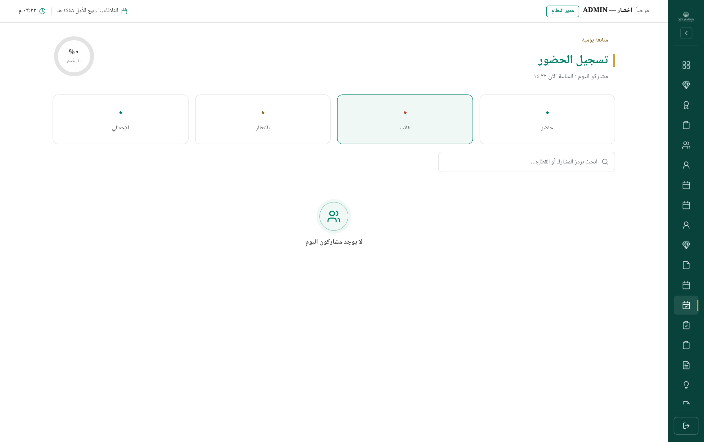

**الوصول من اللوحة الرئيسة**

في حلقة «نسبة الحضور» اضغط «حاضر» أو «غائب» أو «بالانتظار» — تُفتح شاشة الحضور مرشَّحةً على تلك الحالة مباشرةً.

#### ما يمنعه النظام ولماذا

- **جلسة غير مُسنَدة إليك لا تُسجّلها.** مستشار المقابلة ومستشار حلقة النقاش ومساعد التقييم يسجّلون الجلسات المُسنَدة إليهم وحدها — مقيّماً أو مساعداً — وفي بقيّة الصفوف يُكتب «مُسنَدة لغيرك». القاعدة: «الذي يستقبله يسجّله»؛ بلا هذا التمييز يسجّل أيُّ مقيّم حضور مشاركٍ لم يره. والخادم يردّ «هذه الجلسة ليست مُسنَدة لك» ويقيّد المحاولة في سجل التدقيق.


- **الاستقبال ومشرف أدوات القياس يسجّلان أي جلسة** (`attendance.record_any`)، لأنهما يستقبلان من لا جلسة لهما فيه.
- **العرض لا يعني التسجيل.** مدير المركز ومسؤول الجدولة ومسؤول العمليات ومدير إدارة التقييم يرون الشاشة ولا يسجّلون فيها. ومدير المركز وإن ملك «تسجيل حضور أي جلسة» فالتسجيل يشترط `attendance.record` أولاً، فيردّ الخادم «ليس لديك صلاحية تسجيل الحضور».
- **حدّ القطاع.** مستشار المقابلة ومستشار حلقة النقاش ومساعد التقييم لا يرون إلا جلسات مشاركي قطاعهم، والبطاقات الأربع تُحسب بالحصر نفسه — فلا يعدّ المؤشّر ما لا تعرضه القائمة.


- **المشاركون المصنَّفون** لا تظهر جلساتهم لمن لا يملك `candidate.view_classified`. ومحاولة تسجيل جلسة خارج نطاقك — تصنيفاً أو قطاعاً — تُردّ بـ«الجدول غير موجود» لا برسالة صلاحية، كي لا يصير فرق الردّ كاشفاً لوجود جلسات لا تخصّك.
- **جلسات اليوم وحدها.** ما مضى وما لم يحن لا يظهر في القائمة ولا يُسجَّل: «لا يمكن تسجيل الحضور إلا لجلسات اليوم».
- **حالة واحدة لكل جلسة.** بعد التسجيل يختفي الزرّان ويحلّ محلّهما «تم»، ولا تُعدَّل الحالة من هذه الشاشة. وفهرس فريد على الجلسة في قاعدة البيانات يحرس ذلك حتى عند ضغطتين متزامنتين من جهازين.
- **بعد التسجيل تُقفل الجلسة في الجدولة.** لا تُحذف («لا يمكن حذف جلسة سُجّل حضورها»)، ولا تُعدَّل إلا لمن يملك تعديل بيانات المشارك — وتغيير تاريخ الجلسة أو وقتها يُلغي الحضور المسجّل، لأن حضوراً لموعدٍ تبدّل لم يعد صحيحاً.
- **إعادة الجدولة تتبع الغياب.** لا تُعاد جدولة إلا جلسة سُجّل فيها غياب، وبصلاحية تعديل بيانات المشارك — فتسجيل الغياب هو ما يفتح باب الموعد البديل.

#### رسائل الخطأ

| الرسالة | معناها | ما تفعله |
|---|---|---|
| «تعذّر تحميل الحضور — تأكد أن الخادم يعمل» | لم تصل قائمة اليوم ولا مؤشراتها | حدّث الصفحة؛ فإن تكرّرت فالخادم لا يستجيب — راجع الدعم الفني |
| «ليس لديك صلاحية عرض الحضور» | حسابك لا يملك `attendance.view` | الشاشة ليست لدورك — اطلب الصلاحية من مدير النظام |
| «ليس لديك صلاحية تسجيل الحضور» | تملك العرض لا التسجيل (`attendance.record`) | أبلغ من يملك التسجيل: الاستقبال، أو المستشار المُسنَدة إليه الجلسة |
| «ليس لديك صلاحية التسجيل» | الرسالة نفسها عند تسجيل الغياب | كما سبق |
| «هذه الجلسة ليست مُسنَدة لك» | الجلسة لمستشار آخر، وأنت لا تملك تسجيل أي جلسة | اتركها لصاحبها أو للاستقبال |
| «الجدول غير موجود» | الجلسة غير موجودة، أو خارج نطاقك قطاعاً أو تصنيفاً | تأكّد من الصفّ؛ وما خرج عن نطاقك لا يُسجَّل منك |
| «لا يمكن تسجيل الحضور إلا لجلسات اليوم» | الجلسة ليست بتاريخ اليوم | الحضور يُسجَّل في يومه؛ وما فات يُعالَج بإعادة الجدولة |
| «لا يمكن تسجيل الغياب إلا لجلسات اليوم» | نفسها عند تسجيل الغياب | كما سبق |
| «تم تسجيل حالة هذه الجلسة مسبقاً» | حالة الجلسة سُجّلت من قبل، أو سجّلها مستخدم آخر في اللحظة نفسها | حدّث الصفحة لترى الحالة المسجَّلة |
| «تعذّر التسجيل» | ردّ الخادم بخطأ بلا نصّ مخصّص — كسبب غياب يتجاوز ٥٠٠ حرف | النافذة تُغلق: أعد فتحها من زرّ «غياب» واختصر السبب |

---

### التقييم


**من يفتحها:** `evaluation.view` — مدير النظام، ومدير المركز، ومدير إدارة التقييم، ومستشار المقابلة، ومستشار حلقة النقاش، ومساعد التقييم، وإدارة تطوير الكفاءات. أمّا **بدء الجلسة ورصد الدرجات وإرسالها** فتلزمها `evaluation.input`، ولا يملكها إلا **مدير النظام** و**مستشار المقابلة** و**مستشار حلقة النقاش**. من يفتحها بلا `evaluation.input` يقرأ النموذج ولا يبدأ به جلسة.

شاشة واحدة بحالتين: قبل بدء الجلسة تعرض نموذج البدء وقائمة مسوداتك أنت، وبعد البدء تتحوّل إلى نموذج الدرجات. الدرجات تُرصَد على **كفاءات النشاط المختار وحده** — المرتبطة به في **خريطة الكفاءات** — ثم تُرسَل دفعةً واحدة إلى الاعتماد.

الشاشة تعمل بالرمز لا بالاسم: لا يظهر فيها اسم المشارك ولا رقم هويته في أي موضع — لا في قائمة الاختيار، ولا في صفوف المسودات، ولا في السيرة الذاتية.

| العنصر | معناه |
|---|---|
| «جلسة تقييم» / «نموذج التقييم» | عنوان الشاشة |
| «اختر مرشحاً ونوع النشاط لبدء الجلسة» | السطر الظاهر قبل بدء الجلسة |
| «جلسة جارية · 00:00» | يحلّ محلّه بعد البدء — عدّاد يبدأ من لحظة فتح النموذج، ولا يُرسَل إلى الخادم ولا يُحفَظ مع التقييم |
| **المرشح** | قائمة المشاركين المتاحين للتقييم، كلٌّ بصيغة «الرمز — القطاع». لا تعرض إلا من حالته **مجدول** أو **مُقيَّم** |
| «— اختر المرشح —» | القيمة الفارغة؛ زرّ **بدء الجلسة** معطَّل ما دامت مختارة |
| **نوع النشاط** | «مقابلة شخصية» أو «حلقة نقاش» — وهو ما يحدّد الكفاءات التي ستُرصَد |
| **بدء الجلسة** | يُنشئ التقييم مسودةً على الخادم ويفتح نموذج الدرجات |
| **استكمال مسودة** | بطاقة لا تظهر إلا إن كانت لك مسودات. لكل صفّ: رمز المشارك، ثم «مقابلة شخصية» أو «حلقة نقاش» و«{العدد} كفاءة مُقيّمة» |
| **استكمال** | يفتح المسودة بدرجاتها وملاحظاتها المحفوظة، وبنشاطها المخزَّن |
| **السيرة الذاتية** | لوحة مطوية أعلى النموذج، بجانبها رمز المشارك |
| «كفاءات المقابلة الشخصية» / «كفاءات حلقة النقاش» | عنوان بطاقة الدرجات بحسب نشاط الجلسة |
| شارة «جارٍ التقييم» | شارة ثابتة تظهر ما دام نموذج الدرجات مفتوحاً |
| صفّ الكفاءة | اسم الكفاءة، وبجانبه وسم نوعها: «سلوكية» أو «قيادية» أو «فنية» |
| أزرار الأرقام | مستويات الكفاءة من ١ إلى حدّها الأقصى. الضغط على رقم يُضيئه ويُضيء ما دونه |
| «0 / 5» | الدرجة المختارة من الحدّ الأقصى. `0` تعني أن الكفاءة **لم تُقيَّم بعد** |
| **ملاحظات المستشار** | حقل نصّي حرّ («اكتب ملاحظاتك حول أداء المرشح...») يُحفَظ مع الدرجات |
| **إلغاء الجلسة** | يُغلق النموذج ويعود لشاشة البدء — **ولا يحذف المسودة** |
| **حفظ مسودة** | يحفظ الدرجات والملاحظات ويُبقي التقييم قابلاً للتعديل |
| **إرسال للاعتماد** | يحفظ ثم يُقفل التقييم ويُحيله للاعتماد |

#### كيف تعمل فيها

**١ — بدء جلسة جديدة**

1. افتح **التقييم** من الشريط الجانبي.
2. اختر المشارك من قائمة **المرشح** — تظهر بالرمز والقطاع.
3. اختر **نوع النشاط**: «مقابلة شخصية» أو «حلقة نقاش».
4. اضغط **بدء الجلسة**.

يُنشأ التقييم مسودةً على الخادم، ويُفتح نموذج الدرجات بكفاءات ذلك النشاط وحدها، ويبدأ العدّاد من `00:00`.


**٢ — رصد الدرجات**

1. لكل كفاءة اضغط رقم المستوى الذي تراه — يُضيء هو وما دونه، ويتحدّث العدّاد بجانبه إلى «{الدرجة} / {الحدّ الأقصى}».
2. لتغيير درجة، اضغط رقماً آخر في الصفّ نفسه.
3. اكتب ملاحظاتك في **ملاحظات المستشار**.

الكفاءة التي لم تُضغط لها درجة تبقى على `0` ولا تُرسَل ضمن الدرجات إطلاقاً.


**٣ — قراءة السيرة الذاتية**

1. اضغط **السيرة الذاتية** أعلى النموذج.
2. تُعرض — إن وُجدت — **المنصب الحالي** و**سنوات الخبرة** ونبذة، ثم **المؤهلات العلمية** (دبلوم/بكالوريوس/ماجستير/دكتوراه/زمالة مع التخصّص والجهة وسنة التخرّج)، ثم **الخبرات العملية** (المنصب والجهة والمدّة، و«حتى الآن» للوظيفة القائمة)، ثم **الشهادات**.

المعروض هو **لقطة الدورة المجمَّدة** التي تُلتقَط عند أول تقييم في الدورة، لا السيرة الحيّة — فما يقرؤه المستشار لا يتبدّل تحته أثناء الجلسة. ومن لا يملك `candidate.view_names` تُطمَس عنه المعرّفات داخل نصوص السيرة آلياً. وإن لم يُدخل المشارك سيرة ظهر «لم يُدخل المرشح سيرة ذاتية.»، وأثناء الجلب يظهر «جارٍ التحميل…».


**٤ — حفظ مسودة**

1. اضغط **حفظ مسودة**.
2. تظهر «تم حفظ المسودة» ثم تختفي وحدها.

الحفظ يستبدل الدرجات المحفوظة كلها بما هو معروض أمامك — إمّا كلّها أو لا شيء، فلا تُفقَد درجة في حفظٍ ناقص. والقيم السابقة تُقيَّد في سجل التدقيق مع كل حفظ.

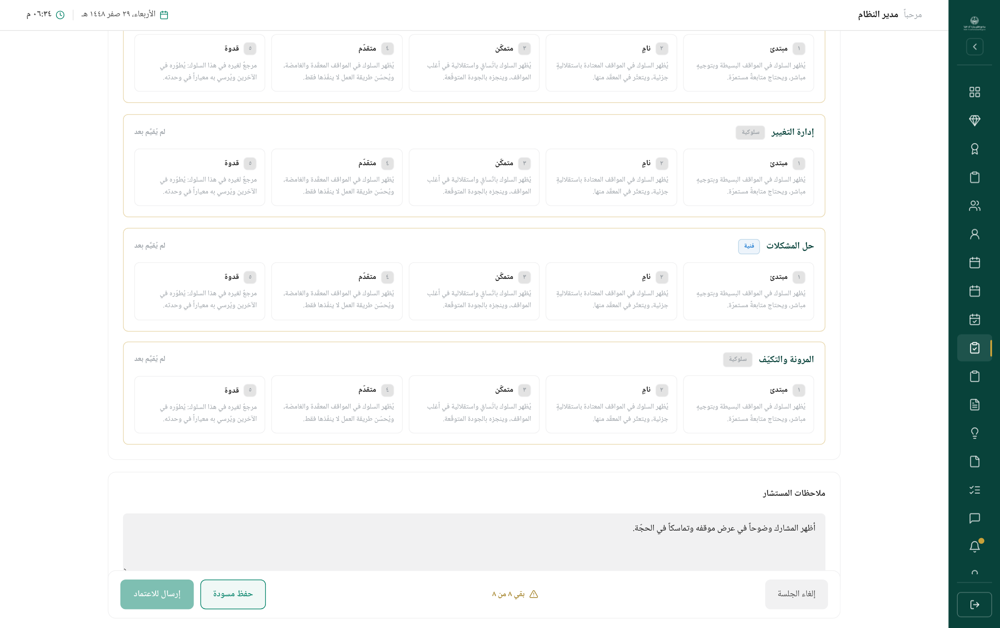

**٥ — استكمال مسودة**

1. من شاشة التقييم اضغط **استكمال** بجانب المسودة، أو ادخل إليها من قسم المسودات في **لوحة التحكم**.
2. يُفتح النموذج بدرجاته وملاحظاته المحفوظة، وبنشاطه المخزَّن لا بالنشاط المختار في شاشة البدء.

البطاقة تعرض **مسوداتك أنت** لا مسودات غيرك. وإن تعذّر تحميل القائمة لم تظهر رسالة خطأ — تختفي البطاقة فحسب.

**٦ — الإرسال للاعتماد**

1. تأكّد من رصد درجةٍ لـ**كل** كفاءة من كفاءات النشاط.
2. اضغط **إرسال للاعتماد**.

تظهر «تم إرسال التقييم للاعتماد ✓»، ويتوقّف العدّاد، وتعود الشاشة إلى نموذج البدء بعد ثانيتين. ينتقل التقييم إلى حالة «مُرسل»، وتنتقل حالة المشارك من **مجدول** إلى **مُقيَّم**، ويصل إشعار «تقييم بانتظار الاعتماد» إلى مدير إدارة التقييم.

**٧ — إلغاء الجلسة**

1. اضغط **إلغاء الجلسة**.

تعود إلى نموذج البدء. **المسودة لا تُحذف**: التقييم أُنشئ على الخادم لحظة الضغط على «بدء الجلسة»، فتجده في «استكمال مسودة». ولن تستطيع بدء جلسة جديدة للمشارك نفسه في النشاط نفسه — استكمل مسودته.

**٨ — إن أُرجع تقييمك**

صاحب صلاحية `evaluation.approve` قد يُرجع التقييم بسبب مكتوب إلزامي. حينها يعود التقييم إلى حالة **مسودة**، ويصلك إشعار «تقييم مُرجع للتعديل» يحمل السبب، ويظهر التقييم من جديد في **استكمال مسودة** لتعدّله وتُرسله ثانية.

#### ما يمنعه النظام ولماذا

- **تقييمان للمشارك نفسه في النشاط نفسه داخل الدورة الواحدة.** المنع على مستوى **دورة التقييم**، فيُسمح بتقييم النشاط نفسه في **دورة تقييم جديدة**. والفحص وحده لا يكفي عند ضغطتين متزامنتين، فيحسمه فهرس فريد على (الدورة، النشاط) بردٍّ مفهوم «تم بدء تقييم لهذا المرشح في هذا النشاط للتوّ» بدل سجلَّين متضاربين أو خطأ نظام.
- **تقييم مشارك من خارج قطاعك.** المستشار (المقابلة وحلقة النقاش) ومساعد التقييم محصورون بقطاعهم: القائمة لا تعرض غير مشاركي القطاع، والقيد يُفرَض **مرّةً أخرى عند بدء الجلسة** لا عند التوزيع وحده — وإلا بدأ مستشارٌ جلسةً لمشارك من قطاع آخر بلا جدولة أصلاً. والردّ «المرشح غير موجود» لا «ليس من قطاعك»، كي لا يصير تجريب المعرّفات طريقاً لمعرفة قطاع من ليس لك.
- **المشاركون المصنَّفون (سرّي / سرّي للغاية).** لا يظهرون في القائمة، ولا تُفتح لهم جلسة، ولا تُقرأ سيرتهم لمن لا يملك `candidate.view_classified`. والمحاولة تُقيَّد في سجل التدقيق.
- **تقييم مشارك لم يُعتمد للتقييم.** القائمة لا تعرض إلا من حالته **مجدول** أو **مُقيَّم**، والخادم يرفض ما سواهما — التقييم يقع على مشاركٍ اكتمل مساره إليه.
- **قراءة تقييم غيرك أو سيرته.** من يفتح تقييماً ليس له يُردّ «التقييم غير موجود» — إلا من يملك `evaluation.approve`، فمراجعته تقتضي قراءته. سرّية الدرجات بين المستشار ومراجعه.
- **إرسال تقييم ناقص.** يجب رصد **كل** كفاءات النشاط قبل الإرسال؛ وإلا رُدَّ بعدد ما رُصد من المطلوب. تقريرٌ يُبنى على كفاءات نصفها غير مرصود يقارن ما لا يُقارَن.
- **تعديل تقييم بعد إرساله أو اعتماده.** الدرجات تُقفل عند الإرسال، فما يراجعه المعتمِد هو ما أُرسل بعينه. للتعديل بعد الإرسال طريق واحد: أن يُرجعه صاحب صلاحية الاعتماد.
- **درجة تتجاوز الحدّ الأقصى للكفاءة، أو كفاءة لا تخصّ النشاط.** الأزرار لا تعرض إلا ما يجوز، والخادم يفحص الاثنين من جديد: الإخفاء في الواجهة راحة لا حماية.
- **الرصد بلا `evaluation.input`.** الصلاحية تُفحَص **قبل** ملكية الجلسة، حتى لا تبقى الجلسة مفتوحة لمن سُحبت منه الصلاحية بعد بدئها.


وكل خطوة مُقيَّدة في **سجل التدقيق**: بدء الجلسة، وحفظ الدرجات ومعه القيم السابقة، والإرسال، والاعتماد والإرجاع، وفتح السيرة الذاتية، والمحاولات المرفوضة خارج النطاق.

#### رسائل الخطأ

| الرسالة | معناها | ما تفعله |
|---|---|---|
| «أدخل درجة واحدة على الأقل» | ضغطت **حفظ مسودة** أو **إرسال للاعتماد** ولم تُرصَد أي درجة | ارصد الدرجات ثم أعد المحاولة |
| «توجد مسودة تقييم لهذا المرشح في هذا النشاط — استكملها بدل بدء جلسة جديدة» | التقييم مفتوح أصلاً في هذه الدورة | استعمل بطاقة **استكمال مسودة** |
| «تم تقييم هذا المرشح في هذا النشاط مسبقاً» | التقييم أُرسل أو اعتُمد في الدورة الحالية | لا يُعاد التقييم إلا بدورة تقييم جديدة |
| «تم بدء تقييم لهذا المرشح في هذا النشاط للتوّ» | ضغطتان متزامنتان على **بدء الجلسة** | أعد تحميل الشاشة، وستجد المسودة في **استكمال مسودة** |
| «المرشح غير موجود» | خارج قطاعك، أو خارج تصنيفك، أو غير موجود فعلاً | راجع مسؤول الجدولة أو التوزيع |
| «لا يمكن تقييم مرشح غير معتمد للتقييم» | حالة المشارك ليست **مجدول** ولا **مُقيَّم** | يُستكمل مساره أولاً |
| «ليس لديك صلاحية إدخال التقييم» | حسابك يفتح الشاشة ولا يرصد فيها | الرصد لمستشار المقابلة ومستشار حلقة النقاش |
| «ليس لديك صلاحية عرض التقييم» / «ليس لديك صلاحية عرض التقييمات» | حسابك لا يملك `evaluation.view` | راجع مدير النظام |
| «التقييم غير موجود» | تقييم يخصّ غيرك، أو مشاركاً خارج نطاقك | لا تُقرأ تقييمات غيرك إلا بصلاحية الاعتماد |
| «لا يمكن تعديل تقييم تم إرساله أو اعتماده» | حاولت الحفظ على تقييم مُقفل | اطلب إرجاعه ممّن يعتمده |
| «التقييم مُرسل مسبقاً» | إرسال مكرّر لنفس التقييم | لا شيء — الإرسال تمّ |
| «لا يمكن إرسال تقييم بدون درجات» | لم تُحفَظ أي درجة على الخادم | ارصد الدرجات ثم أرسل |
| «التقييم ناقص: تم تقييم {عدد} من {عدد} كفاءة لهذا النشاط» | بقيت كفاءات بلا درجة | أكمل الكفاءات الباقية ثم أرسل |
| «لا توجد كفاءات مرتبطة بهذا النشاط» | النشاط بلا كفاءات في **خريطة الكفاءات** | تُربَط الكفاءات بالنشاط أولاً |
| «إحدى الكفاءات لا تخص هذا النشاط» | وصلت درجة لكفاءة خارج كفاءات النشاط | أعد تحميل الشاشة وارصد من جديد |
| «الدرجة تتجاوز الحد الأقصى للكفاءة ({اسم الكفاءة}: {الحدّ})» | درجة أعلى من سقف الكفاءة | اختر درجة ضمن أزرار الصفّ |
| «تعذّر تحميل البيانات — تأكد أن الخادم يعمل» | لم تُجلب قائمة المشاركين | أعد تحميل الصفحة، ثم راجع الدعم الفني |
| «تعذّر بدء الجلسة» / «تعذّر فتح المسودة» / «تعذّر الحفظ» / «تعذّر الإرسال» | رسالة احتياطية حين لا يُرجع الخادم سبباً مفهوماً | أعد المحاولة، ثم راجع الدعم الفني |
| «لم يُدخل المرشح سيرة ذاتية.» | ليست خطأً — لا سيرة محفوظة لهذا المشارك | تابع الجلسة بلا سيرة |

---

### أدوات القياس


**من يفتحها:** صلاحية **«عرض أدوات القياس»** `measurement.view` — مدير النظام، مدير المركز، مدير إدارة التقييم، مساعد التقييم، إدارة تطوير الكفاءات، مشرف أدوات القياس. أمّا التعديل فيلزمه صلاحية ثانية منفصلة: **«رفع نتائج القياس»** `measurement.upload`، ولا يملكها إلا مدير النظام ومدير المركز ومشرف أدوات القياس. الرابط في القائمة الجانبية: **أدوات القياس**.

شاشة واحدة لنتائج أدوات القياس الثلاث للدورة الحالية للمشارك. تختار المشارك من قائمة واحدة، فتظهر نتيجته المحفوظة إن وُجدت، وتُدخل الدرجات الثلاث وتحفظها دفعة واحدة. الشاشة تعمل برمز المشارك وقطاعه لا باسمه — ومشرف أدوات القياس MEASURE_SUPER لا يملك «رؤية أسماء المرشحين» أصلاً.

| العنصر | معناه |
|---|---|
| **المرشّح** (قائمة منسدلة) | قائمة الاختيار. تعرض فقط من كانت حالته **مجدول** `scheduled` أو **مُقيّم** `assessed` — أي من هو في دورة نشطة |
| «اختر مرشّحاً…» | الخيار الافتراضي، معطّل ولا يُختار |
| كل خيار: `DM-026 — الصحة` | رمز المشارك ثم قطاعه. لا اسم |
| «لا مرشحين في دورة نشطة (scheduled/assessed).» | تحذير أسفل القائمة حين لا يوجد أحد في هاتين الحالتين |
| **المقياس الشخصي** | درجة المقياس الشخصي من 100 |
| **القدرات التحليلية** | درجة القدرات التحليلية من 100 |
| **اللغة الإنجليزية** | درجة اللغة الإنجليزية من 100 |
| «/ 100» بجانب كل حقل | السقف الأعلى للدرجة. خطوة الإدخال 0.5 |
| «آخر تحديث: …» | تاريخ ووقت آخر حفظ للنتيجة. لا يظهر قبل أول حفظ |
| **حفظ النتيجة** | يرفع الدرجات الثلاث في نداء واحد. يصير «جارٍ الحفظ…» أثناء التنفيذ |
| «عرض فقط — تحتاج صلاحية رفع القياس للتعديل.» | تحلّ محلّ زرّ الحفظ لمن يملك العرض دون الرفع |

#### كيف تعمل فيها

**١. عرض نتيجة مشارك**

1. افتح **أدوات القياس** من القائمة الجانبية.
2. اضغط قائمة **المرشّح** واختر رمز المشارك.
3. انتظر انتهاء «جارٍ التحميل…».

تظهر بطاقة الدرجات الثلاث معبّأة بالنتيجة المحفوظة، وتحتها سطر **«آخر تحديث»** بتاريخ آخر حفظ. وإن لم تُرفع نتيجة بعد، ظهرت الحقول فارغة بعلامة «—» ولا يظهر سطر آخر تحديث.


**٢. رفع نتيجة أو تعديلها**

1. اختر المشارك من القائمة.
2. اكتب الدرجة في كل حقل من الحقول الثلاثة (من 0 إلى 100، وتقبل الكسر النصفي 0.5).
3. اضغط **حفظ النتيجة**.

يظهر شريط أخضر: **«تم حفظ نتيجة القياس»**، ويتحدّث سطر «آخر تحديث» إلى وقت الحفظ.


**٣. رفع نتيجة جزئية**

1. اختر المشارك.
2. اكتب الدرجات المتوفّرة فقط، واترك الحقل الذي لم تصل نتيجته **فارغاً**.
3. اضغط **حفظ النتيجة**.

يُحفظ الحقل الفارغ بلا قيمة، ولا يُعدّ صفراً. عُد لاحقاً واكتبه واحفظ من جديد — الحفظ يستبدل نتيجة الدورة نفسها لا يضيف سجلاً جديداً.

> تبديل المشارك من القائمة يعيد تحميل الشاشة من الخادم ويمسح ما لم تحفظه ورسائل النجاح والخطأ. احفظ قبل أن تنتقل.

#### ما يمنعه النظام ولماذا

- **العرض والرفع صلاحيتان منفصلتان.** من يملك `measurement.view` وحدها يرى الدرجات ولا يعدّلها: الحقول معطّلة وزرّ الحفظ غائب، ومكانه سطر «عرض فقط — تحتاج صلاحية رفع القياس للتعديل.». وهذا فصل مقصود في المصفوفة: مدير إدارة التقييم ومساعد التقييم وإدارة تطوير الكفاءات يقرؤون القياس لأنه يدخل في التقرير، ولا يرفعونه — الرفع لمشرف أدوات القياس ومدير المركز.
- **لا كتابة ولا قراءة خارج نطاقك.** المتحكّم يحلّ المشارك بالتصنيف والقطاع معاً، فمرشّح من قطاع آخر — أو مصنَّف لا تملك رؤيته — يعود بردّ **«المرشح غير موجود»**، لا «ممنوع». الردّ واحد في الحالتين عمداً كي لا يصير المعرّف أداةً يُستدلّ بها على من هو مسجَّل في القاعدة.
- **الدرجة محصورة بين 0 و100.** الخادم يتحقّق منها ويرفض ما خرج عن المدى قبل أن يمسّ القاعدة.
- **لا كتابة على دورة منتهية.** الرفع يستهدف آخر دورة **غير مكتملة** للمشارك؛ فإن كانت كل دوراته مكتملة رُدّ الطلب بـ«لا توجد دورة تقييم نشطة للمرشّح». نتيجة الدورة المنتهية تبقى للقراءة ولا تُصحَّح بأثر رجعي.
- **القائمة لا تعرض إلا الدورات النشطة.** المشاركون في حالة «مسودة» أو «معتمد» أو «مكتمل» لا يظهرون في قائمة الاختيار أصلاً.
- **كل حفظ مُدقَّق.** يُسجَّل في سجل التدقيق باسم `UPLOAD_MEASUREMENT` مع رمز المشارك ورقم من رفعه وعنوان الشبكة.

#### رسائل الخطأ

| الرسالة | معناها | ما تفعله |
|---|---|---|
| «تعذّر الحفظ — تحقّق من القيم (0–100)» | إحدى الدرجات خارج المدى المسموح أو ليست رقماً | صحّح الحقل المخالف واحفظ. لم يُكتب شيء في القاعدة |
| «ليس لديك صلاحية رفع القياس» | حاولت الحفظ بحساب يملك العرض دون الرفع | راجع مدير النظام. الرفع لمشرف أدوات القياس أو مدير المركز |
| «ليس لديك صلاحية عرض القياس» | سُحبت صلاحية العرض من دورك بعد دخولك | سجّل خروجاً ودخولاً؛ فإن بقيت، فالصلاحية غير ممنوحة لدورك |
| «المرشح غير موجود» | المشارك خارج قطاعك أو خارج تصنيفك المسموح | لا تتابع. اطلب من مسؤول القطاع رفع نتيجته |
| «لا توجد دورة تقييم نشطة للمرشّح» | كل دورات المشارك مكتملة | لا يُرفع قياس على دورة منتهية. تُفتح له دورة جديدة أولاً |
| «تعذّر جلب النتيجة» | الخادم لم يستجب لطلب العرض | أعد اختيار المشارك؛ فإن تكرّرت فأبلغ مدير النظام |

---

### التقارير النهائية

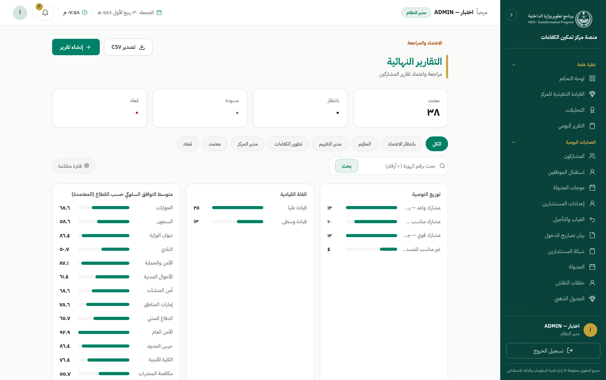

**من يفتحها:** `report.view` — مدير النظام، مدير المركز، مدير إدارة التقييم، مستشار المقابلة، مساعد التقييم، إدارة تطوير الكفاءات.

ترويستها **الاعتماد والمراجعة — التقارير النهائية — مراجعة واعتماد تقارير المرشحين**. فيها يُكتب التقرير النهائي للمشارك، ويمرّ في سلسلة الاعتماد مرحلةً بعد مرحلة، ثم يخرج مستنداً مطبوعاً. القائمة محصورة بنطاقك: تصنيف المرشّح وقطاعه، ومستشار المقابلة لا يرى إلا تقارير من قيّمهم هو.

**ترويسة الشاشة والمؤشّرات**

| العنصر | معناه |
|---|---|
| **تصدير CSV** | يُنزّل ملف `reports.csv` بالأعمدة: الرمز، القطاع، الفئة، الحالة، التوافق السلوكي، التوافق الفني، التوصية. يظهر لحاملي `report.export`. |
| **إنشاء تقرير** | يفتح محرّر التقرير في وضع الإنشاء. يظهر لحاملي `report.create`. |
| **معتمد** | عدد التقارير التي اكتمل اعتمادها في نطاقك. |
| **بانتظار** | عدد التقارير الواقعة في أي مرحلة من مراحل الاعتماد. |
| **مسودة** | تقارير كُتبت ولم تُرسل للاعتماد بعد. |
| **مُعاد** | تقارير أُعيدت لكاتبها للتعديل. |

**المرشّحات والبحث**

| العنصر | ما يعرضه |
|---|---|
| **الكل** | كل التقارير في نطاقك. |
| **بانتظار الاعتماد** | سلسلة الاعتماد كاملةً — كل مرحلة فيها، لا الأخيرة وحدها. وهو المرشّح نفسه الذي تفتحه بطاقة «معلّقة» في لوحة التحكم. |
| **المقيّم** | التقارير الواقفة عند اعتماد مستشار المقابلة. يظهر بجانبه عددها إن وُجدت. |
| **مدير التقييم** | التقارير الواقفة عند اعتماد مدير إدارة التقييم، وبجانبه عددها. |
| **نهائي** | التقارير الواقفة عند اعتماد إدارة تطوير الكفاءات، وبجانبه عددها. |
| **معتمد** | التقارير المكتملة. |
| **مُعاد** | التقارير المُعادة للتعديل. |
| حقل **بحث برقم الهوية (١٠ أرقام)** | يبحث برقم هوية المشارك كاملاً — لا يقبل جزءاً منه. |
| **بحث** | ينفّذ البحث، ويظهر أعلى القائمة سطر «نتائج البحث برقم الهوية — … تقرير» ومعه **عرض الكل**. |
| زر × داخل حقل البحث | «مسح البحث» — يعيد القائمة إلى غير محصورة. |
| **فلترة متقدّمة** | يفتح لوحة المرشّحات الإضافية ويغلقها. |

**لوحة الفلترة المتقدّمة**


| الحقل | القيم |
|---|---|
| **القطاع** | «الكل» أو قطاع بعينه من قطاعات المنصّة. |
| **الفئة** | «الكل» أو «قيادة عليا» أو «قيادة وسطى». |
| **التوصية** | «الكل» أو إحدى: «يوصى به بقوة»، «يوصى به»، «يوصى به بتحفّظ»، «لا يوصى به». |
| **من تاريخ** / **إلى تاريخ** | مدى تاريخ إنشاء التقرير. |
| **تطبيق** | يطبّق المرشّحات ويعيد القائمة إلى الصفحة الأولى. |
| **مسح** | يظهر متى كان أحد الحقول مملوءاً، ويفرّغها جميعاً. |

**الرسوم البيانية** — تُحسب على الترشيح كلّه لا على الصفحة المعروضة، فلا يصف الرسم خمسةً وعشرين تقريراً ويُقرأ كأنّه يصف الكل.

| الرسم | ما يقيسه |
|---|---|
| **توزيع التوصية** | عدد التقارير تحت كل توصية؛ وما لا توصية له يظهر تحت «بلا توصية». |
| **الفئة القيادية** | عدد التقارير لكل من «قيادة عليا» و«قيادة وسطى». |
| **متوسط التوافق السلوكي حسب القطاع (المعتمدة)** | متوسط التوافق السلوكي لكل قطاع، محسوباً على التقارير المعتمدة وحدها. |

**شريط الفرز وشريط الترقيم**

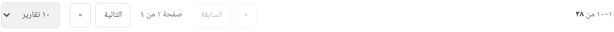

| العنصر | معناه |
|---|---|
| **الترتيب** | عمود الفرز: «تاريخ الإنشاء»، «رمز المشارك»، «الحالة»، «التوصية»، «التوافق السلوكي»، «التوافق الفني»، «مرّات الإرجاع». |
| **تصاعدي** / **تنازلي** | زر يعكس الاتجاه. الافتراضي «تنازلي» — الأحدث أولاً. |
| «… تقرير» في طرف شريط الفرز | إجمالي التقارير المطابقة للترشيح، لا عدد الصفحة. |
| «١–١٠ من ١٧» | نطاق الصفحة المعروضة من الإجمالي. يظهر حين تتعدّد الصفحات؛ وإذا كانت صفحةً واحدة ظهر «… تقرير». |
| **«** و **»** | الصفحة الأولى والصفحة الأخيرة. |
| **السابقة** / **التالية** | صفحة إلى الخلف أو إلى الأمام. تُعطَّل عند الطرفين. |
| «صفحة ١ من ٢» | موضعك الحالي. |
| محدّد حجم الصفحة | «١٠ تقارير»، «٢٥ تقريراً»، «٥٠ تقريراً»، «١٠٠ تقرير». الافتراضي ٢٥. |

**بطاقة التقرير**


| العنصر | معناه |
|---|---|
| رمز المشارك | رمز المشارك لا اسمه. |
| القطاع | قطاع المشارك. |
| **قيادة عليا** / **قيادة وسطى** | فئته القيادية. |
| شارة الحالة | «مسودة»، «بانتظار اعتماد المقيّم»، «بانتظار اعتماد مدير التقييم»، «بانتظار الاعتماد النهائي»، «معتمد»، «مُعاد للتعديل». |
| الرقم الصغير في الشارة | موضع التقرير في السلسلة (مثل `1/3`) — يُظهر كم بقي، لا مجرّد «معلّق». ومراحل الانتظار الثلاث بلون واحد يميّزها الرقم لا اللون. |
| **السلوكية** / **الفنية** | شريطان بنسبة التوافق. تظهر «—» متى كانت القيمة غير مسجّلة. |
| «أُعيد للتعديل — بانتظار إعادة الإرسال» | يحلّ محلّ الشريطين في التقرير المُعاد. |

**أزرار البطاقة**

| الزر | متى يظهر | ماذا يفعل |
|---|---|---|
| **التقييمات السابقة** | متى كان التقرير مرتبطاً بمشارك | يفتح سجلّ دورات هذا المشارك. |
| **مستند مفصّل** | دائماً | يفتح التقرير النهائي المطبوع في تبويب جديد. |
| **مستند مختصر** | دائماً | يفتح ورقة الملخّص التنفيذي المطبوعة في تبويب جديد. |
| **الملخّص التنفيذي** | دائماً | يفتح نافذة الملخّص — للقراءة، أو للكتابة لحاملي `report.exec_summary`. |
| **تعديل التقرير** | للتقرير في حالة «مسودة» أو «مُعاد للتعديل»، ولكاتبه أو لحامل `report.edit_any` | يفتح المحرّر في وضع التعديل. |
| **اعتماد** | لمن يملك صلاحية المرحلة التي يقف عندها التقرير | يعتمد المرحلة ويحيل التقرير إلى ما بعدها. |
| **اعتماد وتجاوز المقيّم** | لمدير إدارة التقييم على تقرير واقف عند المقيّم | يعتمد ويتخطّى مرحلة المقيّم. |
| **اعتماد نهائي** | على التقرير الواقف عند الاعتماد النهائي | يُنهي السلسلة. |
| **إرجاع للتعديل** | لحاملي `report.return` على تقرير في مرحلة اعتماد | يفتح نافذة سبب الإرجاع. |

سلسلة الاعتماد تُضبط من شاشة **مراحل الاعتماد**، وهي في هذا التنصيب أربع مراحل آخرها اعتماد مدير المركز. وشارات هذه الشاشة تسمّي المراحل الثلاث الأولى؛ فالتقرير الذي يبلغ مرحلة مدير المركز يظهر برمزها `pending_center`، ويبقى محسوباً في مؤشّر **بانتظار** وضمن مرشّح **بانتظار الاعتماد**، ولا يظهر له زرّ اعتماد في هذه الشاشة.

#### كيف تعمل فيها

**اعتماد تقرير وصل مرحلتك**

1. اضغط مرشّح مرحلتك: **المقيّم** أو **مدير التقييم** أو **نهائي**، أو اضغط **بانتظار الاعتماد** لترى السلسلة كاملةً.
2. اقرأ شارة الحالة على البطاقة ورقم موضعها في السلسلة.
3. راجع التقرير بزر **مستند مفصّل** قبل قرارك.
4. اضغط **اعتماد**.

تظهر رسالة «تم اعتماد تقرير \<رمز المشارك\>»، وتتقدّم البطاقة إلى المرحلة التالية ويُشعَر صاحبها. وفي آخر مرحلة تصير الحالة **معتمد**، ويُشعَر كاتب التقرير، وتصير حالة المشارك «مكتمل» فتُتاح له دورة تقييم جديدة.

**إرجاع تقرير للتعديل**


1. اضغط **إرجاع للتعديل** على بطاقة التقرير.
2. اكتب السبب في حقل «سبب الإرجاع (إلزامي)» — خمسة أحرف فأكثر.
3. اضغط **تأكيد الإرجاع**.

تظهر رسالة «أُعيد تقرير \<الرمز\> للتعديل»، وتصير حالته **مُعاد للتعديل**، ويصل كاتبه إشعار بالسبب، ويُقيَّد السبب في محادثة التقرير، ويزيد عدّاد مرّات الإرجاع (وهو أحد خيارات الفرز).

**إنشاء تقرير نهائي**


1. اضغط **إنشاء تقرير**.
2. اختر المشارك من قائمة «اختر مرشحاً منتهي التقييم…». القائمة لا تضمّ إلا من انتهى تقييمه ولا تقرير لدورته الحالية؛ وإن خلت ظهر «لا يوجد مرشحون منتهو التقييم بلا تقرير حالياً.».
3. راجع لوحة **الاحتساب الآلي من الدرجات**: تعرض «سلوكي» و«فني» و«عام»، وعدد الكفاءات والتقييمات التي احتُسبت منها، وتفصيل كل كفاءة بمتوسّطها ونسبتها.
4. راجع لوحة **تحليل الفجوة** — تقارن كل كفاءة بالمستوى المستهدف لفئة المشارك، وتُظهر «… / … محقّق».
5. عدّل «التوافق السلوكي (%)» و«التوافق الفني (%)» إن لزم؛ فالقيمتان مُعبّأتان تلقائياً من الاحتساب كما يقول التنبيه «عُبّئت قيمتا التوافق تلقائياً — يمكنك تعديلهما.».
6. اختر «التوصية».
7. اكتب «نظرة عامة»، وأضف بنود «نقاط القوة» و«مجالات التطوير» بزر **إضافة**، واحذف أي سطر بزر × بجانبه.
8. اضغط **حفظ كمسودة** لتُبقيه عندك، أو **حفظ وإرسال للاعتماد** لتدفعه إلى أول مرحلة.

تظهر «تم حفظ المسودة» أو «أُرسل التقرير للاعتماد»، وتُحدَّث القائمة. وعند الإرسال يُشعَر صاحب المرحلة الأولى وحده.

**تعديل مسودة أو تقرير مُعاد**

1. رشّح القائمة بـ**مُعاد** أو ابحث عن مسودتك.
2. اضغط **تعديل التقرير**.
3. عدّل الحقول، ثم اضغط **حفظ كمسودة** أو **حفظ وإرسال للاعتماد**.

التقرير المُعاد يعود بالإرسال إلى **أول** السلسلة لا إلى المرحلة التي أُعيد منها، فتُراجَع المراحل كلها من جديد. ولا زرّ منفصلاً لإعادة الإرسال. ولاحظ أنّ حقلَي التوافق في وضع التعديل يُحفظان كما تتركهما — لا يُعاد احتسابهما آلياً كما في الإنشاء.

**كتابة الملخّص التنفيذي**


1. اضغط **الملخّص التنفيذي** على البطاقة.
2. إن كنت تملك `report.exec_summary` ظهر التنبيه «يُعرض في المستند المختصر. بصلاحية مدير المركز.» — اكتب النصّ في الحقل.
3. اضغط **حفظ**.

يُحفظ النصّ ويظهر في **المستند المختصر**. ومن لا يملك الصلاحية يقرأ فقط، ويظهر له «للعرض فقط — الكتابة بصلاحية مدير المركز.» ولا يظهر له زرّ الحفظ.

**إخراج المستند المطبوع**

1. اضغط **مستند مفصّل** أو **مستند مختصر**.
2. يفتح المستند في تبويب جديد؛ اضغط فيه **طباعة / حفظ PDF**.

المستند المفصّل سبعة أقسام مرقّمة: البيانات الشخصية والوظيفية، نتائج التقييم النهائية، الكفاءات السلوكية، الكفاءات الفنية حسب مجالات التقييم، تقييم اللغة الإنجليزية، المرئيات والتوصيات (ومعها مواطن القوة ومجالات التطوير وأدوات القياس)، خطة التطوير الفردية؛ وفي ذيله أربعة مواضع توقيع: المُقيّم، ومدير إدارة التقييم، وإدارة تطوير الكفاءات، ومدير المركز. والمستند المختصر ورقة واحدة: القطاع والفئة، والتوافق السلوكي والفني والتوصية، والملخّص التنفيذي، وتوقيع مدير المركز.

**مراجعة التقييمات السابقة للمشارك**

1. اضغط **التقييمات السابقة**.
2. تُعرض دورات هذا المشارك من الأحدث: رمز الدورة وتاريخها وعدد تقييماتها، ومعها توافقها السلوكي والفني وتوصيتها إن كان لها تقرير.
3. اضغط **إغلاق**.

وإن لم تكن له دورات سابقة ظهر «لا توجد دورات سابقة».

**تضييق القائمة والبحث**

1. اضغط **فلترة متقدّمة**، واضبط القطاع أو الفئة أو التوصية أو المدى الزمني، ثم اضغط **تطبيق**.
2. للبحث عن مشارك بعينه، اكتب رقم هويته كاملاً (عشرة أرقام) في حقل البحث واضغط **بحث**.
3. للعودة إلى القائمة كاملة اضغط **عرض الكل** أو زر × داخل حقل البحث، واضغط **مسح** في لوحة الفلترة المتقدّمة.

كل ترشيح جديد يعيدك إلى الصفحة الأولى، وتُعاد الرسوم البيانية على الترشيح الجديد.

**الفرز والتنقّل بين الصفحات**

1. اختر عمود الفرز من قائمة **الترتيب**.
2. اضغط زر الاتجاه لتقلب **تصاعدي** / **تنازلي**.
3. انتقل بين الصفحات بـ**السابقة** و**التالية** و**«** و**»**.
4. غيّر عدد التقارير في الصفحة من المحدّد في طرف الشريط.

الفرز والترقيم يجريان على الخادم، فالترتيب يشمل التقارير كلها لا الصفحة المعروضة. واختيار عمود عددي أو تاريخي يبدأ تنازلياً (الأعلى توافقاً والأحدث أولاً)، أمّا «رمز المشارك» فيبدأ تصاعدياً.

**تصدير القائمة**

1. اضغط **تصدير CSV**.
2. يُنزَّل ملف `reports.csv` ويفتحه Excel بالعربية.

الملف محصور بنطاقك نفسه — التصدير لا يكشف ما تُخفيه الشاشة.

#### ما يمنعه النظام ولماذا

- **زرّ الاعتماد لا يظهر إلا لصاحب المرحلة التي يقف عندها التقرير** — لا لكل من يملك اعتماداً ما. المرحلة تُشتقّ من حالة التقرير لا من دور المستخدم، والخادم يفرض ذلك؛ وإخفاء الزرّ في الشاشة يمنع زرّاً يَعِد بما يُرفض. من ضغط على مرحلة ليست له ردّ عليه: «ليس لديك صلاحية اعتماد هذه المرحلة».
- **التجاوز مسموح لطرف واحد فقط:** من يملك المرحلة **التالية مباشرةً** يعتمد من المرحلة الحالية — لذلك يقرأ الزرّ «اعتماد وتجاوز المقيّم» لمدير إدارة التقييم. ولا يُسمح بتجاوز السلسلة كلها من أوّلها، فذلك نقضٌ لمعنى السلسلة.
- **من يكتب لا يعتمد:** مرحلة مدير إدارة التقييم مضبوطة على منع الكاتب من اعتماد ما كتبه بنفسه — «لا يمكنك اعتماد تقرير كتبته بنفسك — يعتمده صاحب صلاحية أخرى». وتُفحص هذه القاعدة أيضاً عند التجاوز، فلا يصير التخطّي باباً خلفياً يلتفّ عليها.
- **قاعدة الفريق:** المرحلة نفسها تشترط أن يكون كاتب التقرير من فريق المعتمِد — «هذا التقرير كتبه من ليس ضمن فريقك». وتقريرٌ بلا كاتب معروف لا يُنسب لفريق فلا يُعتمد بهذه القاعدة.
- **الإرجاع لحاملي `report.return` وحدهم** (مدير المركز ومدير النظام). كان موزّعاً على كل مرحلة فكان كلُّ معتمِدٍ يردّ التقرير خطوات للوراء.
- **لا يُرجَع إلا تقرير في مرحلة اعتماد** — لا معتمد ولا مسودة، منعاً لإفساد حالة المشارك. وسبب الإرجاع إلزامي لا يقلّ عن خمسة أحرف: الكاتب يُشعَر بالسبب، وسببٌ فارغ لا يُصلح شيئاً.
- **لا يُعدَّل إلا تقرير «مسودة» أو «مُعاد للتعديل»** — «لا يمكن تعديل تقرير في هذه الحالة». وتقريرٌ في سلسلة الاعتماد لا يُعدَّل من تحت المعتمِدين.
- **لا يُعدّل أحد تقرير غيره** إلا بصلاحية `report.edit_any` — «لا تملك صلاحية تعديل تقرير أنشأه غيرك».
- **لا تقرير قبل انتهاء التقييم فعلاً** — «لا يمكن إنشاء تقرير قبل انتهاء تقييم المرشح»، منعاً لتجاوز مسار التقييم بأكمله. **ولا تقريران لدورة واحدة** — «يوجد تقرير لهذه الدورة — استخدم التعديل».
- **النطاق واحد في القراءة والكتابة:** القائمة والعرض والمستند والاعتماد والإرجاع والتصدير كلها محصورة بتصنيف المرشّح وقطاعه. والردّ على ما هو خارج نطاقك «التقرير غير موجود» لا «ممنوع» — كي لا يصير رقم التقرير أداةً لكشف ما هو موجود.
- **مستشار المقابلة يضيق أكثر:** لا يرى إلا تقارير من قيّمهم هو، فتقريرٌ لم يشارك في تقييمه ليس شأنه ولو كان في قطاعه. ومساعد التقييم يبقى على حدّ القطاع لأنه يكتب ولا يقيّم.
- **اسم المشارك في المستند المطبوع** لا يظهر إلا لحاملي `report.view_names` (مدير المركز ومدير النظام) — لا لكل من يرى الأسماء في الشاشات: المستند يُطبع ويخرج من النظام، فحدّه أضيق. ويُدوَّن في سجل التدقيق من أخرج مستنداً يحمل الاسم.
- **كتابة الملخّص التنفيذي** بصلاحية `report.exec_summary` — «الملخّص التنفيذي بصلاحية مدير المركز فقط»؛ والقراءة متاحة لمن يفتح التقرير.
- **إلغاء التقرير** (`report.cancel`) لا زرّ له في هذه الشاشة. والمعتمَد لا يُلغى أصلاً: وثيقة نافذة قد تكون طُبعت ووُقّعت، وسحبها يحتاج إجراءً موثّقاً لا زرّاً.
- **الاعتماد والإرجاع يُرفضان إن تغيّرت الحالة أثناء عملك** — «تغيّرت حالة التقرير — أعد التحميل»: اعتمادٌ بحالة قديمة لا يطمس إرجاعاً متزامناً ولا يُقدّم التقرير مرتين.
- **رقم الهوية يُقبل كاملاً فقط** (عشرة أرقام) — لا بحث بجزءٍ منه.


#### رسائل الخطأ

| الرسالة | معناها | ما تفعله |
|---|---|---|
| رقم الهوية يجب أن يكون ١٠ أرقام | أدخلت أقلّ أو أكثر من عشرة أرقام في حقل البحث | أدخل الرقم كاملاً، أو امسح الحقل لعرض الكل. |
| تعذّر تحميل التقارير — تأكد أن الخادم يعمل | لم يستجب الخادم لطلب القائمة | أعد تحميل الصفحة، وراجع الدعم الفني إن تكرّرت. |
| ليس لديك صلاحية اعتماد هذه المرحلة | التقرير واقف عند مرحلة لا تملك صلاحيتها | اترك الاعتماد لصاحب المرحلة. |
| لا يمكن اعتماد تقرير في هذه الحالة | التقرير ليس في مرحلة اعتماد (معتمد أو مسودة أو مُعاد) | حدّث الصفحة لترى حالته الحقيقية. |
| لا يمكنك اعتماد تقرير كتبته بنفسك — يعتمده صاحب صلاحية أخرى | مرحلة الاعتماد هذه تمنع كاتب التقرير من اعتماده | أحِل الاعتماد إلى صاحب صلاحية أخرى في المرحلة نفسها. |
| هذا التقرير كتبه من ليس ضمن فريقك | المرحلة تشترط أن يكون الكاتب من فريقك | يعتمده مدير الكاتب. |
| تعذّر تحديد كاتب التقرير — لا يمكن اعتماده بقاعدة الفريق | التقرير بلا كاتب معروف في النظام | راجع مدير النظام. |
| تغيّرت حالة التقرير — أعد التحميل | غيّر مستخدم آخر حالة التقرير أثناء عملك | أعد تحميل الشاشة ثم كرّر الإجراء إن كان لا يزال لازماً. |
| التقرير غير موجود | التقرير خارج نطاقك أو غير موجود | تأكّد من الرمز، أو اطلبه من صاحب النطاق. |
| تعذّر الاعتماد | رُفض الطلب ولم يُرجع الخادم سبباً مفصّلاً | أعد تحميل الشاشة وحاول مرة أخرى. |
| تعذّر الإرجاع | رُفض طلب الإرجاع؛ وأشيع أسبابه سببٌ أقصر من خمسة أحرف | اكتب سبباً أوضح ثم أعد المحاولة. |
| لا يمكن إرجاع تقرير غير مُرسل للاعتماد | التقرير معتمد أو مسودة | لا يُرجَع إلا ما هو في سلسلة الاعتماد. |
| اختر المرشح | لم تختر مشاركاً في محرّر الإنشاء | اختره من القائمة. |
| اختر التوصية | حقل التوصية إلزامي | اختر إحدى التوصيات الأربع. |
| تحقّق من الحقول المدخلة | قيمة خارج المسموح: التوافق من ٠ إلى ١٠٠، والنظرة العامة حتى ٥٠٠٠ حرف، والبنود حتى ٢٠ بنداً لكل قائمة | صحّح الحقل ثم أعد الحفظ. |
| يوجد تقرير لهذه الدورة — استخدم التعديل | لدورة المشارك الحالية تقرير قائم | افتحه بزر **تعديل التقرير** بدل الإنشاء. |
| لا يمكن إنشاء تقرير قبل انتهاء تقييم المرشح | لم تُغلق دورة تقييم المشارك بعد | أكمِل التقييم أولاً. |
| لا يمكن تعديل تقرير في هذه الحالة | التقرير ليس «مسودة» ولا «مُعاد للتعديل» | لتعديله يجب أن يُعاد أولاً بيد صاحب صلاحية الإرجاع. |
| لا تملك صلاحية تعديل تقرير أنشأه غيرك | التعديل لكاتبه أو لحامل `report.edit_any` | اطلب التعديل من كاتبه. |
| تعذّر حفظ التقرير | فشل الحفظ لسبب غير محدَّد | أعد المحاولة، واحفظ نصّك خارج الشاشة إن تكرّر. |
| الملخّص التنفيذي بصلاحية مدير المركز فقط | حاولت الحفظ بلا `report.exec_summary` | اطلب كتابته من مدير المركز. |
| تعذّر حفظ الملخّص | رُفض حفظ الملخّص التنفيذي | تأكّد أن النصّ لا يتجاوز ٥٠٠٠ حرف ثم أعد المحاولة. |
| فعّل النوافذ المنبثقة لعرض المستند | المتصفّح منع فتح تبويب المستند | اسمح بالنوافذ المنبثقة لهذا الموقع ثم أعد الضغط. |
| تعذّر فتح المستند / تعذّر فتح المستند المختصر | لم يُرجِع الخادم المستند | أعد المحاولة، وتأكّد أن التقرير ضمن نطاقك. |
| تعذّر التصدير | فشل تنزيل ملف CSV | أعد المحاولة، وتأكّد من صلاحية `report.export`. |
| تعذّر جلب المرشحين المؤهّلين | لم تُحمَّل قائمة المشاركين في محرّر الإنشاء | أغلق المحرّر وافتحه من جديد. |
| تعذّر فتح التقرير للتعديل | لم تُحمَّل بيانات التقرير | أعد تحميل الشاشة ثم افتحه مرة أخرى. |
| تعذّر تحميل التقييمات السابقة | لم يُحمَّل سجلّ دورات المشارك | أغلق النافذة وأعد المحاولة. |

---

### خطط التطوير الفردية

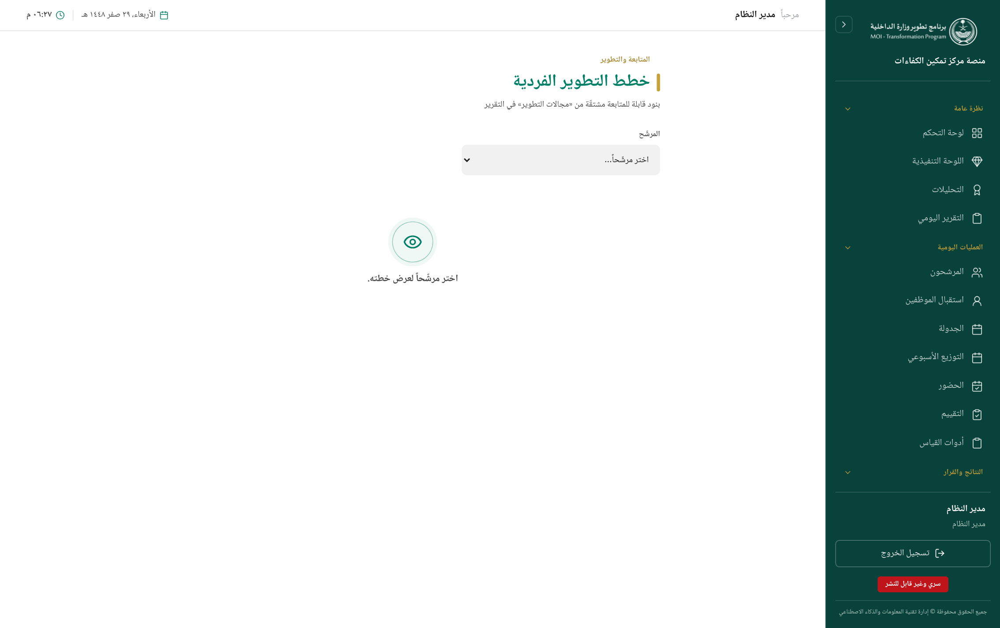

**من يفتحها:** صلاحية **«خطط التطوير الفردية»** `development_plan.view` — مدير النظام، مدير المركز، مدير إدارة التقييم، مستشار المقابلة، مساعد التقييم، إدارة تطوير الكفاءات. والإدارة (إضافة/تعديل الحالة/حذف/توليد) تلزمها صلاحية أخرى: **«كتابة تقرير»** `report.create`، ويملكها مدير النظام ومدير المركز ومدير إدارة التقييم ومساعد التقييم. فمستشار المقابلة وإدارة تطوير الكفاءات يقرآن الخطة ولا يعدّلانها. الرابط في القائمة الجانبية: **خطط التطوير**.

الخطة بنود متابعة مشتقّة من «مجالات التطوير» المكتوبة في تقرير المشارك. كل بند مجالٌ وإجراءٌ اختياري وموعدٌ مستهدف وحالة. البنود المعروضة هي بنود **الدورة الأخيرة** للمشارك وحدها.

| العنصر | معناه |
|---|---|
| **المرشّح** (قائمة منسدلة) | قائمة الاختيار. تعرض كل مشاركي نطاقك بلا تصفية حالة، كلٌّ برمزه ثم قطاعه |
| «اختر مرشّحاً…» | الخيار الافتراضي، معطّل |
| **توليد من التقرير** | يقرأ «مجالات التطوير» من تقرير الدورة ويُنشئ بنداً لكل مجال. لا يظهر إلا لمن يملك الإدارة |
| «{n} بند · {n} مكتمل» | ملخّص أعلى القائمة: عدد البنود وعدد المكتمل منها |
| **مجال التطوير** (السطر العريض في البند) | عنوان البند. يُشطَب بخطّ حين تصير حالته «مكتمل» |
| الإجراء / التوصية | السطر الثاني في البند. يظهر إن كُتب |
| التاريخ بجانب أيقونة التقويم | الموعد المستهدف للبند |
| «اكتمل» | يظهر في البند بعد وضعه على حالة «مكتمل» |
| قائمة الحالة: **بالانتظار** / **قيد التنفيذ** / **مكتمل** | حالة متابعة البند. معطّلة لمن لا يملك الإدارة |
| زرّ **حذف** (أيقونة سلّة) | يحذف البند بعد تأكيد. لا يظهر لمن لا يملك الإدارة |
| «اختر مرشّحاً لعرض خطته.» | الحالة الفارغة قبل الاختيار |
| «لا بنود بعد — أضِف بنداً أو ولّد من التقرير.» | الحالة الفارغة بعد اختيار مشارك بلا بنود |
| بطاقة **إضافة بند** | نموذج الإضافة اليدوية. لا تظهر لمن لا يملك الإدارة |
| «مجال التطوير *» | حقل إلزامي، حدّه 500 حرف. زرّ الإضافة معطّل ما دام فارغاً |
| «الإجراء / التوصية (اختياري)» | حقل اختياري، حدّه 1000 حرف |
| حقل التاريخ | الموعد المستهدف، اختياري |
| **إضافة** | يضيف البند إلى خطة الدورة الحالية |

#### كيف تعمل فيها

**١. عرض خطة مشارك**

1. افتح **خطط التطوير** من القائمة الجانبية.
2. اضغط قائمة **المرشّح** واختر رمز المشارك.

تظهر بنود الدورة الأخيرة، وفوقها ملخّص «{n} بند · {n} مكتمل». البنود المكتملة تظهر باهتة ومجالها مشطوب.


**٢. توليد البنود من التقرير**

1. اختر المشارك.
2. اضغط **توليد من التقرير**.

يُنشأ بند بحالة «بالانتظار» لكل مجال تطوير في تقرير الدورة. المجال المُدرَج في الخطة سابقاً لا يتكرّر — تُضاف الجديدة وحدها. وإن لم يكن هناك جديد ظهرت رسالة «لا مجالات جديدة لإضافتها من التقرير».


**٣. إضافة بند يدوياً**

1. اختر المشارك.
2. اكتب **مجال التطوير \*** — وهو وحده الإلزامي.
3. اكتب **الإجراء / التوصية (اختياري)** إن وُجد.
4. اختر تاريخاً في حقل التاريخ إن أردت موعداً مستهدفاً.
5. اضغط **إضافة**.

يُضاف البند إلى القائمة بحالة «بالانتظار»، وتُفرَّغ حقول النموذج للبند التالي.


**٤. متابعة حالة البند**

1. حدّد البند في القائمة.
2. اضغط قائمة الحالة بجانبه واختر **قيد التنفيذ** أو **مكتمل**.

تُحفظ الحالة فوراً وتُعاد قراءة القائمة. عند اختيار **مكتمل** يُسجَّل وقت الإكمال ويظهر في البند وسم «اكتمل»؛ وإعادته إلى حالة أخرى تمحو وقت الإكمال.


**٥. حذف بند**

1. اضغط أيقونة **حذف** بجانب البند.
2. أكّد الرسالة **«حذف هذا البند؟»**.

يُحذف البند من الخطة وتُعاد قراءة القائمة. الحذف نهائي ولا تراجع عنه من الشاشة.

#### ما يمنعه النظام ولماذا

- **الفتح والإدارة صلاحيتان مختلفتان.** الشاشة تُفتح بـ`development_plan.view`، والكتابة فيها بـ`report.create`. ولذلك يرى مستشار المقابلة وإدارة تطوير الكفاءات الخطة ولا يغيّرانها: الحالة معطّلة، ولا زرّ حذف، ولا بطاقة إضافة، ولا زرّ توليد.
- **صلاحية الشاشة قائمة بذاتها.** المسار يفرض `development_plan.view` ولا يقبل «عرض التقارير» بديلاً عنها، كي لا يبقى مفتوحاً لمن سُحبت عنه صلاحية الخطط من شاشة الأدوار.
- **مستشار المقابلة المحصور بقطاع لا يرى إلا من قيّمهم هو.** القائمة تعرض مشاركي قطاعه كلّهم، لكن اختيار من لم يقيّمه يعود بردّ «المرشح غير موجود» — الحصر مطبَّق في الخادم لا في القائمة. وهذا يطابق حصره في «معاينة الدرجات» و«فجوة الكفاءات»: تقريرٌ لم يشارك في تقييمه ليس شأنه ولو كان في قطاعه.
- **لا خطة بلا دورة تقييم.** إضافة بند لمشارك لا دورة له تُردّ بـ«لا توجد دورة تقييم لهذا المرشح»، لأن البند يُربط بمعرّف الدورة.
- **التوليد لا يخترع مجالات.** إن خلا تقرير الدورة من مجالات تطوير — أو لم يكن هناك تقرير أصلاً — رُدّ الطلب بـ«لا توجد مجالات تطوير في تقرير هذه الدورة».
- **التوليد لا يكرّر.** يقارن المجالات بما هو موجود ويضيف الجديد وحده، ونداءان متزامنان لا يُنتجان بنوداً مكرّرة لأن العملية مقفولة على صفّ المشارك.
- **الحذف والتعديل داخل نطاقك فقط.** البند يُحلّ عبر مشاركه، فبندُ مشارك من قطاع آخر يعود «البند غير موجود».
- **كل عملية مُدقَّقة.** الإضافة `CREATE_DEV_ITEM`، التعديل `UPDATE_DEV_ITEM`، الحذف `DELETE_DEV_ITEM`، التوليد `SEED_DEV_PLAN` مع عدد ما أُنشئ.

#### رسائل الخطأ

| الرسالة | معناها | ما تفعله |
|---|---|---|
| «تعذّر جلب الخطة» | الخادم لم يستجب لطلب العرض | أعد اختيار المشارك من القائمة |
| «المرشح غير موجود» | المشارك خارج قطاعك أو تصنيفك، أو أنت مستشار محصور لم تقيّمه | لا تتابع. الخطة ليست ضمن نطاقك |
| «ليس لديك صلاحية عرض خطة التطوير» | سُحبت `development_plan.view` من دورك | سجّل خروجاً ودخولاً؛ فإن بقيت فراجع مدير النظام |
| «ليس لديك صلاحية إدارة خطة التطوير» | حاولت الإضافة أو التعديل أو الحذف أو التوليد بحساب عرض فقط | الإدارة لمن يملك «كتابة تقرير» |
| «لا توجد مجالات تطوير في تقرير هذه الدورة» | لا تقرير للدورة، أو التقرير بلا مجالات تطوير | اكتب التقرير وحدّد مجالات التطوير فيه، ثم أعد التوليد |
| «لا مجالات جديدة لإضافتها من التقرير» | كل مجالات التقرير مُدرَجة في الخطة | لا إجراء. أضِف بنداً يدوياً إن احتجت |
| «لا توجد دورة تقييم لهذا المرشح» | المشارك بلا دورة تقييم | لا تُبنى خطة قبل فتح دورة للمشارك |
| «تعذّرت الإضافة» / «تعذّر التحديث» / «تعذّر الحذف» / «تعذّر التوليد (تأكّد من وجود تقرير بمجالات تطوير)» | الخادم لم يستجب أو ردّ بخطأ بلا نصّ | أعد المحاولة؛ فإن تكرّرت فأبلغ مدير النظام |
| «البند غير موجود» | البند حُذف من جلسة أخرى، أو هو خارج نطاقك | أعد اختيار المشارك لتحديث القائمة |

---

### إطار الكفاءات المرجعي


**من يفتحها:** صلاحية **«عرض إطار الكفاءات»** `competency.view` — مدير النظام، مدير المركز، مدير إدارة التقييم، إدارة تطوير الكفاءات. والإضافة والتعديل يلزمهما **«إدارة الكفاءات وربطها بالأنشطة»** `competency.manage`، ولا يملكها إلا مدير النظام ومدير المركز وإدارة تطوير الكفاءات. الرابط في القائمة الجانبية: **إطار الكفاءات**.

هذه هي المرجعية التي يُرصد عليها التقييم كلّه: كل كفاءة باسمها ونوعها وحدّها الأقصى ووزنها والمستوى المطلوب منها في القيادة العليا والوسطى. بلا كفاءات معرَّفة هنا لا تُرصد درجة في أي نشاط.

| العمود | معناه |
|---|---|
| **الكفاءة** | اسم الكفاءة بالعربية |
| **النوع** | وسم ملوّن: **سلوكية** أو **قيادية** أو **فنية**. يُحدَّد عند الإضافة ولا يُعدَّل بعدها |
| **المجموعة/المجال** | المجموعة إن وُجدت، وإلا المجال، وإلا «—» |
| **الحد الأقصى** | أعلى مستوى تُرصد عليه الكفاءة (من 1 إلى 10) |
| **الوزن** | ثقل الكفاءة في الحساب (من 0 إلى 10، بخطوة 0.5) |
| **مطلوب (عليا)** | المستوى المطلوب من الكفاءة لفئة القيادة العليا، أو «—» إن لم يُحدَّد |
| **مطلوب (وسطى)** | المستوى المطلوب لفئة القيادة الوسطى، أو «—» |
| العمود الأخير بلا عنوان | زرّ **تعديل** لكل صفّ. لا يظهر العمود أصلاً لمن لا يملك الإدارة |
| **إضافة كفاءة** (أعلى الشاشة) | يفتح نافذة إضافة كفاءة جديدة. لا يظهر لمن لا يملك الإدارة |
| «ليس لديك صلاحية عرض الكفاءات.» | يحلّ محلّ الجدول حين يرفض الخادم العرض |

حقول نافذة الإضافة/التعديل:

| الحقل | معناه |
|---|---|
| **الاسم** | اسم الكفاءة، حتى 150 حرفاً. زرّ الحفظ معطّل ما دام فارغاً |
| **النوع** | **سلوكية** / **قيادية** / **فنية**. يظهر عند الإضافة فقط |
| **المجموعة (سلوكية/تميز/إحساس)** | تجميع اختياري حتى 60 حرفاً |
| **المجال (للفنية)** | مجال فنّي اختياري حتى 60 حرفاً |
| **الحد الأقصى** | من 1 إلى 10 |
| **الوزن** | من 0 إلى 10 بخطوة 0.5 |
| **مطلوب — قيادة عليا** | اتركه فارغاً إن لم يكن للكفاءة مستوى مطلوب في هذه الفئة |
| **مطلوب — قيادة وسطى** | كسابقه |
| «المستوى المطلوب لا يتجاوز الحد الأقصى. اتركه فارغاً إن لم يكن للكفاءة مستوى مطلوب.» | تنبيه ثابت أسفل الحقول |
| **إلغاء** / **حفظ** | إغلاق بلا تغيير / إرسال النموذج |

#### كيف تعمل فيها

**١. إضافة كفاءة**

1. اضغط **إضافة كفاءة** أعلى الشاشة.
2. اكتب **الاسم**.
3. اختر **النوع** — سلوكية أو قيادية أو فنية.
4. اكتب **المجموعة** أو **المجال** إن أردت تجميعها.
5. اضبط **الحد الأقصى** و**الوزن**.
6. اكتب **مطلوب — قيادة عليا** و**مطلوب — قيادة وسطى**، أو اتركهما فارغين.
7. اضغط **حفظ**.

تُغلق النافذة ويُعاد تحميل الجدول، وتظهر الكفاءة الجديدة في آخره.

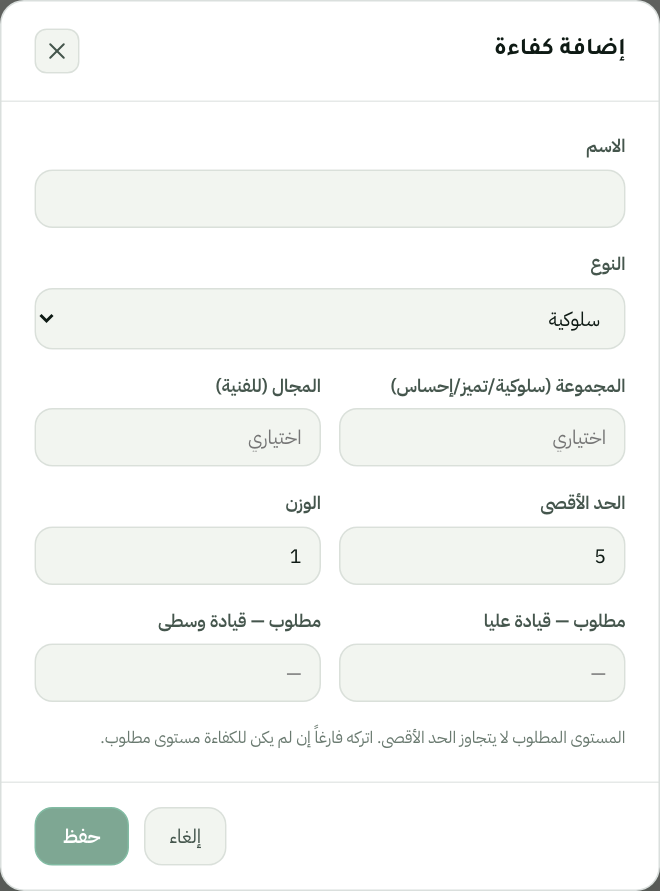

**٢. تعديل كفاءة قائمة**

1. اضغط أيقونة **تعديل** في صفّ الكفاءة.
2. عدّل ما تحتاجه — الاسم أو المجموعة أو المجال أو الحد الأقصى أو الوزن أو المستويات المطلوبة.
3. اضغط **حفظ**.

تُغلق النافذة ويُعاد تحميل الجدول بالقيم الجديدة. لاحظ أن حقل **النوع** لا يظهر هنا: نوع الكفاءة يُثبَّت عند إنشائها.


**٣. إلغاء المستوى المطلوب**

1. افتح **تعديل** للكفاءة.
2. امسح محتوى **مطلوب — قيادة عليا** أو **مطلوب — قيادة وسطى**.
3. اضغط **حفظ**.

يظهر في الجدول «—» مكان الرقم، ولا يُحتسب للكفاءة مستوى مطلوب في تلك الفئة.

#### ما يمنعه النظام ولماذا

- **العرض والإدارة صلاحيتان منفصلتان.** مدير إدارة التقييم يقرأ الإطار — لأنه مرجع تقاريره — ولا يعدّله: لا يظهر له زرّ «إضافة كفاءة» ولا عمود التعديل. ضبط الأوزان والمستويات المطلوبة بيد مدير المركز وإدارة تطوير الكفاءات.
- **المستوى المطلوب لا يتجاوز الحد الأقصى.** الخادم يرفض حفظ مستوى مطلوب أكبر من الحد الأقصى للكفاءة نفسها، منعاً لمرجعيةٍ يستحيل بلوغها.
- **الحد الأقصى بين 1 و10، والوزن بين 0 و10.** ما خرج عن ذلك يُردّ قبل الكتابة.
- **النوع لا يُعدَّل بعد الإنشاء.** نافذة التعديل لا تعرض الحقل، ومسار التعديل في الخادم لا يقبل النوع أصلاً — لأن نوع الكفاءة يحكم موضعها في الرصد والتحليل، وتبديله بأثر رجعي يغيّر معنى درجات مرصودة.
- **لا حذف للكفاءة.** المسارات المتاحة للكفاءات هي العرض والإضافة والتعديل فقط؛ لا مسار حذف. الكفاءة مرتبطة بدرجات مرصودة وتقارير معتمدة، فحذفها يُيتّمها. إن استُغني عن كفاءة فأزِل ربطها بالأنشطة من شاشة **ربط الكفاءات**.
- **الترتيب يُدار داخلياً.** الكفاءة الجديدة تأخذ ترتيباً بعد آخر كفاءة، والجدول يُعرض بهذا الترتيب.
- **كل تغيير مُدقَّق.** الإضافة `CREATE_COMPETENCY` والتعديل `UPDATE_COMPETENCY` مع الاسم والوزن والمستويات المطلوبة.

#### رسائل الخطأ

| الرسالة | معناها | ما تفعله |
|---|---|---|
| «تحقّق من الحقول: المستوى المطلوب لا يتجاوز الحد الأقصى» | مستوى مطلوب أكبر من الحد الأقصى، أو قيمة خارج المدى المسموح | صحّح الرقم واحفظ. لم يُكتب شيء في القاعدة |
| «ليس لديك صلاحية إدارة الكفاءات» | حاولت الحفظ بحساب عرض فقط | الإضافة والتعديل لمدير المركز أو إدارة تطوير الكفاءات |
| «ليس لديك صلاحية عرض الكفاءات» (وتظهر في الشاشة: «ليس لديك صلاحية عرض الكفاءات.») | رُفض طلب العرض؛ الجدول لا يُحمَّل | سجّل خروجاً ودخولاً؛ فإن بقيت فراجع مدير النظام |
| «الكفاءة غير موجودة» | الكفاءة حُذفت أو عُدّلت من جلسة أخرى | أعد تحميل الشاشة |
| «تعذّر الحفظ» | الخادم لم يستجب أو ردّ بخطأ بلا نصّ | أعد المحاولة؛ فإن تكرّرت فأبلغ مدير النظام |

---

### ربط الأنشطة بالكفاءات


**من يفتحها:** صلاحية **«إدارة الكفاءات وربطها بالأنشطة»** `competency.manage` — مدير النظام، مدير المركز، إدارة تطوير الكفاءات. الرابط في القائمة الجانبية: **ربط الكفاءات**، وعنوان الشاشة **ربط الأنشطة بالكفاءات**.

هنا تُحدَّد الكفاءات التي يرصدها المقيّم في كل نشاط. الشاشة بطاقتان — واحدة لكل نشاط — وفيهما قائمة الكفاءات المعرَّفة في **إطار الكفاءات** مع مربّع اختيار لكل كفاءة. الوصف في أعلى الشاشة: «حدّد الكفاءات التي تخص كل نشاط تقييم — تُطبَّق فورًا على شاشة التقييم».

| العنصر | معناه |
|---|---|
| بطاقة **مقابلة شخصية** | كفاءات نشاط المقابلة |
| بطاقة **حلقة نقاش** | كفاءات نشاط حلقة النقاش |
| «{n} كفاءة» في رأس البطاقة | عدّاد المُحدَّد حالياً. يتغيّر فور تأشير مربّع أو إزالته، قبل الحفظ |
| مربّع الاختيار بجانب كل كفاءة | تأشيره يربط الكفاءة بالنشاط، وإزالته يفكّ الربط |
| الوسم الصغير بجانب الاسم | نوع الكفاءة: **سلوكية** أو **قيادية** أو **فنية** |
| **حفظ** (أسفل كل بطاقة) | يحفظ كفاءات تلك البطاقة وحدها. يصير «جارٍ الحفظ...» أثناء التنفيذ |

#### كيف تعمل فيها

**١. ربط كفاءة بنشاط**

1. افتح **ربط الكفاءات** من القائمة الجانبية.
2. في بطاقة النشاط المطلوب، أشّر مربّع كل كفاءة تريد رصدها فيه.
3. راقب عدّاد «{n} كفاءة» في رأس البطاقة — يتحدّث فوراً.
4. اضغط **حفظ** في البطاقة نفسها.

يظهر شريط أخضر: **«تم حفظ كفاءات المقابلة الشخصية ✓»** أو **«تم حفظ كفاءات حلقة النقاش ✓»**، ويختفي بعد لحظات. التغيير يسري على شاشة التقييم مباشرة.


**٢. فكّ ربط كفاءة عن نشاط**

1. أزِل تأشير مربّعها في بطاقة النشاط.
2. اضغط **حفظ**.

يُقبل الطلب إن لم يكن للنشاط تقييمات نشطة. وإن وُجدت تقييمات قيد التنفيذ رُفض الطلب كاملاً ولم يتغيّر شيء — راجع القسم التالي.

> كل بطاقة تُحفظ على حدة. حفظُ بطاقة المقابلة لا يحفظ ما غيّرته في بطاقة حلقة النقاش.

#### ما يمنعه النظام ولماذا

- **الشاشة كلّها خلف صلاحية الإدارة.** لا تُفتح إلا لمن يملك `competency.manage`، ومن كتب رابطها يدوياً دون الصلاحية أُعيد إلى لوحة التحكم. أمّا الحفظ فالخادم يفرض الصلاحية نفسها على أي حال.
- **لا حذف ولا تبديل ولا تفريغ لنشاطٍ له تقييمات جارية.** إن كان للنشاط تقييم واحد على الأقل بحالة «مسودة» أو «مُرسَل»، فأي إزالة أو استبدال لكفاءاته يُردّ برسالة: «لا يمكن حذف/تبديل كفاءات نشاط له تقييمات نشطة قيد التنفيذ (الإضافة فقط مسموحة)». السبب: التقييم الجاري مرصود على قائمة الكفاءات القائمة، وسحبُ كفاءة من تحته يُيتّم درجاتها أو يُفشل إرساله. **الإضافة تبقى مسموحة دائماً** لأنها لا تكسر شيئاً مرصوداً.
- **الحفظ استبدال كامل لا إضافة تراكمية.** ما تُرسله البطاقة هو قائمة النشاط النهائية: ما لم يُؤشَّر يُفكّ ربطه. تأكّد من المربّعات كلّها قبل الحفظ لا من الجديد وحده.
- **نشاطان لا ثالث لهما.** الأنشطة المعرَّفة في الخادم هي المقابلة وحلقة النقاش؛ أي نشاط آخر يُردّ بـ«نشاط غير معروف».
- **الكفاءة يجب أن تكون معرَّفة أصلاً.** الربط لا يقبل إلا كفاءات موجودة في **إطار الكفاءات**، ولا يقبل تكرار الكفاءة نفسها في النشاط الواحد.
- **كل حفظ مُدقَّق بقبله وبعده.** يُسجَّل باسم `UPDATE_ACTIVITY_COMPETENCIES` مع النشاط وقائمة الكفاءات قبل التغيير وبعده، فيُقرأ التغيير الفعلي لا قائمة مبهمة.

#### رسائل الخطأ

| الرسالة | معناها | ما تفعله |
|---|---|---|
| «لا يمكن حذف/تبديل كفاءات نشاط له تقييمات نشطة قيد التنفيذ (الإضافة فقط مسموحة)» | أزلت كفاءة أو استبدلتها بينما للنشاط تقييمات مسودة أو مُرسَلة | أعد التأشير كما كان. أنهِ اعتماد التقييمات الجارية أوّلاً، أو اكتفِ بالإضافة الآن. لم يتغيّر شيء في القاعدة |
| «ليس لديك صلاحية إدارة الكفاءات» | حاولت الحفظ بحساب لا يملك `competency.manage` | الحفظ لمدير المركز أو إدارة تطوير الكفاءات |
| «ليس لديك صلاحية عرض الكفاءات» | رُفض طلب تحميل القائمة | سجّل خروجاً ودخولاً؛ فإن بقيت فراجع مدير النظام |
| «نشاط غير معروف» | طلبُ حفظٍ لنشاط غير المقابلة وحلقة النقاش | أعد تحميل الشاشة |
| «تعذّر تحميل البيانات» | الخادم لم يستجب عند فتح الشاشة | أعد تحميل الصفحة؛ فإن تكرّرت فأبلغ مدير النظام |
| «تعذّر الحفظ» | الخادم لم يستجب أو ردّ بخطأ بلا نصّ | أعد المحاولة، ثم تحقّق من العدّاد بعد إعادة التحميل |

---

### التحليلات

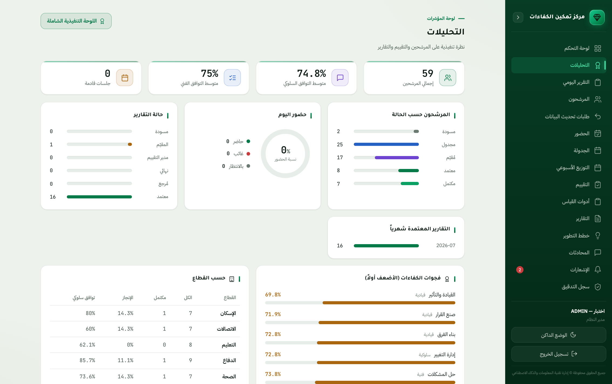

**من يفتحها:** `analytics.view` — «شاشة التحليلات». تملكها افتراضياً أربعة أدوار: **مدير النظام** (يملك كل الصلاحيات)، و**مدير المركز**، و**مدير إدارة التقييم**، و**إدارة تطوير الكفاءات**. هذه القائمة هي الافتراض الأول، والمرجع جدول صلاحيات الأدوار الذي يُحرَّر من شاشة «الأدوار والصلاحيات».

شاشة قراءة فقط: لا زرّ فيها ولا مرشِّح ولا حقل إدخال. تُبنى من أربعة نداءات: لوحة المؤشرات، والقطاعات، وفجوات الكفاءات، والاتجاه الشهري. تتحدّث بإعادة تحميل الصفحة لا بأمرٍ منك.

| العنصر | معناه |
|---|---|
| **إجمالي المرشحين** | عدد كل المشاركين الداخلين في تصنيفاتك |
| **متوسط التوافق السلوكي** | متوسّط `behavioral_fit` من التقارير **المعتمدة** وحدها؛ `—` إن لم يوجد تقرير معتمد |
| **متوسط التوافق الفني** | متوسّط `technical_fit` من التقارير المعتمدة وحدها |
| **جلسات قادمة** | الجلسات المجدولة اليوم أو بعده |
| **المرشحون حسب الحالة** | أعمدة: **مسودة** · **مجدول** · **مُقيّم** · **معتمد** · **مكتمل** |
| **حضور اليوم** | حلقة **نسبة الحضور** = الحاضرون ÷ جلسات اليوم، وبجانبها: **حاضر** · **غائب** · **بالانتظار** |
| **حالة التقارير** | أعمدة: **مسودة** · **المقيّم** · **مدير التقييم** · **نهائي** · **مُرجع** · **معتمد** — مراحل السلسلة مفصولة عمداً كي يظهر أين تتكدّس التقارير |
| **التقارير المعتمدة شهرياً** | عمود لكل شهر فيه تقارير معتمدة؛ لا يظهر القسم أصلاً إن لم يوجد شهر واحد |
| **فجوات الكفاءات (الأضعف أولاً)** | كل كفاءة ونوعها (**سلوكية** / **قيادية** / **فنية**) ونسبة الإتقان؛ اللون: أخضر ٨٠٪ فأعلى، برتقالي ٦٠–٨٠٪، أحمر دون ٦٠٪ |
| **حسب القطاع** — عمود **القطاع** | اسم القطاع |
| **حسب القطاع** — عمود **الكل** | عدد مشاركي القطاع |
| **حسب القطاع** — عمود **مكتمل** | من بلغت حالتهم «مكتمل» |
| **حسب القطاع** — عمود **الإنجاز** | مكتمل ÷ الكل، نسبةً مئوية |
| **حسب القطاع** — عمود **توافق سلوكي** | متوسّط التوافق السلوكي لتقارير القطاع المعتمدة؛ `—` إن لم يوجد |

#### كيف تعمل فيها

**١) قراءة الصورة العامة في سطر واحد**

1. افتح **التحليلات** من القائمة الجانبية.
2. اقرأ البطاقات الأربع في أعلى الشاشة.

النتيجة: عدد المشاركين، ومتوسّطا التوافق السلوكي والفني من التقارير المعتمدة، وعدد الجلسات القادمة.


**٢) معرفة أين يقف المشاركون وأين تتكدّس التقارير**

1. انظر إلى بطاقة **المرشحون حسب الحالة** لترى توزيعهم على المراحل الخمس.
2. انظر إلى بطاقة **حالة التقارير** واقرأ أطول عمود.
3. العمود الأطول بين **المقيّم** و**مدير التقييم** و**نهائي** هو المرحلة التي تتكدّس عندها التقارير.

النتيجة: تعرف مرحلة الاعتماد التي تحتاج متابعة، وعدد التقارير **مُرجع** التي تنتظر تعديلاً.

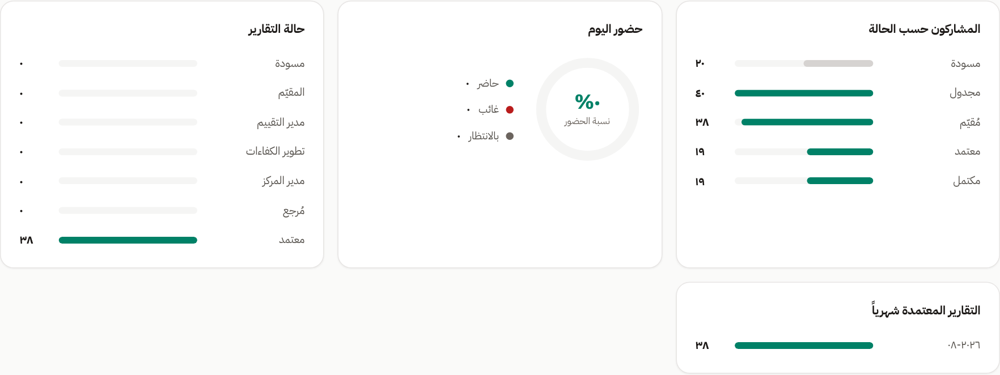

**٣) قراءة حضور اليوم**

1. انظر إلى بطاقة **حضور اليوم**.
2. الرقم داخل الحلقة هو **نسبة الحضور** من جلسات اليوم.
3. راجع **بالانتظار** — وهي الجلسات التي لم يُسجَّل لها حضور ولا غياب بعد.

النتيجة: صورة لحظية لليوم الجاري. يومٌ بلا جلسات تُعرَض حلقته ٠٪.

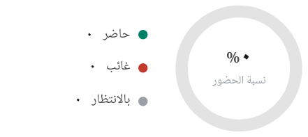

**٤) تحديد أولويات التطوير ومقارنة القطاعات**

1. اقرأ بطاقة **فجوات الكفاءات (الأضعف أولاً)** من أعلاها — الأضعف مرتّبة أولاً.
2. الكفاءات ذات الشريط الأحمر (دون ٦٠٪) هي المرشّحة لبرنامج تطوير.
3. انتقل إلى جدول **حسب القطاع** وقارن عمودَي **الإنجاز** و**توافق سلوكي**.

النتيجة: قائمة أولويات تطوير مؤسسية، وقائمة قطاعات متأخّرة في الإنجاز.


#### ما يمنعه النظام ولماذا

- **لا تُفتح الشاشة بلا `analytics.view`.** كل نداء من نداءاتها الأربعة يفحص الصلاحية بنفسه ويردّ `403`، والواجهة تعيدك إلى لوحة التحكم قبل ذلك. المنع خادمي لا واجهي، فكتابة `/analytics` في شريط العنوان لا تفتح شيئاً.
- **الأرقام محصورة بتصنيفاتك.** من لا يملك `candidate.view_classified` لا تدخل في مجاميعه بيانات المشاركين المصنَّفين (سرّي / سري للغاية) — الحصر داخل الاستعلام نفسه لا في العرض، فلا يُستدلّ على وجودهم من فارق الأعداد.
- **لا اسم مشارك في هذه الشاشة إطلاقاً.** أرقام مجمّعة وأسماء قطاعات وكفاءات فقط.
- **متوسّطا التوافق يُحتسبان من التقارير المعتمدة وحدها.** تقريرٌ ما زال في سلسلة الاعتماد لا يحرّك الرقم — والمتوسّط يعبّر عمّا أُقرّ لا عمّا يُناقَش.
- **فجوات الكفاءات تُحتسب من التقييمات المُرسَلة والمعتمدة فقط.** المسودّات لا تدخل الحساب.
- **قطاعٌ بلا مشاركين لا يظهر في الجدول** — الصفوف الصفرية ضجيج لا معلومة.

#### رسائل الخطأ

| الرسالة | معناها | ما تفعله |
|---|---|---|
| «ليس لديك صلاحية عرض التحليلات.» | ردّ الخادم `403` على نداء لوحة المؤشرات | اطلب من مدير النظام منحك `analytics.view` |
| «جارٍ التحميل…» | النداء لم يعد بعد | انتظر؛ إن بقيت الرسالة فالخادم لا يستجيب |
| «لا توجد درجات مُحتسَبة بعد.» | لا توجد درجات تقييم مُرسَلة أو معتمدة ضمن تصنيفاتك | لا شيء — تظهر الفجوات بعد أول تقييم يُرسَل |
| «لا بيانات.» في بطاقة **حسب القطاع** | لا قطاع فيه مشاركون ضمن تصنيفاتك، أو تعذّر جلب هذا القسم (خطؤه يُتجاهَل بلا رسالة) | أعِد تحميل الصفحة؛ فإن بقيت فالسبب أنه لا قطاع مؤهَّل |
| `—` مكان النسبة | لا تقارير معتمدة يُحتسب منها المتوسّط | لا شيء — يظهر الرقم بعد أول اعتماد |

---

### اللوحة التنفيذية

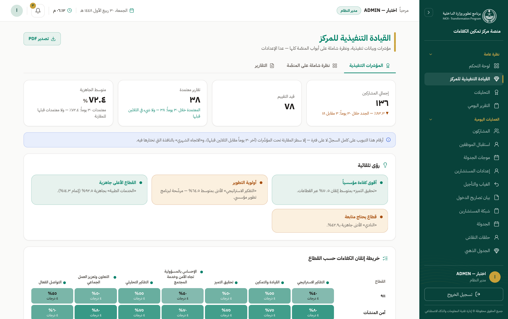

**من يفتحها:** `analytics.executive` — «اللوحة التنفيذية». تملكها افتراضياً أربعة أدوار: **مدير النظام** (يملك كل الصلاحيات)، و**مدير المركز**، و**مدير إدارة التقييم**، و**إدارة تطوير الكفاءات**. صلاحيتها مستقلّة عن `analytics.view`: سحبها من دورٍ يُغلق مسارها على الخادم، لا يُخفي رابطها وحده.

لها بابٌ مستقل في القائمة الجانبية باسم «اللوحة التنفيذية». تُحمَّل كلّها في نداءٍ واحد، وتُعاد كاملةً كلّما غيّرت نافذة الاتجاه.

| العنصر | معناه |
|---|---|
| **آخر ٣ أشهر** · **آخر ٦ أشهر** · **آخر سنة** · **آخر سنتين** | نافذة **الاتجاه الشهري**. المحدَّد افتراضاً «آخر ٦ أشهر» |
| **تصدير PDF** | يفتح نافذة طباعة المتصفّح على اللوحة وحدها. معطَّل أثناء التحميل وحين لا بيانات |
| **إجمالي المرشحين** | عدد كل المشاركين ضمن تصنيفاتك. الشارة بجانبه = فرق **المُضافين** في آخر ٣٠ يوماً مقارنةً بالثلاثين التي قبلها، لا فرق الإجمالي |
| **قيد التقييم** | المشاركون في حالة «مجدول» أو «مُقيّم». بلا شارة فرق |
| **تقارير معتمدة** | عدد التقارير المعتمدة، وشارتها فرق آخر ٣٠ يوماً عمّا قبلها |
| **متوسط الجاهزية** | متوسّط (التوافق السلوكي + الفني) ÷ ٢ للتقارير المعتمدة |
| شارة الفرق (تلميحها **«مقارنة بالفترة السابقة»**) | سهم لأعلى ونسبة خضراء = ارتفاع، سهم لأسفل ونسبة حمراء = انخفاض |
| **رؤى تلقائية** | جُمل مشتقّة من الأرقام نفسها: **أقوى كفاءة مؤسسياً** · **أولوية التطوير** · **القطاع الأعلى جاهزية** · **قطاع يحتاج متابعة** · **اتجاه الجاهزية** · **اختناق الاعتماد**. لا تظهر رؤية لا تتوفّر بياناتها |
| **خريطة إتقان الكفاءات × القطاع** | صفٌّ لكل كفاءة وعمودٌ لكل قطاع؛ الرقم نسبة الإتقان، وشدّة الخضرة تتبعه. الوسيلة أسفلها: **أضعف** ← **أقوى**. النقطة بجانب اسم الكفاءة تدلّ على نوعها |
| **الاتجاه الشهري** | الأعمدة **تقارير معتمدة**، والخطّ **متوسط الجاهزية %**. كل شهر في المدى يظهر ولو كان صفراً |
| **مقارنة القطاعات بالجاهزية** | الرتبة، اسم القطاع، شريط الجاهزية، النسبة، ثم «مكتمل ÷ الكل». مرتّبة تنازلياً بالجاهزية |
| **الفئات القيادية** | **القيادة العليا** و**القيادة الوسطى**: متوسّط الجاهزية و«مكتمل ÷ الكل» لكلٍّ منهما |
| **توزيع الجاهزية** | التقارير المعتمدة على أربع شرائح: **ممتاز (٨٥+)** · **جيّد (٧٠–٨٥)** · **متوسّط (٥٥–٧٠)** · **يحتاج تطويراً (<٥٥)** |

#### كيف تعمل فيها

**١) قراءة المؤشرات وفروق الفترة**

1. افتح **اللوحة التنفيذية** من القائمة الجانبية.
2. اقرأ البطاقات الأربع.
3. مرّر المؤشر فوق شارة النسبة لترى تلميح **«مقارنة بالفترة السابقة»**.

النتيجة: أربعة أرقام قيادية، ومعها اتجاه آخر ثلاثين يوماً مقارنةً بالثلاثين التي سبقتها.

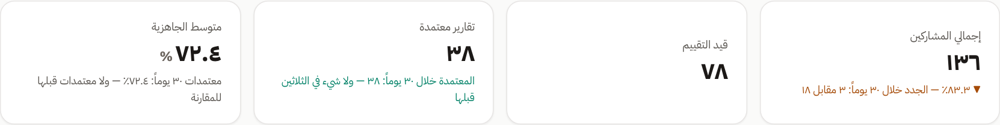

**٢) قراءة الرؤى التلقائية**

1. اقرأ بطاقات **رؤى تلقائية** أسفل المؤشرات.
2. البطاقات الخضراء نتائج إيجابية، والبرتقالية ما يحتاج متابعة، والزرقاء معلومة تشغيلية.
3. ابدأ من **أولوية التطوير** و**اختناق الاعتماد** — هما البطاقتان اللتان تقودان إلى إجراء.

النتيجة: قائمة قصيرة بأقوى كفاءة وأضعفها، وأعلى قطاع وأدناه، واتجاه الجاهزية، وأطول طابور في سلسلة الاعتماد.


**٣) قراءة الخريطة الحرارية**

1. انظر إلى **خريطة إتقان الكفاءات × القطاع**.
2. الخانات الفاتحة هي نقاط الضعف، والداكنة نقاط القوة.
3. مرّر المؤشر فوق أي خانة لترى «الكفاءة — القطاع: النسبة (عدد العيّنات)».
4. الخانة التي فيها `—` لا بيانات لها.

النتيجة: تحديد الكفاءة الضعيفة في قطاعٍ بعينه لا على مستوى المركز كلّه.


**٤) تغيير نافذة الاتجاه**

1. اضغط **آخر سنة** في مجموعة الأزرار أعلى اليسار.
2. انتظر إعادة التحميل.

النتيجة: يُعاد رسم **الاتجاه الشهري** على اثني عشر شهراً، وقد تتغيّر رؤية **اتجاه الجاهزية** لأنها مشتقّة منه. أمّا المؤشرات والخريطة ومقارنة القطاعات والفئات والتوزيع فلا تتأثّر بالنافذة.


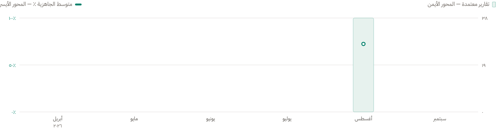

**٥) ترتيب القطاعات والفئات**

1. اقرأ **مقارنة القطاعات بالجاهزية** من الرتبة ١ نزولاً.
2. قارن النسبة بعدّاد «مكتمل ÷ الكل» بجانبها — جاهزيةٌ عالية على تقريرٍ واحد ليست كجاهزيةٍ على عشرة.
3. انزل إلى **الفئات القيادية** و**توزيع الجاهزية**.

النتيجة: ترتيب القطاعات، والفرق بين القيادة العليا والوسطى، وعدد التقارير في كل شريحة جاهزية.

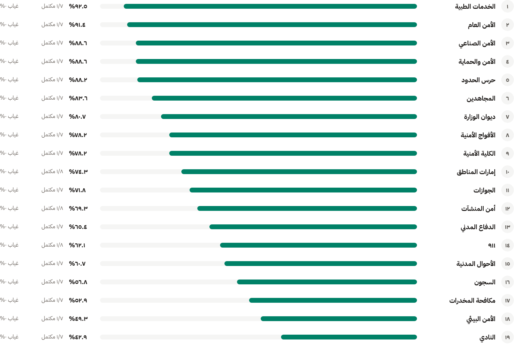

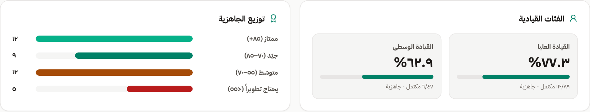

**٦) تصدير اللوحة PDF**

1. اضغط **تصدير PDF**.
2. في نافذة الطباعة اختر «حفظ بصيغة PDF».

النتيجة: صفحة تحوي اللوحة وحدها — تُخفى القائمة الجانبية وأزرار الترويسة، وتظهر في أعلاها ترويسة «اللوحة التنفيذية — مركز تمكين الكفاءات» وتاريخ اليوم.

#### ما يمنعه النظام ولماذا

- **صلاحيتها مستقلّة عن شاشة التحليلات.** المسار `/api/analytics/executive` يفحص `analytics.executive` وحدها ويردّ `403`. اللوحة شاشة قائمة بذاتها في القائمة الجانبية، وسحبُها من دورٍ في شاشة الأدوار يجب أن يُغلق مسارها لا أن يُخفي رابطها.
- **محصورة بتصنيفاتك.** من لا يملك `candidate.view_classified` لا تدخل بيانات المشاركين المصنَّفين في أيٍّ من أرقامه: المؤشرات والخريطة والقطاعات والفئات والتوزيع والاتجاه والرؤى.
- **لا أسماء مشاركين.** كل ما يظهر أسماء قطاعات وكفاءات وأرقام مجمّعة.
- **الجاهزية والاتجاه والتوزيع من التقارير المعتمدة وحدها** — لا يدخلها تقرير ما زال في السلسلة.
- **الخريطة تُبنى من التقييمات المُرسَلة والمعتمدة فقط**، ولا تُعرض فيها إلا الكفاءات والقطاعات التي فيها بيانات فعلاً.
- **رؤيتا «أقوى كفاءة مؤسسياً» و«أولوية التطوير» لا تظهران لكفاءة درجاتها أقل من ثلاث.** عتبة عيّنة تمنع استنتاجاً مؤسسياً من درجةٍ واحدة.
- **نافذة الاتجاه محدودة بين شهر و٢٤ شهراً على الخادم** مهما أُرسل في الطلب.
- **زرّ «تصدير PDF» معطَّل** أثناء التحميل وحين لا بيانات — كي لا يُطبع بياض.

#### رسائل الخطأ

| الرسالة | معناها | ما تفعله |
|---|---|---|
| «ليس لديك صلاحية عرض التحليلات.» | ردّ الخادم `403`، ونصّه عنده «ليس لديك صلاحية عرض اللوحة التنفيذية» | اطلب من مدير النظام منحك `analytics.executive` |
| «جارٍ التحميل…» | النداء لم يعد بعد | انتظر |
| «تعذّر تحميل اللوحة.» | خطأ من الخادم غير خطأ الصلاحية | اضغط **إعادة المحاولة**؛ فإن تكرّر فأبلغ الدعم الفنّي |
| «لا توجد درجات تقييم كافية بعد لبناء الخريطة.» | لا تقييمات مُرسَلة أو معتمدة ضمن تصنيفاتك | لا شيء — تُبنى الخريطة بعد أول تقييم يُرسَل |
| «لا بيانات اتجاه بعد.» | لا شهور في المدى المختار | وسّع النافذة إلى **آخر سنة** أو **آخر سنتين** |
| «لا قطاعات بمرشحين ضمن نطاقك.» | لا قطاع فيه مشاركون ضمن تصنيفاتك | لا شيء |
| «لا تقارير معتمدة بعد.» في **توزيع الجاهزية** | لم يُعتمد أي تقرير | لا شيء — يظهر التوزيع بعد أول اعتماد |
| `—` مكان نسبة الجاهزية | لا تقارير معتمدة في ذلك القطاع أو تلك الفئة | لا شيء |
| `—` داخل خانة الخريطة | لا درجات لتلك الكفاءة في ذلك القطاع | لا شيء |

---

### التقرير اليومي

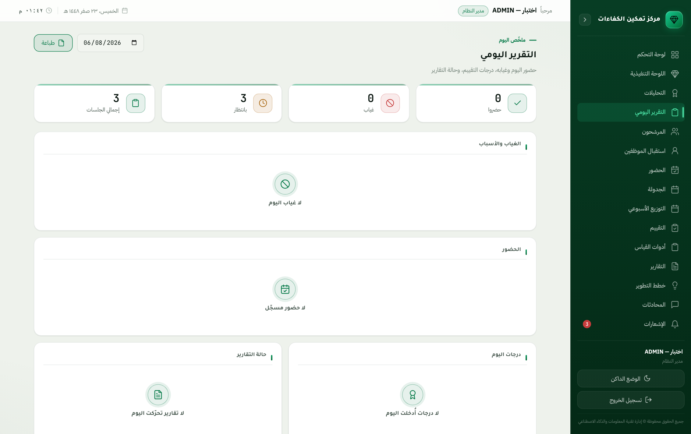

**من يفتحها:** `analytics.daily_report` — «التقرير اليومي». تملكها افتراضياً أربعة أدوار: **مدير النظام** (يملك كل الصلاحيات)، و**مدير المركز**، و**مدير إدارة التقييم**، و**إدارة تطوير الكفاءات**. صلاحيتها مستقلّة عن `analytics.view`.

يومٌ واحد في صفحة واحدة: من حضر، ومن غاب وبأي سبب، وما أُدخل من درجات، وأي تقرير تحرّك. تفتح الشاشة على تاريخ اليوم، ويُغيَّر التاريخ من الحقل في الترويسة. الشاشة والمستند المطبوع والبريد اليومي تُبنى كلّها من مصدرٍ واحد، فلا يتباعد المعروض عن المُرسَل.

| العنصر | معناه |
|---|---|
| حقل التاريخ | يبدأ بتاريخ اليوم. تغييره يُعيد تحميل كل الأقسام لذلك اليوم فوراً |
| **طباعة** | يفتح المستند الرسمي في تبويب جديد. معطَّل أثناء التحميل وحين لا بيانات |
| **حضروا** | جلسات ذلك اليوم التي سُجِّل فيها حضور |
| **غياب** | جلسات سُجِّل فيها غياب — بعذر أو بدونه |
| **بانتظار** | جلسات لم يُسجَّل لها حضور ولا غياب بعد |
| **إجمالي الجلسات** | كل جلسات ذلك اليوم |
| **الغياب والأسباب** — **الرمز** | رمز المشارك |
| **الغياب والأسباب** — **القطاع** | قطاع المشارك |
| **الغياب والأسباب** — **النشاط** | **مقابلة** · **حلقة نقاش** · **أدوات قياس** · **جلسة تكامل** |
| **الغياب والأسباب** — **النوع** | وسم أخضر **بعذر** أو وسم أحمر **بدون عذر** |
| **الغياب والأسباب** — **السبب** | ما دُوِّن عند تسجيل الغياب؛ `—` إن لم يُدوَّن |
| **الحضور** — **وقت الوصول** | ساعة تسجيل الوصول (ساعة:دقيقة)؛ `—` إن لم تُسجَّل |
| **درجات اليوم** — **المتوسط** | متوسّط درجات جلسة التقييم من ٥ |
| **درجات اليوم** — **الكفاءات** | عدد الكفاءات المرصودة في تلك الجلسة |
| **حالة التقارير** — **الحالة** | **مسودة** · **بانتظار المقيّم** · **بانتظار مدير التقييم** · **بانتظار تطوير الكفاءات** · **بانتظار مدير المركز** · **معتمد** · **مُعاد للتعديل** · **ملغى** |

#### كيف تعمل فيها

**١) قراءة يوم اليوم**

1. افتح **التقرير اليومي** من القائمة الجانبية.
2. اقرأ البطاقات الأربع.
3. راجع قسمَي **الغياب والأسباب** و**الحضور**.

النتيجة: عدد من حضر ومن غاب ومن لم يُسجَّل بعد، وأسباب الغياب مذكورة صراحةً بجانب كل رمز.

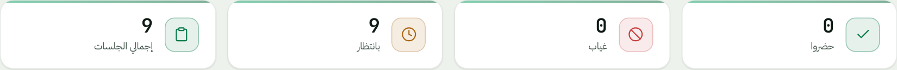

**٢) الرجوع إلى يومٍ سابق**

1. اضغط حقل التاريخ في أعلى الشاشة.
2. اختر اليوم المطلوب.

النتيجة: تُعاد البطاقات والأقسام الأربعة لذلك اليوم فوراً — لا يوجد زرّ بحث.


**٣) مراجعة درجات اليوم وحركة التقارير**

1. انزل إلى قسم **درجات اليوم** واقرأ عمود **المتوسط**.
2. انظر إلى عمود **الكفاءات** للتأكّد من اكتمال الرصد.
3. انتقل إلى **حالة التقارير** لترى ما أُنشئ أو تحرّك في ذلك اليوم.

النتيجة: قائمة الجلسات التي أُدخلت درجاتها، وقائمة التقارير التي تغيّرت حالتها.


**٤) طباعة المستند الرسمي أو حفظه PDF**

1. تأكّد من التاريخ المعروض.
2. اضغط **طباعة**.
3. يُفتح تبويب جديد فيه مستند «مركز تمكين الكفاءات لتقييم القيادات — التقرير اليومي» بتاريخه وأربعة جداول.
4. اضغط **طباعة / حفظ PDF** في أعلى المستند.

النتيجة: نسخة رسمية قابلة للطباعة أو الحفظ بصيغة PDF.

> يُرسَل بريدٌ يومي الساعة ٦:٠٠ صباحاً إلى حسابات **مدير المركز** النشطة التي لها بريد مسجَّل، نصّه: «التقرير اليومي — <التاريخ>. افتح النظام لعرض التفاصيل والطباعة.» التفاصيل تُقرأ من هذه الشاشة لا من البريد.

#### ما يمنعه النظام ولماذا

- **صلاحيتها وحدها تفتح مسارها.** كان المتحكّم يقبل `analytics.view` أيضاً إبقاءً على ما كان يعمل قبل فصل الشاشات، فصار السحب من شاشة الأدوار يُخفي الرابط ولا يُغلق `/api/daily-report` — ومن نُزعت عنه الصلاحية يفتح المسار مباشرةً فيقرأ يوم المركز كاملاً. فصلُ الصلاحية بلا فصل البوّابة ليس فصلاً.
- **المستند المطبوع ليس رابطاً عاماً.** يُطلَب بتوكن جلستك ثم يُكتب في التبويب الجديد؛ ونسخُ رابط `/api/daily-report/document` وفتحه بلا جلسة لا يُعطي شيئاً.
- **بالرمز لا بالاسم.** كل الجداول — في الشاشة وفي المستند وفي البريد — تعرض رمز المشارك وقطاعه فقط. لا اسم ولا رقم هوية.
- **محصور بتصنيفاتك.** من لا يملك `candidate.view_classified` لا يظهر في تقريره وجودُ المشاركين المصنَّفين ولا تدخل جلساتهم في العدّادات — والحصر لا يعتمد على اقتران الأدوار الذي يكسره الاستثناء الفردي.
- **حقل التاريخ لا يقبل إلا تاريخاً صالحاً**، وتركُه فارغاً يعني اليوم الجاري.
- **«درجات اليوم» صفٌّ لكل جلسة تقييم لا لكل مشارك.** قد يتكرّر الرمز نفسه في أكثر من صف إن قُيّم في أكثر من جلسة في اليوم — والتجميع على الجلسة يُبقي متوسّط كل جلسة مقروءاً على حدة.
- **«حالة التقارير» لا تعرض كل التقارير**، بل ما أُنشئ أو تحرّك في ذلك اليوم — التقرير هنا حدثٌ يومي لا سجلّ دائم.

#### رسائل الخطأ

| الرسالة | معناها | ما تفعله |
|---|---|---|
| «ليس لديك صلاحية عرض التقرير اليومي» | ردّ الخادم `403` | اطلب من مدير النظام منحك `analytics.daily_report` |
| «تعذّر تحميل التقرير» | أي خطأ آخر من الخادم — تاريخ غير صالح أو انقطاع | تحقّق من التاريخ ثم أعد المحاولة؛ فإن تكرّر فأبلغ الدعم الفنّي |
| «لا غياب اليوم» | لم يُسجَّل غياب في ذلك اليوم | لا شيء |
| «لا حضور مسجّل» | لم يُسجَّل وصول أحد بعد | راجع شاشة الحضور إن كان اليوم قد بدأ |
| «لا درجات أُدخلت اليوم» | لم يرصد أحد درجات في ذلك اليوم | لا شيء |
| «لا تقارير تحرّكت اليوم» | لم يُنشأ تقرير ولم تتغيّر حالة تقرير | لا شيء |
| لا يُفتح تبويب عند الضغط على **طباعة** | المتصفّح يمنع النوافذ المنبثقة لهذا الموقع | اسمح بالنوافذ المنبثقة للموقع ثم أعد الضغط |

---

### المحادثات

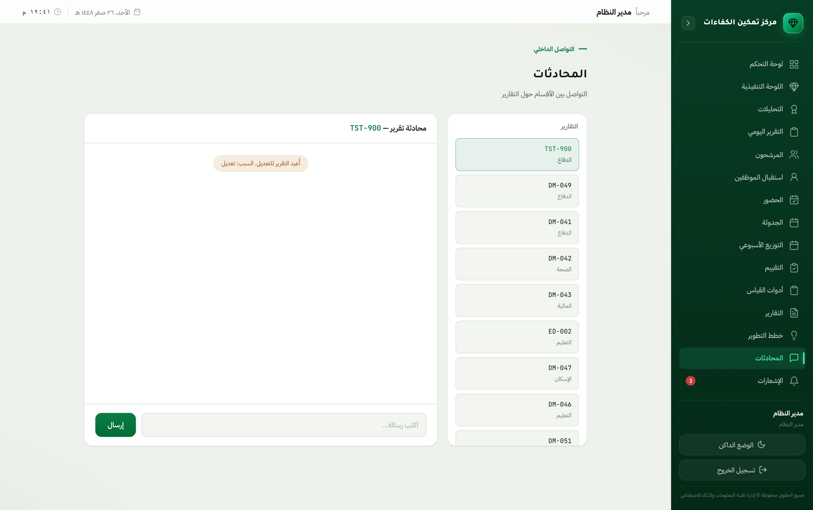

**من يفتحها:** `chat.view` — مدير النظام، مدير المركز، مسؤول الجدولة، مسؤول استقبال الموظفين، مدير إدارة التقييم، مستشار المقابلة، مستشار حلقة النقاش، مساعد التقييم، إدارة تطوير الكفاءات، مشرف أدوات القياس.

ولا تعمل فعلياً إلا لمن يملك معها `report.view`: مدير النظام، مدير المركز، مدير إدارة التقييم، مستشار المقابلة، مساعد التقييم، إدارة تطوير الكفاءات. من يملك `chat.view` وحدها — مسؤول الجدولة، ومسؤول استقبال الموظفين، ومستشار حلقة النقاش، ومشرف أدوات القياس — يفتح الشاشة فلا يجد فيها محادثة واحدة، وتظهر له عبارة **«تعذّر تحميل التقارير — تأكد أن الخادم يعمل»**. وهذه العبارة هنا **لا تعني عطلاً في الخادم**: الشاشة تطلب قائمة التقارير فيردّها الخادم بمنعٍ لأن صاحبها لا يملك `report.view`، فتعرضها الواجهة رسالةَ تعذُّر. ولا حاجة لمراجعة الدعم الفنّي — المحادثات ببساطة ليست من عمل هذا الدور.

محادثة واحدة لكل تقرير. على اليمين قائمة التقارير التي تراها، وعلى اليسار محادثة التقرير المختار. يُفتح أول تقرير في القائمة تلقائياً عند دخول الشاشة، وترتيب القائمة من الأحدث إنشاءً إلى الأقدم.

| العنصر | معناه |
| --- | --- |
| «التقارير» | عنوان قائمة التقارير على اليمين |
| بطاقة التقرير | سطران: رمز المشارك ثم اسم القطاع. المفتوحة منها مُبرَزة |
| «لا توجد تقارير» | لا تقارير في نطاقك — أو تعذّر تحميلها |
| «اختر تقريراً لعرض المحادثة» | لم يُفتح تقرير بعد |
| «محادثة تقرير — ‹الرمز›» | ترويسة اللوحة: رمز مشارك التقرير المفتوح |
| فقاعة وسطى بلون تنبيه | رسالة نظام أو إجراء — يكتبها النظام عند إرجاع التقرير أو إلغائه، ولا يكتبها مستخدم |
| فقاعة عادية | اسم المرسل · دوره، ثم النص، ثم الساعة. رسائلك أنت تظهر على الجهة المقابلة بلون مميّز |
| «لا توجد رسائل بعد — ابدأ المحادثة» | المحادثة أُنشئت ولا رسالة فيها |
| «اكتب رسالة...» | حقل الإرسال — حدّه ٢٠٠٠ حرف يفرضه الخادم |
| «إرسال» | يرسل الرسالة ثم يعيد قراءة المحادثة |

#### كيف تعمل فيها

**فتح محادثة تقرير**
1. افتح «المحادثات» من القائمة الجانبية.
2. اضغط بطاقة التقرير المطلوب في قائمة «التقارير».

النتيجة: تظهر ترويسة «محادثة تقرير — ‹رمز المشارك›»، وتُعرض الرسائل من الأقدم إلى الأحدث، وينزل العرض إلى آخر رسالة.

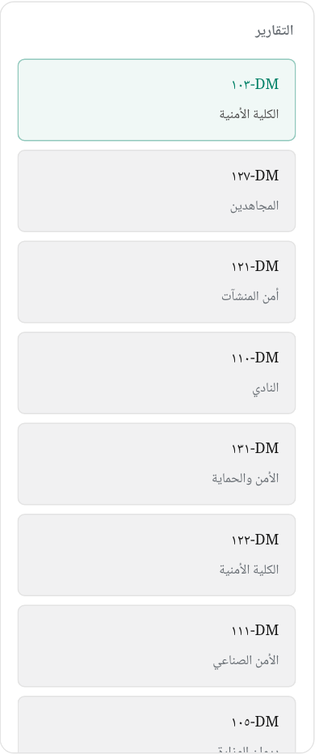

**قراءة سبب الإرجاع أو الإلغاء**
1. اختر التقرير المُرجَع أو الملغى.
2. ابحث عن الفقاعة الوسطى في مجرى الرسائل.

النتيجة: يظهر نصّ «أُعيد التقرير للتعديل. السبب: …» أو «أُلغي التقرير. السبب: …» كما كُتب لحظة الإجراء. هذه الفقاعة يكتبها الخادم مع الإجراء نفسه في `ReportController`، فهي أثرٌ لا تعليق.


**إرسال رسالة**
1. اضغط حقل «اكتب رسالة...».
2. اكتب النص.
3. اضغط «إرسال» أو مفتاح Enter.

النتيجة: يُفرَّغ الحقل، وتُعاد قراءة المحادثة فتظهر رسالتك في آخرها، ويصل إشعار «رسالة جديدة من ‹اسمك›» بمتن «لديك رسالة جديدة في محادثة — افتحها للاطّلاع» إلى كل من سبق أن كتب في المحادثة نفسها. من لم يكتب فيها من قبل لا يصله شيء.


**بدء محادثة على تقرير لم يُناقَش**
1. اختر التقرير من القائمة.
2. اقرأ «لا توجد رسائل بعد — ابدأ المحادثة».
3. اكتب رسالتك واضغط «إرسال».

النتيجة: تُنشأ المحادثة عند أوّل فتح للتقرير، وتصير رسالتك أولى رسائلها.

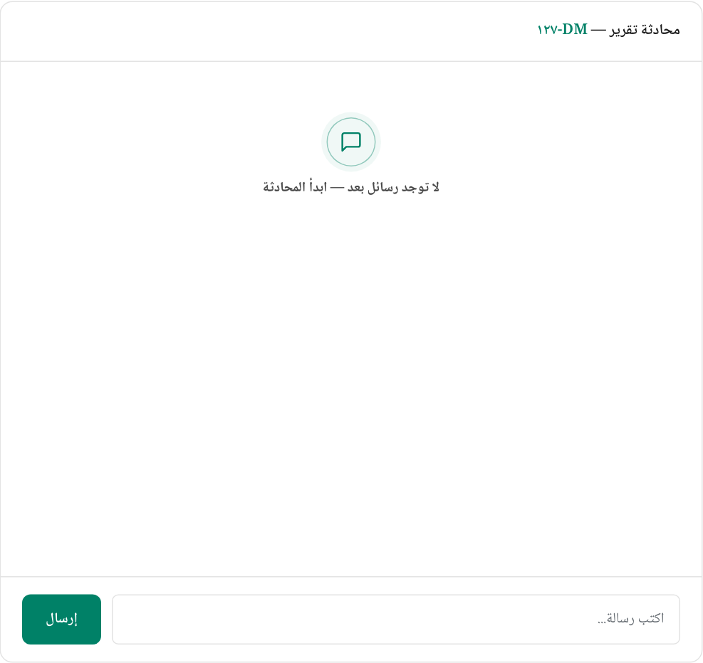

**ملاحظة على التحديث:** الشاشة لا تُحدِّث نفسها تلقائياً. رسائل الآخرين تظهر عند إرسالك رسالة، أو عند إعادة اختيار التقرير من القائمة.

#### ما يمنعه النظام ولماذا

- **بوّابتان لا واحدة.** `chat.view` تفتح الميزة نفسها، و`report.view` تفتح محادثةً بعينها. سحبُ الأولى من دور كان يُخفي الشاشة ويترك مسارها مفتوحاً لكل من يقرأ التقارير (`ChatController::authorizeEntity`).
- **محادثة خارج نطاقك تُردّ «غير موجودة» لا «ممنوعة».** المحادثة تحمل سبب الإرجاع ونقاش المقيّمين، أي مضمون التقرير المحجوب؛ والتفريق بين «غير موجود» و«ليس لك» يجعل المعرّف أداة كشف.
- **نطاق المحادثة هو نطاق التقرير نفسه** (`Controller::scopeReports`): التصنيف أولاً، ثم القطاع لمن هو محصور قطاعياً، ثم تضييق إضافي على مستشار المقابلة ومستشار حلقة النقاش — لا يريان إلا تقارير من قيّموهم هم. مساعد التقييم يبقى على حدّ القطاع.
- **لا محادثة لغير التقارير.** أي نوع كيان آخر يُردّ «نوع محادثة غير مدعوم» منعاً لمحادثات يتيمة لمدخلات عشوائية.
- **لا انتحال لرسائل النظام.** كل ما ترسله يُخزَّن بنوع «تعليق» مهما أُرسل من العميل، فلا يستطيع مستخدم أن يصنع فقاعة نظام.
- **إشعار الرسالة لا ينسخ نصّها.** الإشعار لقطة مجمّدة قد يتجاوز تصنيفها لاحقاً، فيبقى عاماً: «لديك رسالة جديدة في محادثة».
- **الترخيص قبل التحقّق من المدخلات.** من لا يملك الوصول يُمنع قبل أن يتعلّم قواعد الحقل (اسمه وحدّه) من ردّ التحقّق.

#### رسائل الخطأ

| الرسالة | معناها | ما تفعله |
| --- | --- | --- |
| تعذّر تحميل التقارير — تأكد أن الخادم يعمل | فشل جلب قائمة التقارير، ومنه ردّ «ليس لديك صلاحية عرض التقارير» لمن لا يملك `report.view` | إن كان دورك بلا صلاحية عرض التقارير فالشاشة لا تعمل لك؛ وإلا فراجع اتصال الخادم |
| تعذّر تحميل المحادثة | فشل فتح محادثة التقرير المختار | أعد المحاولة؛ إن تكرّر فالتقرير خارج نطاقك |
| المحادثة غير موجودة | التقرير غير موجود، أو خارج تصنيفك أو قطاعك أو تقييماتك | اطلب الاطّلاع ممّن يملك نطاقه |
| ليس لديك صلاحية المحادثات | دورك بلا `chat.view` | تُمنح من مدير النظام في شاشة الأدوار والصلاحيات |
| ليس لديك صلاحية الوصول لهذه المحادثة | تملك `chat.view` بلا `report.view` | كسابقتها |
| المحادثة مغلقة | المحادثة مُقفلة فلا تقبل رسائل جديدة | لا إرسال فيها — تُقرأ فقط |
| تعذّر الإرسال | فشل الإرسال، ومنه تجاوز حدّ ٢٠٠٠ حرف | اختصر النصّ وأعد الإرسال؛ نصّك يبقى في الحقل ولا يضيع |

---

### الإشعارات

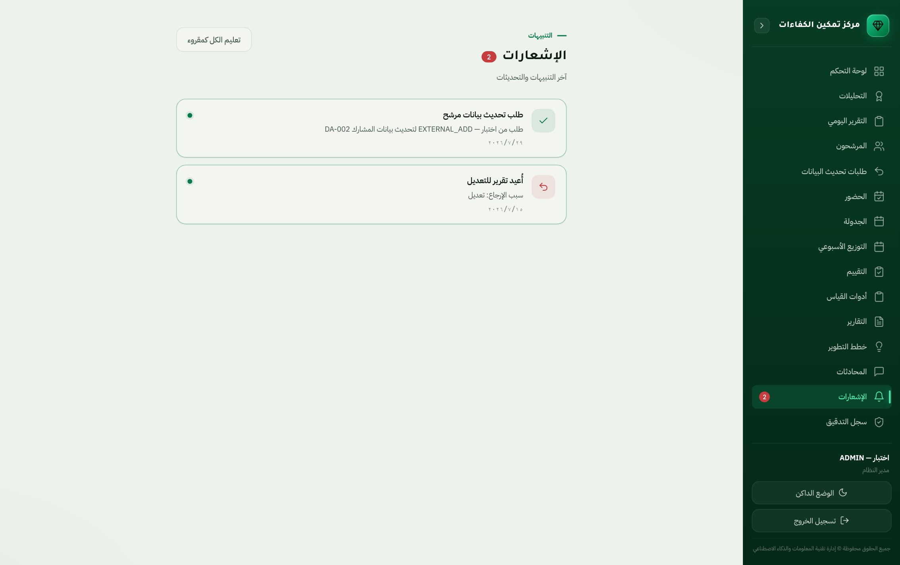

**من يفتحها:** لا صلاحية — كل مستخدم مُصادَق. ولا يرى فيها إلا إشعاراته هو: كل استعلام في `NotificationController` محصور بـ`recipient_id` = حسابك.

كل ما يخصّك في مكان واحد: تقرير وصل مرحلة اعتمادك، تقرير أُرجع لك، مرشّح أُسنِد إليك، جلسة غداً، طلب تحديث بيانات. تُعرض أحدث ٥٠ إشعاراً، ولا ترقيم صفحات في هذه الشاشة.

| العنصر | معناه |
| --- | --- |
| «الإشعارات» ومعها رقم أحمر | عدد إشعاراتك غير المقروءة. يختفي الرقم عند الصفر |
| «آخر التنبيهات والتحديثات» | سطر وصف الشاشة |
| «تعليم الكل كمقروء» | لا يظهر إلا إن كان لديك غير مقروء |
| بطاقة الإشعار | أيقونة النوع، ثم العنوان، ثم المتن، ثم الوقت |
| نقطة خضراء في طرف البطاقة | الإشعار غير مقروء |
| «لا توجد إشعارات» | لا إشعارات لحسابك |
| العدّاد على «الإشعارات» في القائمة الجانبية | نفس عدد غير المقروء؛ يُحدَّث كل دقيقة وعند كل تنقّل، ويُكتب «99+» فوق تسعة وتسعين |

**صيغة الوقت:** «الآن» دون الدقيقة، ثم «قبل N دقيقة» دون الساعة، ثم «قبل N ساعة» دون اليوم، ثم التاريخ.

**أنواع الإشعارات ولون أيقونتها** — النوع يفرضه قيد القاعدة على `notifications.type`:

| النوع | أمثلة حقيقية من النظام |
| --- | --- |
| approval | «تقرير جديد بانتظار اعتمادك» · «تقرير بانتظار اعتمادك» · «تقرير معدّل بانتظار الاعتماد» · «تقرير متأخر بانتظار الاعتماد» · «تقييم بانتظار الاعتماد» · «طلب تحديث بيانات مرشح» |
| return | «أُعيد تقرير للتعديل» · «أُلغي التقرير» · «ردّ إسناد: ‹الرمز›» |
| action | «مرشّح مُسنَد إليك: ‹الرمز›» |
| info | «تذكير: جلسة غداً» · «اعتُمد ورُحّل: ‹الرمز›» · «تقييم مُرجع للتعديل» · «رسالة جديدة من ‹الاسم›» |
| report | «اعتُمد التقرير نهائياً» |
| system | إشعارات النظام |

#### كيف تعمل فيها

**قراءة إشعار وتعليمه مقروءاً**
1. افتح «الإشعارات» من القائمة الجانبية.
2. اضغط بطاقة الإشعار.

النتيجة: تختفي النقطة الخضراء عن البطاقة، وينقص الرقم الأحمر واحداً. الضغط لا ينقلك إلى الشاشة المعنيّة — افتحها بنفسك من القائمة الجانبية. والبطاقة تبقى في القائمة بعد قراءتها ولا تُحذف.


**تعليم الكل كمقروء**
1. اضغط «تعليم الكل كمقروء» أعلى يسار الشاشة.

النتيجة: تُعلَّم كل إشعاراتك غير المقروءة — لا المعروضة على الشاشة وحدها — فيصير العدّاد صفراً ويختفي الزرّ.


**متابعة الجديد وأنت في شاشة أخرى**
1. راقب الرقم بجانب «الإشعارات» في القائمة الجانبية.

النتيجة: يتحدّث تلقائياً كل دقيقة، وعند كل انتقال بين الشاشات.


#### ما يمنعه النظام ولماذا

- **لا ترى إلا إشعاراتك.** القائمة والعدّاد والتعليم كلها محصورة بـ`recipient_id` = حسابك، وتعليم إشعار غيرك مقروءاً يُردّ «غير موجود» لأن المعرّف والمستلم يُفحصان معاً في استعلام واحد.
- **إشعار التقرير الموجَّه إلى دور لا يصل من هو خارج نطاق المرشّح.** متن الإشعار يحمل رمز المشارك، فيُنقّى المستلمون بنفس حصر المرشّح: المصنَّف لا يصل من لا يملك `candidate.view_classified`، والمحصور قطاعياً لا يصله مرشّح خارج قطاعه — وإلا سُرّب رمز مرشّح لمن يُحجب عنه التقرير نفسه (`NotificationService::notifyRole`).
- **إشعار المردود يذهب إلى من يملك الصلاحية لا إلى رمز دور.** ردّ الإسناد يُرسَل لكل من يملك `reception.assign`؛ مركزٌ لم يُنشئ دور «مسؤول العمليات» كان الإشعار يذهب فيه إلى لا أحد فيقف المرشّح في منتصف المسار.
- **تصعيد التقرير المتأخر مرّة واحدة لكل تأخّر.** طابع التصعيد يمنع إعادة الإشعار يومياً بلا حدّ.
- **الإشعار لا ينسخ نصّ رسالة المحادثة** — نصّ الرسالة لقطة مجمّدة قد يتجاوز تصنيفها لاحقاً.

#### رسائل الخطأ

| الرسالة | معناها | ما تفعله |
| --- | --- | --- |
| تعذّر تحميل الإشعارات — تأكد أن الخادم يعمل | فشل جلب قائمة الإشعارات | أعد تحميل الصفحة؛ إن تكرّر فراجع اتصال الخادم |
| لا رسالة عند فشل التعليم كمقروء | فشل «تعليم كمقروء» أو «تعليم الكل كمقروء» يُتجاهل بصمت، فلا تظهر رسالة | إن بقيت النقطة الخضراء أو الرقم الأحمر بعد الضغط فأعد تحميل الصفحة |

---

### المستخدمون

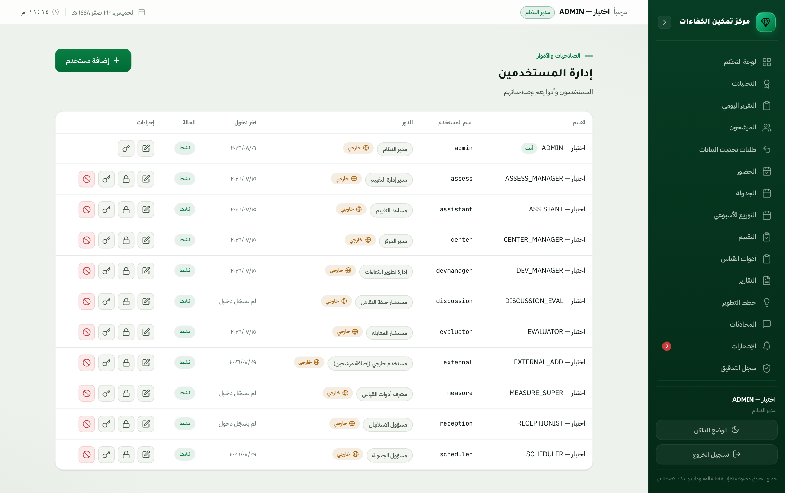

**من يفتحها:** `user.manage`. ولا يحملها في مصفوفة الصلاحيات إلا **مدير النظام** (`ADMIN`). وهي واحدة من ثلاث سلطات غير قابلة للتفويض (`user.manage`، `settings.manage`، `audit.view`): لا تُمنح لشخصٍ باستثناء فردي، ولا تُضاف لدورٍ من شاشة الأدوار — تُسنَد بالدور المبذور وحده. ومن لا يملكها لا يرى **المستخدمون** في القائمة الجانبية، وفتحُه `/users` مباشرةً يُحوّله إلى لوحة التحكم لا إلى شاشة خطأ.

هذه الشاشة تُدير **الحسابات**: إنشاءها، وإسناد الدور والقطاع والمدير المباشر، وتفعيلها وتعطيلها، وإعادة تعيين كلمات المرور، ومنح **استثناء فردي** فوق الدور أو سحبه. أمّا صلاحيات الدور نفسه فمكانها شاشة **الأدوار والصلاحيات**.

القائمة تُعرض كاملةً مرتّبةً بالاسم الكامل تصاعدياً — بلا حقل بحث ولا مرشِّحات ولا شريط ترقيم.

| العنصر | معناه |
|---|---|
| **إضافة مستخدم** | يفتح نموذج إنشاء حساب جديد |
| عمود **الاسم** | الاسم الكامل، ويظهر بجانب حسابك أنت وسم **أنت** |
| عمود **اسم المستخدم** | اسم الدخول. يُكتب مرّةً عند الإنشاء ولا يظهر في نموذج التعديل أصلاً |
| عمود **الدور** | اسم الدور، ومعه وسم النوع: **داخلي** أو **خارجي** |
| عمود **آخر دخول** | تاريخ آخر دخول، أو **لم يسجّل دخول** لمن لم يدخل بعد |
| عمود **الحالة** | **نشط** أو **معطّل** — وصفّ المعطّل يبهت |
| عمود **إجراءات** | أربعة أزرار: **تعديل** · **الصلاحيات** · **كلمة المرور** · **تعطيل**/**تفعيل** |
| **لا يوجد مستخدمون** | لا حسابات في القاعدة |

في صفّك أنت يختفي زرّا **الصلاحيات** و**تعطيل**، ويبقى **تعديل** و**كلمة المرور**.

#### كيف تعمل فيها

**إضافة مستخدم داخلي (عبر Active Directory)**

1. اضغط **إضافة مستخدم**.
2. اختر البطاقة **داخلي (Active Directory)** — «من حسابات المؤسسة — أدوار كاملة».
3. اكتب **اسم المستخدم** و**الاسم الكامل**؛ و**البريد الإلكتروني** اختياري.
4. اكتب **اسم حساب Active Directory** بالصيغة المعروضة في الحقل `domain\username`.
5. اختر **الدور**. يظهر أسفل النموذج صندوق **صلاحيات هذا الدور (N)** يعدّد ما يفتحه هذا الدور فعلاً — وبعض الصلاحيات تظهر فيه بمفتاحها التقني (مثل `development_plan.view` و`chat.view`) لأن قائمة الأسماء العربية في هذا الصندوق لا تغطّيها كلّها.
6. إن كان الدور محصوراً بقطاع — **مستشار المقابلة**، **مستشار حلقة النقاش**، **مساعد التقييم** — ظهر حقل **القطاع** بتنبيه «لا يُقيّم إلا مرشحي هذا القطاع»؛ اختر القطاع. وإن كان الدور مُسنَداً لمدير — **مساعد التقييم** — ظهر حقل **المدير** بتنبيه «مديره هو من يعتمد تقاريره»؛ اختر المدير، والقائمة تعرض مديري إدارة التقييم وحدهم.
7. اضغط **حفظ**.

النتيجة: رسالة **تمت إضافة المستخدم الداخلي**، ويظهر الحساب في الجدول بوسم **داخلي**. ولا كلمة مرور محلية له — دخوله عبر الدليل النشط.


**إضافة مستخدم خارجي**

1. اضغط **إضافة مستخدم**؛ النوع المختار افتراضياً **خارجي** — «حساب محلي — إضافة مرشحين فقط».
2. اكتب **اسم المستخدم** و**الاسم الكامل**.
3. اكتب **كلمة المرور**: ٨ أحرف على الأقل، وفيها حرف كبير وحرف صغير ورقم.
4. اضغط **حفظ**.

النتيجة اليوم: الحفظ يُردّ برسالة **The role id field is required.** — النموذج يُخفي حقل **الدور** عن النوع الخارجي بينما الخادم يشترط دوراً لكل حساب، فلا يكتمل إنشاء الحساب الخارجي من هذه الشاشة. ودور «مستخدم خارجي (إضافة مرشحين)» لا يظهر أصلاً في قائمة أدوار النموذج: الخادم يستثنيه منها. فالإضافة العاملة من هنا هي **النوع الداخلي**.

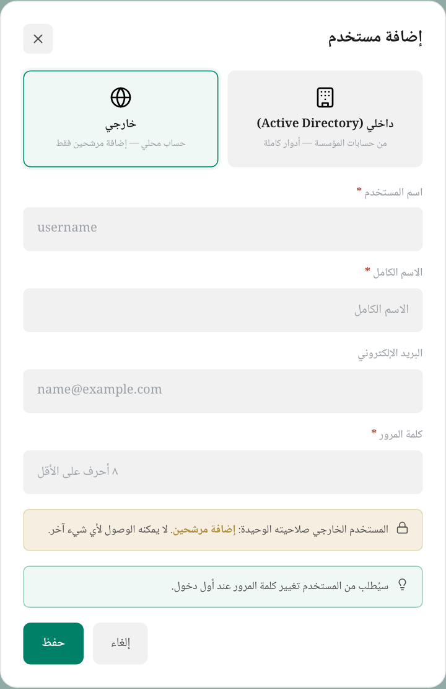

**تعديل مستخدم**

1. اضغط **تعديل** في صفّ المستخدم.
2. عدّل الاسم الكامل أو البريد أو الدور؛ وإن ظهر **القطاع** أو **المدير** فاضبطهما على الدور الجديد.
3. اضغط **حفظ**.

النتيجة: **تم تحديث المستخدم**. وإن تغيّر الدور أو القطاع أُبطلت جلسات المستخدم فيدخل من جديد بنطاقه الجديد. ومع تغيّر الدور تُحذف الاستثناءات **الممنوحة** له فوق دوره القديم — أمّا **المسحوبة** فتبقى، فلا يُعاد امتيازٌ أُسقط عمداً.

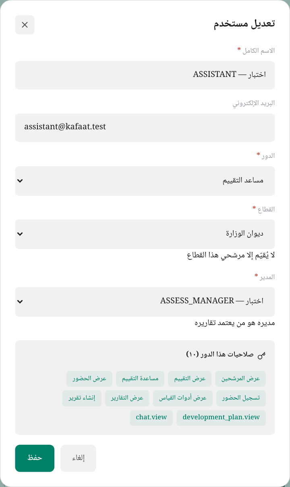

**منح استثناء صلاحية لشخص أو سحبه منه**

1. اضغط **الصلاحيات** في صفّ المستخدم.
2. اقرأ السطر الأول: الدور هو الأساس، والنقر يمنح أو يسحب **لهذا المستخدم وحده**.
3. اضغط على الصلاحية لتدوير حالتها: من الدور ← عكس ما يقوله الدور ← عودة إلى الدور. الأخضر **ممنوحة استثناءً**، والأحمر المشطوب **مسحوبة استثناءً**.
4. راقب الشريط أسفل القائمة: **N استثناء — سيُطلب من المستخدم إعادة الدخول بعد الحفظ**.
5. اضغط **حفظ الصلاحيات**.

النتيجة عند القبول: **تم حفظ الصلاحيات — سيُطلب من المستخدم إعادة الدخول**، وتُبطَل جلساته فوراً. أمّا عند الرفض فالنافذة تبقى مفتوحة كما هي **بلا رسالة ظاهرة** — راجع «رسائل الخطأ» أدناه.

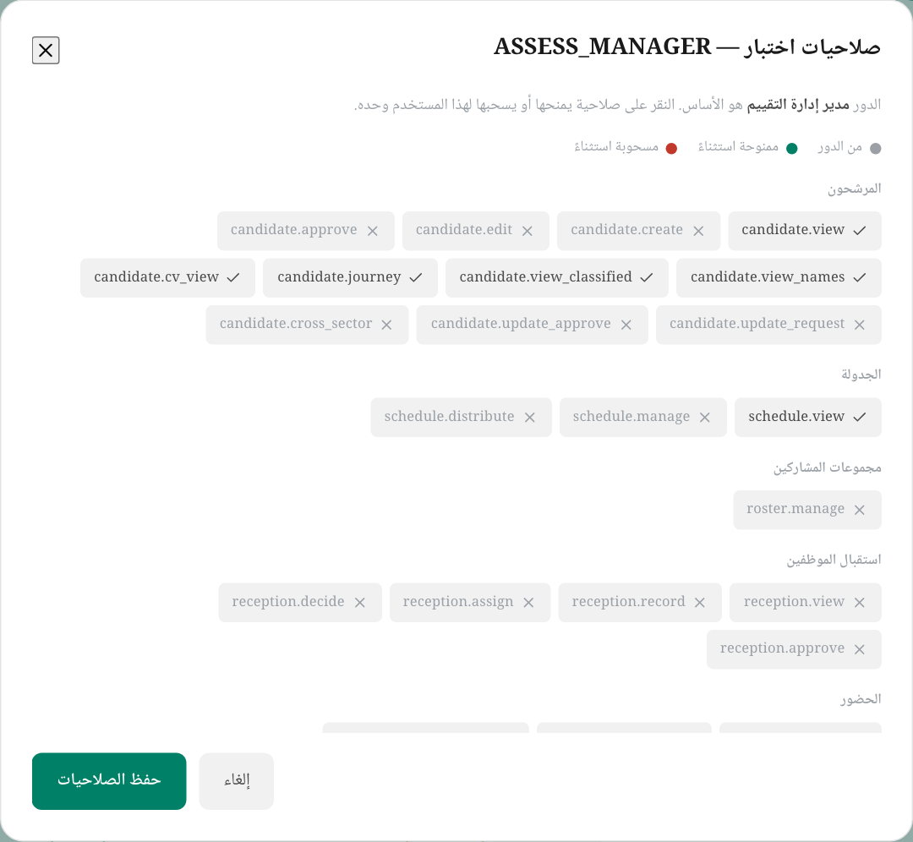


**إعادة تعيين كلمة المرور**

1. اضغط **كلمة المرور** في صفّ المستخدم.
2. اكتب **كلمة المرور الجديدة**: ٨ أحرف على الأقل، وفيها حرف كبير وحرف صغير ورقم.
3. اضغط **تعيين**.

النتيجة: **تم إعادة تعيين كلمة مرور «اسم المستخدم»**، وتُبطَل كل جلساته القائمة، ويُلزَم بتغييرها عند أول دخول.

> الزرّ متاح على حسابك أنت أيضاً؛ واستعمالُه عليه يُبطل جلستك ويعيدك إلى شاشة الدخول.

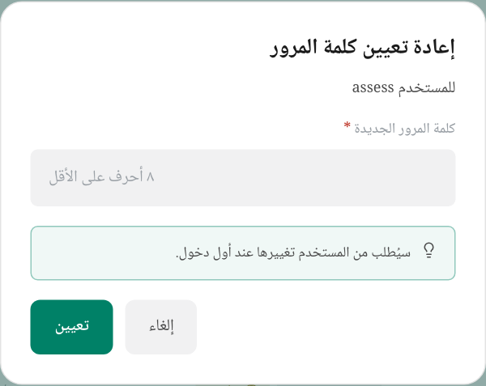

**تعطيل حساب أو تفعيله**

1. اضغط الزرّ الأخير في عمود **إجراءات**: **تعطيل** للحساب النشط، أو **تفعيل** للمعطّل.

النتيجة: **تم تعطيل المستخدم** أو **تم تفعيل المستخدم**، ويتحدّث الجدول. والتعطيل يُنهي جلسات صاحبه فوراً فلا يبقى رمز دخول فعّالاً لموظّف موقوف.

#### ما يمنعه النظام ولماذا

- **لا تعدّل صلاحيات حسابك أنت.** لولا هذا لصار كل من يملك «إدارة المستخدمين» قادراً على منح نفسه كل شيء، فلا يبقى لأي حدٍّ معنى.
- **لا تُعطّل حسابك، ولا تغيّر دورك.** الزرّان مخفيّان في صفّك، والخادم يردّ المحاولة على أي حال.
- **لا تمنح صلاحيةً لا تملكها أنت.** سقفٌ لا منعٌ مطلق: تُفوّض ما عندك ولا تصنع سلطةً أعلى منك.
- **إدارة المستخدمين والإعدادات وسجل التدقيق لا تُمنح ولا تُسحب بالاستثناء الفردي.** سلطات نظام تُدار بالدور؛ ومنحُها لشخصٍ يكسر حدود المصفوفة كلّها.
- **استثناء يطابق ما يقوله الدور أصلاً مرفوض.** يوحي باستثناء حيث لا استثناء، ثم يصير كذباً صامتاً لحظة تغيّر الدور.
- **لا يعدّل صلاحيات مدير النظام إلا مدير نظام مثله** — منعاً لقفل المدراء خارج نظامهم.
- **القطاع إلزامي للأدوار المحصورة به** (مستشار المقابلة، مستشار حلقة النقاش، مساعد التقييم): مقيّم بلا قطاع لا يُقيّم أحداً، فالسماح بإنشائه يُنتج حساباً معطّلاً بصمت. وهو ممنوع لغيرها.
- **المدير إلزامي لمساعد التقييم، ولا بدّ أن يملك اعتماد تقارير فريقه.** مساعدٌ بلا مدير يكتب تقارير لا يعتمدها أحد، فمرحلة مدير التقييم تشترط أن يكون الكاتب من فريق المعتمِد، والتقرير يعلق.
- **لا يكون المستخدم مدير نفسه.** حلقةٌ تجعل قاعدة الفريق تقبله على تقرير نفسه.
- **لا يُعدَّل ولا يُعطَّل ولا تُعاد كلمة مرور حسابٍ أعلى صلاحيةً منك.** يمنع مديرَ مستخدمين مفوَّضاً من الاستيلاء على حساب مدير النظام.
- **المستخدم الداخلي لا تُعاد كلمة مروره من هنا.** يُصادَق عبر الدليل ولا كلمة مرور محلية له، وإعادةُ تعيينها تحبسه في حلقة «غيّر كلمة المرور» لا يستطيع إتمامها.

#### رسائل الخطأ

| الرسالة | معناها | ما تفعله |
|---|---|---|
| ليس لديك صلاحية إدارة المستخدمين | حسابك لا يملك `user.manage` | الشاشة ليست لك؛ اطلبها من مدير النظام |
| تعذّر تحميل المستخدمين | الخادم لم يستجب | أعِد تحميل الصفحة، ثم راجع حالة الخادم |
| اسم المستخدم مطلوب · الاسم الكامل مطلوب · اسم حساب Active Directory مطلوب · اختر الدور · كلمة المرور ٨ أحرف على الأقل | فحص الواجهة قبل الإرسال | أكمل الحقل المذكور |
| The role id field is required. | حُفظ الحساب بلا دور — يقع دائماً عند إضافة مستخدم من النوع **خارجي** لأن حقل الدور مخفيّ عنه | استعمل النوع **داخلي (Active Directory)** ليظهر حقل الدور |
| اسم المستخدم مسجّل مسبقاً | الاسم مأخوذ | اختر اسماً غيره |
| كلمة المرور يجب أن تحتوي على حرف كبير (A-Z) · حرف صغير (a-z) · رقم | كلمة المرور لا تستوفي الشروط | أعِد كتابتها مستوفيةً الثلاثة |
| تعذّر التغيير | ظهرت عند إعادة تعيين كلمة المرور: الخادم ردّ الطلب ولم تُعرض رسالته — والسبب الغالب أن كلمة المرور تنقصها شروط القوّة | اكتب كلمة مرور فيها حرف كبير وحرف صغير ورقم |
| القطاع مطلوب لهذا الدور — كل مقيّم ومساعد مخصَّص لقطاع | دور محصور بقطاع بلا قطاع | اختر القطاع |
| هذا الدور غير محصور بقطاع | أُرسل قطاع لدور لا يقبله | أعِد فتح النموذج بعد اختيار الدور الصحيح |
| المدير مطلوب لهذا الدور — تقاريره يعتمدها مديره | مساعد تقييم بلا مدير | اختر المدير |
| هذا الدور لا يُسنَد لمدير | أُرسل مدير لدور لا يقبله | أعِد فتح النموذج بعد اختيار الدور الصحيح |
| المدير المختار لا يملك اعتماد تقارير فريقه | المستخدم المختار لا يملك `report.approve_manager` | اختر مديراً من مديري إدارة التقييم |
| لا يكون المستخدم مدير نفسه | أُسند المستخدم مديراً لنفسه | اختر مديراً آخر |
| لا يمكنك إسناد دور مدير النظام · لا يمكنك إسناد دور بصلاحيات تفوق صلاحياتك | سقف إسناد الدور | أسنِد دوراً في حدود صلاحياتك |
| لا يمكنك تغيير دورك الخاص · لا يمكنك تعطيل حسابك الخاص · لا يمكنك تعديل صلاحيات حسابك | إجراء على حسابك أنت | اطلبه من مدير نظام آخر |
| لا يمكنك تعديل حساب أعلى صلاحيةً منك · لا يمكنك تعطيل حساب أعلى صلاحيةً منك · لا يمكنك إعادة تعيين كلمة مرور حساب أعلى صلاحيةً منك | الحساب المستهدف يملك ما لا تملكه أنت | لا شيء — الحدّ مقصود |
| هذا مستخدم يُصادَق عبر الدليل النشط (AD) ولا يملك كلمة مرور محلية | إعادة تعيين كلمة مرور حساب داخلي | كلمة مروره تُدار في الدليل لا هنا |
| استثناء يطابق الدور بلا فائدة: … | أشّرت صلاحيةً بنفس ما يعطيه الدور | أعِد الصلاحية المذكورة إلى حالة «من الدور» |
| هذه الصلاحيات تُدار بالدور لا بالاستثناء الفردي: … | حاولت منح أو سحب سلطة نظام | أعِدها إلى حالة الدور؛ هذه السلطات تُسنَد بالدور المبذور وحده |
| لا يمكنك منح صلاحية لا تملكها: … | فوق سقفك | امنح ما تملكه أنت |
| لا يمكنك تعديل صلاحيات مدير النظام | المستهدف يحمل دور مدير النظام ولستَ مثله | لا شيء |
| **لا شيء يظهر بعد ضغط «حفظ الصلاحيات»** | الخادم ردّ الحفظ، والنافذة لا تعرض سبب الردّ | راجع تأشيراتك: سلطة نظام؟ استثناء يطابق الدور؟ صلاحية لا تملكها؟ ثم أعِد المحاولة |

---

### الأدوار والصلاحيات

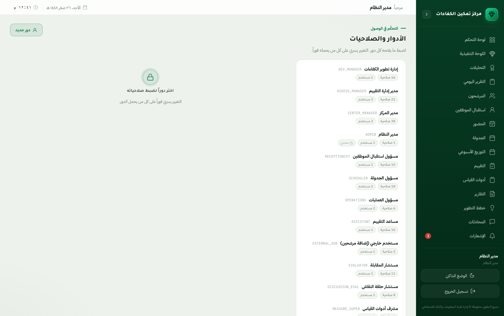

**من يفتحها:** `user.manage` — **مدير النظام** (`ADMIN`) وحده، وهي الصلاحية نفسها التي تفتح شاشة **المستخدمون**. ومن لا يملكها لا يرى الرابط في القائمة الجانبية، وفتحُه `/roles` مباشرةً يُحوّله إلى لوحة التحكم.

هنا تُضبط صلاحيات **الأدوار نفسها**، لا صلاحيات شخصٍ بعينه. إجراءٌ واحد هنا يغيّر ما يستطيعه **كل** حامل للدور دفعةً واحدة، ويسري فوراً. الفرق عن شاشة **المستخدمون**: هناك استثناءٌ لشخصٍ فوق دوره، وهنا القاعدة التي يقوم عليها الدور. استعمل الدور للقاعدة، والاستثناء للحالة الفردية.

الشاشة عمودان: قائمة الأدوار على اليمين، وصلاحيات الدور المفتوح على اليسار موزّعةً على **سبع عشرة مجموعة** فيها **ثلاث وخمسون صلاحية**.

| العنصر | معناه |
|---|---|
| **دور جديد** | يفتح نافذة إنشاء دور |
| بطاقة الدور في القائمة | اسمه بالعربية ورمزه اللاتيني تحته |
| وسم **N صلاحية** | عدد صلاحيات الدور. ويظهر لمدير النظام **1 صلاحية** لأن صلاحيته مخزَّنة علامةً واحدة تعني الكل — وتفصيلُه يُظهر الثلاث والخمسين كلها مؤشَّرة |
| وسم **N مستخدم** | عدد حامليه، ويتلوّن تحذيراً حين يكون صفراً |
| وسم **محميّ** | دور مدير النظام: لا يُعدَّل ولا يُحذف |
| **اختر دوراً لضبط صلاحياته** | لم يُفتح دور بعد. وتحته: «التغيير يسري فوراً على كل من يحمل الدور.» |
| **يحمله N مستخدماً · مؤشَّر N صلاحية** | سطر تفصيل الدور المفتوح |
| وسم **افتراضي** | صلاحيات هذا الدور لم تُحرَّر بعد — ما زالت كما وُلد بها |
| **الافتراضي** | يعيد الدور إلى صلاحياته الأصلية. يظهر لغير المحميّ وغير دورك أنت |
| **حذف** | يظهر للدور غير المحميّ الذي **لا حامل له** |
| **تحديد الكل** / **إلغاء الكل** | لكل مجموعة، ولا يمسّ المقفل منها |
| صفّ الصلاحية | وصفها بالعربية، ومفتاحها التقني بجانبه، وسبب قفلها إن كانت مقفلة |
| **تغييرات غير محفوظة — ستسري على N مستخدماً** | الفرق عن المحفوظ: **+ يُضاف** و**− يُسحَب**، بالأسماء لا بالمفاتيح |
| الشريط أسفل الشاشة **N إضافة · N سحب** | ومعه **تراجع** و**حفظ**. ثابتٌ أسفل الشاشة لأن قائمة الصلاحيات أطول من الشاشة، فزرُّ حفظٍ في ذيلها يُخفي عليك أن لديك تغييراً غير محفوظ |

#### كيف تعمل فيها

**ضبط صلاحيات دور**

1. اضغط اسم الدور في القائمة اليمنى. تُفتح صلاحياته على اليسار مع عدد حامليه.
2. أشِّر ما تريد منحه، وأزِل تأشير ما تريد سحبه؛ أو استعمل **تحديد الكل** / **إلغاء الكل** لمجموعة كاملة.
3. اقرأ صندوق **تغييرات غير محفوظة**: ما يُضاف وما يُسحَب، وعدد من سيتأثّر.
4. اضغط **حفظ** في الشريط أسفل الشاشة — أو **تراجع** للعودة إلى المحفوظ.

النتيجة: **حُفظت صلاحيات «اسم الدور» — تسري على N مستخدماً**، ويتحدّث عدّاد الصلاحيات في القائمة.

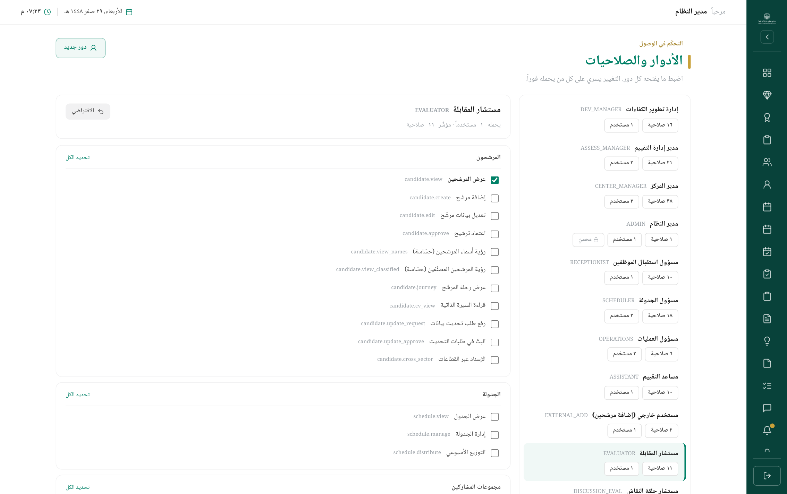


**إعادة دور إلى صلاحياته الافتراضية**

1. افتح الدور.
2. اضغط **الافتراضي**.

النتيجة: **أُعيد الدور إلى صلاحياته الافتراضية**. أمّا الدور الذي أُنشئ من هذه الشاشة فلا افتراضي له، فيردّ الخادم: «هذا الدور لا افتراضي له — أُنشئ من الشاشة».

**إنشاء دور جديد**

1. اضغط **دور جديد**.
2. اكتب **الرمز** بأحرف لاتينية كبيرة وأرقام وشرطة سفلية. لا يتغيّر بعد الإنشاء — يُستعمل مفتاحاً في النظام.
3. اكتب **الاسم بالعربية**، و**الوصف (اختياري)**.
4. اضغط **إنشاء**.

النتيجة: **أُنشئ الدور — يبدأ بلا صلاحية، امنحه ما يلزم**، ويُفتح الدور مباشرةً لتمنحه صلاحياته.

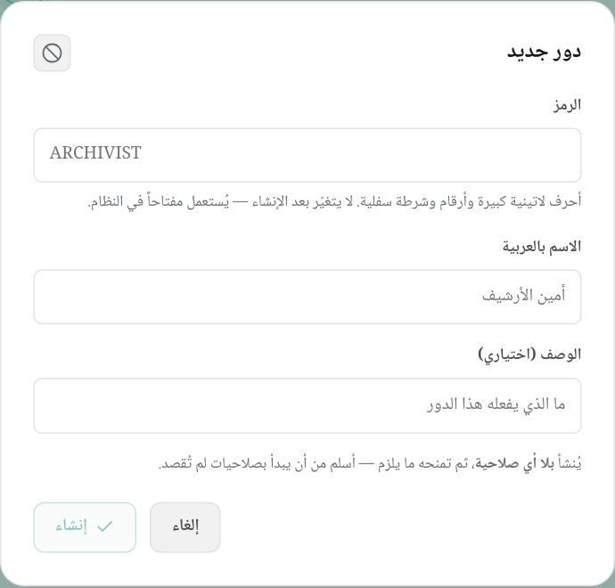

**حذف دور**

1. افتح دوراً غير محميّ لا حامل له — يظهر زرّ **حذف**.
2. اضغط **حذف**، ثم أكّد السؤال «حذف دور «…» نهائياً؟».

النتيجة: **حُذف الدور**، ويختفي من القائمة.

#### ما يمنعه النظام ولماذا

- **دور مدير النظام لا تُعدَّل صلاحياته ولا يُحذف.** يُفتح وكل صلاحياته مقفلة بسبب «دور مدير النظام لا يُعدَّل»، ولا يظهر له زرّا **الافتراضي** و**حذف**. سحب «إدارة المستخدمين» منه يُغلق باب الإدارة على الجميع بلا سبيل للعودة إلا من قاعدة البيانات مباشرة.
- **لا تعدّل صلاحيات الدور الذي تحمله أنت.** من يعدّل دوره يمنح نفسه ما يشاء، فلا يبقى لأي حدٍّ معنى.
- **`user.manage` و`audit.view` و`settings.manage` مقفلة في كل دور** بسبب «سلطة نظام تُدار بالدور المبذور لا بالتحرير»: منحُها بالتحرير يلتفّ على كونها غير قابلة للتفويض أصلاً.
- **لا تُمنح صلاحيةً لا تملكها أنت**، وتظهر عندك مقفلةً بسبب «لا تملك هذه الصلاحية بنفسك». والفحص على **المضاف** وحده: صلاحيةٌ كانت للدور من قبل ولا تملكها تبقى ولا تُعدّ تصعيداً. والمحاولة المرفوضة تُقيَّد في سجل التدقيق.
- **لا يُحذف دورٌ له حاملون.** حذفه وهم عليه يترك حساباتٍ بلا دور، وكلُّ فحص صلاحية يمرّ بدور صاحبه فيسقط عند أول طلب لهم. انقلهم إلى دورٍ آخر أولاً.
- **الرمز لا يتغيّر بعد الإنشاء** — يُستعمل مفتاحاً في الشيفرة، والشاشة لا تتيح تعديله.
- **الدور الجديد يُولد بلا أي صلاحية** — أسلم من أن يبدأ بصلاحيات لم تُقصد.
- **تجريد دور من كل صلاحياته يبقى مقصوداً.** الفراغ يُحفظ فراغاً بعلامة صريحة، فلا يقع الدور على قائمته الافتراضية فيستعيدها بصمت.


#### رسائل الخطأ

| الرسالة | معناها | ما تفعله |
|---|---|---|
| ليس لديك صلاحية إدارة الأدوار | حسابك لا يملك `user.manage` | الشاشة ليست لك |
| تعذّر تحميل الأدوار · تعذّر تحميل صلاحيات الدور | الخادم لم يستجب | أعِد تحميل الصفحة |
| الدور غير موجود | حُذف الدور من جهةٍ أخرى بينما هو مفتوح عندك | أعِد تحميل الصفحة |
| دور مدير النظام لا تُعدَّل صلاحياته | حفظُ صلاحيات الدور المحميّ | لا شيء — المنع مقصود |
| لا يمكنك تعديل صلاحيات دورك | حفظُ صلاحيات الدور الذي تحمله | اطلبه من مدير نظام آخر |
| لا تُمنح صلاحيةً لا تملكها: … | أضفتَ للدور صلاحيةً ليست عندك | احذفها من التأشير، وتُقيَّد المحاولة في سجل التدقيق |
| سلطات النظام لا تُعدَّل من هنا: … | تغيّرت إحدى الصلاحيات الثلاث غير القابلة للتفويض | أعِدها إلى ما كانت عليه |
| دور مدير النظام لا يُحذف · لا يمكنك حذف دورك | حذف الدور المحميّ أو دورك أنت | لا شيء |
| الدور مُسنَد إلى N مستخدماً — انقلهم إلى دورٍ آخر أولاً | للدور حاملون | غيّر أدوارهم من شاشة **المستخدمون** ثم احذفه |
| هذا الدور لا افتراضي له — أُنشئ من الشاشة | إعادة دور أُنشئ يدوياً إلى «الافتراضي» | اضبط صلاحياته يدوياً |
| الرمز بأحرف لاتينية كبيرة وأرقام وشرطة سفلية فقط | رمز الدور مخالف للنمط | اكتبه مثل `ARCHIVIST` |
| هذا الرمز مستعمل لدورٍ آخر | الرمز مأخوذ | اختر رمزاً غيره |
| تعذّر حفظ الصلاحيات · تعذّرت الإعادة · تعذّر إنشاء الدور · تعذّر حذف الدور | ردٌّ من الخادم بلا رسالة مفصّلة | أعِد المحاولة، ثم راجع سجل التدقيق |

---

### سير العمل

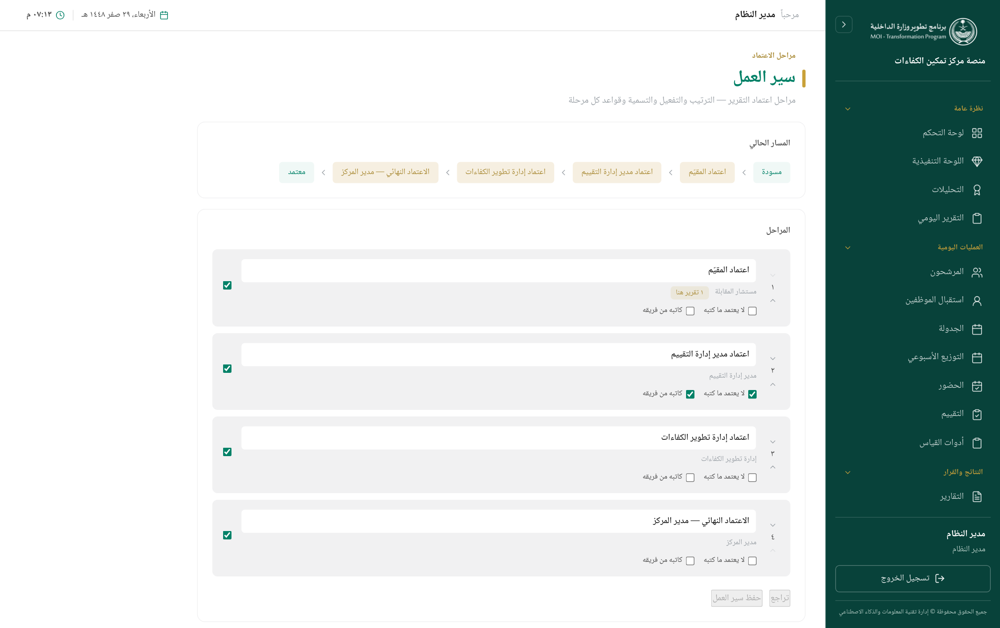

**من يفتحها:** `workflow.manage` — **مدير النظام وحده**. مدير المركز لا يملكها بقرار صريح في `Permissions::matrix()`: «لا يتحكّم في المستخدمين ولا الإعدادات ولا مراحل الاعتماد؛ تلك سلطات نظام تُدار من حساب مدير النظام وحده، وفصلُها يبقي من يشرف غير من يضبط». المسار في الخادم يقبل `workflow.manage` أو `settings.manage`، وكلتاهما لمدير النظام.

سلسلة اعتماد التقرير **بيانات في القاعدة لا شيفرة مثبّتة**، وهذه الشاشة تحرّرها. ما يُعرض هنا هو ما يفرضه محرّك الاعتماد حرفياً. مفردات الحالات نفسها ثابتة يفرضها قيد القاعدة، فلا تُخترع مرحلة جديدة من الشاشة — يُعاد ترتيب الموجود ويُفعَّل ويُعطَّل ويُسمّى.

| العنصر | معناه |
| --- | --- |
| «المسار الحالي» | السلسلة كما يمشيها التقرير: «مسودة» ثم المراحل المفعّلة بالترتيب ثم «معتمد» |
| «المراحل» | كل المراحل، المفعّلة والمعطّلة معاً |
| سهم «لأعلى» / «لأسفل» | تحريك المرحلة في الترتيب — تبديل موضعين لا إزاحة. السهم معطّل عند طرف القائمة |
| الرقم بين السهمين | ترتيب المرحلة داخل السلسلة المفعّلة، و«—» إن كانت معطّلة |
| حقل «اسم المرحلة» | تسمية المرحلة كما تظهر في «المسار الحالي» وفي إشعارات الاعتماد. حدّه ١٠٠ حرف |
| اسم الدور تحت الاسم | الدور صاحب المرحلة — يُعرض ولا يُعدَّل من هنا |
| وسم «N تقرير هنا» | عدد التقارير الواقفة على حالة هذه المرحلة الآن |
| «لا يعتمد ما كتبه» | من يعتمد في هذه المرحلة لا يعتمد تقريراً كتبه بنفسه |
| «كاتبه من فريقه» | لا يعتمد المرحلة إلا إذا كان كاتب التقرير مرؤوساً مباشراً للمعتمِد |
| المفتاح في طرف الصف | تفعيل المرحلة أو تعطيلها. المعطّلة تظهر باهتة بإطار متقطّع |
| «تراجع» | يعيد قراءة السلسلة من الخادم فيُلغي تعديلاتك غير المحفوظة |
| «حفظ سير العمل» / «جارٍ الحفظ...» | يحفظ السلسلة كاملة. الزرّان معطّلان ما لم تُغيّر شيئاً |
| «ملاحظات مهمة» | خمس قواعد يفرضها المحرّك، مكتوبة في الشاشة نفسها |

#### كيف تعمل فيها

**قراءة المسار قبل تغييره**
1. افتح «سير العمل» من القائمة الجانبية.
2. اقرأ بطاقة «المسار الحالي».

النتيجة: تظهر السلسلة الفعلية من «مسودة» إلى «معتمد» مارّةً بالمراحل المفعّلة بترتيبها. هذه البطاقة تُقرأ من نفس الدالّة التي يعتمد بها المحرّك، فلا تتباعد عن الواقع.


**تغيير ترتيب مرحلة**
1. حدّد صفّ المرحلة في قسم «المراحل».
2. اضغط سهم «لأعلى» أو «لأسفل» بجانب رقمها.
3. راجع «المسار الحالي» — يتحدّث فوراً.
4. اضغط «حفظ سير العمل».

النتيجة: تتبادل المرحلتان موضعيهما، ويظهر «تم حفظ سير العمل»، وتُعاد قراءة عدّادات التقارير. التغيير يُدوَّن في سجل التدقيق بحالتيه قبل وبعد.


**تسمية مرحلة**
1. اضغط حقل «اسم المرحلة» في صفّ المرحلة.
2. اكتب التسمية الجديدة (١٠٠ حرف حدّاً أعلى).
3. اضغط «حفظ سير العمل».

النتيجة: تظهر التسمية في «المسار الحالي» وفي متن إشعارات هذه المرحلة.

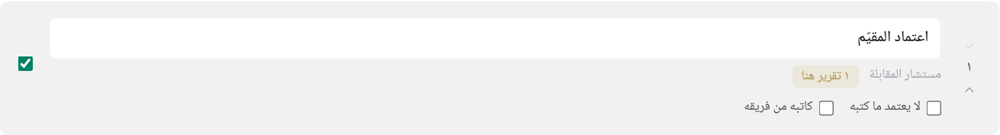

**ضبط قواعد المرحلة على كاتب التقرير**
1. علّم «لا يعتمد ما كتبه» إن أردت منع المعتمِد من اعتماد تقرير كتبه بنفسه.
2. علّم «كاتبه من فريقه» إن أردت ألّا يعتمد إلا ما كتبه مرؤوسوه المباشرون.
3. اضغط «حفظ سير العمل».

النتيجة: يفحص الخادم القاعدتين عند كل اعتماد لهذه المرحلة، ويردّ منعاً مشروحاً إن خالفتاه. ومحاولة الاعتماد المرفوضة تُدوَّن في سجل التدقيق.

**تعطيل مرحلة**
1. تأكّد أن وسم «N تقرير هنا» غير ظاهر في صفّها.
2. اضغط المفتاح في طرف الصفّ.
3. اضغط «حفظ سير العمل».

النتيجة: يبهت الصفّ ويصير إطاره متقطّعاً ويتحوّل رقمه إلى «—»، وتخرج المرحلة من «المسار الحالي» فلا يمرّ بها التقرير بعد اليوم.


**التراجع عن تعديل لم يُحفظ**
1. اضغط «تراجع».

النتيجة: تُعاد قراءة السلسلة من الخادم وتعود الشاشة إلى المحفوظ.


#### ما يمنعه النظام ولماذا

- **لا تُعطَّل مرحلة فيها تقارير.** التقرير الواقف عليها يعلق على حالةٍ لا مرحلةَ مفعّلة تعتمدها. الشاشة تمنعك قبل الرحلة، والخادم يمنعك بعدها — والمنع بدل تحريك تقارير أحدٍ من تحته.
- **مرحلة واحدة مفعّلة على الأقل.** سلسلة فارغة تعني تقريراً لا يُعتمد أبداً.
- **السلسلة تُرسَل كاملة عند الحفظ.** تعديل جزئي يترك مواضع متضاربة، فالخادم يرفض أي طلب لا يشمل كل المراحل.
- **المواضع فريدة.** تكرار الترتيب يجعل السلسلة غير محدّدة، فيُردّ «ترتيب المراحل مكرّر».
- **لا تُخترع مرحلة.** مفردات الحالات يفرضها قيد قاعدة البيانات على `final_reports.status`؛ الشاشة تُرتّب وتُفعّل وتُسمّي فقط.
- **الإرجاع والإلغاء لمدير المركز وحده** بصلاحيتي `report.return` و`report.cancel`، مهما تغيّر ترتيب المراحل. كانتا موزّعتين على كل مرحلة فكان كلّ معتمِدٍ يردّ التقرير خطوات للوراء.
- **صاحب المرحلة التالية مباشرةً يتجاوز من قبله**، وتُفحص قواعد المرحلة المُتخطّاة والوجهة معاً — وإلا صار التجاوز باباً خلفياً يلتفّ على «لا يعتمد ما كتبه». والتجاوز يُدوَّن في سجل التدقيق.
- **كل تغيير هنا يُدوَّن** في سجل التدقيق بحالتَي السلسلة قبل وبعد: تغيير سلسلة الاعتماد قرار حوكمي.

#### رسائل الخطأ

| الرسالة | معناها | ما تفعله |
| --- | --- | --- |
| «‹اسم المرحلة›» فيها N تقرير — حرّكها أولاً ثم عطّل المرحلة | منعتك الشاشة من تعطيل مرحلة عليها تقارير واقفة | اعتمد تلك التقارير أو أرجعها حتى يخلو العدّاد، ثم عطّل المرحلة |
| لا يمكن تعطيل مرحلة فيها تقارير: «‹الاسم›» فيها N تقرير. حرّكها أولاً ثم عطّل المرحلة. | نفس المنع من الخادم عند الحفظ | كسابقتها |
| يجب تفعيل مرحلة واحدة على الأقل — وإلا تعذّر اعتماد أي تقرير | حاولت تعطيل آخر مرحلة مفعّلة | أبقِ مرحلة واحدة على الأقل مفعّلة |
| يجب إرسال المراحل كاملة | وصل الخادمَ طلبٌ لا يشمل كل المراحل | أعد تحميل الشاشة وأعد المحاولة |
| ترتيب المراحل مكرّر | موضعان متطابقان في السلسلة | أعد تحميل الشاشة ورتّب المراحل بالسهمين |
| تعذّر الحفظ | رفضٌ لم تُفهَم رسالته، وأشهر أسبابه ترك «اسم المرحلة» فارغاً | تأكّد أن لكل مرحلة اسماً غير فارغ لا يتجاوز ١٠٠ حرف، ثم احفظ |
| ليس لديك صلاحية إدارة الإعدادات | حسابك بلا `workflow.manage` ولا `settings.manage` | الشاشة لمدير النظام؛ اطلب التغيير منه |
| تعذّر تحميل سير العمل | فشل جلب السلسلة | أعد تحميل الصفحة؛ إن تكرّر فراجع اتصال الخادم |
| تم حفظ سير العمل | الحفظ تمّ ودُوِّن في سجل التدقيق | لا شيء — راجع «المسار الحالي» للتأكّد |

---

### الإعدادات

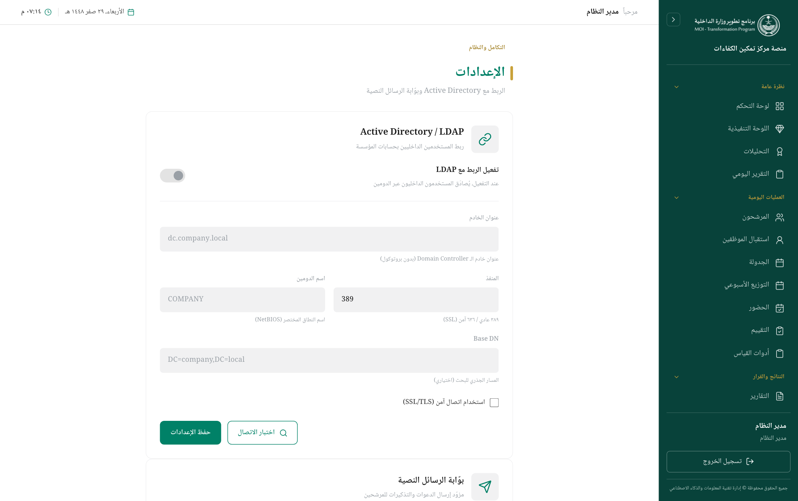

**من يفتحها:** `settings.manage`. في مصفوفة الصلاحيات لا يملكها إلا **مدير النظام** (ADMIN). وهي إحدى ثلاث سلطات في `Permissions::NON_DELEGABLE`، فلا تُمنح لمستخدم بعينه استثناءً ولا تُضاف إلى دور من شاشة الأدوار. من لا يملكها ويكتب `/settings` في الشريط يُعاد إلى لوحة التحكم.

صفحة واحدة طويلة، ثماني بطاقات مستقلّة يُحفظ كلٌّ منها وحده. البطاقات الأربع الأولى تكاملات خارجية ولكلٍّ زرّ اختبار؛ والأربع الأخيرة بيانات تشغيل تستهلكها شاشات أخرى (رمز المشارك، الجدولة، كشف الحضور، تصنيف الفئة القيادية).

#### بطاقة «Active Directory / LDAP»

| العنصر | معناه |
|---|---|
| **تفعيل الربط مع LDAP** | «عند التفعيل، يُصادَق المستخدمون الداخليون عبر الدومين» |
| **عنوان الخادم** | «عنوان خادم الـ Domain Controller (بدون بروتوكول)» — مطلوب عند التفعيل |
| **المنفذ** | «389 عادي / 636 آمن (SSL)» |
| **اسم الدومين** | «اسم النطاق المختصر (NetBIOS)» — مطلوب عند التفعيل |
| **Base DN** | «المسار الجذري للبحث (اختياري)» |
| **استخدام اتصال آمن (SSL/TLS)** | مربّع اختيار يُمرَّر مع طلب الاختبار والحفظ |
| **اختبار الاتصال** | يفتح اتصالاً بالخادم المكتوب — قبل الحفظ |
| **حفظ الإعدادات** | يحفظ البطاقة |

#### بطاقة «بوّابة الرسائل النصية»

| العنصر | معناه |
|---|---|
| **تفعيل الإرسال الفعلي** | «عند الإيقاف، تُسجَّل الرسائل بلا إرسال (وضع التطوير)» |
| **عنوان البوّابة** | «رابط الإرسال من مزوّدك — https فقط» |
| **مفتاح البوّابة** | إن كان محفوظاً ظهر في الحقل «•••••••• (محفوظ — اتركه فارغاً للإبقاء عليه)»، وإلا «المفتاح من لوحة المزوّد» |
| **اسم المرسِل** | «الاسم الظاهر للمستقبل (مسجَّل لدى المزوّد)» |
| **رقم الدعم** | «يحلّ محل {phone} في القوالب» |
| **رقم اختبار** | «يُرسل رسالة فعلية بتكلفة — احفظ الإعدادات أولاً» |
| **إرسال رسالة اختبار** / **حفظ إعدادات البوّابة** | الزرّان |

#### بطاقة «بوّابة التحقق من الهوية»

| العنصر | معناه |
|---|---|
| **تفعيل التحقق** | «عند الإيقاف، لا يُستدعى المزوّد (لا يتأثّر تدفّق الإضافة)» |
| **المزوّد** | خياران: «عام (شكل قياسي)» و«يقين / أبشر» — «اختر «يقين» لخريطة طلب/ردّ أبشر، أو «عام» لأي مزوّد» |
| **عنوان البوّابة** | «رابط التحقق من مزوّدك — https فقط» |
| **مفتاح البوّابة** | كنظيره في الرسائل: محفوظ ومشفّر ولا يُعاد للواجهة |
| **معرّف التطبيق** | «معرّف/رمز الاشتراك لدى المزوّد (اختياري)» |
| **رقم هوية للاختبار** | «يستدعي المزوّد فعلياً — احفظ الإعدادات أولاً» |
| **اختبار التحقق** / **حفظ إعدادات التحقق** | الزرّان |
| **آخر محاولات التحقق** | آخر مئة محاولة: حالتها، ورمز المشارك، ومن نفّذها، والمزوّد. زرّ **تحديث** يعيد جلبها. بلا محاولات تظهر «لا محاولات بعد.» |
| حالات المحاولة | **تطابقت** / **لم تتطابق** / **فشل** / **وضع التطوير** |

#### بطاقة «خادم البريد (SMTP)»

| العنصر | معناه |
|---|---|
| **تفعيل إرسال البريد** | «عند الإيقاف، يُستخدم مُرسِل البيئة (سجل فقط في التطوير)» |
| **عنوان الخادم** | «عنوان خادم البريد (بدون بروتوكول)» |
| **المنفذ** | «465 ضمني / 587 STARTTLS / 25 عادي» |
| **نوع التشفير** | «STARTTLS — يُرقّى بعد الاتصال (الأشيع)» / «SSL/TLS ضمني — مشفّر من البداية» / «بلا تشفير — شبكة داخلية فقط». «اختيار النوع يضبط المنفذ القياسي تلقائياً» |
| **اسم المستخدم** | «اتركه فارغاً لمُرحِّل داخلي بلا مصادقة» |
| **كلمة المرور** | إن كانت محفوظة ظهر «•••••••• (محفوظة — اتركها فارغة للإبقاء)» |
| **بريد المرسِل** | «العنوان الظاهر للمستقبِل» |
| **اسم المرسِل** | «الاسم الظاهر بجانب العنوان» |
| **بريد اختبار** | «يُرسل رسالة فعلية — احفظ الإعدادات أولاً» |
| **إرسال بريد اختبار** / **حفظ إعدادات البريد** | الزرّان |

#### بطاقة «القطاعات»

| العمود / الزر | معناه |
|---|---|
| **اسم القطاع** | حقل قابل للتحرير مباشرةً في الصفّ |
| **الرمز** | بادئة رمز المشارك — حرفان إلى أربعة، لاتيني كبير أو أرقام. تُكتب بحروف كبيرة تلقائياً |
| **نموذج** | معاينة حيّة للرمز الناتج: `ED-001` |
| **مرتبط بـ** | «{عدد} مرشح · {عدد} مستخدم»، أو «—» إن لم يرتبط به أحد |
| **حفظ الاسم** | يظهر فقط بعد تغيير الاسم |
| **حفظ الرمز** | يظهر فقط بعد تغيير الرمز |
| **حذف** | يظهر للقطاع غير المرتبط بأحد |
| **محمي** | بديل زرّ الحذف للقطاع المرتبط، وتلميحه: «لا يُحذف قطاع مرتبط بمرشحين أو مستخدمين» |
| **إضافة** | في الصفّ الفارغ الدائم أسفل الجدول (placeholders: «اسم القطاع…» و«XX») |
| العدّاد أعلى البطاقة | «{عدد القطاعات} من 26» — رقم إرشادي لا حدّ يمنع الإضافة |

#### بطاقات التشغيل الثلاث

| البطاقة | الحقل | المدى المقبول |
|---|---|---|
| **التوزيع الأسبوعي** | «الحدّ لكل مقيّم / يوم» | عدد صحيح بين 1 و 50 |
| **أوقات الجلسات** | «الأوقات (مفصولة بفاصلة)» | من وقت واحد إلى ستة، بصيغة `HH:MM` بنظام 24 ساعة |
| **تصنيف القيادة** | «الرتب العسكرية «العليا» (افصل بينها بفاصلة)» | نصّ مطلوب |
| **تصنيف القيادة** | «عتبة الرتبة المدنية للقيادة العليا (م-؟ فأعلى)» | عدد صحيح بين 1 و 20 |

زرّ الحفظ في هذه الثلاث لا يظهر إلا بعد تغيير القيمة، ونصّه **حفظ** في الأوليَين و**حفظ قواعد التصنيف** في الثالثة.

#### كيف تعمل فيها

**١) ربط الدخول بـ Active Directory**

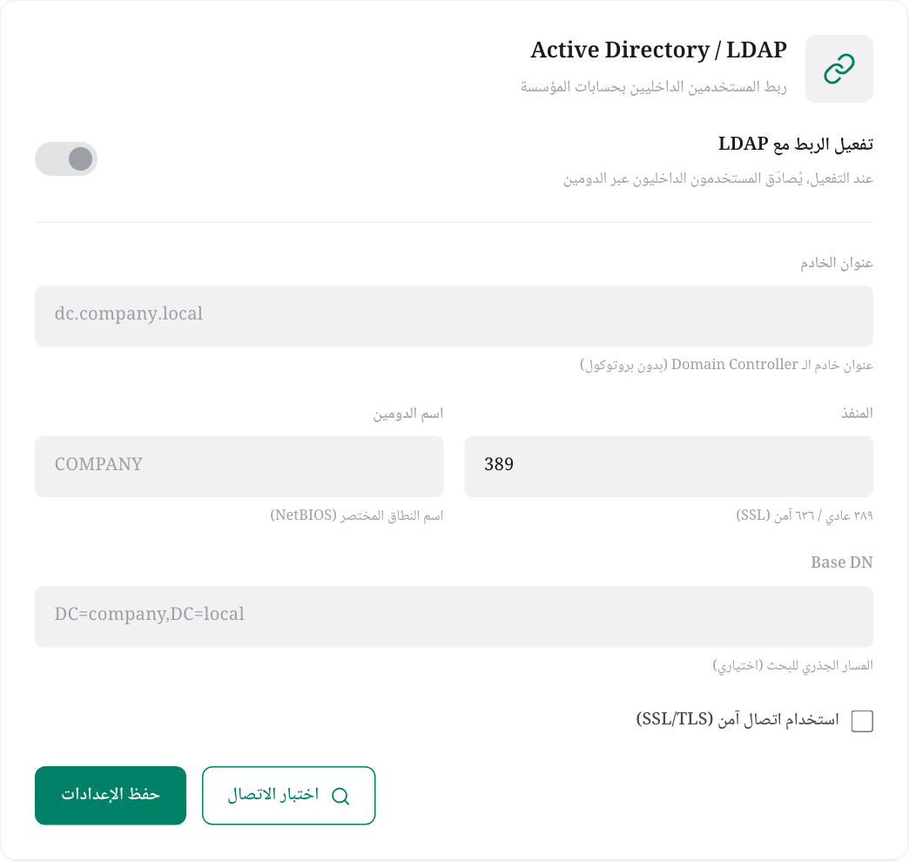

1. اكتب **عنوان الخادم** بلا بروتوكول، ثم **المنفذ** (389 أو 636)، ثم **اسم الدومين** المختصر.
2. اضغط **اختبار الاتصال** قبل أي شيء.
3. إن ظهرت نتيجة خضراء، فعِّل **تفعيل الربط مع LDAP**.
4. اضغط **حفظ الإعدادات**.

النتيجة: يظهر «تم حفظ إعدادات LDAP بنجاح»، ويصبح المستخدمون الداخليون يصادَقون بكلمة مرور الدومين. المستخدمون الخارجيون يبقون على كلمة المرور المحلية دائماً.

**٢) ضبط بوّابة الرسائل النصية واختبارها**

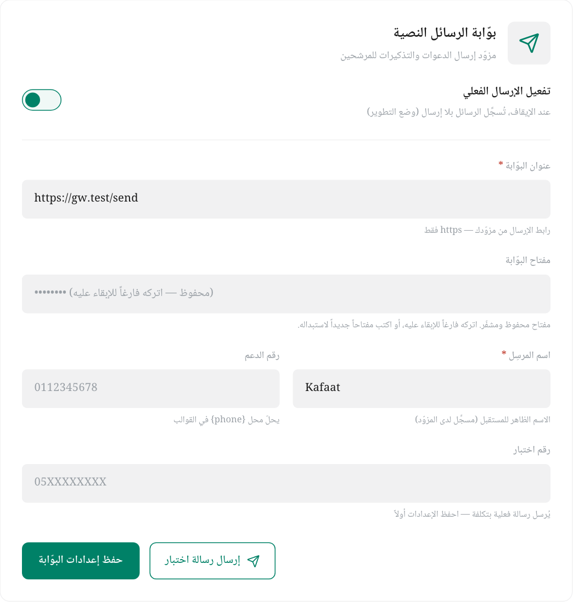

1. اكتب **عنوان البوّابة** مبتدئاً بـ `https://`.
2. الصق **مفتاح البوّابة**. إن كان محفوظاً من قبل واكتفيت به فاترك الحقل فارغاً.
3. اكتب **اسم المرسِل** كما هو مسجَّل لدى المزوّد، و**رقم الدعم** إن كانت قوالبك تستعمل `{phone}`.
4. فعِّل **تفعيل الإرسال الفعلي**، ثم اضغط **حفظ إعدادات البوّابة**.
5. اكتب رقماً في **رقم اختبار** بصيغة `05XXXXXXXX` ثم اضغط **إرسال رسالة اختبار**.

النتيجة: شريط أخضر «تم إرسال رسالة الاختبار — تحقّق من الجوال». الرسالة تُرسَل فعلياً وبتكلفة، وتُدوَّن المحاولة في سجل التدقيق.

**٣) ضبط بوّابة التحقق من الهوية**

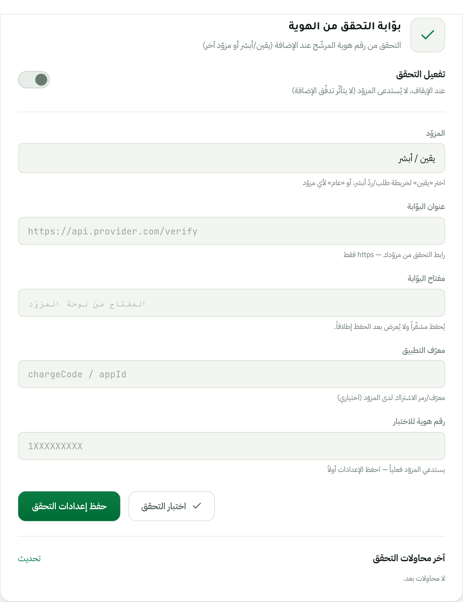

1. اختر **المزوّد**: «يقين / أبشر» لخريطة طلب وردّ أبشر، أو «عام (شكل قياسي)» لغيره.
2. اكتب **عنوان البوّابة** مبتدئاً بـ `https://`، والصق **مفتاح البوّابة**، و**معرّف التطبيق** إن طلبه المزوّد.
3. فعِّل **تفعيل التحقق** ثم اضغط **حفظ إعدادات التحقق**.
4. اكتب رقم هوية من عشرة أرقام يبدأ بـ 1 أو 2 في **رقم هوية للاختبار**، ثم اضغط **اختبار التحقق**.

النتيجة: تظهر «تطابقت الهوية» أو «لم تتطابق الهوية»، وتُضاف المحاولة إلى قائمة **آخر محاولات التحقق** أسفل البطاقة.

**٤) ضبط خادم البريد**

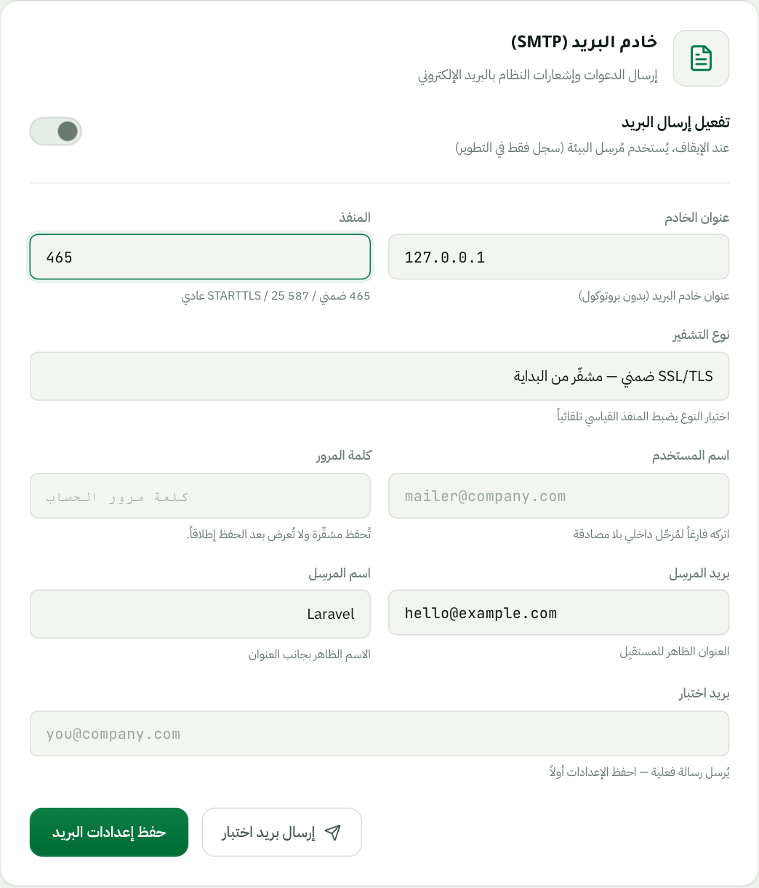

1. اكتب **عنوان الخادم**.
2. اختر **نوع التشفير**. ما دام المنفذ على قيمة قياسية (465 أو 587 أو 25) فاختيار النوع يبدّله تلقائياً إلى المنفذ المقابل؛ ومنفذٌ غير قياسي كتبته بنفسك لا يُمَسّ.
3. اكتب **اسم المستخدم** و**كلمة المرور** إن كان الخادم يطلب مصادقة، أو اترك الحقلين فارغين لمُرحِّل داخلي.
4. اكتب **بريد المرسِل** و**اسم المرسِل**.
5. فعِّل **تفعيل إرسال البريد** ثم اضغط **حفظ إعدادات البريد**.
6. اكتب عنواناً في **بريد اختبار** واضغط **إرسال بريد اختبار**.

النتيجة: «تم إرسال رسالة الاختبار — تحقّق من البريد». وإن فشل الإرسال ظهر سببه الحقيقي مقتطعاً من سجل البريد بدل رسالة عامة.

**٥) إضافة قطاع**


1. مرّر إلى بطاقة **القطاعات**، وانزل إلى الصفّ الفارغ الدائم أسفل الجدول.
2. اكتب الاسم في «اسم القطاع…» والرمز في «XX». عمود **نموذج** يعرض شكل الرمز الناتج فوراً.
3. اضغط **إضافة** (أو اضغط Enter من أي من الحقلين).

النتيجة: «تمت إضافة «{الاسم}»»، ويُعاد تحميل الجدول فيظهر القطاع الجديد بعدّاده «مرتبط بـ: —».

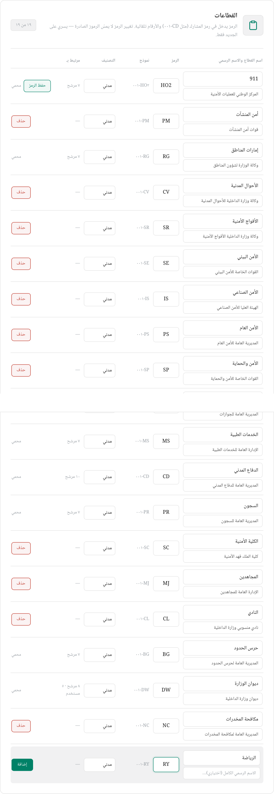

**٦) تعديل اسم قطاع أو رمزه**

1. عدّل الاسم في خانته داخل الصفّ — يظهر زرّ **حفظ الاسم**. اضغطه.
2. عدّل الرمز في خانته — يظهر زرّ **حفظ الرمز**، ويتحدّث عمود **نموذج** فوراً. اضغطه.

النتيجة: «تم تحديث اسم القطاع» أو «تم تحديث رمز «{الاسم}»». الرمز الجديد يسري على المشاركين الجدد وحدهم — الرموز الصادرة لا تتغيّر.

**٧) حذف قطاع**

1. تأكّد أن عمود **مرتبط بـ** في صفّه يعرض «—»؛ عندئذ وحده يظهر زرّ **حذف**.
2. اضغط **حذف**، ثم أكِّد في نافذة المتصفّح «حذف قطاع «{الاسم}»؟».

النتيجة: «تم حذف القطاع» ويختفي الصفّ.

**٨) ضبط حدّ التوزيع اليومي**

1. غيّر الرقم في **الحدّ لكل مقيّم / يوم** — يظهر زرّ **حفظ**.
2. اضغط **حفظ**.

النتيجة: «تم حفظ حدّ التوزيع اليومي». يُستعمل الرقم في اقتراح توزيع الأسبوع القادم.

**٩) ضبط أوقات الجلسات**

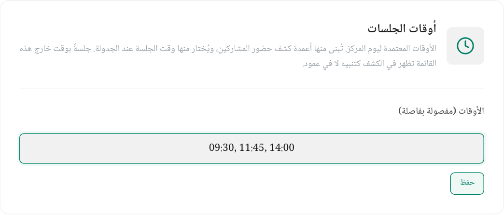

1. اكتب الأوقات مفصولة بفاصلة، بصيغة `HH:MM` بنظام 24 ساعة — الفاصلة اللاتينية `,` والعربية `،` كلتاهما مقبولة.
2. اضغط **حفظ** الظاهر بجانب الحقل.

النتيجة: «تم حفظ أوقات الجلسات». القائمة تُرتَّب وتُنقّى من التكرار عند الحفظ، ومنها تُبنى أعمدة كشف حضور المشاركين وخيارات وقت الجلسة عند الجدولة. الجلسات المسجَّلة سابقاً لا تتأثّر؛ ما وقعَ وقتُه خارج القائمة يظهر في الكشف كتنبيه لا في عمود.

**١٠) ضبط قواعد تصنيف القيادة**

1. اكتب الرتب العسكرية التي تُعدّ «قيادة عليا» مفصولة بفاصلة.
2. اضبط **عتبة الرتبة المدنية للقيادة العليا** برقم بين 1 و 20.
3. اضغط **حفظ قواعد التصنيف**.

النتيجة: «تم حفظ قواعد التصنيف». تُطبَّق القواعد عند إضافة المرشحين، لا على المُضافين قبلها.

#### ما يمنعه النظام ولماذا

- **الشاشة كلّها لمدير النظام وحده، ولا تُفوَّض.** `settings.manage` واحدة من ثلاث في `Permissions::NON_DELEGABLE`، فلا تُمنح استثناءً لمستخدم بعينه ولا تُضاف إلى دور من شاشة الأدوار. من يطلب أي مسار من مسارات الإعدادات بلا الصلاحية يُردّ بـ«ليس لديك صلاحية إدارة الإعدادات» — منعٌ خادمي لا واجهي.
- **المفاتيح وكلمات المرور لا تعود إلى الواجهة أبداً.** الخادم يُخزّنها مشفَّرة، ولا يعيد منها إلا إشارةً بأنها مضبوطة. لذلك يُحمَّل حقل المفتاح فارغاً دائماً، وتركه فارغاً يعني «أبقِ المحفوظ» لا «امسحه».
- **عنوان بوّابة الرسائل وبوّابة التحقق يجب أن يبدأ بـ `https://`.** لئلا يُرسَل المفتاح على اتصال غير مشفّر، ولقطع مخططات الطلبات الداخلية المموّهة.
- **منفذ اختبار LDAP محصور بمنافذ LDAP القياسية (389/636/3268/3269).** بلا هذا الحصر يتحوّل زرّ الاختبار إلى ماسح منافذ للشبكة الداخلية.
- **أزرار الاختبار الأربعة محدودة بخمس محاولات في الدقيقة.** كلٌّ منها يفتح اتصالاً خارجياً أو يرسل رسالة بتكلفة.
- **كل حفظ وكل اختبار يُدوَّن في سجل التدقيق** — ويُدوَّن معه ما إذا استُبدل المفتاح أو كلمة المرور، لا قيمتهما. ورقم الهوية المُختبَر لا يُسجَّل إطلاقاً.
- **حفظ بطاقات LDAP والرسائل والبريد والتحقق يجري في معاملة واحدة** مع سجل التدقيق، فلا يترك عطلٌ في المنتصف بوّابةً نصف مُعدّة (عنوان جديد ومنفذ قديم).
- **لا يُحذف قطاع مرتبط بمرشحين أو مستخدمين.** حذفه يُيتّم سجلاتهم ويكسر المرجعية. الواجهة تُخفي الزرّ وتضع «محمي» مكانه، والخادم يرفض الطلب أيضاً لو أُرسِل مباشرة.
- **رمز القطاع فريد.** تكراره يخلط رموز قطاعين في تسلسل ترقيم واحد.
- **تغيير الرمز لا يمسّ الرموز الصادرة.** رمز المشارك مُثبَّت على دورته لا مشتقّ عند العرض، فالتغيير يسري على الجديد وحده.
- **رمز القطاع الداخلي لا يُعدَّل بعد الإنشاء.** هو هويّة القطاع الثابتة؛ ولذلك تُحرَّر من الشاشة البادئةُ والاسم فقط. والقطاع الجديد يُنشأ مدنياً — لا مفتاح للتصنيف العسكري في هذه الشاشة.
- **أوقات الجلسات ستة على الأكثر وواحد على الأقل**، لأنها أعمدة كشف حضور مطبوع لا قائمة مفتوحة.

#### رسائل الخطأ

| الرسالة | معناها | ما تفعله |
|---|---|---|
| «ليس لديك صلاحية إدارة الإعدادات» | فُتحت الشاشة بحساب لا يملك `settings.manage` | اطلب الإجراء من مدير النظام — الصلاحية لا تُفوَّض |
| «تعذّر تحميل الإعدادات» | الخادم لم يستجب | تأكّد أن الخادم يعمل ثم أعِد تحميل الصفحة |
| «عنوان الخادم مطلوب عند التفعيل» / «اسم الدومين مطلوب عند التفعيل» | فُعِّل LDAP وأحد الحقلين فارغ | أكمِل الحقل أو أوقف التفعيل |
| «أدخل عنوان الخادم أولاً» | ضُغط **اختبار الاتصال** وحقل العنوان فارغ | اكتب العنوان ثم أعِد الاختبار |
| «عنوان البوّابة مطلوب عند التفعيل» | فُعِّلت بوّابة الرسائل أو التحقق بلا عنوان | اكتب العنوان أو أوقف التفعيل |
| «عنوان البوّابة يجب أن يبدأ بـ https://» | العنوان بروتوكوله غير مشفَّر | صحّح العنوان — لا يُقبل `http://` |
| «مفتاح البوّابة مطلوب عند التفعيل» | تفعيلٌ بلا مفتاح محفوظ ولا مفتاح جديد | الصق المفتاح ثم احفظ |
| «اسم المرسِل مطلوب عند التفعيل» | حقل اسم المرسِل فارغ وبوّابة الرسائل مفعّلة | اكتب الاسم المسجَّل لدى المزوّد |
| «عنوان المرسِل مطلوب عند التفعيل» | بريد المرسِل فارغ وخادم البريد مفعّل | اكتب البريد الذي ستظهر منه الرسائل |
| «كلمة المرور مطلوبة مع اسم المستخدم» | كُتب اسم مستخدم بلا كلمة مرور محفوظة ولا جديدة | اكتب كلمة المرور، أو امسح اسم المستخدم إن كان المُرحِّل بلا مصادقة |
| «أدخل رقم جوال بصيغة 05XXXXXXXX» | رقم الاختبار غير مطابق للصيغة | صحّح الرقم |
| «أدخل بريداً صحيحاً» | بريد الاختبار غير صالح | صحّح العنوان |
| «أدخل رقم هوية من 10 أرقام يبدأ بـ 1 أو 2» | رقم اختبار التحقق غير مطابق | صحّح الرقم |
| «البوّابة غير مفعّلة أو غير مكتملة — احفظ الإعدادات أولاً» | ضُغط زرّ الاختبار قبل حفظ إعدادات مكتملة | احفظ البطاقة أولاً ثم أعِد الاختبار |
| «خادم البريد غير مفعّل أو غير مكتمل — احفظ الإعدادات أولاً» | المثل في بطاقة البريد | احفظ أولاً |
| «فشل الإرسال — راجع سجل الرسائل للتفاصيل» | البوّابة ردّت بفشل | راجع بيانات المزوّد والمفتاح |
| «تعذّر الوصول لخادم AD — تأكد من العنوان والمنفذ (رمز {رقم})» | اختبار LDAP لم يصل إلى الخادم | تأكّد من العنوان والمنفذ ومن فتح الجدار الناري |
| «إضافة LDAP غير مثبّتة في PHP (php-ldap)» | البيئة تنقصها إضافة LDAP | يُثبّتها مسؤول الخادم |
| «الخادم واصل (رفض الربط المجهول طبيعي في AD). جرّب دخول مستخدم داخلي للتأكد الكامل.» | الخادم يستجيب ولم يقبل الربط المجهول — وهذا سلوك AD الطبيعي | احفظ ثم جرّب دخول مستخدم داخلي |
| «فشل الاختبار» | ردّ الخادم لا يحمل رسالة يفهمها الحقل — من ذلك منفذ LDAP غير قياسي، أو تجاوز حدّ خمس محاولات في الدقيقة | تحقّق أن المنفذ 389 أو 636 أو 3268 أو 3269، وانتظر دقيقة قبل إعادة المحاولة |
| «الرمز حرفان إلى أربعة، لاتيني كبير أو أرقام» | رمز القطاع لا يطابق الشكل المطلوب | اكتب رمزاً مثل `ED` أو `HR2` |
| «الرمز مستعمل في قطاع «{الاسم}»» | البادئة مأخوذة لقطاع آخر | اختر رمزاً غيره |
| «البادئة مستعملة — اختر غيرها» | المثل عند إضافة قطاع جديد | اختر رمزاً غيره |
| «الرمز مستعمل لقطاع آخر» | الرمز يطابق رمزاً داخلياً قائماً | اختر رمزاً غيره |
| «اسم القطاع مطلوب» / «اكتب اسم القطاع» | حقل الاسم فارغ عند الحفظ أو الإضافة | اكتب الاسم |
| «لا يمكن حذف قطاع مرتبط بمرشحين أو مستخدمين» | حاولتَ حذف قطاع له مرتبطون | انقل مرتبطيه إلى قطاع آخر أوّلاً |
| «الحدّ رقم بين 1 و 50» | حدّ التوزيع اليومي خارج المدى | اكتب رقماً داخل المدى |
| «أدخل وقتاً واحداً على الأقل» | قائمة الأوقات فارغة | أضِف وقتاً |
| «الحدّ الأقصى ستة أوقات» | كُتب أكثر من ستة أوقات | اختصر القائمة |
| «صيغة الوقت HH:MM بنظام 24 ساعة — مثال 14:30» | أحد الأوقات بصيغة خاطئة | صحّحه |
| «أدخل الرتب العسكرية العليا» | حقل الرتب فارغ | اكتب الرتب مفصولة بفاصلة |
| «العتبة رقم بين 1 و 20» | عتبة الرتبة المدنية خارج المدى | اكتب رقماً داخل المدى |

---

### سجل التدقيق


**من يفتحها:** `audit.view` — **مدير النظام** و**مدير المركز** فقط. وهي إحدى ثلاث سلطات في `Permissions::NON_DELEGABLE`، فلا تُمنح استثناءً لمستخدم بعينه ولا تُضاف إلى دور من شاشة الأدوار. من لا يملكها ويكتب `/audit` يُعاد إلى لوحة التحكم.

شاشة قراءة فقط. تعرض آخر ٢٠٠ عملية مرتّبة من الأحدث إلى الأقدم، وتُضيّق بأربعة مرشّحات. لا يوجد فيها زرّ تعديل ولا حذف: السجل يُكتَب من داخل العمليات نفسها ولا يُمَسّ من هنا.

#### المرشّحات


| المرشّح | معناه |
|---|---|
| **كل الإجراءات** | قائمة الإجراءات الموصوفة بالعربية — خمسون إجراءً. اختيار أحدها يقصر الجدول عليه |
| **كل المستخدمين** | قائمة بكل مستخدمي المنصّة. اختيار أحدهم يقصر الجدول على ما فعله |
| **من تاريخ** | يُظهر ما وقع في هذا اليوم فما بعده |
| **إلى تاريخ** | يُظهر ما وقع في هذا اليوم فما قبله |
| **مسح** | يفرّغ المرشّحات الأربعة ويعيد تحميل الجدول |

كل تغيير في أي مرشّح يعيد التحميل فوراً — لا زرّ «بحث».

#### أعمدة الجدول

| العمود | ما يعرضه |
|---|---|
| **الوقت** | تاريخ العملية وساعتها بالتقويم والأرقام العربية |
| **المستخدم** | اسم من نفّذ العملية، أو «مستخدم محذوف» إن لم يعد حسابه قائماً |
| **الإجراء** | وصف الإجراء بالعربية. الإجراءات الحسّاسة تُكتب بلون التحذير ويسبقها قفل. والإجراء الذي لا وصف عربي له يظهر برمزه الإنجليزي كما هو (مثل `VIEW_CV_ADMIN`)، ولا يظهر في قائمة **كل الإجراءات** فلا يُرشَّح منها |
| **الكيان** | رمز المشارك إن حملته تفاصيل العملية (مثل `DA-001`)، وإلا نوع الكيان ومعرّفه (مثل `settings #0`)، وإلا «—» |
| **IP** | عنوان الجهاز الذي نُفّذت منه العملية، أو «—» |

الصفوف الحسّاسة تُظلَّل بخلفية تحذيرية. وهي: الاطلاع على البيانات الشخصية، وتغيير تصنيف السرّية، وحذف المرشح، وتصدير القائمة، وإعادة تعيين كلمة المرور، وتعطيل مستخدم — ومعها **كل محاولة وصول مرفوضة**.

أسفل الجدول عند اكتمال العدد يظهر: «يُعرض آخر ٢٠٠ عملية. استخدم الفلاتر لتضييق النتائج.»

#### كيف تعمل فيها

**١) تتبّع عملية حسّاسة بعينها**


1. افتح قائمة **كل الإجراءات** واختر الإجراء المطلوب — مثلاً «الاطلاع على البيانات الشخصية».
2. اقرأ عمودي **المستخدم** و**الوقت** لتعرف من اطّلع ومتى.
3. اقرأ عمود **الكيان** لتعرف على أي مشارك، وعمود **IP** لتعرف من أي جهاز.

النتيجة: جدول مقصور على ذلك الإجراء وحده، صفوفه مظلَّلة لأنه حسّاس.

**٢) مراجعة نشاط مستخدم بعينه في مدّة محدّدة**

1. اختر اسمه من قائمة **كل المستخدمين**.
2. اضبط **من تاريخ** ثم **إلى تاريخ**.
3. اقرأ الجدول — ويعاد تحميله بعد كل اختيار.

النتيجة: كل ما فعله ذلك المستخدم داخل المدّة، من الأحدث إلى الأقدم.

**٣) العودة إلى العرض الكامل**

1. اضغط **مسح**.

النتيجة: تُفرَّغ المرشّحات الأربعة ويعود الجدول إلى آخر ٢٠٠ عملية.

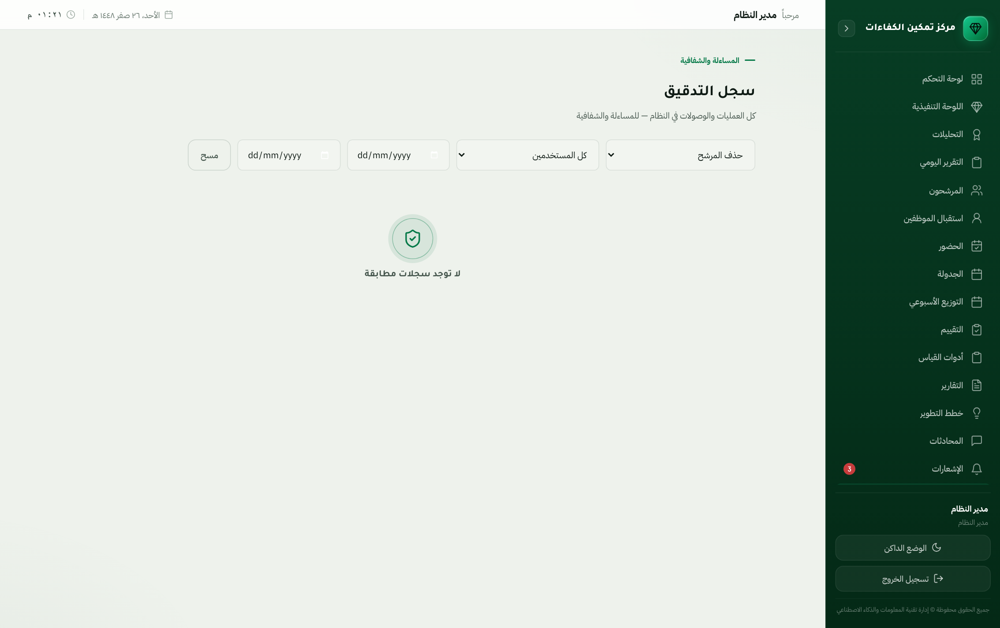

إن لم تطابق المرشّحات شيئاً ظهرت «لا توجد سجلات مطابقة» مكان الجدول.


#### ما يمنعه النظام ولماذا

- **الشاشة لدورين فقط ولا تُفوَّض.** السجل يكشف من فعل ماذا ومتى، ومن رأى بيانات المشاركين ومن حاول ورُفض — فقراءته سلطة إشراف تُسنَد بالدور لا بالاستثناء. ولهذا وُضعت `audit.view` في `NON_DELEGABLE`.
- **السجل للقراءة فقط.** لا مسار في المنصّة يعدّل صفّاً في السجل أو يحذفه؛ المسار الوحيد المتاح هو القراءة.
- **العرض محدود بآخر ٢٠٠ عملية** مهما كان حجم السجل — حدٌّ في الخادم لا في الواجهة. التضييق يكون بالمرشّحات.
- **المرشّحات مُتحقَّق منها على الخادم:** المستخدم المطلوب يجب أن يكون مستخدماً قائماً، والتاريخان تاريخين صحيحين، و«إلى تاريخ» لا يسبق «من تاريخ». ومخالفة ذلك تُردّ ولا تُنفَّذ.
- **تفاصيل المرشحين المصنَّفين محجوبة عمّن لا يملك رؤية المصنَّفين.** يبقى الفعل والفاعل والوقت والعنوان، وتُفرَّغ خانتا الكيان والتفاصيل. والحجب يشمل كل الكيانات المرتبطة بمرشّح — التقييم والتقرير والجدولة والحضور والقياس وخطة التطوير والتوزيع — لا صفوف المرشح وحدها، لأن رمز المشارك يظهر في تفاصيل تلك الصفوف بمفاتيح غير موحّدة، فحجب صفوف المرشّح وحدها كان يُسرّب الرمز عبر أشقّائها. عملياً لا يظهر هذا الحجب في التسليم الافتراضي: من يملك `audit.view` اليوم يملك `candidate.view_classified` أيضاً.
- **الإجراءات الجماعية لا تُحجب** — العملية التي لا تخصّ مرشّحاً بعينه (كتحديث إعداد أو تصدير قائمة) تبقى ظاهرة كاملةً.

#### رسائل الخطأ

| الرسالة | معناها | ما تفعله |
|---|---|---|
| «ليس لديك صلاحية عرض سجل التدقيق» | فُتحت الشاشة بحساب لا يملك `audit.view` | اطلب المراجعة من مدير النظام أو مدير المركز — الصلاحية لا تُفوَّض |
| «تعذّر تحميل السجل — تأكد أن الخادم يعمل» | لم يستجب الخادم، أو رُدَّت المرشّحات لعدم صحّتها — ومن أشيع أسبابها أن **إلى تاريخ** يسبق **من تاريخ** | تحقّق من ترتيب التاريخين، واضغط **مسح** لتفريغ المرشّحات، وتأكّد أن الخادم يعمل |
| «لا توجد سجلات مطابقة» | المرشّحات صحيحة ولا عملية تطابقها | وسّع المدّة أو اضغط **مسح** |
| «مستخدم محذوف» في عمود المستخدم | العملية مُدوَّنة لكن حساب منفّذها لم يعد قائماً | السجل يبقى — الحساب هو الذي حُذف |

---

## ٨. المستندات المطبوعة

خمسة مستندات تُفتح في **تبويب جديد** جاهزةً للطباعة أو الحفظ PDF بزرّ
**طباعة / حفظ PDF** أعلاها. وهي ليست شاشات: لا روابط لها في القائمة، ويُوصَل
إلى كلٍّ منها من شاشته.

| المستند | من أين | الصلاحية | الاسم فيه |
|---|---|---|---|
| **كشف حضور المشاركين** | قاعدة المرشحين ← **كشف الحضور** | `schedule.view` | يظهر؛ ورقم الهوية بصلاحية الأسماء وحدها |
| **بطاقات المشاركين** | قاعدة المرشحين ← **طباعة بطاقات المشاركين**، أو أيقونة البطاقة في الصفّ | `candidate.view` | بحسب `candidate.view_names` |
| **السيرة الذاتية مطبوعةً** | بطاقة المرشّح ← **طباعة النموذج** | `candidate.cv_view` | **محجوب** بلا `candidate.view_names` |
| **التقرير النهائي — مستند مفصّل / مستند مختصر** | التقارير ← أزرار التقرير | `report.view` | **بالرمز** إلّا لحامل `report.view_names` |
| **التقرير اليومي** | التقرير اليومي | `analytics.daily_report` | — |

### كشف حضور المشاركين

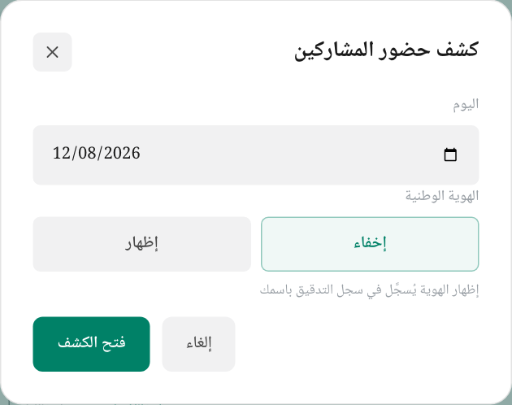

اختر **اليوم**، ثم قرّر **إظهار** أو **إخفاء** الهوية الوطنية، ثم **فتح الكشف**.

- **إظهار الهوية متاحٌ لحامل صلاحية الأسماء وحده**، و**يُسجَّل في سجل التدقيق
  باسمك** — الشاشة تقول ذلك صراحةً قبل أن تختار.
- لغير حاملها يُعطَّل الخيار وتظهر العبارة: «صلاحيتك لا تسمح بطباعة أرقام
  الهوية — يُطبع الكشف بالرموز».

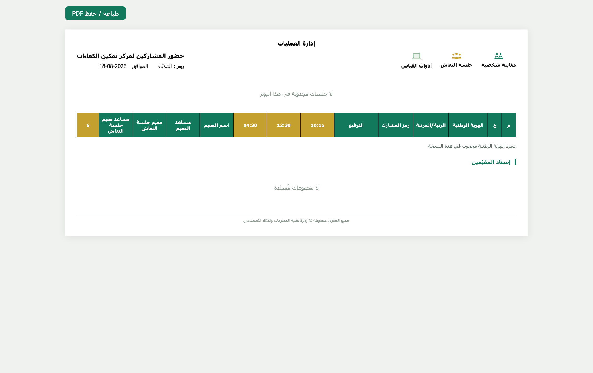

الكشف ورقة عمل يوم المركز: أعمدة التوقيت مبنيّة على **أوقات الجلسات** المضبوطة
في الإعدادات، وعمود توقيع لكل مشارك، وجدول **إسناد المقيّمين** أسفله.

> ⚠ جلسةٌ بوقتٍ **خارج الأوقات المعتمدة** لا تظهر في عمود توقيت، ويُنبّه الكشف
> إليها بعبارة «‏… جلسة خارج الأوقات المعتمدة». وإن ظهرت هذه العبارة فإمّا أن
> تُصحَّح أوقات الجلسات، وإمّا أن تُضاف أوقاتها إلى الإعدادات.

### بطاقة المشارك

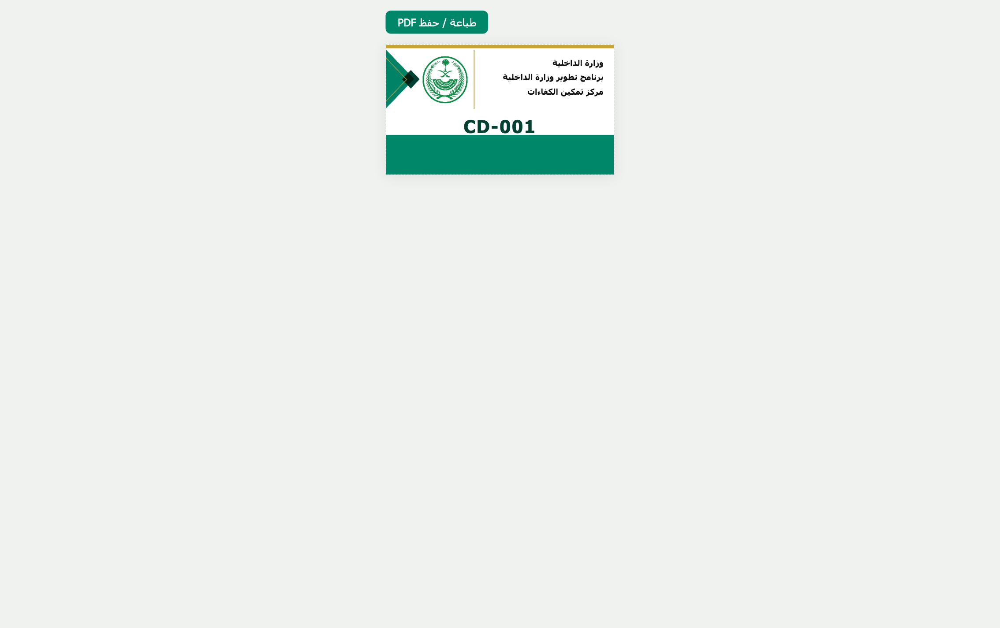

بطاقة تُطبَع وتُلبَس في يوم المركز: شعار الجهة، و**رمز المشارك وحده**. لا اسم
فيها ولو طبعها من يملك رؤية الأسماء — لأنها تُرى في القاعة، ومن يقيّم لا ينبغي
أن يقرأ اسم من يقابله.

تُطبع لمشارك واحد من أيقونة البطاقة في صفّه، أو لمجموعة بتحديد صفوفها ثم
**طباعة بطاقات المشاركين**.

### نموذج السيرة الذاتية

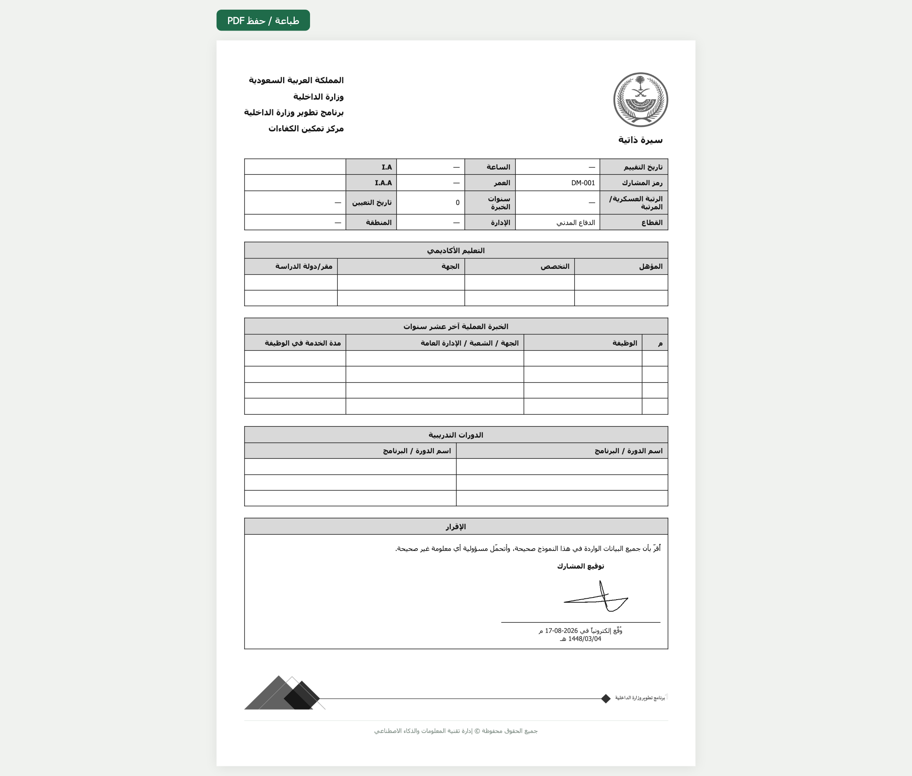

نسخة ورقية من السيرة كما أدخلها المشارك: بياناته، ومؤهّلاته، وخبراته، ودوراته.
تُفتح من بطاقة المشارك ← **طباعة النموذج**، وتلزمها `candidate.cv_view`.

🔒 **الاسم محجوب فيها عمّن لا يملك `candidate.view_names`** — والمعرّفات تُطمَس
من النصّ الحرّ آلياً، فلا تنكشف الهوية ولو كتبها المشارك داخل نبذته.

### التقرير النهائي


المستند نفسه، بالحساب نفسه من دورٍ آخر، يحمل **الرمز** بدل الاسم:


سبعة أقسام: البيانات الشخصية والوظيفية، ونتائج التقييم النهائية، والكفاءات
السلوكية، والكفاءات الفنية، وتقييم اللغة الإنجليزية، والمرئيات والتوصيات،
وخطة التطوير الفردية — وأسفلها أربعة حقول توقيع تطابق سلسلة الاعتماد.

> ⚠ **حجب الاسم يشمل الحقول المرتّبة وحدها، لا النصّ الحرّ.** ترويسة المستند
> تُبدَّل بالرمز لمن لا يملك `report.view_names`، أمّا ما يكتبه محرّر التقرير
> بيده في **المرئيات والتوصيات** و**مواطن القوة** و**مجالات التطوير**
> و**الملخّص التنفيذي** فيُطبع كما كُتب.
>
> **فلا تكتب اسم المرشّح ولا رقم هويته ولا جواله في نصّ التقرير الحرّ** — اكتب
> رمزه. من كتب الاسم هناك جعله مقروءاً لكل من يفتح المستند، ولو كان النظام
> يحجبه عنه في الترويسة.

### المستند المختصر

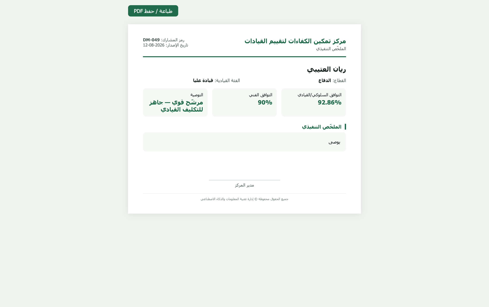

صفحة واحدة للقيادة: النتيجة النهائية والتوصية و**الملخّص التنفيذي** الذي يكتبه
مدير المركز. وما لم يُكتب بعدُ ظهر مكانه: «لم يُكتب الملخّص التنفيذي بعد
(بصلاحية مدير المركز).» ويخضع لقاعدة الاسم نفسها.

### التقرير اليومي

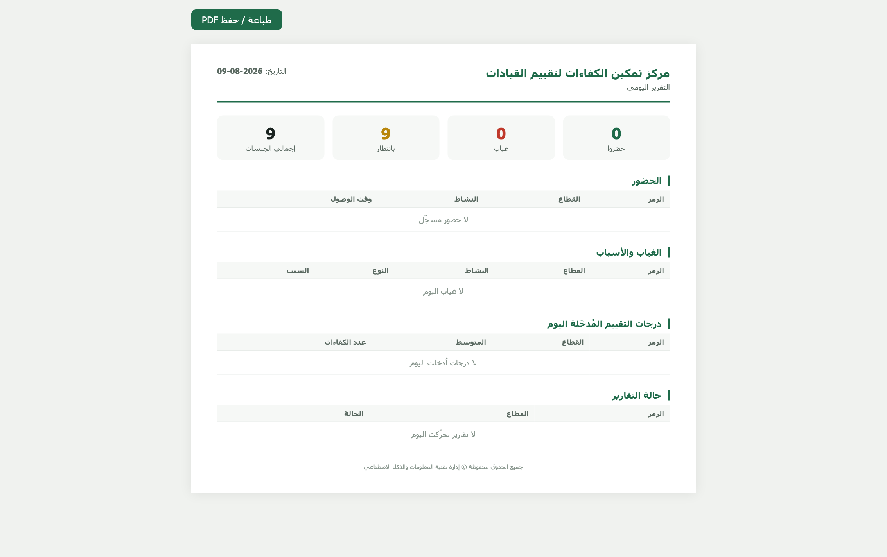

خلاصة يوم المركز — الجلسات والحضور والتقييمات والتقارير — وهي البيانات نفسها
التي تُرسَل بالبريد ليلاً. يُفتح بزرّ **طباعة** أعلى شاشة التقرير اليومي.


---

## ٩. التهيئة الأولى لمنصّة جديدة

هذا الفصل لمدير النظام وحده، ويُقرأ مرّة واحدة عند تجهيز منصّة جديدة (أو بعد
تفريغها). **الترتيب مقصود**: كل خطوة تعتمد على ما قبلها، ومخالفتُه تُوقفك عند
منتصف الطريق.

| # | الخطوة | أين | لماذا هنا بالذات |
|---|---|---|---|
| ١ | **القطاعات** ورموزها | الإعدادات ← القطاعات | رمز المرشّح يُشتقّ من بادئة قطاعه (`ED-001`)، ولا يُضاف مرشّح بلا قطاع |
| ٢ | **قواعد تصنيف القيادة** | الإعدادات ← تصنيف القيادة | تُطبَّق **لحظة إضافة المرشّح**؛ ضبطُها بعده لا يُعيد تصنيف من أُضيف |
| ٣ | **أوقات الجلسات** | الإعدادات ← أوقات الجلسات | تُبنى منها أعمدة كشف الحضور، ويُختار منها وقت الجلسة عند الجدولة |
| ٤ | **حدّ التوزيع اليومي** | الإعدادات ← التوزيع الأسبوعي | عليه يقوم اقتراح توزيع الأسبوع |
| ٥ | **الكفاءات** | إطار الكفاءات | بلا كفاءات معرَّفة لا تُرصَد درجة |
| ٦ | **ربط الكفاءات بالأنشطة** | ربط الكفاءات | كفاءةٌ غير مربوطة بنشاط **لا تُرصَد أبداً** |
| ٧ | **مراحل الاعتماد** | سير العمل | سلسلة اعتماد التقرير — مضبوطة مسبقاً، وتُعدَّل عند الحاجة |
| ٨ | **الأدوار** ثم **المستخدمون** | الأدوار والصلاحيات ← المستخدمون | لكل موظّف حساب بدوره، ولمقيّمي القطاعات قطاعُهم |
| ٩ | **قنوات الاتصال** | الإعدادات | البريد والرسائل والتحقق من الهوية ودليل المؤسسة — تُؤجَّل بلا ضرر |
| ١٠ | **المرشحون** | قاعدة المرشحين | بعد اكتمال ما سبق |

> ⚠ **بادئة القطاع** (`ED`، `HR2`…) تدخل في رمز كل مرشّح، **والرموز المُصدَرة لا
> تتغيّر بعدها**. اضبطها قبل إدخال أوّل مرشّح، لا بعده.

### تفصيل الخطوات الحسّاسة

**القطاعات.** لكل قطاع اسمٌ ورمزٌ ونموذج. القطاع المرتبط بمرشحين أو مستخدمين
**يُعرَض كـ«محمي» ولا يُحذف** — والخادم يمنع حذفه أيضاً لا الشاشة وحدها.

**تصنيف القيادة.** قاعدتان: قائمة **الرتب العسكرية «العليا»** مفصولةً بفاصلة
(عميد، لواء، فريق، مشير)، و**عتبة الرتبة المدنية** التي تُعدّ منها فأعلى قيادةً
عليا (م-؟). ما دونهما يُصنَّف قيادةً وسطى.

**أوقات الجلسات.** قائمة أوقاتٍ مفصولة بفاصلة (`10:15, 12:30, 14:30`). جلسةٌ
بوقتٍ خارج هذه القائمة **تظهر في الكشف كتنبيه لا في عمود** — فأبقِ القائمة
مطابقةً ليوم المركز الفعلي.

**قنوات الاتصال** — أربعٌ مستقلّة، ولكلٍّ زرّ **اختبار** قبل الاعتماد عليها:

| القناة | ما تفعله | ملاحظة تشغيلية |
|---|---|---|
| **Active Directory / LDAP** | دخول الموظّفين الداخليين بحساب المؤسسة | المستخدم **الخارجي** يبقى على كلمة المرور المحلية دائماً. وبلا تفعيل: الجميع محلّي |
| **بوّابة الرسائل النصية** | دعوات وتنبيهات المرشحين | المفتاح يُحفَظ **مشفَّراً ولا يُعاد للواجهة**؛ تركه فارغاً يُبقي المحفوظ |
| **بوّابة التحقق من الهوية** | التحقّق من رقم الهوية عند الإدخال | العنوان يجب أن يبدأ بـ`https://` — لا يُرسَل المفتاح على اتصال غير مشفّر |
| **خادم البريد (SMTP)** | الدعوات والتقرير اليومي والتصعيد | `STARTTLS/587` هو الأشيع؛ و`SSL/465` إن طلبه المزوّد |

> **ما دامت القناة غير مفعّلة، تُسجَّل الرسائل في السجل بلا إرسال فعلي** — فلا
> تُفقَد، ولا تصل. أمّا **رسائل الاختبار فتُرسَل فعلاً** (وللجوال بتكلفة)،
> وتُدوَّن في سجل التدقيق.

### أوّل حساب، وفكّ القفل

لا تُنشأ حسابات مديري النظام من الشاشة — «لا يمكنك إسناد دور مدير النظام» —
بل من سطر الأوامر على الخادم:

```bash
php artisan kafaat:create-admin <اسم المستخدم>          # حساب جديد
php artisan kafaat:create-admin <اسم المستخدم> --reset  # إعادة ضبط وفكّ قفل
```

تُطبع كلمة المرور **مرّة واحدة**، ويُلزَم صاحبها بتغييرها عند أوّل دخول.

### قائمة تحقّق قبل التشغيل الفعلي

- [ ] القطاعات ورموزها نهائية — ولن تتغيّر بعد أوّل مرشّح.
- [ ] قواعد تصنيف القيادة مضبوطة على رتب الجهة الحقيقية.
- [ ] أوقات الجلسات تطابق يوم المركز.
- [ ] الكفاءات معرَّفة، **وكلٌّ منها مربوط بنشاط** في شاشة ربط الكفاءات.
- [ ] مراحل الاعتماد فعّالة — ومرحلة واحدة على الأقلّ مفعّلة.
- [ ] لكل مرحلة اعتماد **مستخدم فعلي** يحملها؛ وإلّا وقفت التقارير عندها.
- [ ] يوجد مستخدم بدور **مسؤول العمليات** — وإلّا وقف المرشّح المردود بلا من يعيد إسناده.
- [ ] لمقيّمي القطاعات قطاعُهم مضبوط في حساباتهم.
- [ ] قنوات البريد والرسائل مُختبَرة بزرّ الاختبار لا مفترَضة.
- [ ] نسخة احتياطية أولى للقاعدة، ومفتاح التشفير (`APP_KEY`) محفوظ خارج الخادم.

> ⚠ **فقدان `APP_KEY` يعني فقدان كل بيانات المرشحين المشفّرة بلا استرجاع.**
> احفظه قبل أن تُدخِل أوّل مرشّح، لا بعده.


---

## ١٠. ما ليس له شاشة في هذا الإصدار

ثلاث قدرات موجودة في المنصّة **وتعمل فعلاً**، لكن لا زرّ لها في الواجهة. تُذكر
هنا صراحةً كي لا يبحث عنها أحدٌ فلا يجدها فيظنّ عطلاً:

### ١) اعتماد التقييم وإرجاعه

الصلاحية `evaluation.approve` — يحملها مدير النظام، ومدير المركز، ومدير إدارة
التقييم. وأثرها حقيقي: من يحملها **يقرأ تقييمات غيره**، ويصله إشعار «تقييم
بانتظار الاعتماد» عند كل إرسال.

**لكن لا زرّ اعتماد ولا إرجاع في شاشة التقييم.** المسارات قائمة على الخادم
(`POST /evaluations/{id}/approve` و`/return`)، وتُستدعى من الواجهة البرمجية
لا من الشاشة. وما يصفه هذا الدليل من أثر الإرجاع — عودة التقييم إلى **مسودة**،
وإشعار «تقييم مُرجع للتعديل» بسببه، وظهوره في **استكمال مسودة** — يقع فعلاً
حين يُستدعى المسار.

> **ما يعنيه هذا عملياً:** سلسلة اعتماد **التقرير** الرباعية تعمل من الشاشة
> كاملةً، وهي المسار المعتمَد. أمّا مراجعة **التقييم** نفسه فتُدار اليوم خارج
> الشاشة. من احتاجها فليراجع الإدارة التقنية.

### ٢) إرسال الدعوات وسجل المراسلات

`communication.invite` يحملها أربعة أدوار (مدير النظام، ومدير المركز، ومسؤول
الجدولة، ومسؤول استقبال الموظفين)، وتظهر باسمها في شاشة الأدوار والصلاحيات —
**ولا شاشة لها**.

والسبب أن الدعوة لا تحتاج زرّاً: **رسالة التأكيد تُجدوَل آلياً لحظة إضافة
المرشّح**، لكل دورة تقييم جديدة، إن كان له جوال مسجَّل. نصّها يحمل رمز المشارك
ورابط بوّابته. راجع مسار «من ترشيح مرشّح جديد إلى جدولته ودعوته».

كذلك **سجل المراسلات** (`GET /communications/history/{id}`) قائم على الخادم بلا
شاشة تعرضه.

> ما دامت **بوّابة الرسائل النصية** غير مفعّلة في الإعدادات، تُسجَّل الرسائل
> ولا تُرسَل. فتفعيلُها شرطُ وصول الدعوات فعلاً.

### ٣) طلبات تحديث بيانات المرشحين

الشاشة كاملة، والمسارات تعمل، والصلاحية `candidate.update_approve` موزّعة —
لكنها **مُطفأة بمفتاح تشغيل** بطلب صاحب المنصّة. الرابط لا يظهر، وكتابة العنوان
`/update-requests` تعيد إلى لوحة التحكم.

إعادتها سطرٌ واحد: `updateRequests` في
`frontend/src/services/features.js` بقيمة `true`.

> ⚠ **ما دامت مُطفأة فلا أحد يبتّ في طلبات التحديث.** والمستخدم الخارجي الذي
> يحاول إضافة مرشّح مسجَّل مسبقاً يستطيع رفع الطلب، فيبقى الطلب معلّقاً بلا من
> يراه. فإمّا أن تُعاد الشاشة، وإمّا أن تُعالَج طلبات التحديث بالتواصل المباشر
> مع مسؤول الجدولة ليعدّل السجلّ من قاعدة المرشحين.


---

## ١١. الرسائل ومعانيها

المنصّة لا تفشل صامتة: كل منعٍ يُقابله سببٌ مكتوب. وهذه الرسائل مصنَّفة بحسب ما
تعنيه لك عملياً — فبعضها يُصلَح بنقرة، وبعضها يحتاج زميلاً آخر، وبعضها يعني أن
ما تحاوله ممنوع أصلاً.

### أ) «ليس لديك صلاحية …»

عائلةٌ واحدة من الرسائل، ومعناها واحد: **الفعل يحتاج صلاحيةً لا يحملها دورك.**
لن يُصلحها تكرار المحاولة ولا إعادة الدخول.

**ما تفعله:** اطلب من مدير النظام إمّا منحك الصلاحية استثناءً على حسابك، أو
إسناد الفعل إلى صاحبه. وهذه أشهرها ومَن يملكها:

| الرسالة | الصلاحية | مَن يملكها |
|---|---|---|
| ليس لديك صلاحية عرض المرشحين | `candidate.view` | كل الأدوار عدا المستخدم الخارجي |
| ليس لديك صلاحية إضافة مرشح | `candidate.create` | مسؤول الجدولة، المستخدم الخارجي |
| ليس لديك صلاحية تسجيل وصول المرشحين | `reception.record` | مسؤول استقبال الموظفين |
| ليس لديك صلاحية أخذ توقيع المرشح | `reception.record` | مسؤول استقبال الموظفين |
| ليس لديك صلاحية توزيع المرشحين | `reception.assign` | الاستقبال، العمليات، الجدولة، مدير المركز |
| ليس لديك صلاحية البتّ في الإسناد | `reception.decide` | مستشار المقابلة، مستشار حلقة النقاش، مشرف أدوات القياس — كلٌّ على ما أُسنِد إليه |
| ليس لديك صلاحية اعتماد بيانات الاستقبال | `reception.approve` | العمليات، الجدولة، مدير المركز |
| ليس لديك صلاحية إدارة الجدولة | `schedule.manage` | مسؤول الجدولة، مدير المركز |
| ليس لديك صلاحية تسجيل الحضور | `attendance.record` | المقيّمون والمساعد لجلساتهم، والاستقبال ومشرف القياس لأي جلسة |
| ليس لديك صلاحية إدخال التقييم | `evaluation.input` | مستشار المقابلة، ومستشار حلقة النقاش — **لا المساعد** (له `evaluation.assist`) |
| ليس لديك صلاحية رفع القياس | `measurement.upload` | مشرف أدوات القياس، مدير المركز |
| ليس لديك صلاحية إنشاء تقرير | `report.create` | المساعد، مدير إدارة التقييم، مدير المركز |
| ليس لديك صلاحية اعتماد هذه المرحلة | صلاحية المرحلة نفسها | صاحب المرحلة وحده |
| ليس لديك صلاحية الإرجاع / إلغاء التقرير | `report.return` / `report.cancel` | مدير المركز وحده |
| ليس لديك صلاحية الاستيراد / تصدير المرشحين | `candidate.create` / `candidate.view` مع التصدير | الجدولة ومدير النظام للاستيراد |
| ليس لديك صلاحية عرض رحلة المرشح | `candidate.journey` | مدير النظام، مدير المركز، مدير إدارة التقييم، إدارة تطوير الكفاءات |
| ليس لديك صلاحية عرض السيرة الذاتية | `candidate.cv_view` | الأربعة أعلاه ومسؤول الاستقبال |
| ليس لديك صلاحية تعيين/تغيير التصنيف الأمني | `candidate.view_classified` | مدير النظام، مدير المركز، مدير إدارة التقييم، إدارة تطوير الكفاءات |
| ليس لديك صلاحية إسناد مجموعات المشاركين | `roster.manage` | مدير النظام، مدير المركز، مسؤول الجدولة |
| ليس لديك صلاحية إرسال الدعوات / عرض سجل المراسلات | `communication.invite` | مدير النظام، مدير المركز، الجدولة، الاستقبال — **بلا شاشة** |
| ليس لديك صلاحية عرض سجل التدقيق | `audit.view` | مدير النظام، مدير المركز |
| ليس لديك صلاحية إدارة المستخدمين / الأدوار / الإعدادات | `user.manage` / `settings.manage` | مدير النظام وحده — **لا تُفوَّض** |

> 🔒 ثلاث سلطات **تُدار بالدور وحده**: إدارة المستخدمين (`user.manage`)، وإدارة
> الإعدادات (`settings.manage`)، وسجل التدقيق (`audit.view`). لا تُمنح ولا
> تُسحب باستثناءٍ فردي على حساب، ولا تُبدَّل من شاشة الأدوار — والرسالة عندها:
> «هذه الصلاحيات تُدار بالدور لا بالاستثناء الفردي». وهي في الأصل مصفوفة
> الأدوار: سجل التدقيق مثلاً يحمله مدير المركز بدوره، لكن لا أحد يستطيع
> إعطاءه لشخصٍ بعينه بنقرة.
>
> والسبب: لو فُوِّضت `user.manage` لغير مدير النظام، لَملك حاملُها توزيع كل
> صلاحية على كل حساب، فتنهار حدود المصفوفة كلّها.

### ب) «لا يمكن …» — الحالة تمنع لا الصلاحية

هنا الصلاحية موجودة، لكنّ **حالة السجلّ** لا تسمح بالفعل الآن. هذه أهمّها:

| الرسالة | لماذا | ما تفعله |
|---|---|---|
| لا يمكن جدولة مرشّح غير معتمد للتقييم | الجدولة تلي اعتماد الترشيح | اعتمِد المرشّح من قاعدة المرشحين أوّلاً |
| لا يمكن تقييم مرشح غير معتمد للتقييم | كذلك | كما سبق |
| لا يمكن اعتماد مرشح غادر حالة المسودة | الاعتماد يقع مرّة واحدة | لا شيء — هو معتمد فعلاً |
| لا يمكن تسجيل الحضور إلا لجلسات اليوم | الحضور واقعةٌ في يومها | لجلسة فائتة: تُعالَج بإعادة الجدولة لا بتسجيل حضورٍ رجعي |
| لا يمكن تعديل جلسة سُجّل حضورها | الحضور أثبت وقوعها | أعِد جدولتها بدل تعديلها |
| لا يمكن حذف جلسة سُجّل حضورها | كذلك | كما سبق |
| لا يمكن إرسال تقييم بدون درجات | التقييم الفارغ لا يُعتمد | ارصد الدرجات ثم أرسِل |
| لا يمكن تعديل تقييم تم إرساله أو اعتماده | الدرجات تُقفل بالإرسال | اطلب إرجاعه من صاحب الصلاحية |
| لا يمكن اعتماد تقييم غير مُرسل | الاعتماد يلي الإرسال | يرسله راصده أوّلاً |
| لا يمكن إنشاء تقرير قبل انتهاء تقييم المرشح | التقرير يُبنى على تقييمٍ مكتمل | أكمِل أنشطة التقييم |
| لا يمكن تعديل تقرير في هذه الحالة | التقرير في سلسلة الاعتماد | يُرجعه مدير المركز إن لزم التعديل |
| لا يمكن إرجاع تقرير غير مُرسل للاعتماد | لا شيء يُرجَع منه | — |
| لا يمكن إرجاع تقييم غير مُرسل | كذلك للتقييم | — |
| التقرير ليس في حالة إرجاع | حاولت إعادة إرسال تقرير لم يُرجَع أصلاً | راجع حالته في القائمة |
| لا يمكن إعادة جدولة مرشّح غير معتمد للتقييم | إعادة الجدولة كالجدولة: تلي الاعتماد | اعتمِد الترشيح أوّلاً |
| لا يمكن إلغاء تقرير معتمد أو ملغى مسبقاً | المعتمد وثيقة مستقرّة | — |
| لا يمكن تعديل السيرة بعد بدء التقييم | السيرة التي قُيّم عليها تبقى كما هي | — |
| لا يمكن حذف مرشح بدأت عملية تقييمه | حذفه يُيتّم جلساتٍ وتقارير | ألغِ مساره بدل حذفه |
| لا يمكن حذف قطاع مرتبط بمرشحين أو مستخدمين | الرموز المُصدَرة تُشتقّ من بادئته | انقل المرتبطين أوّلاً |
| لا يمكن تعطيل مرحلة فيها تقارير | التقارير العالقة عندها تفقد معتمِدها | مرّرها أوّلاً ثم عطّل المرحلة |
| يجب تفعيل مرحلة واحدة على الأقل | سلسلةٌ بلا مراحل لا تعتمد شيئاً | أبقِ مرحلة فعّالة |
| لا يمكن حذف/تبديل كفاءات نشاط له تقييمات نشطة | تبديلها يُغيّر ما يُقاس تحت أقدام المقيّم | الإضافة مسموحة؛ أجّل الحذف |

### ج) «… مسبقاً» — الفعل وقع من قبل

ليست أخطاءً بقدر ما هي حمايةٌ من الازدواج: تسجيل وصولٍ مرّتين، أو تقييمين
للنشاط نفسه، أو تقريرين لدورة واحدة. القيد في **قاعدة البيانات** لا في الشاشة،
فلا يمرّ حتى مع نقرتين متزامنتين.

| الرسالة | المعنى |
|---|---|
| تم تقييم هذا المرشح في هذا النشاط مسبقاً | تقييم واحد لكل مرشّح في كل نشاط |
| التقييم مُرسل مسبقاً | أُرسل ولا يُرسَل ثانية |
| تم تسجيل حالة هذه الجلسة مسبقاً | حضور الجلسة مُسجَّل |
| يوجد تقرير لهذه الدورة بالفعل | تقرير واحد لكل دورة |
| هذا النشاط مُسنَد بالفعل — اسحب الإسناد القائم أولاً | المرشّح لا يكون في مقابلتين معاً |
| رقم الهوية مسجّل مسبقاً لمرشح آخر | يُردّ الإدخال ومعه تاريخ الإضافة السابقة |
| هذا المرشح مُضاف مسبقاً في النظام | ومعه زرّ **طلب تحديث بيانات المرشح** |
| بُتّ في هذا الطلب مسبقاً | طلب التحديث اعتُمد أو رُفض |
| بياناتك مؤكّدة مسبقاً | المرشّح أكّد دعوته من قبل |
| اسم المستخدم مسجّل مسبقاً | اختر اسماً آخر |

### د) رسائل التحقّق من البيانات

| الرسالة | الصيغة المقبولة |
|---|---|
| رقم الهوية يجب أن يكون ١٠ أرقام | عشرة أرقام بالضبط |
| رقم الهوية يجب أن يبدأ بـ ١ (مواطن) أو ٢ (مقيم) | ١… أو ٢… |
| رقم الهوية غير صحيح (فشل التحقق) | رُفض من بوّابة التحقق من الهوية |
| رقم الجوال يجب أن يكون بصيغة 05XXXXXXXX | يبدأ بـ`05` وعشرة أرقام |
| صيغة الوقت يجب أن تكون HH:MM | ‏`09:30` |
| المجموعة يجب أن تكون أ أو ب | مجموعتا الكشف لا غير |

### هـ) رسائل حماية الحسابات والأدوار

هذه ليست أعطالاً: هي حدودٌ مصمَّمة تمنع تصعيد الصلاحيات ولو من مدير.

| الرسالة | القاعدة خلفها |
|---|---|
| لا يمكنك اعتماد تقرير كتبته بنفسك | من يكتب لا يعتمد — المرحلة الثانية تحديداً |
| لا تملك صلاحية تعديل/إرسال تقرير أنشأه غيرك | تعديل تقارير الغير صلاحية مستقلّة |
| هذا التقرير كتبه من ليس ضمن فريقك | الاعتماد بقاعدة الفريق |
| لا يمكنك إسناد دور بصلاحيات تفوق صلاحياتك | لا تُنشئ حساباً أقوى منك |
| لا يمكنك منح صلاحية لا تملكها | ولا تُوزّع ما ليس لك |
| لا يمكنك إسناد دور مدير النظام | يُنشأ من سطر الأوامر لا من الشاشة |
| لا يمكنك تعديل/تعطيل حساب أعلى صلاحيةً منك | ولا إعادة ضبط كلمة مروره |
| لا يمكنك تعديل صلاحيات حسابك / دورك | لا أحد يوسّع صلاحيات نفسه |
| لا يمكنك تغيير دورك الخاص | كذلك |
| لا يمكنك تعطيل حسابك الخاص | لئلّا يُقفَل النظام على نفسه |
| لا يمكنك حذف دورك | كذلك |
| لا تملك هذه الصلاحية بنفسك | لا تمنح ما لا تملك |

### و) رسائل الأنظمة الخارجية

| الرسالة | ما تفعله |
|---|---|
| خادم البريد غير مفعّل أو غير مكتمل — احفظ الإعدادات أولاً | أكمِل إعدادات البريد واحفظها قبل الإرسال |
| البوّابة غير مفعّلة أو غير مكتملة — احفظ الإعدادات أولاً | كذلك لبوّابة الرسائل |
| فشل الإرسال — راجع سجل الرسائل للتفاصيل | السبب في سجل المراسلات بالإعدادات |
| تعذّر الاتصال ببوّابة التحقق | البوّابة لا تستجيب — أدخِل البيانات وراجع التقنية |
| عنوان البوّابة يجب أن يبدأ بـ https:// | لا يُرسَل المفتاح على اتصال غير مشفّر |
| المنفذ يجب أن يكون أحد منافذ LDAP القياسية (389/636/3268/3269) | اكتب أحد الأربعة |
| عنوان المرسِل يجب أن يكون بريداً صحيحاً | صحّح بريد المرسِل في إعدادات البريد |
| تعذّر إنشاء اتصال بالخادم | تعذّر الوصول إلى خادم الدليل (LDAP) |
| [تعذّر فك تشفير الرسالة] | نصّ مشفَّر بمفتاحٍ غير المفتاح الحالي — راجع مدير النظام فوراً |

> ⚠ **«تعذّر فك تشفير الرسالة»** علامةٌ على أن مفتاح التشفير (`APP_KEY`) تغيّر أو
> استُعيدت نسخة احتياطية بمفتاحٍ آخر. أوقِف الإدخال وراجع مدير النظام قبل أن
> تُكتب بيانات جديدة فوق القديمة.

---

## ١٢. أسئلة متكرّرة

**بيدي ورقة فيها اسم مرشّح ولا أعرف رمزه — كيف أجده؟**
هذا أوّل ما يصطدم به الموظّف الجديد، والجواب أن **البحث بالاسم غير متاح في أي
شاشة**. أمامك ثلاثة طرق:

1. **قاعدة المرشحين** تبحث **بالرمز وحده**. فإن كنت تملك رؤية الأسماء، صفِّ
   القائمة بالقطاع والفئة والحالة حتى تقصر، ثم اقرأ عمود الاسم في بطاقات
   المرشحين.
2. **شاشة التقارير** تبحث **برقم الهوية كاملاً** (عشرة أرقام) — وهي الطريق
   الأسرع إن كان الرقم بيدك.
3. **شاشة الاستقبال** تبحث بالرمز كذلك، ضمن كشف اليوم لا في القاعدة كلّها.

والسبب في غياب البحث بالاسم مقصود: قاعدة المرشحين شاشة يفتحها أحد عشر دوراً،
وبحثٌ بالاسم فيها يجعل الاسم مفتاح الوصول لمن لا يملك رؤيته أصلاً.

**لماذا لا أرى أسماء المرشحين؟**
لأن القائمة تعرض الرموز **لكل الأدوار**، ولأن رؤية الاسم في البطاقة والسيرة
صلاحية مستقلّة (`candidate.view_names`). المقيّم ومساعده لا يريانه بحالٍ —
حيادُ التقييم يقوم على ذلك.

**أرى الأسماء في الشاشات، فلماذا يظهر الرمز في المستند المطبوع؟**
لأن الاسم في المستند صلاحية **ثالثة** مستقلّة (`report.view_names`)، لا يحملها
اليوم غير **مدير المركز ومدير النظام**. فمدير إدارة التقييم — مثلاً — يقرأ
الأسماء في الشاشات، ويطبع المستند بالرمز.

**زميلي يرى شاشةً لا أراها.** دوره يملك صلاحيتها ودورك لا. القائمة لا تعرض إلا
ما تملك — وهذا ليس عطلاً في جهازك.

**فتحت الرابط يدوياً فأعادني إلى لوحة التحكم.** الشاشة غير متاحة لدورك.
والإخفاء ليس هو الحماية: الخادم يردّ الطلب أيضاً.

**عدّلت صلاحيات مستخدم فلم يتغيّر شيء عنده.** الصلاحيات تُقرأ عند الدخول —
تظهر الرسالة «تم حفظ الصلاحيات — سيُطلب من المستخدم إعادة الدخول». اطلب منه
الخروج والدخول.

**المرشّح موجود في القاعدة ولا يظهر في قائمتي.** ثلاثة أسباب محتملة بالترتيب:
مصنَّف (سرّي) ولا تملك رؤية المصنَّفين، أو من قطاعٍ غير قطاعك وأنت مقيّم
مقيَّد بقطاعه، أو مرشِّحٌ فعّال في الشاشة يستبعده.

**أين المرشّح الذي ردّه المقيّم؟** في شاشة الاستقبال عند مسؤول العمليات، وسبب
الردّ تحت صفّه بالأحمر. إن لم يوجد مستخدم بدور مسؤول العمليات فسيقف بلا من
يعيد إسناده — وهذا يُقيَّد في سجل التدقيق.

**نسيت كلمة المرور.** لا استرجاع ذاتياً: مدير النظام يعيد ضبطها فتُطبع مرّة
واحدة، وتُغيَّر عند أوّل دخول.

**دخلتُ خطأً خمس مرّات.** الحساب يُقفل ربع ساعة، والرسالة تبقى «فشل تسجيل
الدخول» نفسها.

**هل تُحذف البيانات؟** لا. المسارات تُلغى أو تُرجَع أو تُعطَّل، وتبقى في السجلّ.
والحذف الحقيقي ممنوع متى تعلّق بالسجلّ شيء (جلسة، تقرير، مرشّح).

**هل يُسجَّل ما أفعله؟** نعم — الدخول والخروج والاعتماد والتعديل والتصدير
وتغيير الصلاحيات، في **سجل التدقيق**، ولا يُفوَّض الاطّلاع عليه.

---

## ١٣. مسرد المصطلحات

| المصطلح | معناه في المنصّة |
|---|---|
| **رمز المرشّح** | معرّفه المعروض (`ED-014`): بادئة قطاعه + ترقيم متسلسل. يُولَّد عند الجدولة ولا يتغيّر |
| **القطاع** | جهة المرشّح (التعليم، الصحة، الدفاع…). بادئته تدخل في الرمز، ويحدّ من يقيّمه |
| **الفئة** | قيادة عليا / قيادة وسطى — تُشتقّ من الرتبة |
| **التصنيف** | عادي / مصنَّف (سرّي). المصنَّف لا يظهر لمن لا يملك رؤيته |
| **الدورة** | دورة التقييم التي يُدرَج فيها المرشّح؛ التقرير واحدٌ لكل دورة |
| **النشاط** | مقابلة شخصية، أو حلقة نقاش، أو أدوات قياس |
| **الجلسة** | موعد نشاطٍ لمرشّح مع مقيّم في تاريخ ووقت |
| **الكفاءة** | ما يُقاس (قيادية / سلوكية / فنية)، بوزنٍ ومستوى مستهدف |
| **خريطة الكفاءات** | ربط كل كفاءة بالنشاط الذي يقيسها. غير المربوطة لا تُرصَد |
| **الإسناد** | تكليف مقيّمٍ بمرشّحٍ في نشاط، في يوم الاستقبال |
| **الردّ** | رفض المقيّم استلام مرشّحٍ أُسنِد إليه، بسببٍ إلزامي |
| **الترحيل** | تحويل إسنادات يوم الاستقبال المعتمَدة إلى جلسات في الجدول |
| **مراحل الاعتماد** | سلسلة اعتماد التقرير الأربع، وترتيبها بيانات تُضبَط لا شيفرة |
| **الملخّص التنفيذي** | خلاصة مدير المركز على التقرير المعتمد |
| **خطة التطوير** | بنود مستخلصة من فجوات الكفاءات في تقريرٍ معتمد |
| **سجل التدقيق** | قيدُ من فعل ماذا ومتى — لا يُعدَّل ولا يُحذف |


---

## ١٤. ملحق: تحديث هذا الدليل

الدليل جزء من المستودع لا ملفٌّ خارجه، ويُحدَّث بأمرين لا بالتحرير اليدوي
للصور. **بعد كل خدمة جديدة تُضاف إلى المنصّة، حدِّث الدليل قبل إغلاق المهمّة.**

### ١) تحديث الصور

الصور تُلتقط آلياً من المنصّة نفسها، فلا يقع أن تُغيَّر شاشة وتبقى صورتها.

```bash
cd backend-new
GUIDE_PASS=<كلمة مرور حسابات التجربة> node docs/capture-guide.mjs
```

| ما تريده | الأمر |
|---|---|
| لقطة أو لقطات بعينها | `node docs/capture-guide.mjs --only=candidates,candidates-add` |
| كل ما يُلتقط بحساب دورٍ واحد | `node docs/capture-guide.mjs --role=reception` |
| عرض الكتالوج بلا التقاط | `node docs/capture-guide.mjs --list` |

**المتطلّبات:** خادم Laravel على المنفذ ٨٠٠٠، وVite على ٥١٧٣، وقاعدة فيها بيانات
عرض، وحسابات التجربة (`TestUsersSeeder`) بكلمة مرور واحدة.

**كتالوج اللقطات** في `docs/guide-shots.json`: كل لقطة مسارٌ ودورٌ وخطوات
Playwright تصل بالشاشة إلى الحالة المطلوبة (نافذة مفتوحة، نموذج معبّأ، ما يراه
دورٌ آخر). لإضافة صورة جديدة: أضِف عنصراً إلى `shots` ثم التقطه بـ`--only`.

```json
{
  "id": "candidates-add",
  "route": "/candidates",
  "role": "scheduler",
  "clip": ".modal",
  "steps": [{ "action": "click", "selector": ".btn-add" }]
}
```

الأفعال المتاحة: `click` · `fill` · `select` · `hover` · `press` · `check` ·
`waitFor` · `scrollTo` · `wait` · `goto`. و`popup: true` لالتقاط مستندٍ يُفتح في
تبويب جديد (المستند الرسمي وكشف الحضور).

### ٢) بناء النسخ القابلة للتسليم

```bash
node docs/build-guide.mjs --pdf         # HTML مكتفٍ بنفسه + PDF للطباعة
python3 docs/build-guide-docx.py        # نسخة Word
```

| الناتج | لماذا |
|---|---|
| `docs/USER_GUIDE.html` | ملف واحد، **الصور مضمَّنة فيه**، يعمل بلا شبكة وبلا خادم — للتسليم في شبكة مغلقة وللفتح من ذاكرة محمولة |
| `docs/USER_GUIDE.pdf` | الطباعة والتوزيع الرسمي — ترقيم صفحات وفواصل فصول |
| `docs/USER_GUIDE.docx` | **Word** — يُحرَّر ويُعلَّق عليه ويُدمَج في مستندات الجهة |

نسخة Word مبنيّة من المصدر نفسه لا محوَّلةً عن HTML: عناوين Word حقيقية تظهر
في **لوحة التنقّل**، وجداول تُحرَّر، واتجاهٌ من اليمين إلى اليسار على مستوى
المقطع والفقرة والجدول. وفهرسها حقلٌ يبنيه Word — إن فُتح فارغاً فاضغط عليه
بزرّ الفأرة الأيمن ثم **تحديث الحقل**.

> الثلاثة تُبنى من `USER_GUIDE.md`. **لا تحرّر HTML ولا Word مباشرةً** — تحريرٌ
> فيهما يضيع عند أوّل إعادة بناء. المصدر واحد، والمخرجات ثلاثة.

### الصور والبيانات

اللقطات مأخوذة من **بيئة تطوير ببيانات عرض مولَّدة**: الأسماء وأرقام الهوية
والجوالات فيها **غير حقيقية**. لا تُلتقط صور الدليل من بيئة الإنتاج.

لتجديد بيانات العرض:

```bash
php artisan db:seed --class=DemoDataSeeder    # بيانات المرشحين والجلسات
php artisan db:seed --class=TestUsersSeeder   # حسابات الأدوار
```
