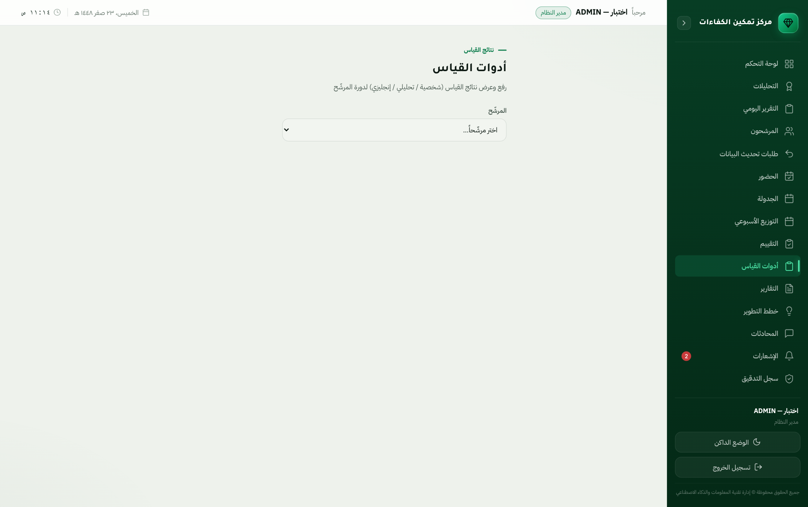

# دليل المستخدم — منصة مركز تمكين الكفاءات

> دليل تشغيلي لموظّفي المركز. يشرح كل شاشة: **مَن يفتحها**، و**ما الذي يفعله فيها**،
> و**ما الذي يمنعه النظام ولماذا**.
>
> الصور مُلتقطة آلياً من المنصّة نفسها عبر `node docs/capture-guide.mjs`، فلا تتقادم
> عن الواجهة. آخر التقاط مذكور في `docs/guide-images/manifest.json`.

---

## الفهرس

1. [البدء: أول دخول](#١-البدء-أول-دخول)
2. [التهيئة الأولى للمنصّة](#٢-التهيئة-الأولى-للمنصّة)
3. [الأدوار والصلاحيات](#٣-الأدوار-والصلاحيات)
4. [رحلة المشارك من الترشيح إلى التقرير المعتمد](#٤-رحلة-المشارك)
5. [دليل الشاشات](#٥-دليل-الشاشات)
6. [أسئلة متكرّرة](#٦-أسئلة-متكرّرة)

---

## ١. البدء: أول دخول


الحقلان يبدآن فارغين دائماً. أدخل اسم المستخدم وكلمة المرور اللذين سلّمهما لك
مدير النظام، ثم **تسجيل الدخول**.

| ما تراه | معناه |
|---|---|
| «أدخل اسم المستخدم وكلمة المرور» | أحد الحقلين فارغ — لم يُرسَل شيء للخادم بعد |
| «فشل تسجيل الدخول — تأكد من البيانات والخادم» | البيانات غير صحيحة، أو الخادم لا يستجيب |
| تحويلك مباشرةً إلى **تغيير كلمة المرور** | حسابك جديد أو أُعيد ضبطه — التغيير إلزامي قبل أي شيء |

**زرّ العين** داخل حقل كلمة المرور يُظهرها للتأكّد من كتابتها.

### تغيير كلمة المرور


إلزامي عند أول دخول **مرّة واحدة فقط**، ومتاح في أي وقت بعده. النظام لا يفتح
لك أي شاشة أخرى قبل إتمامه — وهو منعٌ خادمي لا واجهي: لن ينفع تجاوزه بتغيير
الرابط.

بعد إتمامه لا يُطلب منك مرّة أخرى. وإن غادرت الشاشة دون إتمامه، فالدخول من
جديد يبقى متاحاً ويعيدك إليها — لا تُحبَس خارج النظام.

> **لمدير النظام:** لإنشاء أول حساب أو فكّ قفل حساب واستعادة الدخول:
> ```bash
> php artisan kafaat:create-admin <اسم المستخدم>          # حساب جديد
> php artisan kafaat:create-admin <اسم المستخدم> --reset  # إعادة ضبط وفكّ قفل
> ```
> تُطبع كلمة المرور مرّة واحدة، ويُلزَم صاحبها بتغييرها عند أول دخول.

---

## ٢. التهيئة الأولى للمنصّة

على منصّة جديدة (أو بعد تفريغها) أدخِل البيانات **بهذا الترتيب**، لأن كل خطوة
تعتمد على ما قبلها:

| # | الخطوة | الشاشة | لماذا هذا الترتيب |
|---|---|---|---|
| ١ | **القطاعات** | الإعدادات ← القطاعات | رمز المشارك يُشتقّ من بادئة القطاع (`ED-001`)، ولا يمكن إضافة مشارك بلا قطاع |
| ٢ | **الرتب المُدارة** *(اختياري)* | الإعدادات ← الرتب | تُصنَّف الفئة القيادية تلقائياً بدونها. أضِفها لتجاوز التصنيف الافتراضي لرتبةٍ بعينها |
| ٣ | **الكفاءات** | إطار الكفاءات | التقييم يُرصَد على كفاءات معرَّفة — بلا كفاءات لا تُفتح جلسة تقييم |
| ٤ | **ربط الكفاءات بالأنشطة** | خريطة الكفاءات | يحدّد أي كفاءة تُقاس في أي نشاط |
| ٥ | **مراحل الاعتماد** | مراحل الاعتماد | سلسلة اعتماد التقرير — مضبوطة مسبقاً وتُعدَّل عند الحاجة |
| ٦ | **المستخدمون** | المستخدمون | لكل موظّف حساب بدوره، ولمقيّمي القطاعات قطاعُهم |
| ٧ | **المشاركون** | المشاركون / ترشيح مشارك | بعد اكتمال ما سبق |

> ⚠ **بادئة القطاع** (`ED`, `HR2`…) تدخل في رمز كل مشارك، والرموز المُصدَرة لا
> تتغيّر بعدها. اضبطها قبل إدخال أول مشارك.

---

## ٣. الأدوار والصلاحيات

اثنا عشر دوراً. الصلاحية تأتي من الدور، ويجوز لمدير النظام منح استثناءات فردية
عدا ثلاث سلطات لا تُفوَّض إطلاقاً: **إدارة المستخدمين**، و**إدارة الإعدادات**،
و**سجل التدقيق**.

| الدور | ما يملكه عملياً |
|---|---|
| **مدير النظام** ADMIN | كل شيء |
| **مدير المركز** CENTER_MANAGER | إشراف واطّلاع، الاعتماد النهائي، الملخّص التنفيذي، الإرجاع والإلغاء، سجل التدقيق |
| **مسؤول الجدولة** SCHEDULER | إدارة المشاركين وبياناتهم، الجدولة والتوزيع الأسبوعي، اعتماد طلبات التحديث، إرسال الدعوات |
| **مسؤول استقبال الموظفين** RECEPTIONIST | رؤية الأسماء، تسجيل الوصول وأخذ التوقيع والإقرار، توزيع المرشحين على الأنشطة، تسجيل حضور أي جلسة، إرسال الدعوات |
| **مسؤول العمليات** OPERATIONS | إعادة إسناد المردود من المقيّمين، واعتماد بيانات الاستقبال وترحيل الجلسات — **يعمل بالرمز: لا يرى الأسماء ولا السِّيَر** |
| **مدير إدارة التقييم** ASSESS_MANAGER | كتابة التقارير وتعديل تقارير غيره، اعتماد المرحلة الثانية، التحليلات |
| **مستشار المقابلة** EVALUATOR | إدخال التقييم، اعتماد المرحلة الأولى، تسجيل حضور جلساته |
| **مستشار حلقة النقاش** DISCUSSION_EVAL | إدخال تقييم حلقات النقاش وتسجيل حضورها |
| **مساعد التقييم** ASSISTANT | الرصد المساعد، كتابة التقرير، أدوات القياس |
| **إدارة تطوير الكفاءات** DEV_MANAGER | إدارة الكفاءات، اعتماد مرحلة تطوير الكفاءات، التحليلات |
| **مشرف أدوات القياس** MEASURE_SUPER | رفع نتائج القياس وتسجيل حضور أي جلسة قياس |
| **مستخدم خارجي** EXTERNAL_ADD | إدخال مشارك جديد ورفع طلب تحديث — **ولا يقرأ القاعدة إطلاقاً** |

### قواعد حماية مبنيّة في النظام

- **الاسم محجوب افتراضاً.** المقيّم ومساعده يريان **رمز المشارك** لا اسمه. الاسم
  صلاحية منفصلة (`candidate.view_names`)، وظهوره في **المستند المطبوع** صلاحية
  ثالثة مستقلّة.
- **المصنَّفون (سرّي) لا يظهرون** لمن لا يملك رؤية المصنَّفين — لا في القوائم ولا
  في البحث ولا في التقارير.
- **من يكتب لا يعتمد.** مرحلة الاعتماد الثانية تمنع اعتماد التقرير الذي كتبه
  المعتمِد نفسه.
- **حدّ القطاع.** المقيّم لا يرى إلا مرشحي قطاعه، إلا بإسنادٍ صريح عبر صلاحية
  التجاوز — ويُدوَّن في سجل التدقيق.
- **في مسار الاستقبال الاسم محجوب عن المقيّم بلا استثناء.** هنا القاعدة
  **إجرائية لا صلاحية**: حتى من يملك `candidate.view_names` لا يرى اسم من
  استلمه — يقيّمه برمزه وحده. غير ذلك كان يفتح باباً لمعرفة من يقابل قبل أن
  يقابله.
- **الإخفاء في الواجهة راحة لا حماية.** كل منع مطبَّق على الخادم أيضاً؛ تغيير
  الرابط أو استدعاء الواجهة البرمجية مباشرةً لا يتجاوز شيئاً.

---

## ٤. رحلة المشارك

```text
ترشيح  →  اعتماد الترشيح  →  جدولة  →  توزيع المقيّمين
   →  استقبال يوم الجلسة (وصول + توقيع وإقرار + توزيع على الأنشطة)
   →  استلام المقيّم (أو ردّه فيُعاد إسناده)  →  اعتماد العمليات  →  حضور
   →  تقييم (مقابلة + حلقة نقاش + أدوات قياس)
   →  كتابة التقرير  →  سلسلة اعتماد من أربع مراحل  →  تقرير معتمد + خطة تطوير
```

مسار الاستقبال في يوم الجلسة — لكل مرحلة صلاحية مستقلّة:

| المرحلة | الصلاحية | صاحبها |
|---|---|---|
| ١ تسجيل الوصول (الوقت تلقائي وقابل للتعديل) | `reception.record` | مسؤول استقبال الموظفين |
| ٢ توقيع المرشح وإقراره بصحّة بياناته | `reception.record` | مسؤول استقبال الموظفين |
| ٣ التوزيع على مقابلة / حلقة نقاش / أدوات قياس | `reception.assign` | الاستقبال والعمليات |
| ٤ استلام المرشح أو ردّه بسبب | `reception.decide` | المقيّم المُسنَد إليه |
| ٥ إعادة إسناد المردود | `reception.assign` | مسؤول العمليات |
| ٦ الاعتماد وترحيل الجلسات إلى الجدول | `reception.approve` | مسؤول العمليات |

**من يوزّع لا يعتمد، ومن يقرّر لا يوزّع.** الفصل مقصود: لو جُمعت المراحل في
صلاحية واحدة لملك كلُّ من فتح الشاشة المسارَ كاملاً بلا مراجعة.

سلسلة اعتماد التقرير:

| المرحلة | صاحبها | ملاحظة |
|---|---|---|
| ١ | مستشار المقابلة | يعتمد ما رصده |
| ٢ | مدير إدارة التقييم | **يُمنع** من اعتماد تقرير كتبه بنفسه |
| ٣ | إدارة تطوير الكفاءات | |
| ٤ | مدير المركز | الاعتماد النهائي + الملخّص التنفيذي |

**الإرجاع والإلغاء لمدير المركز وحده** — عمداً: لو ملك كل معتمِدٍ الإرجاع لَرَدّ
كلٌّ منهم التقرير خطواتٍ للوراء فلا يستقرّ.

التقارير المتأخّرة تُصعَّد آلياً كل يوم إلى صاحب المرحلة العالق عندها.

---

## ٥. دليل الشاشات

### الشريط العلوي — في كل الشاشات

أعلى كل شاشة بعد الدخول:

- **مرحباً، [اسمك]** ودورك في المنصّة — يمينَ الشريط.
- **تاريخ اليوم الهجري**، ومرّر المؤشر فوقه ليظهر الميلادي.
- **الساعة**، تتحدّث كل ثانية.

الشريط يلازمك عند التمرير، فالوقت والتاريخ حاضران في شاشات الجدولة والحضور
حيث يلزمان فعلاً.

---

### لوحة التحكم


**من يفتحها:** كل مستخدم مُصادَق.

نظرة اليوم: جاهزية القيادة، والمؤشرات الستّة (المشاركون، الحضور، الإكمال،
التقييمات، الاعتمادات، المعلّقة)، واتجاه اثني عشر شهراً، وخريطة الكفاءات
الأسبوعية، و**إجراءات سريعة** تنقلك إلى أكثر ما تستعمله.

كل بطاقة تعرض نسبة التغيّر عن الفترة السابقة؛ و«لا ربع سابق للمقارنة» تعني أن
المنصّة لم تجمع بعدُ بيانات كافية.

---

### المشاركون


**من يفتحها:** كل من يملك `candidate.view`.

قاعدة المشاركين مع عدّادات علوية (الإجمالي، قيادة عليا/وسطى، مسوّدة/معتمد/مصنَّف)
وتصفية بالقطاع والفئة والتصنيف والحالة، وبحث **بالرمز**.

الأعمدة: الرمز، القطاع، الرتبة، الفئة، التصنيف، الحالة. **الأسماء لا تظهر** لمن
لا يملك صلاحيتها — تُعرض الرموز بدلاً منها. صفوف المصنَّفين مميّزة بلون مختلف.

الإجراءات على كل صفّ: عرض، السيرة الذاتية، تعديل، حذف، واعتماد المسوّدات.
وفي الأعلى: **إضافة مشارك**، **استيراد** دفعة، **تصدير**، و**كشف الحضور**.

**ما يمنعه النظام:** حذف مشارك مرتبط بجلسات أو تقارير، وتكرار رقم هوية مسجَّل
مسبقاً (يُردّ الطلب مع تاريخ الإضافة السابقة).

---

### ترشيح مشارك — للجهات الخارجية


**من يفتحها:** `candidate.create`. وهي **الشاشة الوحيدة** للمستخدم الخارجي،
ويُنزَل عليها مباشرةً بعد الدخول.

تعكس نموذج السيرة الذاتية الورقي المعتمد، بأربعة أقسام:

1. **بيانات المشارك** — الاسم رباعياً، رقم الهوية، تاريخ الميلاد (هجري وميلادي
   متقابلان — إدخال أحدهما يملأ الآخر)، **العمر يُحسب تلقائياً**، الرتبة، القطاع،
   المنطقة، الجهة، الوظيفة الحالية، سنوات الخبرة، الجوال والبريد، ونبذة.
2. **التعليم الأكاديمي** — مؤهّلات متعدّدة (المؤهّل، التخصص، الجهة، مقرّ الدراسة).
3. **الخبرة العملية**.
4. **الدورات التدريبية**.

> رمز المشارك وتاريخ الحضور تولّدها المنصّة عند الجدولة — لا تُدخَل هنا.

**عند إرسال بيانات مسجَّلة مسبقاً:** يُرفض الإدخال ويظهر **تاريخ الإضافة السابقة**،
ومعه زرّ **«طلب تحديث بيانات المشارك»**. الطلب اقتراح لا كتابة: لا يمسّ السجلّ
حتى يعتمده صاحب صلاحية.

تبويب **«طلباتي»** يعرض حالة ما رفعته: بانتظار الاعتماد / معتمد / مرفوض.

---

### طلبات تحديث البيانات — مُخفاة مؤقتاً

> **هذه الشاشة مُخفاة حالياً بطلب صاحب المنصّة.** الرابط لا يظهر في القائمة،
> وكتابة العنوان يدوياً تُعيد إلى لوحة التحكم. الشيفرة والمسارات والبيانات
> كلها قائمة كما هي — لإعادتها: اجعل `updateRequests` في
> `frontend/src/services/features.js` بقيمة `true`. سطرٌ واحد.
>
> ما دون هذا السطر يصف الشاشة كما ستعمل عند إعادتها.

**من يفتحها:** `candidate.update_approve` — مسؤول الجدولة ومدير النظام.

كل طلب يُعرض **مقارنةً حقلاً بحقل**: القيمة الحالية مقابل المقترحة، والمتغيّر
وحده مميَّز. الأقسام المتكرّرة (التعليم، الخبرة، الدورات) تُعرض جنباً إلى جنب.

**اعتماد** يكتب التغييرات على سجلّ المشارك ويُخطر مُقدّم الطلب. **رفض** يُغلق
الطلب مع سببه.

**ما يمنعه النظام:** أكثر من طلب معلّق واحد للمشارك نفسه — قيدٌ في قاعدة
البيانات لا في الواجهة، فلا يمرّ حتى مع إرسالين متزامنين.

---

### استقبال الموظفين


**من يفتحها:** `reception.view` — مسؤول استقبال الموظفين، ومسؤول العمليات،
والمقيّمون (المقابلة وحلقة النقاش وأدوات القياس)، ومدير النظام.

**الشاشة واحدة وتتشكّل بحسب صلاحيات فاتحها.** لا يرى أحدٌ فيها ما لا يخصّه.

#### أ) مسؤول استقبال الموظفين

**١ — تسجيل الوصول.** قائمة «المنتظَرون» أسفل الشاشة تعرض من لم يصل بعد: الرمز
والاسم والقطاع والرتبة. زرّ **تسجيل الوصول** يُثبت وقت الوصول **تلقائياً**.
القائمة مقصوصة عند ٤٠ اسماً ويُذكر العدد الكلّي صراحةً فوقها — من لم يظهر
يُوجَد **بالبحث برمز المشارك**.

**٢ — تعديل وقت الوصول.** الوقت في جدول «الحاضرون اليوم» قابل للنقر: يفتح حقل
وقت يُحفَظ بعلامة الصحّ. يُستعمل حين يُسجَّل الوصول متأخّراً عن حدوثه.

**٣ — السيرة الذاتية.** عمود «السيرة» يفتح سيرة المرشح كاملة بالاسم والرتبة
والقطاع — للمطابقة قبل الإقرار. تُفتح **لمن يستقبله في يومه فقط**، لا لأي
مشارك في القاعدة.

**٤ — التوقيع والإقرار.** زرّ **أخذ التوقيع** يفتح نافذة فيها نصّ الإقرار
باسم المرشح، ولوحة يوقّع عليها بإصبعه أو بالفأرة، وخانة تأكيد أنه **قرأ الإقرار
ووافق عليه**. الحفظ لا يعمل قبل الأمرين معاً. التوقيع يُخزَّن **مشفَّراً**.

**٥ — التوزيع.** زرّ **توزيع** يفتح نافذة تختار فيها النشاط (المقابلة الشخصية /
حلقة النقاش / أدوات القياس) ثم المقيّم. القائمة تعرض **من يستطيع الاستلام
فعلاً**: صاحب دور النشاط، في قطاع المرشح، ويملك صلاحية الاستلام. عند الحفظ
**يصل إشعار للمقيّم فوراً**.

#### ب) المقيّم

قسم **«المُسنَد إليّ اليوم»** — لا يرى غيره. لكل مهمّة: **رمز المشارك** ونوع
النشاط ووقت الوصول، وزرّان: **استلام** و**ردّ**.

- **استلام** يفتح بعده زرّ **السيرة الذاتية**.
- **ردّ** يطلب **سبباً إلزامياً** يصل لمسؤول العمليات ليبني عليه إعادة الإسناد.

> **لا يظهر للمقيّم اسم المرشح ولا رقم هويته إطلاقاً** — لا في القائمة ولا في
> السيرة ولا في الإشعار. السيرة تُطمَس منها المعرّفات آلياً حتى لو كتبها
> المرشح داخل نصٍّ حرّ. والسيرة **لا تُفتح قبل الاستلام**: القرار يقع على الرمز
> والنشاط، لا على محتوى سيرةٍ يُطّلَع عليها ثم تُردّ.

#### ج) مسؤول العمليات

- **إعادة إسناد المردود.** سبب الردّ يظهر تحت صفّ المرشح بالأحمر. زرّ **توزيع**
  يُسنده لمقيّم آخر أو **لنشاط آخر**.
- **الاعتماد والترحيل.** زرّ **اعتماد وترحيل** يُنشئ جلسات في **الجدولة** —
  كلٌّ حسب اختصاصه — فتظهر في الحضور والتقييم كأي جلسة.

الزرّ **معطّل** ما لم يكتمل شرطه، والسبب يظهر عند مرور المؤشّر عليه.

#### ما يمنعه النظام

| المنع | السبب |
|---|---|
| التوزيع قبل التوقيع والإقرار | توزيع من لم يُقرّ بصحّة بياناته يُدخِل المقيّم على بياناتٍ غير مصادَق عليها |
| الاعتماد وهناك إسناد بانتظار قرار | الاعتماد حينها يُسقط قراراً لم يُتّخذ بلا أن يعلم أحد |
| الاعتماد بلا إسناد مستلَم | لا شيء يُرحَّل |
| تعديل وقت زيارة معتمدة أو استبدال توقيعها | الوثيقة المعتمَدة تبقى هي التي اعتُمدت |
| إسناد النشاط نفسه لمقيّمَين معاً | المرشح لا يكون في مقابلتين في وقت واحد |
| إسناد مقيّم من قطاع آخر | إلا بصلاحية التجاوز الصريحة — نفس قاعدة الجدولة |
| إسناد نشاط لدور لا يمارسه | مستشار حلقة النقاش لا يُجري المقابلة الشخصية |
| بتّ مقيّم في إسناد غيره | لا أحد يقبل نيابةً عن غيره |
| تسجيل الوصول مرّتين | زيارة واحدة لكل مشارك في اليوم — قيدٌ في قاعدة البيانات |

**الإسناد المردود يبقى في السجلّ** بسببه واسم رادّه؛ إعادة الإسناد سجلٌّ جديد
بجانبه لا استبدالٌ له — فيبقى جواب «لماذا تغيّر المقيّم» قائماً.

> **تنبيه تشغيلي:** إن لم يُنشَأ مستخدم بدور **مسؤول العمليات** (أو يُمنح
> `reception.assign` لأحد)، فإن المرشح المردود يقف بلا من يعيد إسناده. النظام
> يُقيّد ذلك في سجل التدقيق بـ`RECEPTION_REJECT_UNROUTED`.

---

### الجدولة


**من يفتحها:** `schedule.view`؛ والتعديل بـ`schedule.manage` (مسؤول الجدولة).

جدولة جلسات المشاركين: التاريخ، والفترة، والنشاط، والمقيّم المُسنَد. عند الجدولة
**يُولَّد رمز المشارك** من بادئة قطاعه بترقيم متسلسل مضمون بلا تكرار حتى مع
جدولة متزامنة.

**إرسال الدعوات** (`communication.invite`) يرسل رسالة وبريداً بموعد الجلسة
ومكانها، ويتضمّن رابط تأكيد يفتحه المشارك بنفسه.

---

### التوزيع الأسبوعي


**من يفتحها:** `schedule.distribute`.

يقترح النظام توزيع مشاركي الأسبوع على المقيّمين مراعياً حدّاً يومياً لكل مقيّم
(قابلاً للضبط في الإعدادات) وحدود القطاعات. الاقتراح **يُراجَع ويُعدَّل ثم
يُعتمد** — لا يُطبَّق آلياً.

---

### الحضور


**من يفتحها:** `attendance.view`.

تسجيل الحضور بحسب جلسات اليوم. المقيّم يسجّل **جلساته هو**؛ أمّا الاستقبال
ومشرف أدوات القياس فيسجّلان **أي جلسة** — لأنهما يستقبلان من لا جلسة لهما فيه.

الغياب غير المبرّر يُرصَد آلياً كل يوم للجلسات المنقضية بلا تسجيل حضور.

---

### التقييم


**من يفتحها:** `evaluation.view`؛ والإدخال بـ`evaluation.input`.

رصد درجات الكفاءات لكل نشاط. الكفاءات المعروضة هي المرتبطة بالنشاط في
**خريطة الكفاءات**. بعد الإرسال تُقفل الدرجات وتنتقل إلى سلسلة الاعتماد.

**ما يمنعه النظام:** أكثر من تقييم واحد لنفس المشارك في نفس النشاط.

---

### أدوات القياس



**من يفتحها:** `measurement.view`؛ والرفع بـ`measurement.upload`
(مشرف أدوات القياس).

نتائج أدوات القياس المعيارية، مربوطة بجلسة التقييم، وتدخل في التقرير النهائي.

---

### التقارير


**من يفتحها:** `report.view`.

قائمة التقارير بحالاتها في سلسلة الاعتماد. لكل تقرير: عرض، تعديل (لصاحبه أو
لمدير إدارة التقييم)، اعتماد المرحلة التي تخصّك، وتصدير PDF.

**اسم المشارك في المستند المطبوع** لا يظهر إلا لحاملي `report.view_names`
(مدير المركز ومدير إدارة التقييم) — حتى لو كنت ترى الأسماء في الشاشات.

**الإرجاع والإلغاء** لمدير المركز وحده.

---

### خطط التطوير


**من يفتحها:** `report.view`.

بنود التطوير المستخلصة من فجوات الكفاءات في التقرير المعتمد، ومتابعة تنفيذها.

---

### إطار الكفاءات


**من يفتحها:** `competency.view`؛ والتعديل بـ`competency.manage`
(إدارة تطوير الكفاءات).

تعريف الكفاءات: الاسم، والنوع (قيادية / سلوكية / فنية)، والمستوى الأعلى،
والوزن، والمستوى المستهدف، والمجموعة.

---

### خريطة الكفاءات والأنشطة


**من يفتحها:** `competency.manage`.

تحدّد **أي كفاءة تُقاس في أي نشاط**. شاشة التقييم تعرض ما ربطته هنا فحسب —
فكفاءة غير مربوطة بنشاط لا تُرصَد أبداً.

---

### التحليلات


**من يفتحها:** `analytics.view`.

توزيع الجاهزية، وفجوات الكفاءات، والأداء بحسب القطاع، واتجاهات زمنية.

---

### لوحة القيادة التنفيذية


**من يفتحها:** `analytics.view`. لها **بابٌ مستقل في القائمة الجانبية** باسم
«اللوحة التنفيذية» — كانت رابطاً داخل شاشة التحليلات، ونُقلت لأن من يفتحها
(القيادة) يقصدها مباشرةً ولا يمرّ بغيرها.

عرض مكثّف للقيادة: مؤشرات عليا، وخريطة حرارية، ومقارنة الشرائح، وتوزيع
الجاهزية، واستنتاجات.

---

### التقرير اليومي


**من يفتحها:** `analytics.view`.

ملخّص اليوم: الجلسات، والحضور، والتقييمات، والتقارير. يُرسَل آلياً بالبريد كل
يوم إلى مدير المركز.

---

### المراسلات


**من يفتحها:** `candidate.view`.

مراسلات داخلية مرتبطة بمشارك أو تقرير، فتبقى المناقشة ملتصقة بموضوعها بدل أن
تتفرّق في البريد.

---

### الإشعارات


**من يفتحها:** كل مستخدم مُصادَق.

ما يخصّك: تقرير ينتظر اعتمادك، جلسة غداً، طلب تحديث جديد، تقرير تأخّر.
العدّاد الأحمر في القائمة الجانبية يعرض غير المقروء.

---

### مراحل الاعتماد


**من يفتحها:** `settings.manage`.

ترتيب مراحل اعتماد التقرير وتفعيلها — **بيانات قابلة للتعديل لا شيفرة مثبّتة**.
لكل مرحلة: الدور صاحبها، والصلاحية المطلوبة، ومنع اعتماد ما كتبه المعتمِد نفسه.

---

### المستخدمون والصلاحيات


**من يفتحها:** `user.manage` — مدير النظام.

إنشاء الحسابات وإسناد الأدوار والقطاعات والمدير المباشر، وتفعيل الحسابات
وتعطيلها، وإعادة ضبط كلمات المرور، ومنح **استثناءات فردية** للصلاحيات.

**ما يمنعه النظام:**
- منح صلاحية لا يملكها المانح نفسه — لا يستطيع أحد ترقية نفسه أو غيره فوق سقفه.
- تفويض **إدارة المستخدمين** أو **الإعدادات** أو **سجل التدقيق** بالاستثناء
  الفردي؛ تُسنَد بالدور فقط.
- تعطيل حسابك أنت.

---

### الأدوار والصلاحيات


**من يفتحها:** `user.manage` — مدير النظام.

هنا تُضبط **صلاحيات الأدوار نفسها**، لا صلاحيات شخص بعينه. كانت هذه الصلاحيات
ثابتةً في شيفرة المنصّة ويحتاج تغييرُها نشراً؛ صارت الآن بياناتٍ تُحرَّر من
الشاشة وتسري **فوراً على كل من يحمل الدور**.

> **الفرق بين هذه الشاشة و«المستخدمون»:** هنا تغيّر ما يستطيعه **كل** حامل
> الدور دفعةً واحدة. وهناك تمنح **شخصاً واحداً** استثناءً فوق دوره أو تسحبه
> منه. استعمل الدور للقاعدة، والاستثناء للحالة الفردية.

#### كيف تعمل

العمود الأيمن: كل الأدوار، ولكلٍّ عدد صلاحياته وعدد حامليه. العمود الأيسر:
صلاحيات الدور المفتوح مجمّعةً في **١٧ مجموعة** — لكل شاشة مجموعتها.

- كل صلاحية بوصفٍ عربي ومفتاحها التقني بجانبه.
- **تحديد الكل / إلغاء الكل** لكل مجموعة.
- قبل الحفظ يظهر **الفرق صراحةً**: ما يُضاف وما يُسحَب، ومعه عدد المستخدمين
  الذين سيتأثّرون. لا يُحفظ شيء قبل أن تراه.
- **الافتراضي** يعيد الدور إلى ما وُلد به.

#### ما يمنعه النظام ولماذا

| المنع | السبب |
|---|---|
| تعديل دور **مدير النظام** أو حذفه | سحب «إدارة المستخدمين» منه يُغلق باب الإدارة على الجميع، ولا سبيل للعودة إلا من قاعدة البيانات مباشرة |
| تعديل **دورك أنت** | من يعدّل دوره يمنح نفسه ما يشاء، فلا يبقى لأي حدٍّ معنى |
| منح صلاحية **لا تملكها أنت** | سقفٌ لا منعٌ مطلق: تمنح ما تملك ولا تصنع سلطةً أعلى منك. يُقيَّد في سجل التدقيق |
| تغيير **سلطات النظام** (إدارة المستخدمين، الإعدادات، سجل التدقيق، مراحل الاعتماد) | تُدار بالدور المبذور لا بالتحرير — وإلا التفّ التحرير على كونها غير قابلة للتفويض |
| حذف دور **له حاملون** | حساباتٌ بلا دور تسقط عند أول طلب. انقلهم إلى دورٍ آخر أولاً |

#### إنشاء دور جديد

زرّ **دور جديد**: رمز لاتيني (لا يتغيّر بعدها — يُستعمل مفتاحاً في النظام)،
واسم عربي، ووصف اختياري. **يُولد بلا أي صلاحية**، ثم تمنحه ما يلزم — أسلم من
أن يبدأ بصلاحيات لم تُقصد.

#### صلاحية لكل شاشة

كانت خمس صلاحيات تحرس إحدى عشرة شاشة: من ملك «التحليلات» ملك اللوحة التنفيذية
والتقرير اليومي معه، ومن ملك «التقارير» ملك خطط التطوير. فُصلت، فصار لكل شاشة
صلاحيتها وأمكن منح واحدةٍ دون أختها:

| الشاشة | الصلاحية |
|---|---|
| اللوحة التنفيذية | `analytics.executive` |
| التقرير اليومي | `analytics.daily_report` |
| خطط التطوير | `development_plan.view` |
| المحادثات | `chat.view` |
| مراحل الاعتماد | `workflow.manage` |

#### مستقبلاً: المزامنة مع Active Directory

عند تفعيل الربط بدليل الوزارة تُستبدل الحسابات الحالية بحسابات الدليل. وهذا
التصميم يجعل الاستبدال **لا يمسّ الصلاحيات**: الصلاحية معلّقة على **الدور** لا
على الشخص، فالحساب الجديد يرث صلاحيات دوره كاملةً بمجرّد إسناده إليه. الذي
يحتاج مراجعةً بعد المزامنة هو **الاستثناءات الفردية** في شاشة «المستخدمون» —
فتلك معلّقة بالشخص وتذهب بذهاب حسابه.

---

### الإعدادات


**من يفتحها:** `settings.manage`.

صفحة واحدة طويلة، بطاقاتها بالترتيب:

- **Active Directory / LDAP** — ربط حسابات الموظّفين بحسابات المؤسسة. عند
  التفعيل يُصادَق المستخدمون الداخليون عبر الدومين بدل كلمة مرور محلية. الحقول:
  عنوان خادم الدومين، والمنفذ (389 عادي / 636 آمن)، واسم الدومين المختصر،
  و`Base DN`، وخيار SSL/TLS. وزرّ **اختبار الاتصال** يتحقّق قبل الحفظ.
- **بوّابة الرسائل النصية** — مزوّد إرسال الدعوات والتذكيرات. عند إيقاف
  «الإرسال الفعلي» تُسجَّل الرسائل بلا إرسال (وضع التطوير) — أبقِه مُفعّلاً في
  التشغيل الحقيقي وإلا لم تصل دعوةٌ واحدة.
- **البريد (SMTP)** — مع زرّ اختبار.
- **بوّابة التحقّق من الهوية** — تكامل خارجي مع سجلّ محاولاته.
- **القطاعات** — إضافة وتعديل وحذف، وضبط **بادئة رمز المشارك**. الحذف ممنوع على
  قطاع مرتبط بمشاركين أو مستخدمين.
- **الرتب** — رتبٌ مُدارة تتجاوز التصنيف الافتراضي للفئة القيادية. الجدول فارغ
  عمداً عند التسليم، وما دام فارغاً يعمل التصنيف التلقائي كما هو.
- **أوقات الجلسات** — خيارات حقل الوقت وأعمدة كشف الحضور.
- **حدّ التوزيع اليومي** لكل مقيّم.
- **قوالب الدعوة** — نصّ البريد والرسالة.

> القطاعات والرتب أسفل الصفحة — مرّرها إليهما عند التهيئة الأولى.

---

### سجل التدقيق


**من يفتحها:** `audit.view` — مدير النظام ومدير المركز. **لا يُفوَّض**.

كل عملية حسّاسة مُدوَّنة: من فعلها، ومتى، ومن أي عنوان، وعلى أي سجلّ، وبالقيمة
قبل وبعد. يشمل الدخول والفشل فيه، وتغيير الصلاحيات، والاطّلاع على المصنَّفين،
وتجاوز حدّ القطاع، وكل اعتماد أو إرجاع.

السجل **للقراءة فقط** — لا يُعدَّل ولا يُحذف من داخل المنصّة.

---

## ٦. أسئلة متكرّرة

**لا أرى أسماء المشاركين، أرى رموزاً فقط.**
هذا هو السلوك المقصود. الاسم صلاحية منفصلة يملكها مسؤول الجدولة والاستقبال
ومدير إدارة التقييم. المقيّم يقيّم الأداء لا الشخص.

**أضفت مشاركاً فقيل لي إنه مسجَّل مسبقاً.**
رقم الهوية موجود. ستجد **تاريخ الإضافة السابقة** في الرسالة، ومعها زرّ **طلب
تحديث بيانات المشارك** إن كانت بياناتك أحدث.

**لماذا لا أستطيع اعتماد تقرير كتبتُه بنفسي؟**
مرحلة اعتماد مدير إدارة التقييم تمنع ذلك عمداً: من يكتب لا يعتمد.

**لا تظهر لي شاشة موجودة في الدليل.**
دورك لا يملك صلاحيتها؛ الشاشات المخفيّة هي التي لا تملكها. راجع مدير النظام.

**نسيت كلمة المرور.**
مدير النظام يعيد ضبطها من شاشة المستخدمين، أو بـ
`php artisan kafaat:create-admin <المستخدم> --reset`.

**أُقفل حسابي بعد محاولات فاشلة.**
القفل مؤقّت ويُفكّ تلقائياً؛ ولإسراعه يعيد مدير النظام ضبط الحساب.

**ما الذي يحدث للبيانات المحذوفة؟**
لا يُحذف شيء حسّاس فعلياً بلا أثر: الحذف مُقيَّد بالارتباطات، وكل عملية مُدوَّنة
في سجل التدقيق.

---

## تحديث هذا الدليل

الدليل **جزء من الخدمة لا ملحق بها**. بعد كل شاشة جديدة أو تعديل في شاشة قائمة:

```bash
cd backend-new
GUIDE_USER=<مستخدم تطوير> GUIDE_PASS=<كلمته> node docs/capture-guide.mjs
```

يلتقط السكربت كل الشاشات من بيئة التطوير ويحدّث `docs/guide-images/`، ثم يُحرَّر
القسم المقابل هنا نصّاً. الشاشة الجديدة تُضاف إلى مصفوفة `SCREENS` في السكربت.
